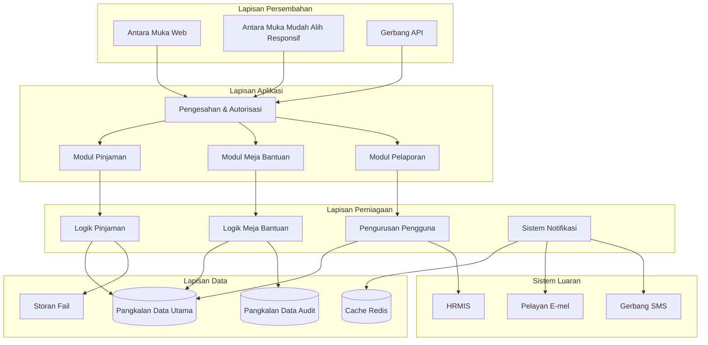
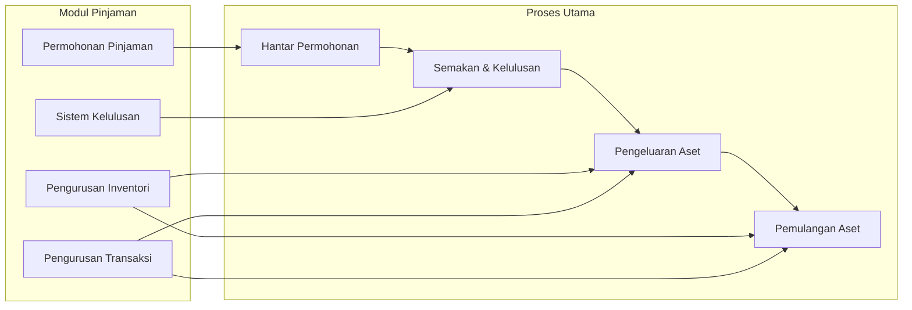
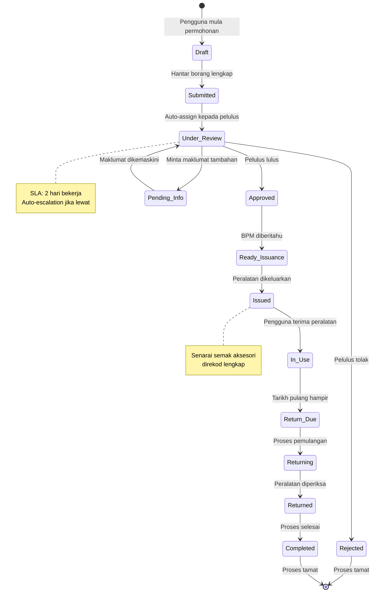
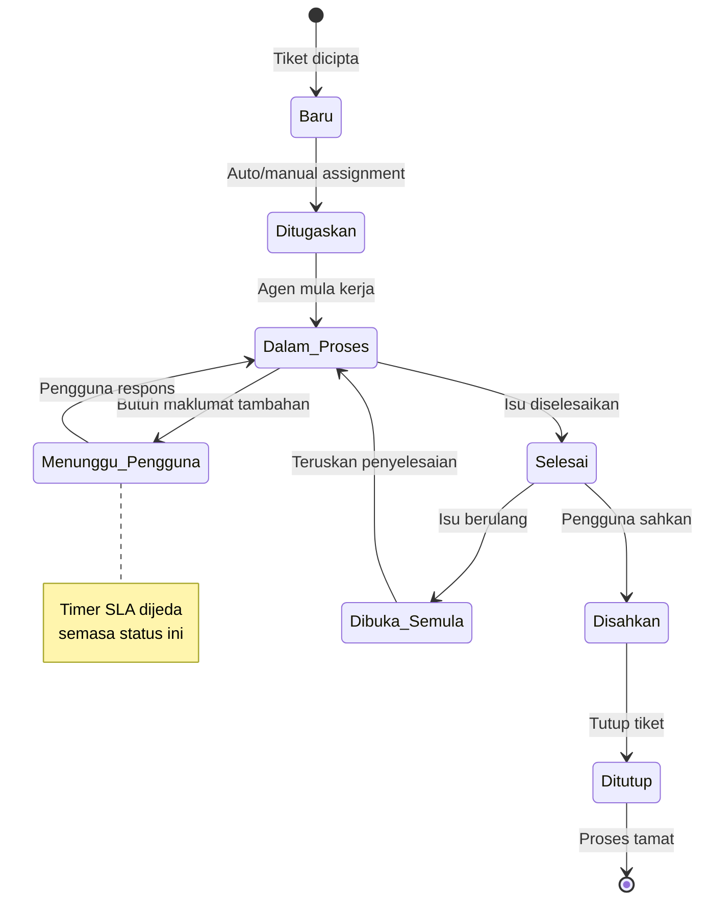
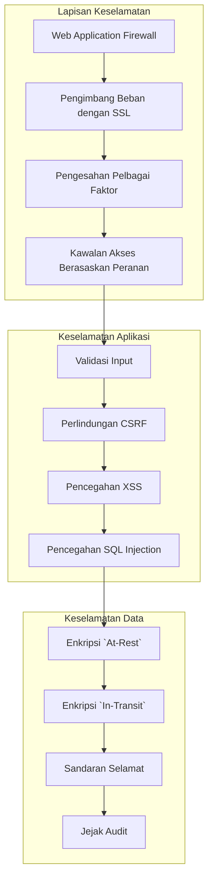
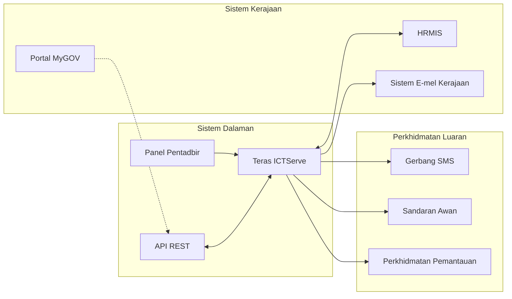
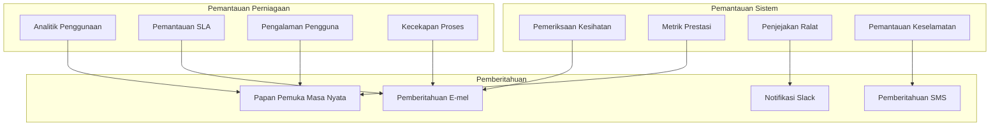
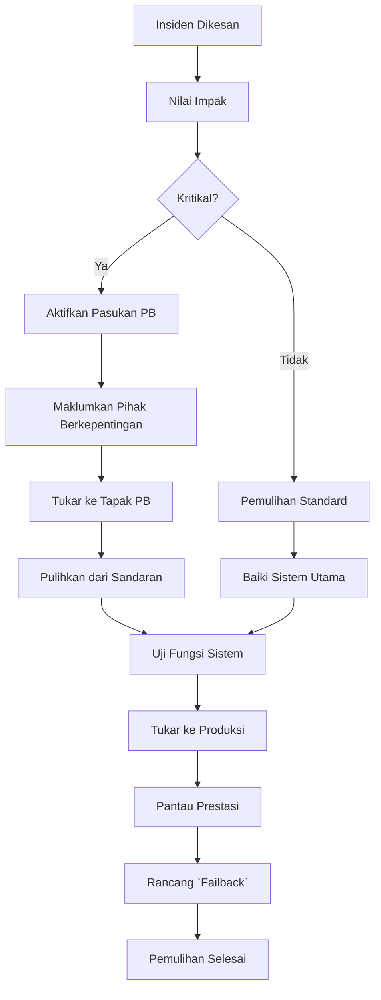
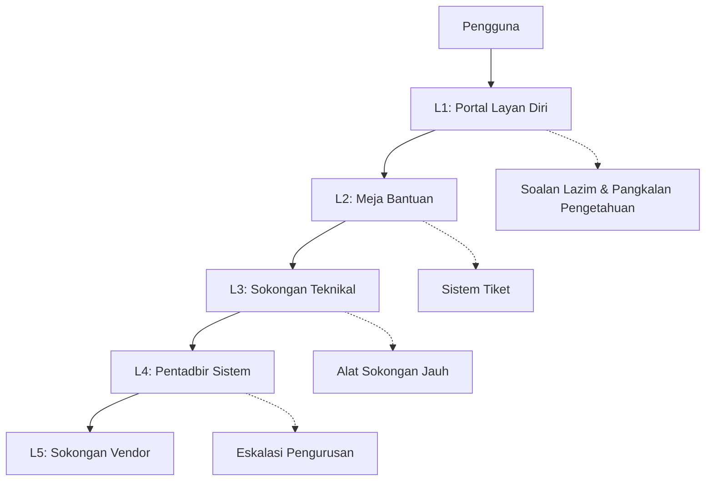
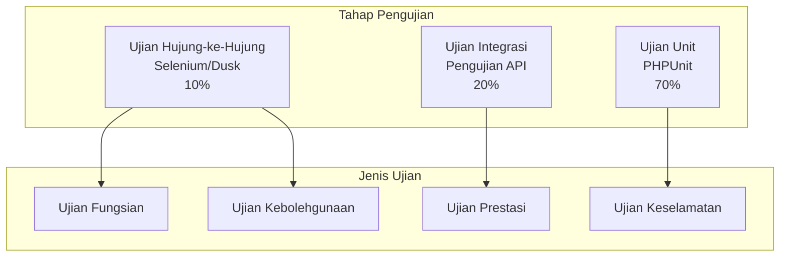

# Dokumentasi Induk Sistem ICTServe (iServe) v3.0.0

## Maklumat Dokumen

| Atribut              | Nilai                                |
| -------------------- | ------------------------------------ |
| **Versi Dokumen**    | 3.0.0                                |
| **Tarikh Kemaskini** | 6 Oktober 2025                       |
| **Status**           | Aktif - Versi Pengeluaran            |
| **Klasifikasi**      | Dokumentasi Teknikal Dalaman         |
| **Penulis**          | Pasukan Pembangunan ICTServe         |
| **Sasaran Audiens**  | Pembangun, Pentadbir, Pengguna Akhir |

## 1. Pengenalan

Dokumen ini berfungsi sebagai pusat rujukan utama untuk semua dokumentasi berkaitan dengan sistem ICTServe (iServe). Ia menyediakan ringkasan sistem dan pautan kepada dokumen-dokumen terperinci yang merangkumi pelbagai aspek sistem, daripada reka bentuk teknikal hingga panduan pengguna.

Tujuan utama dokumen induk ini adalah untuk:

- **Memusatkan Akses:** Menyediakan satu titik permulaan untuk mencari semua maklumat berkaitan sistem.
- **Memudahkan Navigasi:** Membolehkan pengguna mencari dan mengakses dokumen spesifik dengan mudah melalui pautan yang tersusun.
- **Memastikan Konsistensi:** Menjadi rujukan utama untuk versi dan status terkini bagi setiap dokumen.

## 2. Ringkasan Sistem

ICTServe (iServe) v1.0 adalah platform digital bersepadu yang direka khusus untuk mengurus perkhidmatan ICT di Kementerian Pelancongan, Seni dan Budaya Malaysia (MOTAC). Sistem ini menggantikan proses manual tradisional dengan penyelesaian digital yang cekap, selamat, dan mesra pengguna.

Sistem ini merangkumi dua modul utama:

1. **Modul Pinjaman Aset ICT:** Untuk pengurusan permohonan, kelulusan, pengeluaran, dan pemulangan aset ICT.
2. **Modul Meja Bantuan dan Sokongan:** Sistem tiket untuk pengurusan aduan dan permintaan sokongan teknikal.

## 3. Indeks Dokumentasi Sistem

Berikut adalah senarai semua dokumen berkaitan sistem ICTServe yang disusun mengikut versi dan kategori.

### Dokumentasi Versi 2.1.0

- [Dokumentasi Aliran Sistem Meja Bantuan & Meja Perkhidmatan](<./versions/v2.1.0_Dokumentasi_Flow_Sistem_Helpdesk_ServiceDesk_ICTServe(iServe).md>)
- [Dokumentasi Aliran Sistem Permohonan Pinjaman Aset ICT](<./versions/v2.1.0_Dokumentasi_Flow_Sistem_Permohonan_Pinjaman_Aset_ICT_ICTServe(iServe).md>)
- [Dokumentasi Jadual Data Pengguna & Organisasi Teras](<./versions/v2.1.0_Dokumentasi_Jadual_Data_Pengguna_Organisasi_Teras_ICTServe(iServe).md>)
- [Dokumentasi Reka Bentuk](<./versions/v2.1.0_Dokumentasi_Reka_Bentuk_ICTServe(iServe).md>)
- [Dokumentasi Reka Bentuk Sistem](<./versions/v2.1.0_Dokumentasi_Reka_Bentuk_Sistem_ICTServe(iServe).md>)
- [Dokumentasi Sistem Notifikasi E-mel](<./versions/v2.1.0_Dokumentasi_Sistem_Notifikasi_E-mel_ICTServe(iServe).md>)

### Dokumentasi Versi 2.0

- [Dokumentasi Aliran Sistem Meja Bantuan & Meja Perkhidmatan](<./versions/v2.0_Dokumentasi_Flow_Sistem_Helpdesk_ServiceDesk_ICTServe(iServe).md>)
- [Dokumentasi Aliran Sistem Permohonan Pinjaman Aset ICT](<./versions/v2.0_Dokumentasi_Flow_Sistem_Permohonan_Pinjaman_Aset_ICT_ICTServe(iServe).md>)
- [Dokumentasi Jadual Data Pengguna & Organisasi Teras](<./versions/v2.0_Dokumentasi_Jadual_Data_Pengguna_Organisasi_Teras_ICTServe(iServe).md>)
- [Dokumentasi Reka Bentuk](<./versions/v2.0_Dokumentasi_Reka_Bentuk_ICTServe(iServe).md>)
- [Dokumentasi Reka Bentuk Sistem](<./versions/v2.0_Dokumentasi_Reka_Bentuk_Sistem_ICTServe(iServe).md>)

### Dokumentasi Versi 1.0

- [Dokumentasi Aliran Sistem Meja Bantuan & Meja Perkhidmatan](<./versions/v1.0_Dokumentasi_Flow_Sistem_Helpdesk_ServiceDesk_ICTServe(iServe).md>)
- [Dokumentasi Aliran Sistem Permohonan Pinjaman Aset ICT](<./versions/v1.0_Dokumentasi_Flow_Sistem_Permohonan_Pinjaman_Aset_ICT_ICTServe(iServe).md>)
- [Dokumentasi Jadual Data Pengguna & Organisasi Teras](<./versions/v1.0_Dokumentasi_Jadual_Data_Pengguna_Organisasi_Teras_ICTServe(iServe).md>)
- [Dokumentasi Reka Bentuk](<./versions/v1.0_Dokumentasi_Reka_Bentuk_ICTServe(iServe).md>)
- [Dokumentasi Reka Bentuk Sistem](<./versions/v1.0_Dokumentasi_Reka_Bentuk_Sistem_ICTServe(iServe).md>)
- [Dokumentasi Sistem](<./versions/v1.0_Dokumentasi_Sistem_ICTServe(iServe).md>)
- [Dokumentasi Sistem Notifikasi E-mel](<./versions/v1.0_Dokumentasi_Sistem_Notifikasi_E-mel_ICTServe(iServe).md>)

## 4. Kandungan Dokumentasi Terperinci

Bahagian ini mengekalkan kandungan terperinci dari versi sebelumnya untuk rujukan.

- [1. Ringkasan Eksekutif](#1-ringkasan-eksekutif)
- [2. Pengenalan](#2-pengenalan)
- [3. Objektif Sistem](#3-objektif-sistem)
- [4. Keperluan Sistem](#4-keperluan-sistem)
- [5. Seni Bina Sistem](#5-seni-bina-sistem)
- [6. Modul Sistem](#6-modul-sistem-audiens-semua)
- [7. Reka Bentuk Pangkalan Data](#7-reka-bentuk-pangkalan-data-audiens-pembangun-pentadbir)
- [8. Keselamatan dan Pematuhan](#8-keselamatan-dan-pematuhan-audiens-pembangun-pentadbir)
- [9. Integrasi Sistem](#9-integrasi-sistem-audiens-pembangun-pentadbir)
- [10. Pemantauan dan Penyelenggaraan](#10-pemantauan-dan-penyelenggaraan-audiens-pentadbir)
- [11. Sokongan dan Bantuan](#11-sokongan-dan-bantuan-audiens-semua)
- [12. Panduan Pelaksanaan](#12-panduan-pelaksanaan-audiens-pentadbir-pembangun)
- [13. Lampiran](#13-lampiran)

## 1. Ringkasan Eksekutif

ICTServe (iServe) v1.0 adalah platform digital bersepadu yang direka khusus untuk mengurus perkhidmatan ICT
di Kementerian Pelancongan, Seni dan Budaya Malaysia (MOTAC). Sistem ini menggantikan proses manual
tradisional dengan penyelesaian digital yang cekap, selamat, dan mesra pengguna.

### 1.1 Visi dan Misi

**Visi:** Menjadi platform perkhidmatan ICT terunggul yang mempermudah operasi harian MOTAC melalui teknologi moden.

**Misi:** Menyediakan sistem yang mudah digunakan, cekap, dan selamat untuk pengurusan pinjaman aset ICT
dan perkhidmatan sokongan teknikal.

### 1.2 Manfaat Utama

| Manfaat                   | Penerangan                                    | Impak Kuantitatif |
| :------------------------ | :-------------------------------------------- | :---------------- |
| **Peningkatan Kecekapan** | Pengurangan masa pemprosesan permohonan       | 60% lebih pantas  |
| **Ketelusan Operasi**     | Jejak audit lengkap dan status masa nyata     | 100% keterlihatan |
| **Kepuasan Pengguna**     | Antara muka yang intuitif dan mudah digunakan | Skor > 4.0/5.0    |
| **Penggunaan Sumber**     | Pengoptimuman penggunaan aset ICT             | 35% peningkatan   |

## 2. Pengenalan

### 2.1 Tujuan Dokumen

Dokumen ini berfungsi sebagai panduan komprehensif untuk memahami, melaksana, dan menyelenggara Sistem ICTServe.
Ia kini disusun dengan tag `[Audiens]` pada setiap seksyen utama untuk membantu pembaca mencari maklumat yang relevan
mengikut peranan mereka (Pembangun, Pentadbir, Pengguna Akhir).

### 2.2 Skop Sistem

ICTServe v1.0 terdiri daripada dua modul utama yang saling berkaitan:

1. **Modul Pinjaman Aset ICT**
    - Pengurusan permohonan pinjaman aset ICT
    - Aliran kerja kelulusan berperingkat
    - Penjejakan inventori dan penggunaan
    - Proses pengeluaran dan pemulangan

2. **Modul Meja Bantuan dan Sokongan**
    - Sistem tiket untuk isu teknikal
    - Penugasan dan penjejakan penyelesaian
    - Pangkalan pengetahuan
    - Pelaporan prestasi

### 2.3 Sasaran Pengguna

| Kategori Pengguna     | Peranan Teknikal (Role) | Tanggungjawab dalam Sistem                                        |
| :-------------------- | :---------------------- | :---------------------------------------------------------------- |
| **Pengguna Akhir**    | `user`                  | Semua warga kerja MOTAC yang membuat permohonan dan tiket.        |
| **Pegawai Penyokong** | `approver`              | Meluluskan permohonan pinjaman (biasanya Gred 41 ke atas).        |
| **Staf BPM**          | `bpm-staff`             | Menguruskan inventori, transaksi, dan operasi harian.             |
| **Sokongan IT**       | `it-support`            | Memberi sokongan teknikal dan menguruskan tiket meja bantuan.     |
| **Pentadbir Sistem**  | `admin`                 | Menguruskan konfigurasi sistem, pengguna, dan peranan.            |
| **Super Admin**       | `super-admin`           | Mempunyai akses penuh ke semua fungsi sistem dan penyelenggaraan. |
| **Pihak Pengurusan**  | (Tiada peranan khusus)  | Memantau papan pemuka dan laporan strategik (akses baca sahaja).  |

> **Nota:** Panel pentadbir menggunakan Filament. Staf BPM dan Pentadbir IT akan menggunakan antara muka
> Filament sebagai kaedah utama untuk pengurusan inventori, pengeluaran aset, semakan transaksi,
> dan operasi pentadbiran harian.

## 3. Objektif Sistem

### 3.1 Objektif Strategik

| Objektif                          | Penerangan                              | Metrik Kejayaan           | Tempoh Pencapaian |
| :-------------------------------- | :-------------------------------------- | :------------------------ | :---------------- |
| **Transformasi Digital**          | Mendigitalkan proses manual             | 95% proses didigitalkan   | 6 bulan           |
| **Peningkatan Produktiviti**      | Mengurangkan masa pemprosesan           | 50% pengurangan masa      | 3 bulan           |
| **Ketelusan Tadbir Urus**         | Jejak audit lengkap untuk akauntabiliti | 100% transaksi direkodkan | Segera            |
| **Kepuasan Pihak Berkepentingan** | Meningkatkan pengalaman pengguna        | Skor kepuasan > 4.0/5.0   | 6 bulan           |
| **Pengoptimuman Sumber**          | Memaksimumkan penggunaan aset ICT       | 30% peningkatan utiliti   | 9 bulan           |

### 3.2 Objektif Operasi

- **Kebolehcapaian:** Sistem tersedia 99.9% masa operasi.
- **Prestasi:** Masa respons < 2 saat untuk semua transaksi.
- **Skalabiliti:** Menyokong pertumbuhan pengguna sehingga 1000+ serentak.
- **Keselamatan:** Pematuhan penuh dengan standard keselamatan kerajaan.
- **Kebolehselenggaraan:** Sistem mudah dikemas kini dan dipelihara.

### 3.3 Objektif Teknikal

- Melaksanakan seni bina modular yang fleksibel.
- Menggunakan teknologi moden dan piawaian terbuka.
- Menyediakan API RESTful untuk integrasi sistem.
- Melaksanakan strategi sandaran dan pemulihan bencana.
- Memastikan pematuhan dengan Akta Perlindungan Data Peribadi (PDPA).

## 4. Keperluan Sistem

### 4.1 Keperluan Fungsional

#### 4.1.1 Modul Pinjaman Aset ICT

| ID   | Keperluan                                   | Keutamaan | Kompleksiti | Status         |
| :--- | :------------------------------------------ | :-------- | :---------- | :------------- |
| F001 | Penciptaan permohonan pinjaman dalam talian | Kritikal  | Sederhana   | Selesai        |
| F002 | Aliran kerja kelulusan berperingkat         | Kritikal  | Tinggi      | Selesai        |
| F003 | Pengurusan inventori aset masa nyata        | Kritikal  | Tinggi      | Selesai        |
| F004 | Sistem notifikasi automatik                 | Tinggi    | Sederhana   | Selesai        |
| F005 | Penjanaan laporan dan analitik              | Tinggi    | Sederhana   | Dalam kemajuan |
| F006 | Integrasi dengan sistem HRMIS               | Sederhana | Tinggi      | Dirancang      |

#### 4.1.2 Modul Meja Bantuan dan Sokongan

| ID   | Keperluan                                    | Keutamaan | Kompleksiti | Status         |
| :--- | :------------------------------------------- | :-------- | :---------- | :------------- |
| H001 | Penciptaan dan pengurusan tiket sokongan     | Kritikal  | Sederhana   | Selesai        |
| H002 | Sistem penugasan tiket kepada ejen           | Kritikal  | Sederhana   | Selesai        |
| H003 | Penjejakan status dan SLA tiket              | Kritikal  | Tinggi      | Selesai        |
| H004 | Pangkalan pengetahuan dan Soalan Lazim (FAQ) | Tinggi    | Sederhana   | Dalam kemajuan |
| H005 | Papan pemuka analitik prestasi meja bantuan  | Tinggi    | Sederhana   | Dirancang      |
| H006 | Integrasi dengan sistem telefon VoIP         | Rendah    | Tinggi      | Dirancang      |

### 4.2 Keperluan Bukan Fungsional

#### 4.2.1 Prestasi

| Metrik             | Keperluan     | Kaedah Pengukuran            | Sasaran SLA  |
| :----------------- | :------------ | :--------------------------- | :----------- |
| **Masa Respons**   | < 2 saat      | 95th percentile              | 1.5 saat     |
| **Throughput**     | 1000+ req/min | Peak concurrent users        | 1500 req/min |
| **Ketersediaan**   | 99.9%         | Uptime bulanan               | 99.95%       |
| **Masa Pemulihan** | < 4 jam       | Mean Time to Recovery (MTTR) | 2 jam        |

#### 4.2.2 Keselamatan

| Aspek             | Keperluan                               | Standard  | Implementasi          |
| :---------------- | :-------------------------------------- | :-------- | :-------------------- |
| **Pengesahan**    | Pengesahan berpusat melalui direktori   | ISO 27001 | LDAP/Active Directory |
| **Autorisasi**    | Kawalan Akses Berasaskan Peranan (RBAC) | RBAC      | Spatie Permission     |
| **Enkripsi Data** | AES-256 untuk data `at rest`            | NIST      | MySQL TDE             |
| **Komunikasi**    | TLS 1.3 untuk data `in transit`         | OWASP     | SSL/TLS               |
| **Pengauditan**   | Jejak audit yang komprehensif           | ISO 27001 | Laravel Auditing      |

#### 4.2.3 Kebolehgunaan

- **Responsif:** Sokongan penuh untuk desktop, tablet, dan peranti mudah alih.
- **Aksesibiliti:** Pematuhan WCAG 2.1 AA untuk pengguna berkeperluan khas.
- **Pelbagai Bahasa:** Sokongan untuk Bahasa Malaysia dan Bahasa Inggeris.
- **Intuitif:** Navigasi tidak melebihi 3 klik untuk fungsi utama.
- **Konsisten:** Penggunaan sistem reka bentuk yang seragam.

### 4.3 Keperluan Infrastruktur

#### 4.3.1 Persekitaran Produksi

| Komponen                   | Spesifikasi Minimum | Spesifikasi Disyorkan | Kuantiti           |
| :------------------------- | :------------------ | :-------------------- | :----------------- |
| **Pelayan Aplikasi**       | 4 CPU, 8GB RAM      | 8 CPU, 16GB RAM       | 2 (konfigurasi HA) |
| **Pelayan Pangkalan Data** | 4 CPU, 16GB RAM     | 8 CPU, 32GB RAM       | 1 + 1 siap sedia   |
| **Pelayan Cache**          | 2 CPU, 4GB RAM      | 4 CPU, 8GB RAM        | 1 (Redis)          |
| **Storan**                 | 500GB SSD           | 1TB NVMe SSD          | Konfigurasi RAID 1 |
| **Pengimbang Beban**       | 2 CPU, 4GB RAM      | 4 CPU, 8GB RAM        | 1 (HAProxy/Nginx)  |

#### 4.3.2 Keperluan Perisian

| Komponen    | Versi Disyorkan | Nota                            |
| :---------- | :-------------- | :------------------------------ |
| **PHP**     | 8.3+            | Dengan ekstensi yang diperlukan |
| **MySQL**   | 8.0+            | Enjin InnoDB                    |
| **Redis**   | 7.0+            | Untuk cache dan sesi            |
| **Node.js** | 20.x+           | Untuk alat binaan (Vite)        |
| **Nginx**   | 1.24+           | Proksi terbalik                 |

## 5. Seni Bina Sistem

### 5.1 Seni Bina Keseluruhan



### 5.2 Corak Seni Bina

ICTServe menggunakan corak seni bina berlapis (_Layered Architecture_) dengan prinsip-prinsip berikut:

| Corak                  | Implementasi                               | Faedah                                         |
| :--------------------- | :----------------------------------------- | :--------------------------------------------- |
| **MVC Pattern**        | Laravel Controllers, Models, Views         | Pemisahan logik yang jelas                     |
| **Repository Pattern** | Abstraksi lapisan akses data               | Mudah untuk pengujian dan penyelenggaraan      |
| **Observer Pattern**   | Notifikasi berasaskan peristiwa            | Penggandingan longgar antara komponen          |
| **Strategy Pattern**   | Aliran kerja kelulusan yang boleh dipasang | Fleksibiliti dalam logik perniagaan            |
| **Facade Pattern**     | Antara muka lapisan perkhidmatan           | API yang dipermudahkan untuk komponen kompleks |

### 5.3 Teknologi Storan Terperinci

Berikut adalah gambaran keseluruhan teknologi yang digunakan dalam pembangunan dan pelaksanaan sistem ICTServe.

```mermaid
graph TB
    subgraph "Storan Frontend"
        Blade[Templat Blade]
        Livewire[Livewire 3.x]
        Alpine[Alpine.js]
        Tailwind[Tailwind CSS]
        Vite[Vite 4.x]
    end

    subgraph "Storan Backend"
        Laravel[Laravel 12.x]
        PHP[PHP 8.3+]
        Filament[Filament 4.x]
    end

    subgraph "Pangkalan Data & Cache"
        MySQL[(MySQL 8.0+)]
        Redis[(Redis 7.0+)]
    end

    subgraph "Infrastruktur & Pelaksanaan"
        Docker[Kontena Docker]
        Nginx[Nginx]
        Supervisor[Supervisor]
    end

    subgraph "Pakej Utama PHP"
        SpatiePermission[Spatie Laravel Permission v6]
        OwenAuditing[Owen-it Laravel Auditing v13]
        Telescope[Laravel Telescope]
    end

    Livewire --> Laravel
    Blade --> Laravel
    Vite -- Mengkompil -- > Tailwind
    Vite -- Mengkompil -- > Alpine
    Laravel -- Menggunakan -- > SpatiePermission
    Laravel -- Menggunakan -- > OwenAuditing
    Laravel -- Menggunakan -- > Telescope
    Laravel --> MySQL
    Laravel --> Redis
    Laravel -- Berjalan Dalam -- > Docker
    Nginx -- Menyajikan -- > Laravel
    Supervisor -- Mengurus -- > Laravel

    classDef frontend fill:#e1f5fe,stroke:#333,stroke-width:2px;
    classDef backend fill:#f3e5f5,stroke:#333,stroke-width:2px;
    classDef database fill:#e8f5e8,stroke:#333,stroke-width:2px;
    classDef infrastructure fill:#fff3e0,stroke:#333,stroke-width:2px;
    classDef packages fill:#e0f7fa,stroke:#333,stroke-width:2px;

    class Blade,Livewire,Alpine,Tailwind,Vite frontend
    class Laravel,PHP,Filament backend
    class MySQL,Redis database
    class Docker,Nginx,Supervisor infrastructure
    class SpatiePermission,OwenAuditing,Telescope packages
```

| Kategori           | Teknologi                 | Versi | Tujuan Utama                                |
| :----------------- | :------------------------ | :---- | :------------------------------------------ |
| **Backend**        | Laravel                   | 12.x  | Rangka kerja utama aplikasi                 |
|                    | PHP                       | 8.3+  | Bahasa pengaturcaraan pelayan               |
|                    | Filament                  | 4.x   | Panel pentadbir dan pembina UI              |
| **Frontend**       | Livewire                  | 3.x   | Komponen UI yang dinamik dan reaktif        |
|                    | Alpine.js                 | 3.x   | Rangka kerja JavaScript yang ringan         |
|                    | Tailwind CSS              | 3.x   | Rangka kerja CSS _utility-first_            |
|                    | Vite                      | 4.x   | Alat binaan untuk aset frontend             |
| **Pangkalan Data** | MySQL                     | 8.0+  | Pangkalan data utama (Relasional)           |
|                    | Redis                     | 7.0+  | Cache, Sesi, dan Barisan                    |
| **Infrastruktur**  | Docker                    | -     | Kontainerisasi aplikasi                     |
|                    | Nginx                     | 1.24+ | Pelayan web dan proksi terbalik             |
|                    | Supervisor                | -     | Pengurusan proses (contoh: pekerja barisan) |
| **Pakej Utama**    | Spatie Laravel Permission | 6.x   | Pengurusan peranan dan kebenaran (RBAC)     |
|                    | Owen-it Laravel Auditing  | 13.x  | Jejak audit untuk model Eloquent            |
|                    | Laravel Telescope         | -     | Alat debug untuk persekitaran pembangunan   |

### 5.4 Corak Pelaksanaan (_Deployment Pattern_)

```yaml
# Konfigurasi Docker Compose untuk pembangunan
services:
    app:
        build: .
        ports:
            - '8000:8000'
        environment:
            - APP_ENV=local
        volumes:
            - .:/var/www/html
        depends_on:
            - database
            - redis

    database:
        image: mysql:8.0
        environment:
            MYSQL_DATABASE: ictserve
            MYSQL_ROOT_PASSWORD: secret
        ports:
            - '3306:3306'
        volumes:
            - mysql_data:/var/lib/mysql

    redis:
        image: redis:7-alpine
        ports:
            - '6379:6379'

volumes:
    mysql_data:
```

#### 5.4.1 Vite (Alat Binaan) — Contoh Konfigurasi

Berkenaan dengan pemodenan frontend, projek ini menggunakan Vite untuk membina aset (CSS/JS).
Pastikan `npm run build` dipanggil dalam _pipeline_ pelaksanaan — ia menjalankan Vite.

Contoh ringkas `vite.config.js` untuk Laravel + Tailwind + Livewire:

```javascript
import { defineConfig } from 'vite';
import laravel from 'laravel-vite-plugin';

export default defineConfig({
    plugins: [
        laravel({
            input: ['resources/css/app.css', 'resources/js/app.js'],
            refresh: true,
        }),
    ],
});
```

> **Nota:** Pastikan `resources/css/app.css` mengimport Tailwind dan `resources/js/app.js`
> mendaftar komponen Livewire jika diperlukan.

## 6. Modul Sistem [Audiens: Semua]

### 6.1 Modul Pinjaman Aset ICT [Audiens: Semua]

#### Panduan Pengguna — Pinjaman Aset (Panduan Pengguna Akhir)

- [Panduan Pengguna: Pinjaman Aset ICT](Panduan_Pengguna_Pinjaman_Aset.md) _(disediakan berasingan untuk pengguna akhir)_

#### Aliran Kerja Pengguna: Dari Permohonan ke Pemulangan

1. **Pengguna** log masuk ke ICTServe dan pilih menu "Pinjaman Aset".
2. Isi borang permohonan dan pilih aset ICT yang diperlukan.
3. Permohonan dihantar untuk kelulusan pegawai (mengikut gred).
4. **Pegawai Penyokong** menerima notifikasi dan meluluskan/menolak permohonan.
5. **Staf BPM** mengurus pengeluaran aset dan merekod status.
6. **Pengguna** menerima notifikasi untuk pengambilan dan pemulangan.
7. Sistem merekod semua jejak audit dan status secara automatik.

_Lihat juga: [Panduan Pengguna: Pinjaman Aset ICT](Panduan_Pengguna_Pinjaman_Aset.md) untuk langkah demi langkah bergambar._

#### 6.1.1 Komponen Utama



#### 6.1.2 Aliran Kerja Permohonan Pinjaman Aset



| Tahap              | Pelaku            | Tindakan                           | Output Sistem               | SLA            |
| :----------------- | :---------------- | :--------------------------------- | :-------------------------- | :------------- |
| **1. Permohonan**  | Pengguna          | Isi borang permohonan pinjaman     | Status: Draf → Dihantar     | 15 minit       |
| **2. Validasi**    | Sistem            | Semak kelengkapan dan ketersediaan | Laporan pengesahan          | Masa nyata     |
| **3. Kelulusan**   | Pegawai Penyokong | Semak dan lulus/tolak permohonan   | Status: Diluluskan/Ditolak  | 2 hari bekerja |
| **4. Persiapan**   | Staf BPM          | Sediakan aset untuk diambil        | Status: Sedia untuk diambil | 4 jam          |
| **5. Pengeluaran** | Staf BPM          | Rekod pengeluaran aset             | Transaksi dicipta           | 30 minit       |
| **6. Pemulangan**  | Pengguna/BPM      | Pulang dan periksa aset            | Transaksi selesai           | 30 minit       |

#### 6.1.3 Peraturan Perniagaan Pinjaman

```php
class LoanBusinessRules
{
    /**
     * Tentukan sama ada pengguna layak memohon.
     */
    public static function isEligibleApplicant(User $user): bool
    {
        return $user->status === 'active'
            && $user->department_id !== null
            && !self::hasOutstandingLoans($user);
    }

    /**
     * Dapatkan pihak berkuasa kelulusan berdasarkan gred.
     */
    public static function getApprovalAuthority(User $applicant): ?User
    {
        $gradeLevel = $applicant->grade->level ?? 0;

        if ($gradeLevel <= 41) {
            return $applicant->department->getOfficerWithMinGrade(41);
        }

        if ($gradeLevel <= 48) {
            return $applicant->department->getOfficerWithMinGrade(48);
        }

        return $applicant->department->head; // Untuk gred JUSA
    }

    /**
     * Dapatkan tempoh pinjaman maksimum mengikut kategori pengguna dan jenis aset.
     */
    public static function getMaxLoanPeriod(User $user, string $equipmentType): int
    {
        $limits = [
            'laptop' => ['standard' => 14, 'senior' => 30],
            'projector' => ['standard' => 7, 'senior' => 14],
            'tablet' => ['standard' => 30, 'senior' => 60],
        ];

        $userCategory = $user->grade->level >= 44 ? 'senior' : 'standard';

        return $limits[$equipmentType][$userCategory] ?? 7;
    }
}
```

### 6.2 Modul Meja Bantuan dan Sokongan [Audiens: Semua]

#### Panduan Pengguna — Meja Bantuan & Sokongan (Panduan Pengguna Akhir)

- [Panduan Pengguna: Meja Bantuan & Sokongan](Panduan_Pengguna_Meja_Bantuan.md) _(disediakan berasingan untuk pengguna akhir)_

#### 6.2.1 Sistem Pengurusan Tiket



#### 6.2.2 Matriks SLA Meja Bantuan

| Keutamaan     | Masa Respons | Masa Penyelesaian | Eskalasi Tahap 1 | Eskalasi Tahap 2 |
| :------------ | :----------- | :---------------- | :--------------- | :--------------- |
| **Kritikal**  | 30 minit     | 4 jam             | 2 jam            | 3 jam            |
| **Tinggi**    | 2 jam        | 8 jam             | 6 jam            | 7 jam            |
| **Sederhana** | 4 jam        | 24 jam            | 20 jam           | -                |
| **Rendah**    | 8 jam        | 48 jam            | 40 jam           | -                |

#### 6.2.3 Kategori dan Subkategori Tiket

```yaml
Kategori Meja Bantuan:
    Perkakasan:
        subkategori:
            - Komputer/Laptop
            - Pencetak/Pengimbas
            - Projektor
            - Peranti Rangkaian
            - Aksesori

    Perisian:
        subkategori:
            - Sistem Operasi
            - Aplikasi Pejabat
            - Aplikasi Khusus
            - Lesen Perisian
            - Kemas Kini/Pemasangan

    Kesambungan_Rangkaian:
        subkategori:
            - Akses Internet
            - Sambungan WiFi
            - Isu VPN
            - Akses E-mel
            - Pemacu Rangkaian

    Akses_Akaun:
        subkategori:
            - Set Semula Kata Laluan
            - Akaun Disekat
            - Permintaan Kebenaran
            - Kemas Kini Profil
            - Penciptaan Akaun

    Storan_Data:
        subkategori:
            - Pemulihan Fail
            - Permintaan Sandaran
            - Peruntukan Storan
            - Migrasi Data
            - Permintaan Arkib
```

## 7. Reka Bentuk Pangkalan Data [Audiens: Pembangun, Pentadbir]

### 7.1 Gambaran Keseluruhan Skema

```mermaid
erDiagram
    USERS {
        bigint id PK
        char(36) uuid UK "UUID untuk rujukan luaran"
        varchar(50) title "Gelaran (Encik, Puan, Cik, Dato, dll)"
        varchar(255) name "Nama penuh pengguna"
        varchar(20) identification_number UK "No. KP / No. Pekerja (dienkripsi)"
        varchar(50) passport_number "No. Pasport untuk warga asing (dienkripsi)"
        varchar(255) email UK "E-mel rasmi"
        timestamp email_verified_at "Masa pengesahan e-mel"
        varchar(255) password "Hash kata laluan (bcrypt)"
        bigint position_id FK "Jawatan pengguna"
        bigint grade_id FK "Gred organisasi"
        bigint department_id FK "Jabatan/Unit organisasi"
        varchar(10) level "Tahap organisasi (Ibu Pejabat, Negeri, Unit)"
        varchar(20) mobile_number "No. telefon bimbit (dienkripsi)"
        enum('active', 'inactive', 'suspended') status "Status akaun pengguna"
        varchar(255) profile_photo_path "Laluan ke gambar profil"
        text two_factor_secret "Rahsia 2FA (dienkripsi)"
        text two_factor_recovery_codes "Kod pemulihan 2FA (dienkripsi)"
        timestamp two_factor_confirmed_at "Masa pengesahan 2FA"
        varchar(100) remember_token "Token 'Ingat Saya'"
        json preferences "Pilihan pengguna (tema, bahasa, notifikasi)"
        json metadata "Metadata tambahan pengguna"
        bigint created_by FK "Pengguna yang mencipta rekod"
        bigint updated_by FK "Pengguna yang mengemas kini rekod"
        bigint deleted_by FK "Pengguna yang memadam rekod"
        timestamp created_at
        timestamp updated_at
        timestamp deleted_at "Cap masa padam lembut"
    }

    DEPARTMENTS {
        bigint id PK
        varchar(255) name "Nama jabatan/unit"
        varchar(20) code UK "Kod rujukan jabatan (contoh: BPM, BP)"
        enum('headquarters', 'state_office', 'unit') branch_type "Jenis cawangan organisasi"
        text description "Penerangan jabatan"
        bigint parent_department_id FK "Rujukan jabatan induk (rujukan kendiri)"
        bigint head_user_id FK "Ketua jabatan"
        varchar(255) email "E-mel jabatan"
        varchar(20) phone "No. telefon pejabat"
        text address "Alamat pejabat"
        boolean is_active "Status aktif jabatan"
        int sort_order "Susunan paparan"
        timestamp created_at
        timestamp updated_at
        timestamp deleted_at
    }

    POSITIONS {
        bigint id PK
        varchar(255) name "Nama jawatan"
        varchar(20) code UK "Kod jawatan"
        bigint grade_id FK "Gred berkaitan dengan jawatan"
        text description "Penerangan jawatan"
        enum('executive', 'management', 'professional', 'support', 'technical') category "Kategori jawatan"
        int level "Tahap dalam hierarki organisasi (1=tertinggi)"
        boolean is_active "Status aktif jawatan"
        int sort_order
        timestamp created_at
        timestamp updated_at
        timestamp deleted_at
    }

    GRADES {
        bigint id PK
        varchar(50) name UK "Nama gred (contoh: Gred 54, Gred 44, JUSA B)"
        varchar(20) code UK "Kod gred"
        int level "Tahap hierarki (nombor lebih tinggi = pangkat lebih tinggi)"
        bigint min_approval_grade_id FK "Gred minimum yang boleh meluluskan"
        boolean is_approver_grade "Adakah gred ini boleh meluluskan permohonan"
        decimal(12,2) max_approval_amount "Jumlah maksimum yang boleh diluluskan (RM)"
        varchar(50) salary_scheme "Skim gaji (SSM, SSN, JUSA, dll)"
        decimal(10,2) min_salary "Gaji minimum"
        decimal(10,2) max_salary "Gaji maksimum"
        text description "Penerangan gred"
        boolean is_active
        timestamp created_at
        timestamp updated_at
        timestamp deleted_at
    }

    EQUIPMENT {
        bigint id PK
        char(36) uuid UK "UUID untuk rujukan luaran dan API"
        varchar(100) asset_type "Jenis aset (Laptop, Projektor, dll)"
        varchar(100) brand "Jenama aset"
        varchar(100) model "Model aset"
        varchar(100) serial_number UK "Nombor siri unik"
        varchar(50) tag_id UK "Nombor tag aset organisasi"
        varchar(50) item_code "Kod item untuk katalog"
        date purchase_date "Tarikh pembelian"
        decimal(12,2) purchase_price "Harga pembelian (RM)"
        date warranty_expiry_date "Tarikh tamat waranti"
        varchar(255) supplier_name "Nama pembekal"
        enum('purchase', 'donation', 'transfer', 'lease') acquisition_type "Cara perolehan aset"
        varchar(100) funded_by "Sumber pembiayaan"
        enum('available', 'on_loan', 'under_maintenance', 'retired', 'damaged', 'lost', 'reserved') status "Status semasa aset"
        enum('excellent', 'good', 'fair', 'poor', 'damaged') condition_status "Keadaan fizikal aset"
        varchar(255) current_location "Lokasi semasa aset"
        bigint department_id FK "Jabatan yang memiliki aset"
        bigint location_id FK "Lokasi penyimpanan"
        bigint equipment_category_id FK "Kategori aset"
        bigint sub_category_id FK "Sub-kategori aset"
        text description "Penerangan terperinci aset"
        json specifications "Spesifikasi teknikal (pemproses, RAM, storan, dll)"
        text notes "Nota tambahan"
        varchar(50) classification "Klasifikasi keselamatan (jika berkenaan)"
        date last_maintenance_date "Tarikh penyelenggaraan terakhir"
        date next_maintenance_date "Tarikh penyelenggaraan seterusnya"
        varchar(50) maintenance_schedule "Jadual penyelenggaraan (bulanan, suku tahunan, tahunan)"
        timestamp created_at
        timestamp updated_at
        timestamp deleted_at
    }

    EQUIPMENT_CATEGORIES {
        bigint id PK
        varchar(255) name "Nama kategori"
        text description "Penerangan kategori"
        bigint parent_category_id FK "Kategori induk"
        boolean is_active
        int sort_order
        timestamp created_at
        timestamp updated_at
    }

    SUB_CATEGORIES {
        bigint id PK
        varchar(255) name "Nama sub-kategori"
        bigint equipment_category_id FK "Kategori utama"
        boolean is_active
        timestamp created_at
        timestamp updated_at
    }

    LOCATIONS {
        bigint id PK
        varchar(255) name "Nama lokasi"
        text description "Penerangan lokasi"
        bigint parent_location_id FK "Lokasi induk"
        boolean is_active
        timestamp created_at
        timestamp updated_at
    }

    LOAN_APPLICATIONS {
        bigint id PK
        string uuid UK
        string application_number UK
        bigint user_id FK
        text purpose
        date loan_start_date
        date loan_end_date
        enum status
        bigint approved_by FK
        timestamp approved_at
        text rejection_reason
        timestamp created_at
        timestamp updated_at
    }

    HELPDESK_TICKETS {
        bigint id PK
        string uuid UK
        string ticket_number UK
        bigint user_id FK
        bigint assigned_to_user_id FK
        bigint category_id FK
        string subject
        text description
        enum status
        enum priority
        timestamp due_date
        timestamp resolved_at
        timestamp closed_at
        timestamp created_at
        timestamp updated_at
    }

    USERS ||--|{ DEPARTMENTS : "adalah ketua"
    USERS ||--o{ LOAN_APPLICATIONS : "mencipta"
    USERS ||--o{ HELPDESK_TICKETS : "menghantar"
    DEPARTMENTS ||--o{ USERS : "menggaji"
    DEPARTMENTS ||--o{ DEPARTMENTS : "adalah induk kepada"
    POSITIONS ||--o{ USERS : "memegang"
    GRADES ||--o{ USERS : "ditugaskan kepada"
    GRADES ||--o{ POSITIONS : "terpakai untuk"
    GRADES ||--o{ GRADES : "boleh diluluskan oleh"
    EQUIPMENT ||--o{ LOAN_APPLICATIONS : "diminta dalam"
    EQUIPMENT_CATEGORIES ||--o{ EQUIPMENT : "mengkategorikan"
    EQUIPMENT_CATEGORIES ||--o{ EQUIPMENT_CATEGORIES : "adalah induk kepada"
    SUB_CATEGORIES ||--o{ EQUIPMENT : "sub-mengkategorikan"
    EQUIPMENT_CATEGORIES ||--o{ SUB_CATEGORIES : "mengandungi"
    LOCATIONS ||--o{ EQUIPMENT : "disimpan di"
    LOCATIONS ||--o{ LOCATIONS : "adalah induk kepada"
```

### 7.2 Jadual Utama dan Hubungan

#### 7.2.1 Jadual Pengguna dan Organisasi

**Jadual `users`:**

```sql
CREATE TABLE users (
    id BIGINT UNSIGNED AUTO_INCREMENT PRIMARY KEY,
    uuid CHAR(36) UNIQUE NOT NULL,
    title VARCHAR(50),
    name VARCHAR(255) NOT NULL,
    identification_number VARCHAR(20) UNIQUE,
    passport_number VARCHAR(50),
    email VARCHAR(255) UNIQUE NOT NULL,
    email_verified_at TIMESTAMP NULL,
    password VARCHAR(255) NOT NULL,

    -- Maklumat Organisasi
    department_id BIGINT UNSIGNED NOT NULL,
    grade_id BIGINT UNSIGNED,
    position_id BIGINT UNSIGNED,
    level VARCHAR(10),
    mobile_number VARCHAR(20),

    -- Status dan Keselamatan
    status ENUM('active', 'inactive', 'suspended') DEFAULT 'active',
    profile_photo_path VARCHAR(255),
    two_factor_secret TEXT,
    two_factor_recovery_codes TEXT,
    two_factor_confirmed_at TIMESTAMP NULL,
    remember_token VARCHAR(100),

    -- Medan Audit
    created_by BIGINT UNSIGNED,
    updated_by BIGINT UNSIGNED,
    deleted_by BIGINT UNSIGNED,
    created_at TIMESTAMP DEFAULT CURRENT_TIMESTAMP,
    updated_at TIMESTAMP DEFAULT CURRENT_TIMESTAMP ON UPDATE CURRENT_TIMESTAMP,
    deleted_at TIMESTAMP NULL,

    -- Indeks
    INDEX idx_users_department (department_id),
    INDEX idx_users_status (status),
    INDEX idx_users_email (email),

    -- Kunci Asing
    FOREIGN KEY (department_id) REFERENCES departments(id),
    FOREIGN KEY (grade_id) REFERENCES grades(id),
    FOREIGN KEY (position_id) REFERENCES positions(id)
) ENGINE=InnoDB DEFAULT CHARSET=utf8mb4 COLLATE=utf8mb4_unicode_ci;
```

#### 7.2.2 Strategi Pengindeksan

| Jadual                | Indeks Utama                      | Tujuan                                 | Jenis    |
| :-------------------- | :-------------------------------- | :------------------------------------- | :------- |
| **users**             | `(department_id, status)`         | Carian pengguna aktif mengikut jabatan | Komposit |
| **loan_applications** | `(status, created_at)`            | Papan pemuka senarai permohonan        | Komposit |
| **equipment**         | `(status, category_id)`           | Carian aset tersedia                   | Komposit |
| **helpdesk_tickets**  | `(assigned_to, status, priority)` | Papan pemuka ejen IT                   | Komposit |
| **audit_logs**        | `(created_at, user_id)`           | Jejak audit berdasarkan masa           | Komposit |

### 7.3 Strategi Audit dan Log

```php
// Trait untuk audit automatik
trait Auditable
{
    protected static function bootAuditable()
    {
        static::creating(function ($model) {
            if (auth()->check()) {
                $model->created_by = auth()->id();
            }
        });

        static::updating(function ($model) {
            if (auth()->check()) {
                $model->updated_by = auth()->id();
            }
        });

        static::deleting(function ($model) {
            if (auth()->check()) {
                $model->deleted_by = auth()->id();
            }
        });
    }
}

// Model dengan jejak audit lengkap
class LoanApplication extends Model
{
    use Auditable, SoftDeletes;
    use \OwenIt\Auditing\Auditable;

    protected $auditInclude = [
        'status',
        'approved_by',
        'rejection_reason',
        'loan_start_date',
        'loan_end_date'
    ];

    protected $auditEvents = [
        'created',
        'updated',
        'deleted',
        'restored'
    ];
}
```

> **Nota Audit & Filament:** Jejak audit disimpan dalam jadual `audits` oleh pakej `owen-it/laravel-auditing`.
> Untuk kemudahan pentadbir, anda boleh mencipta _Filament Resource_ jenis baca sahaja untuk menyemak rekod
> audit terus dari panel pentadbir:
>
> ```bash
> php artisan make:filament-resource Audit --view
> ```

## 8. Keselamatan dan Pematuhan [Audiens: Pembangun, Pentadbir]

### 8.1 Kerangka Keselamatan



### 8.2 Matriks Pengurusan Peranan

| Peranan               | Pinjaman ICT     | Meja Bantuan | Inventori | Pelaporan     | Pentadbiran |
| :-------------------- | :--------------- | :----------- | :-------- | :------------ | :---------- |
| **Pengguna Biasa**    | Cipta, Lihat     | Cipta, Lihat | Lihat     | Lihat Sendiri | -           |
| **Pegawai Penyokong** | Lulus/Tolak      | -            | Lihat     | Lihat Jabatan | -           |
| **Staf BPM**          | Urus Pengeluaran | -            | Penuh     | Penuh         | -           |
| **Ejen IT**           | Lihat            | Penuh        | Lihat     | Lihat IT      | -           |
| **Pentadbir Sistem**  | Penuh            | Penuh        | Penuh     | Penuh         | Penuh       |

### 8.3 Implementasi Keselamatan

```php
// Konfigurasi keselamatan Laravel
return [
    'auth' => [
        'defaults' => [
            'guard' => 'web',
            'passwords' => 'users',
        ],
        'guards' => [
            'web' => [
                'driver' => 'session',
                'provider' => 'users',
            ],
            'api' => [
                'driver' => 'sanctum',
                'provider' => 'users',
                'hash' => false,
            ],
        ],
    ],

    'password_policy' => [
        'min_length' => 8,
        'require_uppercase' => true,
        'require_lowercase' => true,
        'require_numbers' => true,
        'require_symbols' => true,
        'max_age_days' => 90,
    ],

    'session' => [
        'lifetime' => 120, // 2 jam
        'expire_on_close' => true,
        'encrypt' => true,
        'http_only' => true,
        'same_site' => 'strict',
    ],

    'security_headers' => [
        'X-Frame-Options' => 'SAMEORIGIN',
        'X-Content-Type-Options' => 'nosniff',
        'X-XSS-Protection' => '1; mode=block',
        'Strict-Transport-Security' => 'max-age=31536000; includeSubDomains',
        'Content-Security-Policy' => "default-src 'self'; script-src 'self' 'unsafe-inline'",
    ],
];
```

### 8.4 Pematuhan Standard

| Standard/Akta           | Keperluan                       | Status Pematuhan  | Bukti Pematuhan               |
| :---------------------- | :------------------------------ | :---------------- | :---------------------------- |
| **PDPA 2010**           | Perlindungan data peribadi      | ✅ Patuh          | Dasar privasi, persetujuan    |
| **Garis Panduan MAMPU** | Standard IT kerajaan            | ✅ Patuh          | Semakan seni bina             |
| **ISO 27001**           | Pengurusan keselamatan maklumat | 🔄 Dalam kemajuan | Penilaian keselamatan         |
| **WCAG 2.1 AA**         | Kebolehcapaian web              | ✅ Patuh          | Audit kebolehcapaian          |
| **OWASP Top 10**        | Keselamatan aplikasi web        | ✅ Patuh          | Keputusan imbasan keselamatan |

## 9. Integrasi Sistem [Audiens: Pembangun, Pentadbir]

### 9.1 Seni Bina Integrasi



### 9.2 Spesifikasi API

**Rujukan Rasmi**: Untuk senarai lengkap endpoint, parameter, dan contoh penggunaan, sila rujuk kepada dokumentasi API rasmi: [`docs/API_DOCUMENTATION.md`](../../docs/API_DOCUMENTATION.md)

#### 9.2.1 Kumpulan Sumber API Utama

- **Authentication**: Pengesahan pengguna dan pengurusan token
- **Equipment Management**: Pengurusan inventori peralatan ICT
- **Loan Applications**: Permohonan dan pengurusan pinjaman peralatan
- **Helpdesk Tickets**: Sistem tiket sokongan teknikal
- **Equipment Transfers**: Pemindahan peralatan antara jabatan
- **Maintenance Requests**: Permintaan penyelenggaraan peralatan
- **Notifications**: Sistem notifikasi multi-channel
- **Dashboard & Analytics**: Data dashboard dan laporan

#### 9.2.2 Had Kadar API

Sistem menggunakan had kadar berlapis untuk keselamatan:

- **Infrastruktur (Nginx)**: 10 permintaan/saat untuk API, 5 permintaan/minit untuk login
- **Aplikasi (Laravel)**: 60 permintaan/minit untuk API umum, 20 permintaan/minit untuk notifikasi

### 9.3 Sistem Kebenaran (Authorization)

**Rujukan Rasmi**: Untuk dokumentasi lengkap sistem kebenaran, sila rujuk kepada: [`docs/AUTHORIZATION_SYSTEM_SUMMARY.md`](../../docs/AUTHORIZATION_SYSTEM_SUMMARY.md)

#### 9.3.1 Skop Kebenaran

Sistem kebenaran meliputi semua modul utama dan modul tambahan:

**Modul Utama:**

- **User Management**: Pengurusan pengguna dan profil
- **Loan Applications**: Permohonan dan pengurusan pinjaman peralatan
- **Equipment Management**: Pengurusan inventori peralatan ICT
- **Helpdesk System**: Sistem tiket sokongan teknikal

**Modul Tambahan:**

- **Equipment Transfers**: Pemindahan peralatan antara jabatan
- **Maintenance Requests**: Permintaan penyelenggaraan peralatan
- **Custom Notifications**: Pengurusan notifikasi tersuai
- **System Administration**: Pengurusan sistem dan konfigurasi

#### 9.3.2 Peranan Pengguna

- **super-admin**: Akses penuh sistem dengan semua kebenaran
- **admin**: Pentadbiran sistem dengan akses terhad
- **bpm-staff**: Staf BPM untuk pengurusan peralatan dan pinjaman
- **it-support**: Staf sokongan IT untuk operasi helpdesk
- **approver**: Pihak berkuasa kelulusan untuk permohonan pinjaman
- **user**: Akses pengguna standard

#### 9.2.3 Format Respons Standard

```json
{
    "success": true,
    "data": {
        "id": 1,
        "type": "loan_application",
        "attributes": {
            "application_number": "LA-2025-09-0001",
            "status": "approved",
            "purpose": "Sesi latihan",
            "loan_start_date": "2025-09-20",
            "loan_end_date": "2025-09-27"
        },
        "relationships": {
            "user": {
                "data": {
                    "id": 123,
                    "name": "Ahmad Ali",
                    "department": "BPM"
                }
            },
            "equipment": {
                "data": [
                    {
                        "id": 456,
                        "type": "laptop",
                        "brand": "Dell",
                        "model": "Latitude 5520"
                    }
                ]
            }
        }
    },
    "meta": {
        "timestamp": "2025-09-26T10:30:00+08:00",
        "version": "1.0",
        "pagination": {
            "current_page": 1,
            "per_page": 15,
            "total": 150,
            "total_pages": 10
        }
    },
    "links": {
        "self": "/api/v1/loans/1",
        "related": "/api/v1/loans/1/items"
    }
}
```

### 9.3 Integrasi HRMIS

```php
class HRMISIntegrationService
{
    protected $baseUrl;
    protected $apiKey;

    public function syncUserData(): void
    {
        $hrmisUsers = $this->fetchUsersFromHRMIS();

        foreach ($hrmisUsers as $hrmisUser) {
            $localUser = User::where('identification_number', $hrmisUser['ic'])->first();

            if ($localUser) {
                $this->updateLocalUser($localUser, $hrmisUser);
            } else {
                $this->createLocalUser($hrmisUser);
            }
        }
    }

    private function fetchUsersFromHRMIS(): array
    {
        $response = Http::withHeaders([
            'Authorization' => 'Bearer ' . $this->apiKey,
            'Accept' => 'application/json',
        ])->get($this->baseUrl . '/api/employees');

        return $response->json()['data'] ?? [];
    }

    private function updateLocalUser(User $user, array $hrmisData): void
    {
        $user->update([
            'name' => $hrmisData['name'],
            'email' => $hrmisData['email'],
            'department_id' => $this->mapDepartment($hrmisData['department']),
            'grade_id' => $this->mapGrade($hrmisData['grade']),
            'position_id' => $this->mapPosition($hrmisData['position']),
        ]);
    }
}
```

## 10. Pemantauan dan Penyelenggaraan [Audiens: Pentadbir]

### 10.1 Papan Pemuka Pemantauan



### 10.2 Metrik Pemantauan Utama

| Kategori           | Metrik                    | Sasaran      | Ambang Amaran | Ambang Kritikal |
| :----------------- | :------------------------ | :----------- | :------------ | :-------------- |
| **Prestasi**       | Masa Respons              | < 2s         | > 3s          | > 5s            |
| **Prestasi**       | Penggunaan CPU            | < 70%        | > 80%         | > 90%           |
| **Prestasi**       | Penggunaan Memori         | < 80%        | > 90%         | > 95%           |
| **Kebolehcapaian** | Masa Operasi              | > 99.9%      | < 99.5%       | < 99%           |
| **Perniagaan**     | Masa Pemprosesan Pinjaman | < 2 hari     | > 3 hari      | > 5 hari        |
| **Perniagaan**     | Masa Penyelesaian Tiket   | Mengikut SLA | +20% SLA      | +50% SLA        |
| **Keselamatan**    | Kadar Log Masuk Gagal     | < 1%         | > 5%          | > 10%           |
| **Keselamatan**    | Kadar Ralat API           | < 0.1%       | > 1%          | > 5%            |

### 10.3 Jadual Penyelenggaraan

#### 10.3.1 Penyelenggaraan Rutin

| Kekerapan        | Aktiviti                             | Pelaksana                | Anggaran Masa | Masa Henti |
| :--------------- | :----------------------------------- | :----------------------- | :------------ | :--------- |
| **Harian**       | Sandaran pangkalan data              | Sistem Automatik         | 30 minit      | Tiada      |
| **Harian**       | Putaran log dan pembersihan          | Sistem Automatik         | 10 minit      | Tiada      |
| **Harian**       | Pemeriksaan kesihatan dan pemantauan | Sistem Automatik         | Berterusan    | Tiada      |
| **Mingguan**     | Imbasan keselamatan                  | Pentadbir Sistem         | 2 jam         | Tiada      |
| **Mingguan**     | Semakan prestasi                     | Pentadbir Sistem         | 1 jam         | Tiada      |
| **Bulanan**      | Kemas kini sistem dan penampalan     | Pentadbir Sistem         | 4 jam         | 2 jam      |
| **Bulanan**      | Pengoptimuman pangkalan data         | Pentadbir Pangkalan Data | 2 jam         | 30 minit   |
| **Suku Tahunan** | Ujian pemulihan bencana              | Pasukan IT               | 8 jam         | 4 jam      |
| **Tahunan**      | Audit keselamatan                    | Pihak Ketiga             | 2 hari        | Tiada      |

#### 10.3.2 Prosedur Penyelenggaraan

```bash
#!/bin/bash
# Skrip penyelenggaraan mingguan

echo "=== Penyelenggaraan Mingguan ICTServe ==="
echo "Bermula pada: $(date)"

# 1. Pengesahan sandaran
echo "Mengesahkan sandaran..."
php artisan backup:monitor

# 2. Pengoptimuman pangkalan data
echo "Mengoptimumkan pangkalan data..."
php artisan db:optimize

# 3. Kosongkan cache
echo "Membersihkan cache aplikasi..."
php artisan cache:clear
php artisan config:clear
php artisan view:clear

# 4. Bina semula cache yang dioptimumkan
echo "Membina semula cache..."
php artisan config:cache
php artisan route:cache
php artisan view:cache

# 5. Periksa kesihatan barisan
echo "Memeriksa status barisan..."
php artisan queue:monitor

# 6. Imbasan keselamatan
echo "Menjalankan pemeriksaan keselamatan..."
php artisan security:check

# 7. Ujian prestasi
echo "Menjalankan ujian prestasi..."
php artisan performance:test

# 8. Jana laporan penyelenggaraan
echo "Menjana laporan penyelenggaraan..."
php artisan maintenance:report --weekly

echo "Penyelenggaraan selesai pada: $(date)"
```

### 10.4 Strategi Sandaran dan Pemulihan

#### 10.4.1 Strategi Sandaran

| Jenis Sandaran              | Kekerapan        | Pengekalan | Lokasi          | RTO      | RPO        |
| :-------------------------- | :--------------- | :--------- | :-------------- | :------- | :--------- |
| **Pangkalan Data Penuh**    | Harian           | 30 hari    | Tempatan + Awan | 4 jam    | 24 jam     |
| **Pangkalan Data Tambahan** | Setiap jam       | 7 hari     | Tempatan        | 2 jam    | 1 jam      |
| **Fail Aplikasi**           | Mingguan         | 12 minggu  | Awan            | 2 jam    | 1 minggu   |
| **Konfigurasi**             | Setiap perubahan | 6 bulan    | Repositori Git  | 30 minit | Masa nyata |

#### 10.4.2 Prosedur Pemulihan Bencana



### 10.5 Laravel Telescope (Pembangunan / Pementasan Sahaja)

Laravel Telescope digunakan sebagai alat _observability_ untuk menyemak permintaan HTTP, pertanyaan pangkalan data,
kerja barisan, cache, dan pengecualian semasa pembangunan dan pementasan. Telescope **mesti** dinyahdayakan
dalam persekitaran produksi dan dikawal melalui pemboleh ubah persekitaran `TELESCOPE_ENABLED`.

**Amalan Kawalan:**

- **Telescope:** Hanya dayakan dalam persekitaran pementasan dan tempatan.
- Lindungi akses menggunakan senarai putih IP atau _Gate policy_ yang mengehadkan kepada pengguna pentadbir sahaja.

**Contoh Konfigurasi Persekitaran:**

- **Produksi:** `TELESCOPE_ENABLED=false`
- **Pementasan/Tempatan:** `TELESCOPE_ENABLED=true`

> **Nota Keselamatan:** Pastikan akses ke Telescope dilindungi (contoh: _policy_ / _middleware_) dan
> persekitaran produksi tidak mendedahkan data sensitif melalui Telescope.

## 11. Sokongan dan Bantuan [Audiens: Semua]

### 11.1 Struktur Sokongan



### 11.2 Saluran Sokongan

| Saluran                    | Waktu Operasi      | SLA Respons   | Jenis Isu                            |
| :------------------------- | :----------------- | :------------ | :----------------------------------- |
| **Portal Layan Diri**      | 24/7               | Serta-merta   | Soalan Lazim, Panduan, Status Sistem |
| **Sokongan E-mel**         | 24/7               | 4 jam bekerja | Pertanyaan umum, Permintaan          |
| **Meja Bantuan (Telefon)** | 8:00 PG - 5:00 PTG | 30 minit      | Isu teknikal, Kecemasan              |
| **Sembang Langsung**       | 9:00 PG - 4:00 PTG | 5 minit       | Sokongan segera                      |
| **Sokongan di Tapak**      | Atas permintaan    | 4 jam         | Isu kompleks, Latihan                |

### 11.3 Prosedur Eskalasi

```yaml
Prosedur Eskalasi:
    Tahap 1 - Layan Diri:
        - Portal Soalan Lazim (FAQ)
        - Tutorial video
        - Manual pengguna
        - Halaman status sistem

    Tahap 2 - Meja Bantuan:
        - Telefon: 03-8000-8000 samb. 1234
        - E-mel: helpdesk@ictserve.motac.gov.my
        - Masa respons: 30 minit
        - Masa penyelesaian: 4 jam

    Tahap 3 - Sokongan Teknikal:
        - E-mel: techsupport@ictserve.motac.gov.my
        - Masa respons: 1 jam
        - Masa penyelesaian: 8 jam

    Tahap 4 - Pentadbir Sistem:
        - E-mel: sysadmin@ictserve.motac.gov.my
        - Masa respons: 30 minit
        - Masa penyelesaian: 2 jam

    Tahap 5 - Eskalasi Pengurusan:
        - Untuk kegagalan sistem kritikal
        - Penilaian impak perniagaan
        - Keputusan eksekutif diperlukan
```

### 11.4 Pangkalan Pengetahuan

| Kategori                 | Kandungan                     | Format             | Kekerapan Kemas Kini |
| :----------------------- | :---------------------------- | :----------------- | :------------------- |
| **Panduan Pengguna**     | Tutorial langkah demi langkah | Video + PDF        | Bulanan              |
| **Soalan Lazim (FAQ)**   | Soalan dan jawapan lazim      | Halaman web        | Mingguan             |
| **Penyelesaian Masalah** | Penyelesaian ralat            | Wiki boleh dicari  | Atas permintaan      |
| **Dokumentasi API**      | Panduan integrasi teknikal    | Dokumen interaktif | Setiap keluaran      |
| **Kemas Kini Sistem**    | Nota keluaran & perubahan     | Catatan blog       | Setiap kemas kini    |

## 12. Panduan Pelaksanaan [Audiens: Pentadbir, Pembangun]

### 12.1 Keperluan Pra-Pelaksanaan

#### 12.1.1 Penyediaan Infrastruktur

```yaml
Keperluan Pelayan:
    Produksi:
        Pelayan Aplikasi: 2x (8 CPU, 16GB RAM, 500GB SSD)
        Pelayan Pangkalan Data: 1x (8 CPU, 32GB RAM, 1TB SSD) + 1x Siap Sedia
        Pelayan Cache: 1x (4 CPU, 8GB RAM, 200GB SSD)
        Pengimbang Beban: 1x (4 CPU, 8GB RAM, 100GB SSD)

    Pementasan:
        Semua-dalam-satu: 1x (8 CPU, 16GB RAM, 500GB SSD)

    Pembangunan:
        Tempatan/VM: 1x (4 CPU, 8GB RAM, 250GB SSD)

Keperluan Rangkaian:
    - Lebar jalur internet: 100 Mbps berdedikasi
    - LAN dalaman: Gigabit Ethernet
    - Akses VPN untuk pentadbiran jauh
    - Sijil SSL (disyorkan wildcard)

Keperluan Keselamatan:
    - Konfigurasi tembok api
    - Sistem pengesanan pencerobohan
    - Perlindungan anti-perisian hasad
    - Kemas kini keselamatan berkala
```

#### 12.1.2 Penyediaan Perisian

```bash
# Skrip pemasangan untuk pelayan produksi
#!/bin/bash

# Kemas kini sistem
sudo apt update && sudo apt upgrade -y

# Pasang PHP 8.3 dan ekstensi
sudo apt install -y php8.3-fpm php8.3-mysql php8.3-xml php8.3-mbstring \
    php8.3-curl php8.3-gd php8.3-intl php8.3-zip php8.3-redis php8.3-bcmath

# Pasang MySQL 8.0
sudo apt install -y mysql-server-8.0

# Pasang Redis
sudo apt install -y redis-server

# Pasang Nginx
sudo apt install -y nginx

# Pasang Composer
curl -sS https://getcomposer.org/installer | php
sudo mv composer.phar /usr/local/bin/composer

# Pasang Node.js dan npm
curl -fsSL https://deb.nodesource.com/setup_20.x | sudo -E bash -
sudo apt install -y nodejs

# Sediakan perkhidmatan systemd
sudo systemctl enable php8.3-fpm mysql redis nginx
sudo systemctl start php8.3-fpm mysql redis nginx
```

### 12.2 Proses Pelaksanaan

#### 12.2.1 _Pipeline_ Pelaksanaan Automatik

```yaml
# .github/workflows/deploy.yml
name: Laksana ke Produksi

on:
    push:
        tags:
            - 'v*'

jobs:
    tests:
        runs-on: ubuntu-latest
        steps:
            - uses: actions/checkout@v3
            - name: Sediakan PHP
              uses: shivammathur/setup-php@v2
              with:
                  php-version: '8.3'
            - name: Pasang kebergantungan
              run: composer install --no-dev --optimize-autoloader
            - name: Jalankan ujian
              run: php artisan test
            - name: Jalankan pemeriksaan keselamatan
              run: composer audit

    deploy:
        needs: tests
        runs-on: ubuntu-latest
        steps:
            - name: Laksana ke produksi
              uses: appleboy/ssh-action@master
              with:
                  host: ${{ secrets.PROD_HOST }}
                  username: ${{ secrets.PROD_USER }}
                  key: ${{ secrets.PROD_SSH_KEY }}
                  script: |
                      cd /var/www/ictserve
                      git pull origin main
                      composer install --no-dev --optimize-autoloader
                      npm install && npm run build # Menjalankan Vite untuk mengkompil aset (lihat 5.4.1)
                      php artisan migrate --force
                      php artisan config:cache
                      php artisan route:cache
                      php artisan view:cache
                      sudo systemctl reload php8.3-fpm
```

#### 12.2.2 Senarai Semak Pelaksanaan Manual

```yaml
Pra-pelaksanaan:
  - [ ] Sandarkan pangkalan data semasa
  - [ ] Sandarkan fail aplikasi semasa
  - [ ] Sahkan semua ujian lulus
  - [ ] Semak senarai semak pelaksanaan
  - [ ] Jadualkan tetingkap penyelenggaraan
  - [ ] Maklumkan pihak berkepentingan

Langkah Pelaksanaan:
  - [ ] Dayakan mod penyelenggaraan
  - [ ] Tarik kod terkini dari repositori
  - [ ] Pasang/kemas kini kebergantungan
  - [ ] Jalankan migrasi pangkalan data
  - [ ] Kemas kini fail konfigurasi
  - [ ] Kosongkan dan bina semula cache
  - [ ] Mulakan semula perkhidmatan
  - [ ] Jalankan ujian pasca-pelaksanaan

Pasca-pelaksanaan:
  - [ ] Nyahdayakan mod penyelenggaraan
  - [ ] Sahkan fungsi aplikasi
  - [ ] Periksa log ralat
  - [ ] Pantau prestasi sistem
  - [ ] Kemas kini dokumentasi
  - [ ] Maklumkan pihak berkepentingan tentang penyiapan

Pelan Pusing Balik (jika perlu):
  - [ ] Dayakan mod penyelenggaraan
  - [ ] Pulihkan sandaran pangkalan data
  - [ ] Pulihkan fail aplikasi
  - [ ] Kosongkan cache
  - [ ] Mulakan semula perkhidmatan
  - [ ] Sahkan kejayaan pusing balik
```

### 12.3 Konfigurasi Persekitaran

#### 12.3.1 Persekitaran Produksi

```env
# Konfigurasi produksi (.env)
APP_NAME="ICTServe"
APP_ENV=production
APP_KEY=base64:kunci_yang_dijana_di_sini
APP_DEBUG=false
APP_URL=https://ictserve.motac.gov.my

# Pangkalan Data
DB_CONNECTION=mysql
DB_HOST=10.10.1.100
DB_PORT=3306
DB_DATABASE=ictserve_prod
DB_USERNAME=ictserve_user
DB_PASSWORD=kata_laluan_pangkalan_data_selamat

# Redis
REDIS_HOST=10.10.1.101
REDIS_PASSWORD=kata_laluan_redis_selamat
REDIS_PORT=6379

# Cache & Sesi
CACHE_DRIVER=redis
SESSION_DRIVER=redis
SESSION_LIFETIME=120
SESSION_ENCRYPT=true

# Barisan
QUEUE_CONNECTION=redis
QUEUE_FAILED_DRIVER=database

# Mel
MAIL_MAILER=smtp
MAIL_HOST=mail.motac.gov.my
MAIL_PORT=587
MAIL_USERNAME=ictserve@motac.gov.my
MAIL_PASSWORD=kata_laluan_mel
MAIL_ENCRYPTION=tls
MAIL_FROM_ADDRESS="ictserve@motac.gov.my"
MAIL_FROM_NAME="Sistem ICTServe"

# Keselamatan
FORCE_HTTPS=true
SESSION_SECURE_COOKIE=true
SANCTUM_STATEFUL_DOMAINS=ictserve.motac.gov.my

# Pemantauan
SENTRY_LARAVEL_DSN=https://dsn-sentry-anda
TELESCOPE_ENABLED=false

# Sandaran
BACKUP_DISK=s3
AWS_ACCESS_KEY_ID=kunci_aws_anda
AWS_SECRET_ACCESS_KEY=rahsia_aws_anda
AWS_DEFAULT_REGION=ap-southeast-1
AWS_BUCKET=ictserve-backups
```

#### 12.3.2 Persekitaran Pementasan

```env
# Konfigurasi pementasan (.env.staging)
APP_NAME="ICTServe Staging"
APP_ENV=staging
APP_KEY=base64:kunci_pementasan_berbeza
APP_DEBUG=true
APP_URL=https://staging.ictserve.motac.gov.my

# Pangkalan Data
DB_CONNECTION=mysql
DB_HOST=localhost
DB_PORT=3306
DB_DATABASE=ictserve_staging
DB_USERNAME=pengguna_pementasan
DB_PASSWORD=kata_laluan_pementasan

# Mel (Ujian)
MAIL_MAILER=log
MAIL_HOST=127.0.0.1
MAIL_PORT=2525

# Ciri-ciri
TELESCOPE_ENABLED=true
DEBUGBAR_ENABLED=true
```

### 12.4 Strategi Pengujian

#### 12.4.1 Piramid Pengujian



#### 12.4.2 Keperluan Liputan Ujian

| Tahap Ujian                | Sasaran Liputan | Alat                     | Tanggungjawab       |
| :------------------------- | :-------------- | :----------------------- | :------------------ |
| **Ujian Unit**             | 85%+            | PHPUnit, Mockery         | Pembangun           |
| **Ujian Ciri**             | 70%+            | PHPUnit, Laravel Testing | Pembangun           |
| **Ujian Integrasi**        | 60%+            | Postman, Newman          | Pasukan QA          |
| **Ujian Hujung-ke-Hujung** | Laluan kritikal | Laravel Dusk, Selenium   | Pasukan QA          |
| **Ujian Prestasi**         | Senario beban   | JMeter, k6               | Pasukan DevOps      |
| **Ujian Keselamatan**      | OWASP Top 10    | OWASP ZAP, SonarQube     | Pasukan Keselamatan |

#### 12.4.3 Contoh Kes Ujian

```php
<?php

namespace Tests\Feature;

use Tests\TestCase;
use App\Models\User;
use App\Models\LoanApplication;
use Illuminate\Foundation\Testing\RefreshDatabase;

class LoanApplicationTest extends TestCase
{
    use RefreshDatabase;

    public function test_pengguna_boleh_mencipta_permohonan_pinjaman()
    {
        $user = User::factory()->create();

        $response = $this->actingAs($user)->post('/loans', [
            'purpose' => 'Sesi latihan',
            'loan_start_date' => now()->addDays(1)->format('Y-m-d'),
            'loan_end_date' => now()->addDays(7)->format('Y-m-d'),
            'equipment_type' => 'laptop',
            'quantity' => 1,
        ]);

        $response->assertRedirect();
        $this->assertDatabaseHas('loan_applications', [
            'user_id' => $user->id,
            'purpose' => 'Sesi latihan',
            'status' => 'pending_support',
        ]);
    }

    public function test_pegawai_boleh_meluluskan_permohonan_pinjaman()
    {
        $officer = User::factory()->withGrade(41)->create();
        $application = LoanApplication::factory()->create([
            'status' => 'pending_support'
        ]);

        $response = $this->actingAs($officer)->put("/loans/{$application->id}/approve", [
            'comments' => 'Diluluskan untuk tujuan latihan'
        ]);

        $response->assertSuccessful();
        $this->assertEquals('approved', $application->fresh()->status);
    }

    public function test_permohonan_pinjaman_memerlukan_tarikh_yang_sah()
    {
        $user = User::factory()->create();

        $response = $this->actingAs($user)->post('/loans', [
            'purpose' => 'Sesi latihan',
            'loan_start_date' => now()->subDay()->format('Y-m-d'), // Tarikh lalu
            'loan_end_date' => now()->addDays(7)->format('Y-m-d'),
            'equipment_type' => 'laptop',
            'quantity' => 1,
        ]);

        $response->assertSessionHasErrors(['loan_start_date']);
    }
}
```

## 13. Lampiran

### 13.1 Glosari Istilah

| Istilah     | Definisi                                                                 | Konteks       |
| :---------- | :----------------------------------------------------------------------- | :------------ |
| **API**     | _Application Programming Interface_ - Antara muka untuk integrasi sistem | Teknikal      |
| **BPM**     | Bahagian Pengurusan Maklumat                                             | Organisasi    |
| **CRUD**    | _Create, Read, Update, Delete_ - Operasi data asas                       | Teknikal      |
| **DRP**     | _Disaster Recovery Plan_ - Pelan Pemulihan Bencana                       | Operasi       |
| **HA**      | _High Availability_ - Ketersediaan Tinggi                                | Teknikal      |
| **HRMIS**   | _Human Resource Management Information System_                           | Sistem        |
| **ICT**     | _Information and Communication Technology_                               | Am            |
| **MOTAC**   | Kementerian Pelancongan, Seni dan Budaya Malaysia                        | Organisasi    |
| **MVC**     | _Model-View-Controller_ - Corak seni bina perisian                       | Teknikal      |
| **ORM**     | _Object-Relational Mapping_ - Pemetaan objek-relasi                      | Teknikal      |
| **PDPA**    | _Personal Data Protection Act_ - Akta Perlindungan Data Peribadi         | Undang-undang |
| **RBAC**    | _Role-Based Access Control_ - Kawalan Akses Berasaskan Peranan           | Keselamatan   |
| **REST**    | _Representational State Transfer_ - Gaya seni bina web                   | Teknikal      |
| **RTO**     | _Recovery Time Objective_ - Objektif Masa Pemulihan                      | Operasi       |
| **RPO**     | _Recovery Point Objective_ - Objektif Titik Pemulihan                    | Operasi       |
| **SLA**     | _Service Level Agreement_ - Perjanjian Tahap Perkhidmatan                | Operasi       |
| **SSL/TLS** | _Secure Sockets Layer/Transport Layer Security_                          | Keselamatan   |
| **UUID**    | _Universally Unique Identifier_ - Pengecam Unik Sejagat                  | Teknikal      |
| **WCAG**    | _Web Content Accessibility Guidelines_                                   | Standard      |

### 13.2 Rujukan Teknikal

#### 13.2.1 Dokumentasi Rasmi

| Sumber                    | URL                                                                                    | Versi  | Tujuan                                         |
| :------------------------ | :------------------------------------------------------------------------------------- | :----- | :--------------------------------------------- |
| Laravel Framework         | [https://laravel.com/docs](https://laravel.com/docs)                                   | 12.x   | Dokumentasi rangka kerja                       |
| Livewire                  | [https://laravel-livewire.com/docs](https://laravel-livewire.com/docs)                 | 3.x    | Pustaka komponen frontend                      |
| Filament                  | [https://filamentphp.com/docs](https://filamentphp.com/docs)                           | 4.x    | Rangka kerja panel pentadbir                   |
| Laravel Telescope         | [https://laravel.com/docs/telescope](https://laravel.com/docs/telescope)               | n/a    | Debug & profil (pembangunan/pementasan sahaja) |
| Spatie Laravel Permission | [https://spatie.be/docs/laravel-permission](https://spatie.be/docs/laravel-permission) | 6.x    | Pengurusan peranan & kebenaran                 |
| Laravel Auditing          | [https://laravel-auditing.com](https://laravel-auditing.com)                           | 14.0.0 | Implementasi jejak audit                       |
| MySQL                     | [https://dev.mysql.com/doc/refman/8.0/en/](https://dev.mysql.com/doc/refman/8.0/en/)   | 8.0    | Dokumentasi pangkalan data                     |
| Redis                     | [https://redis.io/documentation](https://redis.io/documentation)                       | 7.x    | Caching dan sesi                               |
| Tailwind CSS              | [https://tailwindcss.com/docs](https://tailwindcss.com/docs)                           | 3.x    | Rangka kerja CSS                               |

#### 13.2.2 Standard dan Garis Panduan

| Standard            | Organisasi | Aplikasi               | Status         |
| :------------------ | :--------- | :--------------------- | :------------- |
| WCAG 2.1 AA         | W3C        | Kebolehcapaian web     | Dipatuhi       |
| OWASP Top 10        | OWASP      | Keselamatan web        | Dipatuhi       |
| ISO 27001           | ISO        | Pengurusan keselamatan | Dalam kemajuan |
| PDPA 2010           | Malaysia   | Perlindungan data      | Dipatuhi       |
| Garis Panduan MAMPU | MAMPU      | IT Kerajaan            | Dipatuhi       |
| PSR-12              | PHP-FIG    | Gaya kod               | Dipatuhi       |

### 13.3 Sumbangan dan Pengurusan Perubahan [Audiens: Semua]

Untuk mencadangkan perubahan pada dokumentasi:

- Sumbangan boleh dibuat melalui _pull request_ di repositori Git (rujuk pentadbir projek).
- Setiap perubahan akan disemak oleh sekurang-kurangnya seorang pentadbir atau ketua pembangun.
- Sejarah perubahan didokumenkan dalam seksyen berikut.

### 13.4 Sejarah Perubahan

| Versi | Tarikh            | Penulis          | Perubahan Utama                                                                                | Status                   |
| :---- | :---------------- | :--------------- | :--------------------------------------------------------------------------------------------- | :----------------------- |
| 1.0   | 12 September 2025 | IzzatFirdaus     | Dokumen awal sistem                                                                            | Selesai                  |
| 1.1   | 20 September 2025 | Pasukan ICTServe | Penambahbaikan modul meja bantuan                                                              | Selesai                  |
| 2.0   | 26 September 2025 | Pasukan ICTServe | Dokumentasi lengkap dan standard industri                                                      | Aktif                    |
| 2.1.0 | 26 September 2025 | Pasukan ICTServe | Segmentasi audiens, tag `[Audiens]`, stub Panduan Pengguna, aliran kerja, pengurusan perubahan | Aktif                    |
| 2.2.0 | 26 September 2025 | Pasukan ICTServe | Integrasi Filament, Vite, Telescope; pengembangan Livewire & Auditing                          | **Aktif (Versi Semasa)** |

### 13.5 Penghargaan dan Penyumbang

#### 13.5.1 Pasukan Projek

| Peranan                      | Nama           | Tanggungjawab                                | Tempoh              |
| :--------------------------- | :------------- | :------------------------------------------- | :------------------ |
| **Pengurus Projek**          | Ahmad Rahman   | Pengurusan projek keseluruhan                | Jan 2025 - sekarang |
| **Ketua Pembangun**          | IzzatFirdaus   | Pembangunan dan seni bina sistem             | Jan 2025 - sekarang |
| **Pembangun Backend**        | Siti Aminah    | API dan logik perniagaan                     | Feb 2025 - sekarang |
| **Pembangun Frontend**       | Muhammad Haris | UI/UX dan komponen Livewire                  | Mac 2025 - sekarang |
| **Pentadbir Pangkalan Data** | Lim Wei Ming   | Reka bentuk dan pengoptimuman pangkalan data | Jan 2025 - sekarang |
| **Jurutera DevOps**          | Raj Kumar      | Pelaksanaan dan infrastruktur                | Apr 2025 - sekarang |
| **Jurutera QA**              | Nurul Huda     | Pengujian dan jaminan kualiti                | Mei 2025 - sekarang |
| **Penganalisis Perniagaan**  | Faridah Kassim | Analisis keperluan perniagaan                | Jan 2025 - sekarang |

#### 13.5.2 Pihak Berkepentingan

| Organisasi         | Perwakilan         | Peranan             | Sumbangan                        |
| :----------------- | :----------------- | :------------------ | :------------------------------- |
| **BPM MOTAC**      | En. Azman Abdullah | Pemilik Produk      | Definisi keperluan dan UAT       |
| **IT MOTAC**       | Pn. Rashidah Ahmad | Penyemak Teknikal   | Semakan teknikal dan keselamatan |
| **MAMPU**          | En. Kumar Selvam   | Penasihat Pematuhan | Standard dan garis panduan       |
| **Pejabat Negeri** | Pelbagai           | Pengguna Akhir      | Maklum balas dan pengujian       |

### 13.6 Hubungan dan Sokongan

#### 13.6.1 Maklumat Hubungan

| Jenis Sokongan          | Hubungan                                                                  | Waktu Operasi      | Kaedah Terbaik |
| :---------------------- | :------------------------------------------------------------------------ | :----------------- | :------------- |
| **Sokongan Teknikal**   | [support@ictserve.motac.gov.my](mailto:support@ictserve.motac.gov.my)     | 24/7               | E-mel          |
| **Sokongan Perniagaan** | [business@ictserve.motac.gov.my](mailto:business@ictserve.motac.gov.my)   | 8:00 PG - 5:00 PTG | E-mel/Telefon  |
| **Kecemasan Sistem**    | [emergency@ictserve.motac.gov.my](mailto:emergency@ictserve.motac.gov.my) | 24/7               | E-mel/SMS      |
| **Dokumentasi**         | [docs@ictserve.motac.gov.my](mailto:docs@ictserve.motac.gov.my)           | 8:00 PG - 5:00 PTG | E-mel          |
| **Latihan**             | [training@ictserve.motac.gov.my](mailto:training@ictserve.motac.gov.my)   | 9:00 PG - 4:00 PTG | E-mel          |

#### 13.6.2 Saluran Komunikasi

| Platform               | Tujuan                                                                       | Akses                      | Kekerapan Kemas Kini |
| :--------------------- | :--------------------------------------------------------------------------- | :------------------------- | :------------------- |
| **Portal Utama**       | [https://ictserve.motac.gov.my](https://ictserve.motac.gov.my)               | Semua pengguna             | Masa nyata           |
| **Halaman Status**     | [https://status.ictserve.motac.gov.my](https://status.ictserve.motac.gov.my) | Awam                       | Masa nyata           |
| **Wiki Dalaman**       | [https://wiki.ictserve.motac.gov.my](https://wiki.ictserve.motac.gov.my)     | Staf IT sahaja             | Harian               |
| **Ruang Kerja Slack**  | Pembangunan ICTServe                                                         | Pasukan pembangunan        | Masa nyata           |
| **Surat Berita E-mel** | Kemas kini bulanan                                                           | Semua pihak berkepentingan | Bulanan              |

### 13.7 Pematuhan dan Audit

#### 13.7.1 Senarai Semak Pematuhan

```yaml
Perlindungan Data (PDPA 2010):
  - [ ] Dasar privasi tersedia dan jelas
  - [ ] Mekanisme persetujuan dilaksanakan
  - [ ] Dasar pengekalan data ditetapkan
  - [ ] Hak untuk mengakses dilaksanakan
  - [ ] Prosedur pemberitahuan pelanggaran data

Standard Keselamatan (ISO 27001):
  - [ ] Penilaian risiko dilakukan
  - [ ] Kawalan keselamatan dilaksanakan
  - [ ] Pelan tindak balas insiden tersedia
  - [ ] Latihan keselamatan berkala
  - [ ] Penilaian keselamatan vendor

Standard IT Kerajaan (MAMPU):
  - [ ] Pematuhan seni bina teknologi
  - [ ] Standard pusat data
  - [ ] Garis panduan pengkomputeran awan
  - [ ] Rangka kerja tadbir urus IT
  - [ ] Pelan hala tuju transformasi digital

Standard Kebolehcapaian (WCAG 2.1 AA):
  - [ ] Sokongan navigasi papan kekunci
  - [ ] Keserasian pembaca skrin
  - [ ] Pematuhan kontras warna
  - [ ] Teks alternatif untuk imej
  - [ ] Label borang yang boleh diakses

Keselamatan Web (OWASP Top 10):
  - [ ] Kerentanan suntikan ditangani
  - [ ] Pengesahan yang rosak dicegah
  - [ ] Pendedahan data sensitif dikurangkan
  - [ ] Entiti luaran XML dinyahdayakan
  - [ ] Salah konfigurasi keselamatan dielakkan
  - [ ] Skrip rentas tapak dicegah
  - [ ] Penyahsirialan tidak selamat ditangani
  - [ ] Kerentanan yang diketahui ditampal
  - [ ] Pembalakan yang tidak mencukupi dipantau
  - [ ] Pemalsuan permintaan pihak pelayan dicegah
```

#### 13.7.2 Jadual Audit

| Jenis Audit               | Kekerapan        | Pelaksana                 | Skop                  | Laporan              |
| :------------------------ | :--------------- | :------------------------ | :-------------------- | :------------------- |
| **Audit Keselamatan**     | Tahunan          | Pihak ketiga              | Keseluruhan sistem    | Pengurusan eksekutif |
| **Semakan Kod**           | Setiap keluaran  | Pasukan dalaman           | Kod aplikasi          | Ketua pembangun      |
| **Audit Infrastruktur**   | Suku tahunan     | Pasukan DevOps            | Pelayan dan rangkaian | Pengurus IT          |
| **Pemeriksaan Pematuhan** | Dua kali setahun | Undang-undang & pematuhan | Standard PDPA, MAMPU  | Pengurusan           |
| **Semakan Prestasi**      | Bulanan          | Pasukan teknikal          | Prestasi sistem       | Pihak berkepentingan |
