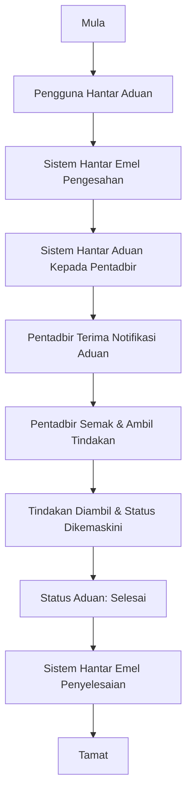

# Dokumentasi Aliran Sistem Helpdesk ServiceDesk ICTServe (iServe) v1.0

> **Rujukan Berkaitan:**
>
> - [ICT DAMAGE COMPLAINT FORM – DETAILS](<./ICT%20DAMAGE%20COMPLAINT%20FORM%20(ServiceDesk%20ICT)%20-%20DETAILED%20BREAKDOWN.md>)
> - [Reka Bentuk ICTServe](<./Dokumentasi_Reka_Bentuk_ICTServe(iServe).md>)
> - [Reka Bentuk Sistem ICTServe](<./Dokumentasi_Reka_Bentuk_Sistem_ICTServe(iServe).md>)
> - [Sistem ICTServe Overview](<./Dokumentasi_Sistem_ICTServe(iServe).md>)
> - [Sistem Notifikasi E-mel](<./Dokumentasi_Sistem_Notifikasi_E-mel_ICTServe(iServe).md>)

---

## 1. Gambaran Umum Aliran Helpdesk

Dokumen ini menerangkan aliran kerja terperinci untuk pengurusan aduan kerosakan ICT melalui modul Helpdesk ServiceDesk dalam ICTServe (iServe). Aliran ini memastikan piawaian UI/UX, aksesibiliti, dan pengalaman pengguna berpaksikan rakyat.

---

## 2. Aliran Proses Aduan Kerosakan ICT

### 2.1 Senarai Langkah Utama

1. **Mula (Start)**
    - Proses bermula apabila pengguna ingin melaporkan masalah ICT.

2. **Pengguna Hantar Aduan**
    - Pengguna log masuk ke ICTServe dan mengisi Borang Aduan Kerosakan ICT.
    - Medan wajib: Nama, Bahagian, E-mel, No. Telefon, Jenis Kerosakan, Maklumat Kerosakan, Perakuan.
    - Dropdown dan input mengikut komponen rasmi, grid responsif 12-8-4.
    - Jika aduan melibatkan perkakasan, medan No. Aset/Printer ID akan dipaparkan secara dinamik.

3. **Sistem Hantar Emel Pengesahan**
    - Sistem menghantar emel pengesahan kepada pengguna (pelapor) secara automatik.
    - Notifikasi juga direkod dalam dashboard ICTServe.

4. **Sistem Hantar Aduan Kepada Pentadbir**
    - Sistem mengarahkan aduan kepada pentadbir Helpdesk untuk tindakan lanjut.
    - Emel notifikasi dihantar kepada pentadbir, dan tiket aduan direkodkan dalam sistem.

5. **Pentadbir Terima Notifikasi Aduan**
    - Pentadbir menerima emel dan notifikasi dalam dashboard pentadbir.

6. **Pentadbir Semak & Ambil Tindakan**
    - Pentadbir menyemak butiran aduan, mengklasifikasikan kategori, dan mengambil tindakan penyelesaian.
    - Status tiket diubah mengikut perkembangan: "Dalam Tindakan", "Menunggu Maklumat", "Selesai".

7. **Tindakan Diambil & Status Dikemaskini**
    - Pentadbir/agen IT mengambil tindakan (pembaikan, komunikasi dengan pelapor, dsb).
    - Semua tindakan dan komen direkod dalam thread tiket.

8. **Status Aduan: Selesai**
    - Setelah masalah diselesaikan, status tiket diubah kepada "Selesai".

9. **Sistem Hantar Emel Penyelesaian**
    - Sistem menghantar emel automatik kepada pelapor, memaklumkan aduan telah diselesaikan.
    - Notifikasi penutupan juga direkod dalam dashboard.

10. **Tamat (End)**
    - Proses aduan kerosakan ICT selesai dan direkodkan untuk audit.

---

## 3. Komponen Kod & Infrastruktur Utama

### 3.1 Komponen UI/UX

- **Form Aduan:** `App\Livewire\Helpdesk\TicketForm`
- **List Tiket:** `App\Livewire\Helpdesk\TicketList`
- **Butiran Tiket:** `App\Livewire\Helpdesk\TicketDetail`
- **Admin Dashboard:** `App\Livewire\Helpdesk\Admin\TicketManagement`
- **Templat Blade:** `resources/views/livewire/helpdesk/ticket-form.blade.php`
- **Grid Layout:** Menggunakan grid 12-8-4, token warna projek, tipografi Poppins/Inter.

### 3.2 Model & Servis

- **Model:** `HelpdeskTicket`, `HelpdeskCategory`, `HelpdeskComment`, `User`
- **Service:** `app/Services/HelpdeskService`
- **Controller:** `app/Http/Controllers/Helpdesk/TicketController`
- **Notification:** `App/Notifications/DamageReportSubmittedNotification`, `DamageReportAssignedNotification`, `DamageReportResolvedNotification`
- **Policy:** `app/Policies/HelpdeskTicketPolicy`

### 3.3 Notifikasi & Audit

- **Automated Email:** Sistem gunakan Laravel Notification dan Mailable untuk semua notifikasi.
- **Audit Log:** Semua perubahan status dan komen disimpan untuk jejak audit (`owen-it/laravel-auditing`).
- **Database:** Semua tiket, komen, status, dan notifikasi direkod dalam pangkalan data.

---

## 4. Pematuhan Rekabentuk & Aksesibiliti

- **UI/UX Konsisten:** Setiap input, dropdown, dan butang menggunakan komponen dan token warna rasmi projek.
- **Aksesibiliti:** ARIA label, keyboard navigation, kontras warna minimum 4.5:1.
- **Grid Responsif:** 12-8-4 grid digunakan, visual dioptimumkan untuk desktop, tablet, dan telefon.
- **Error Prevention:** Validasi real-time dan mesej ralat jelas pada setiap langkah.
- **Komunikasi Dua Saluran:** Notifikasi melalui emel dan dashboard aplikasi.

---

## 5. Carta Alir Proses (Flowchart)

---

## 6. Senarai Semak Pematuhan Prinsip

| Prinsip                         | Status | Penjelasan Ringkas                               |
| ------------------------------- | ------ | ------------------------------------------------ |
| Berpaksikan Rakyat              | ✅     | Borang ringkas, navigasi dua klik, panduan jelas |
| Berpacukan Data                 | ✅     | Audit log dan rekod status yang konsisten        |
| Kandungan Terancang             | ✅     | Struktur borang dan proses jelas                 |
| Teknologi Bersesuaian           | ✅     | Laravel 12, Livewire 3, Filament 4               |
| Antara Muka Minimalis dan Mudah | ✅     | UI ringkas, tidak berlebihan                     |
| Seragam                         | ✅     | Token warna & komponen projek sahaja             |
| Paparan/Menu Jelas              | ✅     | Breadcrumb, label jelas, status pill             |
| Realistik                       | ✅     | Proses mengikut keperluan sebenar BPM            |
| Kognitif                        | ✅     | Susunan borang kurangkan beban kognitif          |
| Fleksibel                       | ✅     | Modular, boleh tambah kategori baru              |
| Komunikasi                      | ✅     | Emel & dashboard notifikasi                      |
| Struktur Hierarki               | ✅     | Hierarki tiket & kategori jelas                  |
| Komponen UI/UX                  | ✅     | Input, dropdown, butang projek                   |
| Tipografi                       | ✅     | Poppins/Inter, saiz label ikut projek            |
| Tetapan Lalai                   | ✅     | Auto-isi bahagian, e-mel jika tersedia           |
| Kawalan Pengguna                | ✅     | Role, policy, akses mengikut peranan             |
| Pencegahan Ralat                | ✅     | Validasi input, pengesahan sebelum submit        |
| Panduan & Dokumentasi           | ✅     | Fail ini, README.md, penerangan langkah          |

---

## 7. Nota Implementasi

- **Warna & Token:** Semua elemen menggunakan token projek (cth: bg-primary-600, txt-danger).
- **Komponen:** Input, select, textarea, button, alert dialog, pill, tag mesti ikut spesifikasi projek.
- **Aksesibiliti:** ARIA, kontras warna, keyboard navigation, skip link.
- **Dark Mode:** Sokongan penuh untuk token automatik.
- **Dokumentasi:** PHPDoc untuk servis/kod utama.

---

## 8. Penutup

Aliran sistem Helpdesk ServiceDesk ICTServe (iServe) direka dan dibangunkan untuk memenuhi keperluan pengurusan aduan kerosakan ICT MOTAC secara digital, selaras dengan piawaian rekabentuk dan aksesibiliti. Aliran ini menjamin pengalaman pengguna yang inklusif, responsif, selamat, dan seragam.

Sebarang penambahbaikan atau maklum balas boleh disalurkan melalui saluran rasmi BPM/MOTAC atau email [design@tech.gov.my](mailto:design@tech.gov.my).

---

## Rujukan

- [Laravel Documentation](https://laravel.com/docs)
- [Filament Documentation](https://filamentphp.com/docs)
- [Livewire Documentation](https://laravel-livewire.com/docs)
- [ICT DAMAGE COMPLAINT FORM – DETAILS](<./ICT%20DAMAGE%20COMPLAINT%20FORM%20(ServiceDesk%20ICT)%20-%20DETAILED%20BREAKDOWN.md>)
