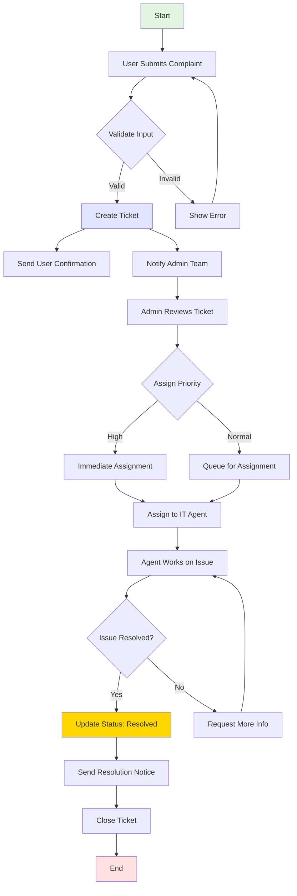

# Dokumentasi Aliran Sistem Helpdesk ServiceDesk — ICTServe (iServe) v1.0

## Maklumat Dokumen

| Atribut              | Nilai          |
| -------------------- | -------------- |
| **Versi Dokumen**    | 3.0.0          |
| **Tarikh Kemaskini** | 6 Oktober 2025 |

- **Jenis dokumen:** Dokumentasi aliran kerja teknikal
- **Audiens:** Pembangun sistem, kakitangan sokongan IT, pentadbir sistem

## Kandungan

1. Gambaran keseluruhan
2. Seni bina sistem
3. Proses aliran kerja
4. Komponen teknikal
5. Piawaian pematuhan
6. Garis panduan pelaksanaan
7. Rujukan

## 1. Gambaran keseluruhan

### 1.1 Tujuan

Dokumen ini menerangkan aliran lengkap pengurusan aduan kerosakan ICT melalui modul Helpdesk ServiceDesk dalam ICTServe (iServe). Sistem menyediakan platform sejagat untuk menjejak permintaan sokongan IT, pengurusan kejadian, dan aliran kerja penyelesaian.

### 1.2 Skop

- Pelaporan dan penjejakan kerosakan ICT
- Penugasan tiket dan pengurusan
- Penjejakan status dan aliran penyelesaian
- Pemberitahuan automatik dan jejak audit

### 1.3 Ciri utama

- Penjejakan status masa nyata: Kemas kini langsung mengenai kemajuan tiket
- Penghalaan automatik: Penugasan tiket pintar berdasarkan kategori
- Pemberitahuan pelbagai saluran: E-mel dan amaran papan pemuka
- Jejak audit komprehensif: Log aktiviti penuh untuk pematuhan

## 2. Seni bina sistem

### 2.1 Teknologi

- Rangka kerja backend: Laravel 12
- Komponen frontend: Livewire 3
- Panel pentadbir: Filament 4
- Pangkalan data: MySQL 8.0+
- Sistem pemberitahuan: Laravel Notifications
- Sistem reka bentuk: Sistem Reka Bentuk Kerajaan Malaysia

### 2.2 Komponen teras

Bahagian ini menyenaraikan komponen logik utama sistem Helpdesk ServiceDesk. Komponen disusun mengikut lapisan (presentation, business logic, data) dan termasuk diagram seni bina inline supaya ia dipaparkan dalam pratonton Markdown.

```mermaid
graph LR
    Presentation[Presentation Layer\n(User form, Admin panel, Dashboard)] --> Business[Business Logic Layer\n(TicketService, DamageService, NotificationService)]
    Business --> Data[Data Layer\n(Tickets, Comments, Categories)]
    Business --> External[External Integrations\n(Email, Storage, Auth, Monitoring)]

    subgraph " "
        Presentation
        Business
        Data
        External
    end

    style Presentation fill:#f0f9ff,stroke:#0366d6
    style Business fill:#e6ffed,stroke:#0f7a1a
    style Data fill:#fff5e6,stroke:#b76b00
    style External fill:#f9e6ff,stroke:#7a2f7a
```

Diagram seni bina ASCII (teks):

```text
┌─────────────────────────────────────────────────────────┐
│                    Presentation Layer                     │
│  ┌──────────────┐  ┌──────────────┐  ┌──────────────┐  │
│  │   User Form  │  │ Admin Panel  │  │  Dashboard   │  │
│  └──────────────┘  └──────────────┘  └──────────────┘  │
└─────────────────────────────────────────────────────────┘
                              │
┌─────────────────────────────────────────────────────────┐
│                    Business Logic Layer                   │
│  ┌──────────────┐  ┌──────────────┐  ┌──────────────┐  │
│  │Ticket Service│  │Damage Service│  │Notify Service│  │
│  └──────────────┘  └──────────────┘  └──────────────┘  │
└─────────────────────────────────────────────────────────┘
                              │
┌─────────────────────────────────────────────────────────┐
│                      Data Layer                          │
│  ┌──────────────┐  ┌──────────────┐  ┌──────────────┐  │
│  │   Tickets    │  │   Comments   │  │  Categories  │  │
│  └──────────────┘  └──────────────┘  └──────────────┘  │
└─────────────────────────────────────────────────────────┘
```

Komponen utama (ringkas):

| Lapisan        | Komponen                | Contoh laluan / kelas                              | Tujuan                                           |
| -------------- | ----------------------- | -------------------------------------------------- | ------------------------------------------------ |
| Presentation   | Borang tiket            | `App\\Livewire\\Helpdesk\\TicketForm`              | Antara muka penghantaran pengguna                |
| Presentation   | Senarai tiket           | `App\\Livewire\\Helpdesk\\TicketList`              | Paparan ringkasan tiket pengguna                 |
| Presentation   | Panel admin             | `App\\Livewire\\Helpdesk\\Admin\\TicketManagement` | Kawalan pentadbir                                |
| Business Logic | HelpdeskService         | `app/Services/HelpdeskService.php`                 | Logik teras aliran tiket dan orkestrasi          |
| Business Logic | DamageReportService     | `app/Services/DamageReportService.php`             | Pemprosesan dan pengesahan laporan kerosakan     |
| Business Logic | NotificationService     | `app/Services/NotificationService.php`             | Pemberitahuan e-mel / papan pemuka / antrian     |
| Data           | HelpdeskTicket          | `app/Models/HelpdeskTicket.php`                    | Model Eloquent untuk tiket                       |
| Data           | HelpdeskComment         | `app/Models/HelpdeskComment.php`                   | Komen perbualan tiket                            |
| External       | E-mel / Queue / Storage | Laravel Notifications, Queues, Filesystem          | Integrasi untuk amaran, lampiran dan kerja latar |

Nota:

- Kekalkan blok mermaid (dokumen ini juga mengandungi diagram aliran proses dalam seksyen 3.1) — ia dipelihara dan akan dipaparkan oleh kebanyakan pratonton Markdown yang menyokong mermaid.
- Gunakan laluan komponen di atas untuk menjejak kod dan ujian dalam repositori.

## 3. Proses aliran kerja

### 3.1 Diagram aliran proses



### 3.2 Langkah proses terperinci

#### Langkah 1: Penghantaran tiket

**Pelakon:** Pengguna akhir

**Tindakan:**

- Akses helpdesk melalui portal ICTServe
- Isikan borang laporan kerosakan dengan medan yang diperlukan
- Lampirkan dokumen/screenshot sokongan (pilihan)
- Hantar borang dengan kotak pengesahan

**Tindak balas sistem:**

- Sahkan semua medan wajib
- Jana nombor tiket unik (format: `HD-YYYY-MM-XXXXX`)
- Simpan tiket dalam pangkalan data dengan cap masa
- Picu aliran kerja pemberitahuan

#### Langkah 2: Pengagihan pemberitahuan

**Tindakan sistem:**

- Hantar pengesahan e-mel kepada pelapor
- Cipta pemberitahuan papan pemuka untuk pasukan pentadbir
- Logkan status penghantaran pemberitahuan

**Kandungan pemberitahuan:**

- Nombor tiket dan cap masa penghantaran
- Ringkasan masalah
- Anggaran masa tindak balas berdasarkan keutamaan

#### Langkah 3: Triaj tiket

**Pelakon:** Pentadbir Helpdesk

**Tindakan:**

- Semak tiket baru dalam papan pemuka pentadbir
- Kategorikan dan tetapkan tahap keutamaan
- Tugaskan kepada ejen IT yang sesuai

**Tahap keutamaan:**

| Keutamaan | Masa tindak balas | Masa penyelesaian |
| --------- | ----------------- | ----------------- |
| Kritikal  | 1 jam             | 4 jam             |
| Tinggi    | 4 jam             | 1 hari bekerja    |
| Normal    | 1 hari bekerja    | 3 hari bekerja    |
| Rendah    | 2 hari bekerja    | 5 hari bekerja    |

#### Langkah 4: Penyelesaian isu

**Pelakon:** Ejen sokongan IT

**Tindakan:**

- Terima tiket yang ditugaskan
- Siasat dan diagnos isu
- Berkomunikasi dengan pengguna melalui komen tiket
- Laksanakan penyelesaian
- Dokumentasikan langkah penyelesaian

**Kemas kini status:**

- Dalam Proses: Ejen sedang bekerja
- Menunggu Pengguna: Menunggu maklum balas pengguna
- Ditunda: Menunggu sumber / kelulusan
- Diselesaikan: Penyelesaian dilaksana

#### Langkah 5: Penutupan tiket

**Tindakan sistem:**

- Kemas kini status akhir ke `Closed`
- Rekod cap masa penutupan
- Hantar pemberitahuan penutupan kepada pengguna
- Jana laporan penyelesaian
- Arkibkan tiket untuk pangkalan pengetahuan

## 4. Komponen teknikal

### 4.1 Komponen frontend

| Komponen      | Laluan                                             | Tujuan                              |
| ------------- | -------------------------------------------------- | ----------------------------------- |
| Borang tiket  | `App\\Livewire\\Helpdesk\\TicketForm`              | Antara muka penghantaran pengguna   |
| Senarai tiket | `App\\Livewire\\Helpdesk\\TicketList`              | Tinjauan tiket pengguna             |
| Butiran tiket | `App\\Livewire\\Helpdesk\\TicketDetail`            | Paparan tiket individu dengan komen |
| Panel admin   | `App\\Livewire\\Helpdesk\\Admin\\TicketManagement` | Panel kawalan pentadbir             |

### 4.2 Perkhidmatan backend

| Perkhidmatan        | Lokasi                                 | Tanggungjawab                      |
| ------------------- | -------------------------------------- | ---------------------------------- |
| HelpdeskService     | `app/Services/HelpdeskService.php`     | Logik perniagaan teras untuk tiket |
| DamageReportService | `app/Services/DamageReportService.php` | Pemprosesan laporan kerosakan      |
| NotificationService | `app/Services/NotificationService.php` | Orkestrasi pemberitahuan           |

### 4.3 Model data

Ringkasan hubungan model:

```text
HelpdeskTicket
├── User (reporter)
├── User (assigned_to)
├── HelpdeskCategory
├── HelpdeskComments[]
└── Attachments[]

DamageReport
├── User (reporter)
├── Department
├── HelpdeskCategory
└── ResolutionNotes
```

### 4.4 Titik akhir API

| Kaedah | Endpoint                              | Tujuan                 | Autentikasi |
| ------ | ------------------------------------- | ---------------------- | ----------- |
| GET    | `/api/helpdesk/tickets`               | Senarai tiket pengguna | Diperlukan  |
| POST   | `/api/helpdesk/tickets`               | Cipta tiket baru       | Diperlukan  |
| GET    | `/api/helpdesk/tickets/{id}`          | Dapatkan butiran tiket | Diperlukan  |
| PUT    | `/api/helpdesk/tickets/{id}`          | Kemas kini tiket       | Diperlukan  |
| POST   | `/api/helpdesk/tickets/{id}/comments` | Tambah komen           | Diperlukan  |

## 5. Piawaian pematuhan

### 5.1 Pematuhan prinsip reka bentuk kerajaan

| Prinsip               | Pelaksanaan                                     | Status   |
| --------------------- | ----------------------------------------------- | -------- |
| Berpaksikan rakyat    | Borang intuitif, navigasi 2-klik                | ✅ Patuh |
| Berpacukan data       | Jejak audit komprehensif                        | ✅ Patuh |
| Kandungan terancang   | Seksyen borang dan aliran kerja jelas           | ✅ Patuh |
| Teknologi sesuai      | Tumpuan pada tumpuan teknologi moden (Laravel)  | ✅ Patuh |
| Antara muka minimalis | UI bersih, tidak berlebihan                     | ✅ Patuh |
| Konsistensi           | Komponen reka bentuk digunakan secara konsisten | ✅ Patuh |
| Paparan/menu jelas    | Breadcrumbs, penunjuk status                    | ✅ Patuh |
| Realistik             | Berdasarkan keperluan BPM sebenar               | ✅ Patuh |
| Beban kognitif rendah | Pendedahan maklumat berperingkat                | ✅ Patuh |
| Fleksibel             | Seni bina modular, boleh dikembangkan           | ✅ Patuh |
| Komunikasi            | Pemberitahuan pelbagai saluran                  | ✅ Patuh |
| Hierarki              | Struktur kandungan yang jelas                   | ✅ Patuh |
| Komponen UI/UX        | Komponen boleh guna semula                      | ✅ Patuh |
| Tipografi             | Piawaian tipografi rasmi                        | ✅ Patuh |
| Tetapan lalai         | Tetapan selamat dan privasi dilindungi          | ✅ Patuh |
| Kawalan pengguna      | Kawalan akses berasaskan peranan                | ✅ Patuh |
| Pencegahan ralat      | Pengesahan input awal, pengesahan tindakan      | ✅ Patuh |
| Dokumentasi           | Panduan dan tooltip komprehensif                | ✅ Patuh |

### 5.2 Pelaksanaan reka bentuk kerajaan

- Token warna: Semua elemen UI menggunakan token warna rasmi
- Komponen: Borang, butang, amaran mengikuti spesifikasi rasmi
- Sistem grid: Susun atur responsif 12-8-4
- Aksesibiliti: WCAG 2.1 AA dengan label ARIA
- Tipografi: Poppins untuk tajuk, Inter untuk teks badan

## 6. Garis panduan pelaksanaan

### 6.1 Persediaan pembangunan

```bash
# Clone repositori
git clone https://github.com/motac/ictserve.git

# Pasang kebergantungan
composer install
npm install

# Konfigurasi persekitaran
cp .env.example .env
php artisan key:generate

# Jalankan migrasi
php artisan migrate --seed

# Mula pelayan pembangunan dan aset frontend
php artisan serve
npm run dev
```

### 6.2 Konfigurasi

Contoh `config/helpdesk.php`:

```php
<?php

return [
    'ticket_prefix' => 'HD',
    'auto_close_days' => 7,
    'priority_levels' => [
        'critical' => ['response' => 60, 'resolution' => 240],
        'high'     => ['response' => 240, 'resolution' => 1440],
        'normal'   => ['response' => 1440, 'resolution' => 4320],
        'low'      => ['response' => 2880, 'resolution' => 7200],
    ],
    'categories' => [
        'hardware' => 'Hardware Issues',
        'software' => 'Software Problems',
        'network'  => 'Network Connectivity',
        'account'  => 'Account Access',
    ],
];
```

### 6.3 Ujian

```bash
# Jalankan ujian unit (berkaitan helpdesk)
php artisan test --filter=Helpdesk

# Jalankan ujian ciri
php artisan test --testsuite=Feature

# Jana laporan liputan
php artisan test --coverage
```

### 6.4 Senarai semak pelaksanaan

- Pembolehubah persekitaran dikonfigurasi
- Migrasi pangkalan data dilaksanakan
- Perkhidmatan e-mel dikonfigurasi
- Pekerja antrian berjalan
- Sijil SSL dipasang
- Alat pemantauan dikonfigurasi
- Strategi sandaran dilaksanakan

## 7. Rujukan

### 7.1 Sumber luaran

- Dokumentasi Laravel 12
- Dokumentasi Livewire 3
- Dokumentasi Filament 4
- Laman rasmi sistem reka bentuk kerajaan

### 7.2 Dokumentasi berkaitan

- Dokumen seni bina sistem
- Dokumentasi API
- Manual pengguna
- Panduan pentadbir
- Panduan pelaksanaan

### 7.3 Perhubungan sokongan

- Sokongan teknikal: <support@ictserve.gov.my>
- Dokumentasi: <docs@ictserve.gov.my>
- Isu keselamatan: <security@ictserve.gov.my>

## Sejarah semakan

| Versi | Tarikh    | Pengarang        | Perubahan   |
| ----- | --------- | ---------------- | ----------- |
| 1.0   | Sept 2025 | Pasukan ICTServe | Siaran awal |

---

## English version

### Helpdesk ServiceDesk System Flow Documentation — ICTServe (iServe) v1.0

## Document information

- **Version:** 1.0
- **Last updated:** September 2025
- **Document type:** Technical workflow documentation
- **Audience:** System developers, IT support staff, system administrators

## Table of contents

1. Overview
2. System architecture
3. Workflow process
4. Technical components
5. Compliance standards
6. Implementation guidelines
7. References

## 1. Overview

### 1.1 Purpose

This document describes the comprehensive workflow for ICT damage complaint management through the Helpdesk ServiceDesk module in ICTServe (iServe). The system provides a unified platform for IT support request tracking, incident management, and resolution workflows.

### 1.2 Scope

- ICT damage reporting and tracking
- Ticket assignment and management
- Status tracking and resolution workflows
- Automated notifications and audit trails

### 1.3 Key features

- Real-time status tracking: Live updates on ticket progress
- Automated routing: Intelligent ticket assignment based on categories
- Multi-channel notifications: Email and dashboard alerts
- Comprehensive audit trail: Complete activity logging for compliance

## 2. System architecture

### 2.1 Technology stack

- Backend framework: Laravel 12
- Frontend components: Livewire 3
- Admin panel: Filament 4
- Database: MySQL 8.0+
- Notification system: Laravel Notifications
- Design system: Malaysia Government Design System

### 2.2 Core components

This section lists the main logical components of the Helpdesk ServiceDesk system. The components are grouped by layer (presentation, business logic, data) and an inline architecture diagram is included so the structure renders in Markdown preview.

```mermaid
graph LR
    Presentation[Presentation Layer\n(User form, Admin panel, Dashboard)] --> Business[Business Logic Layer\n(TicketService, DamageService, NotificationService)]
    Business --> Data[Data Layer\n(Tickets, Comments, Categories)]
    Business --> External[External Integrations\n(Email, Storage, Auth, Monitoring)]

    subgraph " "
        Presentation
        Business
        Data
        External
    end

    style Presentation fill:#f0f9ff,stroke:#0366d6
    style Business fill:#e6ffed,stroke:#0f7a1a
    style Data fill:#fff5e6,stroke:#b76b00
    style External fill:#f9e6ff,stroke:#7a2f7a
```

ASCII architecture diagram (plain text):

```text
┌─────────────────────────────────────────────────────────┐
│                    Presentation Layer                     │
│  ┌──────────────┐  ┌──────────────┐  ┌──────────────┐  │
│  │   User Form  │  │ Admin Panel  │  │  Dashboard   │  │
│  └──────────────┘  └──────────────┘  └──────────────┘  │
└─────────────────────────────────────────────────────────┘
                              │
┌─────────────────────────────────────────────────────────┐
│                    Business Logic Layer                   │
│  ┌──────────────┐  ┌──────────────┐  ┌──────────────┐  │
│  │Ticket Service│  │Damage Service│  │Notify Service│  │
│  └──────────────┘  └──────────────┘  └──────────────┘  │
└─────────────────────────────────────────────────────────┘
                              │
┌─────────────────────────────────────────────────────────┐
│                      Data Layer                          │
│  ┌──────────────┐  ┌──────────────┐  ┌──────────────┐  │
│  │   Tickets    │  │   Comments   │  │  Categories  │  │
│  └──────────────┘  └──────────────┘  └──────────────┘  │
└─────────────────────────────────────────────────────────┘
```

Key components (concise):

| Layer          | Component               | Example path / class                               | Purpose                                                  |
| -------------- | ----------------------- | -------------------------------------------------- | -------------------------------------------------------- |
| Presentation   | Ticket form             | `App\\Livewire\\Helpdesk\\TicketForm`              | User submission UI                                       |
| Presentation   | Ticket list             | `App\\Livewire\\Helpdesk\\TicketList`              | User ticket overview                                     |
| Presentation   | Admin panel             | `App\\Livewire\\Helpdesk\\Admin\\TicketManagement` | Admin controls                                           |
| Business Logic | HelpdeskService         | `app/Services/HelpdeskService.php`                 | Core ticket workflows and orchestration                  |
| Business Logic | DamageReportService     | `app/Services/DamageReportService.php`             | Damage-specific processing and validation                |
| Business Logic | NotificationService     | `app/Services/NotificationService.php`             | Email / dashboard / queue notifications                  |
| Data           | HelpdeskTicket          | `app/Models/HelpdeskTicket.php`                    | Eloquent model for tickets                               |
| Data           | HelpdeskComment         | `app/Models/HelpdeskComment.php`                   | Ticket comments / conversation                           |
| External       | Email / Queue / Storage | Laravel Notifications, Queues, Filesystem          | Integrations for alerts, attachments and background jobs |

Notes:

- Keep the mermaid blocks (this file contains the process flow diagram in section 3.1) — they are preserved and rendered by most Markdown previewers that support mermaid.
- Use the component paths above as starting points for tracing code and tests in the repository.

## 3. Workflow process

### 3.1 Process flow diagram


### 3.2 Detailed process steps

#### Step 1: Ticket submission

**Actor:** End user

**Actions:**

- Access helpdesk through ICTServe portal
- Complete damage report form with required fields
- Attach supporting documents/screenshots (optional)
- Submit form with acknowledgment checkbox

**System response:**

- Validate all required fields
- Generate unique ticket number (format: `HD-YYYY-MM-XXXXX`)
- Store ticket in database with timestamp
- Trigger notification workflow

#### Step 2: Notification distribution

**System actions:**

- Send email confirmation to reporter
- Create dashboard notification for admin team
- Log notification delivery status

**Notification content:**

- Ticket number and submission timestamp
- Problem summary
- Expected response time based on priority

#### Step 3: Ticket triage

**Actor:** Helpdesk administrator

**Actions:**

- Review new tickets in admin dashboard
- Categorize and set priority level
- Assign to appropriate IT agent

**Priority levels:**

| Priority | Response time   | Resolution time |
| -------- | --------------- | --------------- |
| Critical | 1 hour          | 4 hours         |
| High     | 4 hours         | 1 business day  |
| Normal   | 1 business day  | 3 business days |
| Low      | 2 business days | 5 business days |

#### Step 4: Issue resolution

**Actor:** IT support agent

**Actions:**

- Accept assigned ticket
- Investigate and diagnose issue
- Communicate with user via ticket comments
- Implement solution
- Document resolution steps

**Status updates:**

- In Progress: Agent actively working
- Pending User: Awaiting user response
- On Hold: Waiting for resources/approval
- Resolved: Solution implemented

#### Step 5: Ticket closure

**System actions:**

- Update final status to `Closed`
- Record closure timestamp
- Send closure notification to user
- Generate resolution report
- Archive ticket for knowledge base

## 4. Technical components

### 4.1 Frontend components

| Component     | Path                                               | Purpose                              |
| ------------- | -------------------------------------------------- | ------------------------------------ |
| Ticket form   | `App\\Livewire\\Helpdesk\\TicketForm`              | User complaint submission interface  |
| Ticket list   | `App\\Livewire\\Helpdesk\\TicketList`              | User's ticket overview               |
| Ticket detail | `App\\Livewire\\Helpdesk\\TicketDetail`            | Individual ticket view with comments |
| Admin panel   | `App\\Livewire\\Helpdesk\\Admin\\TicketManagement` | Administrative control panel         |

### 4.2 Backend services

| Service             | Location                               | Responsibilities           |
| ------------------- | -------------------------------------- | -------------------------- |
| HelpdeskService     | `app/Services/HelpdeskService.php`     | Core ticket business logic |
| DamageReportService | `app/Services/DamageReportService.php` | Damage report processing   |
| NotificationService | `app/Services/NotificationService.php` | Notification orchestration |

### 4.3 Data models

Simplified model relationships:

```text
HelpdeskTicket
├── User (reporter)
├── User (assigned_to)
├── HelpdeskCategory
├── HelpdeskComments[]
└── Attachments[]

DamageReport
├── User (reporter)
├── Department
├── HelpdeskCategory
└── ResolutionNotes
```

### 4.4 API endpoints

| Method | Endpoint                              | Purpose            | Authentication |
| ------ | ------------------------------------- | ------------------ | -------------- |
| GET    | `/api/helpdesk/tickets`               | List user tickets  | Required       |
| POST   | `/api/helpdesk/tickets`               | Create new ticket  | Required       |
| GET    | `/api/helpdesk/tickets/{id}`          | Get ticket details | Required       |
| PUT    | `/api/helpdesk/tickets/{id}`          | Update ticket      | Required       |
| POST   | `/api/helpdesk/tickets/{id}/comments` | Add comment        | Required       |

## 5. Compliance standards

### 5.1 Compliance with government design principles

| Principle              | Implementation                        | Status       |
| ---------------------- | ------------------------------------- | ------------ |
| User-centric           | Intuitive forms, 2-click navigation   | ✅ Compliant |
| Data-driven            | Comprehensive audit logging           | ✅ Compliant |
| Structured content     | Clear form sections and workflow      | ✅ Compliant |
| Appropriate technology | Modern Laravel stack                  | ✅ Compliant |
| Minimalist interface   | Clean, uncluttered UI                 | ✅ Compliant |
| Consistency            | Consistent use of design components   | ✅ Compliant |
| Clear navigation       | Breadcrumbs, status indicators        | ✅ Compliant |
| Realistic              | Based on actual BPM requirements      | ✅ Compliant |
| Cognitive load         | Progressive disclosure of information | ✅ Compliant |
| Flexibility            | Modular, extensible architecture      | ✅ Compliant |
| Communication          | Multi-channel notifications           | ✅ Compliant |
| Hierarchy              | Clear organizational structure        | ✅ Compliant |
| UI/UX components       | Reusable design components            | ✅ Compliant |
| Typography             | Official typography standards         | ✅ Compliant |
| Default settings       | Smart defaults for common fields      | ✅ Compliant |
| User control           | Role-based access control             | ✅ Compliant |
| Error prevention       | Input validation, confirmations       | ✅ Compliant |
| Documentation          | Comprehensive guides and tooltips     | ✅ Compliant |

### 5.2 Government design implementation

- Color tokens: All UI elements use official color tokens
- Components: Forms, buttons, alerts follow official specifications
- Grid system: 12-8-4 responsive grid layout
- Accessibility: WCAG 2.1 AA compliance with ARIA labels
- Typography: Poppins for headings, Inter for body text

## 6. Implementation guidelines

### 6.1 Development setup

```bash
# Clone repository
git clone https://github.com/motac/ictserve.git

# Install dependencies
composer install
npm install

# Configure environment
cp .env.example .env
php artisan key:generate

# Run migrations
php artisan migrate --seed

# Start development server and frontend assets
php artisan serve
npm run dev
```

### 6.2 Configuration

Example `config/helpdesk.php`:

```php
<?php

return [
    'ticket_prefix' => 'HD',
    'auto_close_days' => 7,
    'priority_levels' => [
        'critical' => ['response' => 60, 'resolution' => 240],
        'high'     => ['response' => 240, 'resolution' => 1440],
        'normal'   => ['response' => 1440, 'resolution' => 4320],
        'low'      => ['response' => 2880, 'resolution' => 7200],
    ],
    'categories' => [
        'hardware' => 'Hardware Issues',
        'software' => 'Software Problems',
        'network'  => 'Network Connectivity',
        'account'  => 'Account Access',
    ],
];
```

### 6.3 Testing

```bash
# Run unit tests (helpdesk-related)
php artisan test --filter=Helpdesk

# Run feature tests
php artisan test --testsuite=Feature

# Generate coverage report
php artisan test --coverage
```

### 6.4 Deployment checklist

- Environment variables configured
- Database migrations executed
- Email service configured
- Queue workers running
- SSL certificates installed
- Monitoring tools configured
- Backup strategy implemented

## 7. References

### 7.1 External resources

- Laravel 12 documentation
- Livewire 3 documentation
- Filament 4 documentation
- Official government design system site

### 7.2 Related documentation

- System architecture document
- API documentation
- User manual
- Administrator guide
- Deployment guide

### 7.3 Support contacts

- Technical support: <support@ictserve.gov.my>
- Documentation: <docs@ictserve.gov.my>
- Security issues: <security@ictserve.gov.my>

## Revision history

| Version | Date      | Author        | Changes         |
| ------- | --------- | ------------- | --------------- |
| 1.0     | Sept 2025 | ICTServe Team | Initial release |
