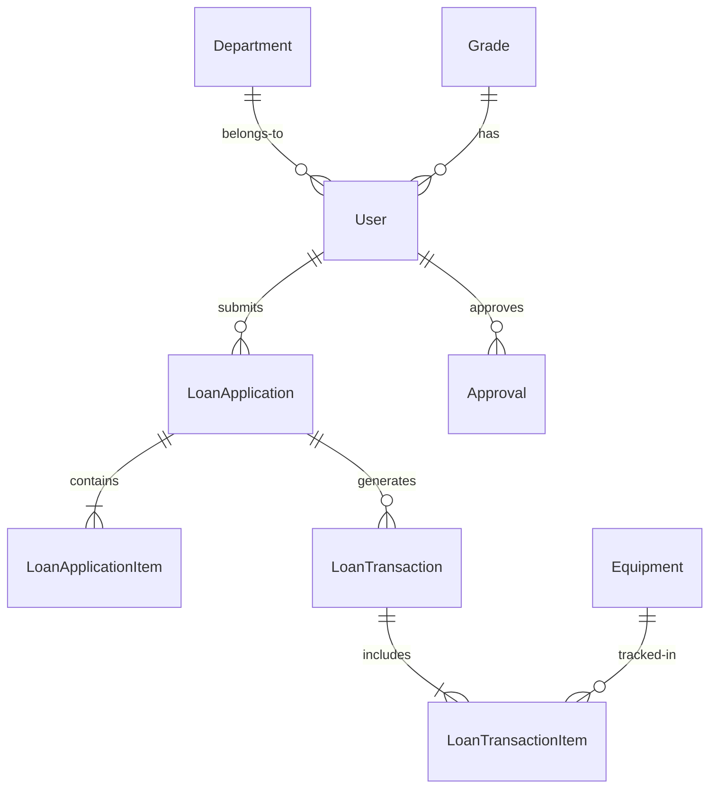

# Dokumentasi Aliran Sistem Permohonan Pinjaman Peralatan ICT

| Atribut              | Nilai          |
| -------------------- | -------------- |
| **Versi Dokumen**    | 3.0.0          |
| **Tarikh Kemaskini** | 6 Oktober 2025 |

## Kandungan

- [Pengenalan](#pengenalan)
- [Seni Bina Sistem](#seni-bina-sistem)
- [Aliran Kerja Permohonan Pinjaman](#aliran-kerja-permohonan-pinjaman)
- [Pelaksanaan Teknikal](#pelaksanaan-teknikal)
- [Aliran Data dan Model](#aliran-data-dan-model)
- [Keselamatan dan Pematuhan](#keselamatan-dan-pematuhan)
- [Dokumentasi API](#dokumentasi-api)
- [Penerapan dan Operasi](#penerapan-dan-operasi)

## Pengenalan

### Tujuan

Modul Pinjaman Peralatan ICT menguruskan keseluruhan kitaran hayat pinjaman peralatan ICT dalam MOTAC, bermula dari permohonan awal sehingga kelulusan, pengeluaran, penjejakan penggunaan, dan pemulangan.

### Objektif Utama

- Proses Dipermudah: Transformasi digital borang pinjaman berasaskan kertas
- Akauntabiliti: Jejak audit lengkap untuk semua transaksi
- Pengoptimuman Sumber: Penjejakan inventori dan ketersediaan masa nyata
- Pematuhan: Mematuhi dasar perolehan dan pengurusan aset kerajaan

### Manfaat Sistem

| Manfaat        | Penerangan                                     | Impak                       |
| -------------- | ---------------------------------------------- | --------------------------- |
| Kecekapan      | Masa proses dikurangkan dari hari ke jam       | 70% lebih pantas            |
| Ketelusan      | Penjejakan status masa nyata untuk semua pihak | 100% keterlihatan           |
| Ketepatan      | Pengesahan automatik & pencegahan ralat        | 95% pengurangan ralat       |
| Kebolehcapaian | Akses 24/7 dari mana-mana peranti              | Kepuasan pengguna meningkat |

## Seni Bina Sistem

### Seni Bina Tahap Tinggi

┌──────────────────────────────────────────────────────────────┐
│ Lapisan Antara Muka Pengguna │
│ ┌────────────┐ ┌────────────┐ ┌────────────┐ │
│ │ Web App │ │Paparan Mudah Alih │ │ Admin │ │
│ │ (Livewire) │ │(Responsif) │ │ (Filament) │ │
│ └────────────┘ └────────────┘ └────────────┘ │
└──────────────────────────────────────────────────────────────┘
│
┌──────────────────────────────────────────────────────────────┐
│ Lapisan Aplikasi │
│ ┌────────────────────────────────────────────────────────┐ │
│ │ Laravel 12 Framework │ │
│ │ ┌──────────┐ ┌──────────┐ ┌──────────┐ │ │
│ │ │Pengawal│ │ Servis │ │ Model │ │ │
│ │ └──────────┘ └──────────┘ └──────────┘ │ │
│ └────────────────────────────────────────────────────────┘ │
└──────────────────────────────────────────────────────────────┘
│
┌──────────────────────────────────────────────────────────────┐
│ Lapisan Data │
│ ┌────────────────────────────────────────────────────────┐ │
│ │ Pangkalan Data MySQL │ │
│ │ ┌──────────┐ ┌──────────┐ ┌──────────┐ │ │
│ │ │ Pinjaman │ │Peralatan │ │ Pengguna │ │ │
│ │ └──────────┘ └──────────┘ └──────────┘ │ │
│ └────────────────────────────────────────────────────────┘ │
└──────────────────────────────────────────────────────────────┘

### Component Architecture

LayerComponentsTechnologiesPresentationForms, Dashboards, ReportsBlade, Livewire 3Business LogicServices, Policies, ObserversLaravel 12, PHP 8.2+Data AccessModels, RepositoriesEloquent ORMInfrastructureQueue, Cache, StorageRedis, S3/Local

## Aliran Kerja Permohonan Pinjaman

### Complete Process Flow

````mermaid
stateDiagram-v2
[*] --> Draft: User starts application
Draft --> Submitted: Submit form
Submitted --> UnderReview: Auto-assign to approver
UnderReview --> Approved: Approve request
UnderReview --> Rejected: Reject request
Rejected --> [*]: End process
Approved --> ReadyForIssuance: BPM notified
ReadyForIssuance --> Issued: Equipment issued
Issued --> InUse: User receives equipment
InUse --> Returning: Return initiated
Returning --> Returned: Equipment checked in
Returned --> Completed: Process complete
Completed --> [*]: End process

    note right of UnderReview
        Approver must be
        Grade 41 or above
    end note


    note right of Issued
        Accessories checklist
        completed
    end note


### Detailed Process Steps

#### Phase 1: Application Submission

##### Step 1.1: Form Initialization

User accesses loan application form
System auto-populates user details
Dynamic form sections load based on user role


##### Step 1.2: Data Entry

```php
// Form structure based on official form
````

Section 1: Applicant Information

- Name (auto-filled)
- Position & Grade (auto-filled)
- Department/Unit (auto-filled)
- Purpose of loan
- Contact number
- Location of use
- Loan period (start/end dates)

Section 2: Responsible Officer

- [ ] Same as applicant
- Officer details (if different)

Section 3: Equipment Details

- Equipment type selection
- Quantity required
- Special requirements/notes

Section 4: Acknowledgments

- Terms and conditions acceptance
- Digital signature timestamp

#### Step 1.3: Validation & Submission

Real-time field validation
Business rule validation
Duplicate request checking
Submission confirmation

#### Phase 2: Approval Process

##### Step 2.1: Automatic Routing

```php
// Approval routing logic
if ($applicant->grade->level < 41) {
    $approver = $applicant->department->getApprover();
} else {
    $approver = $applicant->supervisor;
}
```

##### Step 2.2: Approver Actions

Review application details
Check equipment availability
Add comments/conditions
Approve/Reject decision

##### Step 2.3: Notification Distribution

EventRecipientsChannelSubmissionApplicantEmail + DashboardPending ApprovalApproverEmail + DashboardApprovedApplicant, BPMEmail + DashboardRejectedApplicantEmail + Dashboard

#### Phase 3: Equipment Issuance

##### Step 3.1: Inventory Check

Verify equipment availability
Reserve specific items
Generate issuance checklist

##### Step 3.2: Physical Handover

```yaml
Issuance Checklist:
    Main Equipment:
        - Model/Serial Number
        - Condition assessment
        - Functionality test
    Accessories:
        - Power adapter: [✓]
        - Carrying case: [✓]
        - Cables/peripherals: [✓]
        - Documentation: [✓]
    Signatures:
        - Issuing Officer: [Digital signature]
        - Recipient: [Digital signature]
        - Timestamp: [Auto-generated]
```

##### Langkah 3.3: Kemas Kini Status

Status peralatan → "Sedang Dipinjam"
Status permohonan → "Dikeluarkan"
Jana resit pengeluaran

#### Fasa 4: Proses Pemulangan

##### Langkah 4.1: Inisiasi Pemulangan

Pengguna/BPM memulakan pemulangan
Jadualkan janji temu pemulangan
Notifikasi pra-pemulangan dihantar

##### Langkah 4.2: Pemeriksaan Peralatan

```yaml
Return Checklist:
    Condition Assessment:
        - [ ] Good condition
        - [ ] Minor wear
        - [ ] Damage noted
        - [ ] Missing items
    Accessories Return:
        - Power adapter: [Status]
        - Carrying case: [Status]
        - Other items: [Status]
    Final Status:
        - [ ] Complete return
        - [ ] Partial return
        - [ ] Damage report required
```

##### Langkah 4.3: Selesai Proses

Kemas kini status peralatan
Tutup permohonan pinjaman
Jana sijil penyelesaian
Arkibkan transaksi

## Pelaksanaan Teknikal

### Komponen Teras

#### Pengawal (Controllers)

```php
// Pengawal utama dan tanggungjawabnya
LoanApplicationController

├── index() - Senarai permohonan
├── create() - Papar borang permohonan
├── store() - Proses permohonan baharu
├── show() - Papar butiran permohonan
├── generatePDF() - Eksport ke PDF
└── cancel() - Batal permohonan

LoanTransactionController

├── processIssuance() - Urus pengeluaran peralatan
├── processReturn() - Urus pemulangan peralatan
├── getChecklistItems() - Dapatkan senarai semak
└── updateStatus() - Kemas kini status transaksi
```

#### Servis

```php
// Seni bina lapisan servis
LoanApplicationService

├── createApplication($data)
├── validateApplication($application)
├── routeForApproval($application)
├── checkEquipmentAvailability($items)
└── generateApplicationNumber()

LoanTransactionService

├── processNewIssue($application, $equipment)
├── processExistingReturn($transaction, $condition)
├── validateAccessories($checklist)
└── calculateOverdueFees($transaction)
```

#### Komponen Livewire

```php
// Komponen UI dinamik
ResourceManagement\LoanApplication\ApplicationForm

├── mount() - Inisialisasi borang
├── updated($field) - Urus perubahan medan
├── validateSection($section) - Pengesahan seksyen
├── submitApplication() - Proses penghantaran
└── saveDraft() - Fungsi auto-simpan

ResourceManagement\Admin\BPM\ProcessIssuance

├── selectEquipment() - Pilih peralatan
├── validateChecklist() - Sahkan senarai semak
├── confirmIssuance() - Pengesahan akhir
└── generateReceipt() - Penjanaan resit
```

### Skema Pangkalan Data

```sql
-- Struktur jadual teras
loan_applications
├── id (primary key)
├── application_number (unique)
├── user_id (foreign key)
├── purpose (text)
├── location (varchar)
├── loan_start_date (date)
├── loan_end_date (date)
├── status (enum)
├── responsible_officer_id (foreign key)
├── supporting_officer_id (foreign key)
├── approved_by (foreign key)
├── approved_at (timestamp)
├── admin_notes (text)
└── timestamps

loan_application_items
├── id (primary key)
├── loan_application_id (foreign key)
├── equipment_type (varchar)
├── quantity_requested (integer)
├── quantity_approved (integer)
├── quantity_issued (integer)
└── quantity_returned (integer)

loan_transactions
├── id (primary key)
├── loan_application_id (foreign key)
├── type (enum: issue/return)
├── transaction_date (datetime)
├── accessories_checklist (json)
├── condition_notes (text)
└── signatures (json)
```

### Pelaksanaan Keselamatan

```php
// Kebenaran berasaskan polisi
class LoanApplicationPolicy
{
    public function create(User $user): bool
    {
        return $user->status === 'active'
            && $user->department_id !== null;
    }

    public function approve(User $user, LoanApplication $application): bool
    {
        return $user->grade->level >= 41
            && $user->department_id === $application->user->department_id;
    }

    public function issue(User $user): bool
    {
        return $user->hasRole('bpm-staff');
    }
}
```

## Aliran Data dan Model

### Entity Relationships



```text
LoanApplication {
    string status
    date loan_start_date
    date loan_end_date
    text purpose
}

Equipment {
    string asset_type
    string serial_number
    string status
    string condition
}
```

### Peralihan Keadaan

<!-- Akan ditukar ke jadual markdown pada langkah seterusnya -->

Keadaan SemasaTindakanKeadaan SeterusnyaSyaratDraftHantarSubmittedSemua medan wajib lengkapSubmittedAuto-routeUnder ReviewPemeriksa dikenal pastiUnder ReviewLulusApprovedPemeriksa diberi kuasaUnder ReviewTolakRejectedDengan sebabApprovedProsesReady for IssuanceBPM dimaklumkanReady for IssuanceKeluarkanIssuedPeralatan tersediaIssuedPulangkanReturningPemulangan dimulakanReturningSelesaiReturnedSemua item diperiksaReturnedTutupCompletedProses dimuktamadkan

## Keselamatan dan Pematuhan

### Langkah Keselamatan

<!-- Akan ditukar ke jadual markdown pada langkah seterusnya -->

LapisanKawalan KeselamatanPelaksanaanPengesahanPengesahan berpusat melalui direktoriLDAP/Active DirectoryKebenaranKawalan akses berasaskan perananSpatie Laravel PermissionPerlindungan DataPenyulitan semasa rehat & transitAES-256, TLS 1.3Jejak AuditLog aktiviti menyeluruhLaravel AuditingPengurusan SesiPengendalian sesi selamatRedis session driverPengesahan InputPengesahan sisi pelayanForm Requests, Policies

### Piawaian Pematuhan

Pematuhan Prinsip Kerajaan

✅ Reka Bentuk Berfokus Pengguna: Antara muka intuitif, klik minimum
✅ Keputusan Berasaskan Data: Analitik & papan pemuka laporan
✅ Kandungan Tersusun: Bahagian borang teratur
✅ Teknologi Sesuai: Stak moden, boleh skala
✅ Antara Muka Minimalis: Reka bentuk ringkas, fokus
✅ Konsistensi: Corak seragam merentasi modul
✅ Navigasi Jelas: Breadcrumb, penunjuk kemajuan
✅ Pelaksanaan Realistik: Berdasarkan aliran kerja sebenar
✅ Pengurusan Beban Kognitif: Pendedahan progresif
✅ Fleksibiliti: Aliran kerja boleh dikonfigurasi
✅ Komunikasi: Notifikasi pelbagai saluran
✅ Struktur Hierarki: Rantaian kelulusan jelas
✅ Komponen Boleh Guna Semula: Pustaka komponen rasmi
✅ Piawaian Tipografi: Sistem tipografi rasmi
✅ Lalai Pintar: Medan praisi
✅ Kawalan Pengguna: Kebenaran terperinci
✅ Pencegahan Ralat: Pengesahan & pengesahan
✅ Dokumentasi: Panduan komprehensif

## Dokumentasi API

### Titik Akhir RESTful

```yaml
Loan Applications:
    GET /api/loan-applications:
        description: List user's applications
        parameters:
            - status: filter by status
            - page: pagination
        response: ApplicationCollection
    POST /api/loan-applications:
        description: Create new application
        body: ApplicationRequest
        response: ApplicationResource
    GET /api/loan-applications/{id}:
        description: Get application details
        response: ApplicationResource
    PUT /api/loan-applications/{id}:
        description: Update application
        body: ApplicationUpdateRequest
        response: ApplicationResource
    POST /api/loan-applications/{id}/approve:
        description: Approve application
        body: ApprovalRequest
        response: ApprovalResource
Equipment:
    GET /api/equipment/available:
        description: List available equipment
        parameters:
            - category: filter by category
            - date_range: availability period
        response: EquipmentCollection
```

### Format Respons

```json
{
    "data": {
        "id": "LA-2025-09-00001",
        "status": "approved",
        "applicant": {
            "name": "John Doe",
            "department": "IT Department",
            "grade": "41"
        },
        "equipment": [
            {
                "type": "laptop",
                "quantity_requested": 2,
                "quantity_approved": 2
            }
        ],
        "loan_period": {
            "start": "2025-09-20",
            "end": "2025-09-27"
        }
    },
    "meta": {
        "timestamp": "2025-09-15T10:30:00Z",
        "version": "1.0"
    }
}
```

## Penerapan dan Operasi

### Keperluan Persekitaran

```yaml
Production Environment:
    Server:
        - OS: Ubuntu 22.04 LTS
        - CPU: 4 cores minimum
        - RAM: 8GB minimum
        - Storage: 100GB SSD
    Software:
        - PHP: 8.2+
        - MySQL: 8.0+
        - Redis: 7.0+
        - Nginx: 1.22+
        - Node.js: 18+
    Services:
        - Queue Worker: Supervisor
        - Cache: Redis
        - Session: Redis
        - Mail: SMTP/Mailgun
```

### Proses Penyebaran

```bash

# Senarai semak penyebaran

1. Pra-penyebaran
    □ Sandarkan pangkalan data semasa
    □ Sahkan pembolehubah persekitaran
    □ Jalankan ujian

2. Penyebaran
    □ Tarik kod terkini
    □ Pasang kebergantungan
    □ Jalankan migrasi
    □ Kosongkan cache
    □ Mulakan semula servis

3. Pasca-penyebaran
    □ Sahkan kesihatan aplikasi
    □ Semak log ralat
    □ Pantau metrik prestasi
    □ Jana laporan penyebaran
```

### Pemantauan dan Penyelenggaraan

```yaml
Strategi Pemantauan:
    Aplikasi:
        - Masa tindak balas < 200ms
        - Kadar ralat < 0.1%
        - Masa operasi > 99.9%
    Pangkalan Data:
        - Prestasi pertanyaan
        - Penggunaan pool sambungan
        - Pengesanan deadlock
    Infrastruktur:
        - Penggunaan CPU < 70%
        - Penggunaan memori < 80%
        - Penggunaan cakera < 85%
Jadual Penyelenggaraan:
    Harian:
        - Putaran log
        - Pembersihan fail sementara
        - Pemantauan queue
    Mingguan:
        - Pengoptimuman pangkalan data
        - Semakan kemas kini keselamatan
        - Pengesahan sandaran
    Bulanan:
        - Semakan prestasi
        - Audit keselamatan
        - Perancangan kapasiti
```

## Sejarah Revisi

| Versi | Tarikh    | Penulis          | Perubahan                             |
| ----- | --------- | ---------------- | ------------------------------------- |
| 4.1   | Sept 2025 | Pasukan ICTServe | Kemas kini pematuhan                  |
| 4.0   | Ogos 2025 | Pasukan ICTServe | Reka bentuk semula aliran kerja utama |
| 3.0   | Jun 2025  | Pasukan ICTServe | Penambahbaikan keselamatan            |
| 2.0   | Mac 2025  | Pasukan ICTServe | Tambah aliran kerja kelulusan         |
| 1.0   | Jan 2025  | Pasukan ICTServe | Keluaran awal                         |
