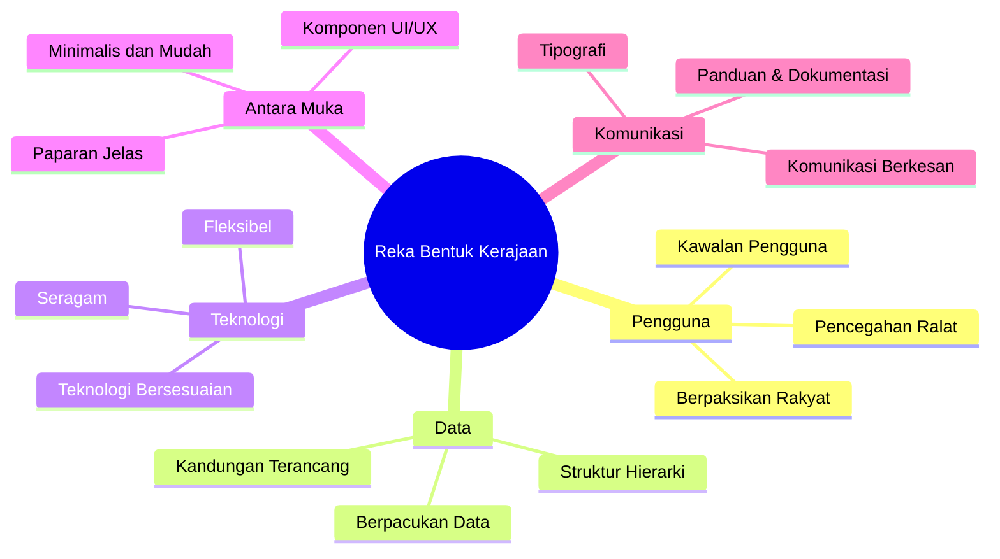

# Dokumentasi Reka Bentuk Sistem ICTServe (iServe)

| Atribut              | Nilai          |
| -------------------- | -------------- |
| **Versi Dokumen**    | 3.0.0          |
| **Tarikh Kemaskini** | 6 Oktober 2025 |

## Kandungan

- [Ringkasan Eksekutif](#ringkasan-eksekutif)
- [Prinsip Reka Bentuk](#prinsip-reka-bentuk)
- [Reka Bentuk Antara Muka](#reka-bentuk-antara-muka)
- [Reka Bentuk Pangkalan Data](#reka-bentuk-pangkalan-data)
- [Pematuhan Standard](#pematuhan-standard)
- [Panduan Implementasi](#panduan-implementasi)
- [Lampiran](#lampiran)

## Ringkasan Eksekutif

### Pengenalan

ICTServe (iServe) ialah sistem pengurusan perkhidmatan ICT yang komprehensif, dibangunkan khusus untuk Kementerian Pelancongan, Seni dan Budaya Malaysia (MOTAC). Sistem ini mengintegrasikan pengurusan pinjaman aset ICT dan operasi helpdesk dalam satu platform yang selamat, cekap, serta mesra pengguna.

### Objektif Reka Bentuk

| Objektif            | Penerangan                                   | Metrik Kejayaan          |
| ------------------- | -------------------------------------------- | ------------------------ |
| Kebolehgunaan       | Antara muka intuitif dan mudah digunakan     | Skor SUS > 80            |
| Prestasi            | Sistem responsif dengan masa pemuatan pantas | Masa respons < 2s        |
| Skalabiliti         | Menyokong pertumbuhan pengguna               | 500+ pengguna serentak   |
| Keselamatan         | Perlindungan data menyeluruh                 | Tiada pelanggaran data   |
| Kebolehselenggaraan | Mudah dikemas kini dan disenggara            | < 4 jam masa henti/tahun |

### Skop Reka Bentuk

Dokumen ini merangkumi:

- Prinsip dan garis panduan reka bentuk
- Seni bina sistem dan komponen
- Spesifikasi antara muka pengguna
- Struktur pangkalan data
- Protokol keselamatan
- Standard API dan integrasi

## Prinsip Reka Bentuk

### Prinsip Reka Bentuk Kerajaan

ICTServe mematuhi prinsip reka bentuk kerajaan Malaysia untuk memastikan kualiti dan kebolehgunaan sistem:



### Prinsip Reka Bentuk Teknikal

// Batasan Konteks (Bounded Contexts)
├── Konteks Pengurusan Peralatan
│ ├── Agregat Tiket
└── Agregat Peranan
| Tanggungjawab Tunggal | Setiap kelas mempunyai satu tanggungjawab sahaja |
}
System_Ext(email, "Sistem E-mel", "Pelayan SMTP")
System_Ext(hrmis, "HRMIS", "Sistem HR")
Rel(api, cache, "Cache data")
Rel(web, email, "Hantar notifikasi")
Rel(api, hrmis, "Penyelarasan data staf")

## Reka Bentuk Antara Muka

### Sistem Grid Responsif

```css
/* Sistem Grid: 12-8-4 */
.container {
    display: grid;
    gap: 1rem;
}

/* Desktop: 12 lajur */
@media (min-width: 1024px) {
    .container {
        grid-template-columns: repeat(12, 1fr);
    }
}

/* Tablet: 8 lajur */
@media (min-width: 768px) and (max-width: 1023px) {
    .container {
        grid-template-columns: repeat(8, 1fr);
    }
}

/* Mudah Alih: 4 lajur */
@media (max-width: 767px) {
    .container {
        grid-template-columns: repeat(4, 1fr);
    }
}
```

### Sistem Warna Rasmi

```scss
// Warna Utama
$primary-50: #eff6ff;
$primary-100: #dbeafe;
$primary-500: #3b82f6;
$primary-600: #2563eb;
$primary-700: #1d4ed8;

// Warna Sekunder
$secondary-50: #f8fafc;
$secondary-500: #64748b;
$secondary-900: #0f172a;

// Warna Semantik
$success: #10b981;
$warning: #f59e0b;
$danger: #ef4444;
$info: #06b6d4;

// Warna Neutral
$gray-50: #f9fafb;
$gray-500: #6b7280;
$gray-900: #111827;
```

### Tipografi

```css
/* Fon Tajuk */
.heading {
    font-family:
        'Poppins',
        -apple-system,
        BlinkMacSystemFont,
        sans-serif;
    font-weight: 600;
    line-height: 1.2;
}

/* Fon Isi */
.body {
    font-family:
        'Inter',
        -apple-system,
        BlinkMacSystemFont,
        sans-serif;
    font-weight: 400;
    line-height: 1.6;
}

/* Saiz Fon (rem) */
.text-xs {
    font-size: 0.75rem;
} /* 12px */
.text-sm {
    font-size: 0.875rem;
} /* 14px */
.text-base {
    font-size: 1rem;
} /* 16px */
.text-lg {
    font-size: 1.125rem;
} /* 18px */
.text-xl {
    font-size: 1.25rem;
} /* 20px */
.text-2xl {
    font-size: 1.5rem;
} /* 24px */
.text-3xl {
    font-size: 1.875rem;
} /* 30px */
```

### Komponen UI

#### Komponen Butang

```blade
{{-- resources/views/components/button.blade.php --}}
@props([
        'type' => 'primary',
        'size' => 'medium',
        'disabled' => false,
        'loading' => false,
])

@php
$classes = [
        'primary' => 'bg-primary-600 hover:bg-primary-700 text-white',
        'secondary' => 'bg-gray-200 hover:bg-gray-300 text-gray-800',
        'danger' => 'bg-danger hover:bg-red-600 text-white',
];

$sizes = [
        'small' => 'px-3 py-1.5 text-sm',
        'medium' => 'px-4 py-2 text-base',
        'large' => 'px-6 py-3 text-lg',
];
@endphp

<button
        {{ $attributes->merge([
                'type' => 'button',
                'class' => 'inline-flex items-center justify-center rounded-md font-medium transition-colors focus:outline-none focus:ring-2 focus:ring-offset-2 disabled:opacity-50 disabled:cursor-not-allowed ' . $classes[$type] . ' ' . $sizes[$size]
        ]) }}
        {{ $disabled || $loading ? 'disabled' : '' }}
>
        @if($loading)
                <svg class="animate-spin -ml-1 mr-2 h-4 w-4" xmlns="http://www.w3.org/2000/svg" fill="none" viewBox="0 0 24 24">
                        <circle class="opacity-25" cx="12" cy="12" r="10" stroke="currentColor" stroke-width="4"></circle>
                        <path class="opacity-75" fill="currentColor" d="M4 12a8 8 0 018-8V0C5.373 0 0 5.373 0 12h4zm2 5.291A7.962 7.962 0 014 12H0c0 3.042 1.135 5.824 3 7.938l3-2.647z"></path>
                </svg>
        @endif
        {{ $slot }}
</button>
```

#### Komponen Input Borang

```blade
{{-- resources/views/components/form/input.blade.php --}}
@props([
        'label' => '',
        'name' => '',
        'type' => 'text',
        'required' => false,
        'error' => null,
])

<div class="form-group">
        @if($label)
                <label for="{{ $name }}" class="block text-sm font-medium text-gray-700 mb-1">
                        {{ $label }}
                        @if($required)
                                <span class="text-danger">*</span>
                        @endif
                </label>
        @endif

        <input
                type="{{ $type }}"
                name="{{ $name }}"
                id="{{ $name }}"
                {{ $attributes->merge(['class' => 'block w-full rounded-md border-gray-300 shadow-sm focus:border-primary-500 focus:ring-primary-500 sm:text-sm' . ($error ? ' border-danger' : '')]) }}
                {{ $required ? 'required' : '' }}
        />

        @if($error)
                <p class="mt-1 text-sm text-danger">{{ $error }}</p>
        @endif
</div>
```

## Reka Bentuk Pangkalan Data

### Prinsip Reka Bentuk Pangkalan Data

| Prinsip       | Penerangan                       | Implementasi                             |
| ------------- | -------------------------------- | ---------------------------------------- |
| Penormalan    | Mengurangkan redundansi data     | 3NF untuk kebanyakan jadual              |
| Pengindeksan  | Meningkatkan prestasi pertanyaan | Indeks pada foreign key dan medan carian |
| Soft Delete   | Mengekalkan sejarah data         | Medan deleted_at (timestamp)             |
| Audit Trail   | Jejak perubahan data             | Medan created_by, updated_by             |
| Sokongan UUID | Pengecam unik                    | UUID untuk rujukan API                   |

### Struktur Jadual Utama

#### Jadual Pengguna (Users)

````sql
CREATE TABLE users (
    id BIGINT UNSIGNED AUTO_INCREMENT PRIMARY KEY,
    uuid CHAR(36) UNIQUE NOT NULL,
    name VARCHAR(255) NOT NULL,
    email VARCHAR(255) UNIQUE NOT NULL,
    identification_number VARCHAR(20) UNIQUE,

    ## Reka Bentuk API

    ### RESTful API Design

    ```yaml
    API Structure:
        Version: /api/v1
        Format: JSON
        Authentication: Bearer Token (Sanctum)

    Endpoints:
        Equipment:
            GET /equipment           # List equipment
            GET /equipment/{id}      # Get equipment details
            POST /equipment          # Create equipment
            PUT /equipment/{id}      # Update equipment
            DELETE /equipment/{id}   # Delete equipment
        Loans:
            GET    /loans                  # List loans
            GET    /loans/{id}             # Get loan details
            POST   /loans                  # Create loan application
            PUT    /loans/{id}/approve     # Approve loan
            PUT    /loans/{id}/reject      # Reject loan
            POST   /loans/{id}/issue       # Issue equipment
            POST   /loans/{id}/return      # Return equipment
    ```

    ### API Response Format

    ```json
    {
        "success": true,
        "data": {
            "id": 1,
            "type": "loan_application",
            "attributes": {
                "application_number": "LA-2025-09-0001",
                "status": "approved",
                "created_at": "2025-09-25T10:00:00Z"
            },
            "relationships": {
                "user": {
                    "id": 123,
                    "name": "Ahmad Ali"
                },
                "equipment": [
                    {
                        "id": 456,
                        "name": "Dell Laptop",
                        "quantity": 1
                    }
                ]
            }
        },
        "meta": {
            "timestamp": "2025-09-25T10:30:00Z",
            "version": "1.0"
        }
    }
    ```

    ### Error Handling

    ```json
    {
        "success": false,
        "error": {
            "code": "VALIDATION_ERROR",
            "message": "The given data was invalid.",
            "details": {
                "email": [
                    "The email field is required."
                ],
                "loan_date": [
                    "The loan date must be a future date."
                ]
            }
        },
        "meta": {
            "timestamp": "2025-09-25T10:30:00Z",
            "request_id": "req_abc123"
        }
    }
    ```
// config/secure-headers.php
return [
    'X-Frame-Options' => 'SAMEORIGIN',
    'X-Content-Type-Options' => 'nosniff',
    'X-XSS-Protection' => '1; mode=block',
    'Strict-Transport-Security' => 'max-age=31536000; includeSubDomains',
    'Content-Security-Policy' => "default-src 'self'; script-src 'self' 'unsafe-inline' 'unsafe-eval' https://cdn.jsdelivr.net; style-src 'self' 'unsafe-inline' https://fonts.googleapis.com; font-src 'self' https://fonts.gstatic.com;",
    'Referrer-Policy' => 'strict-origin-when-cross-origin',
    'Permissions-Policy' => 'camera=(), microphone=(), geolocation=()',
];
````

### Audit Logging

```php
// app/Traits/Auditable.php
trait Auditable
{
    public static function bootAuditable()
    {
        static::creating(function ($model) {
            if (auth()->check()) {
                $model->created_by = auth()->id();
            }
        });

        static::updating(function ($model) {
            if (auth()->check()) {
                $model->updated_by = auth()->id();
            }
        });

        static::deleting(function ($model) {
            if (auth()->check()) {
                $model->deleted_by = auth()->id();
                $model->save();
            }
        });
    }
}
```

## Pematuhan Standard

### Senarai Semak Pematuhan Kerajaan

| Prinsip               | Status | Implementasi                                          |
| --------------------- | ------ | ----------------------------------------------------- |
| Berpaksikan Rakyat    | ✅     | Reka bentuk berpusatkan pengguna, ujian kebolehgunaan |
| Berpacukan Data       | ✅     | Model data komprehensif, analitik                     |
| Kandungan Terancang   | ✅     | Kandungan terstruktur, hierarki jelas                 |
| Teknologi Bersesuaian | ✅     | Teknologi moden, seni bina boleh skala                |
| Antara Muka Minimalis | ✅     | Antara muka ringkas, fungsi terfokus                  |
| Seragam               | ✅     | Corak reka bentuk konsisten                           |
| Paparan Jelas         | ✅     | Navigasi jelas, breadcrumbs                           |
| Realistik             | ✅     | Berdasarkan aliran kerja sebenar                      |
| Kognitif              | ✅     | Beban kognitif dikurangkan                            |
| Fleksibel             | ✅     | Seni bina modular                                     |
| Komunikasi            | ✅     | Notifikasi pelbagai saluran                           |
| Struktur Hierarki     | ✅     | Struktur organisasi jelas                             |
| Komponen UI/UX        | ✅     | Komponen boleh guna semula                            |
| Tipografi             | ✅     | Piawaian tipografi rasmi kerajaan                     |
| Tetapan Lalai         | ✅     | Tetapan lalai pintar                                  |
| Kawalan Pengguna      | ✅     | Keutamaan pengguna, RBAC                              |
| Pencegahan Ralat      | ✅     | Pengesahan, pengesahan semula                         |
| Panduan & Dokumentasi | ✅     | Dokumentasi komprehensif                              |

### Pematuhan WCAG 2.1 AA

| Kriteria                   | Status | Nota                                            |
| -------------------------- | ------ | ----------------------------------------------- |
| 1.1.1 Kandungan Bukan Teks | ✅     | Teks alternatif untuk semua imej                |
| 1.4.3 Kontras (Minimum)    | ✅     | Nisbah 4.5:1 untuk teks biasa                   |
| 2.1.1 Papan Kekunci        | ✅     | Semua fungsi boleh diakses dengan papan kekunci |
| 2.4.7 Fokus Kelihatan      | ✅     | Penunjuk fokus yang jelas                       |
| 3.3.2 Label/Arahan         | ✅     | Label jelas untuk semua input                   |

## Panduan Implementasi

### Persediaan Pembangunan

```bash
# Prasyarat

- PHP >= 8.2
- Composer >= 2.0
- Node.js >= 18.0
- MySQL >= 8.0
- Redis >= 7.0
```

### Langkah Pemasangan

```bash
# 1. Klon repositori
git clone https://github.com/motac/ictserve.git
cd ictserve

# 2. Pasang kebergantungan
composer install
npm install

# 3. Persediaan persekitaran
cp .env.example .env
php artisan key:generate

# 4. Persediaan pangkalan data
php artisan migrate --seed

# 5. Bina aset
npm run build

# 6. Mulakan pelayan pembangunan
php artisan serve
npm run dev
```

### Senarai Semak Pengeluaran

- [ ] Jalankan ujian: php artisan test
- [ ] Semak kualiti kod: php artisan insights
- [ ] Bina aset: npm run build
- [ ] Kosongkan cache: php artisan optimize:clear

### Pengeluaran

- [ ] Aktifkan mod penyelenggaraan: php artisan down
- [ ] Tarik kod terkini: git pull origin main
- [ ] Pasang kebergantungan: composer install --no-dev
- [ ] Jalankan migrasi: php artisan migrate --force
- [ ] Kosong & cache konfigurasi: php artisan optimize
- [ ] Mulakan semula servis: supervisorctl restart all

### Selepas Pengeluaran

- [ ] Nyahaktif mod penyelenggaraan: php artisan up
- [ ] Sahkan aplikasi: semakan kesihatan
- [ ] Pantau log: tail -f storage/logs/laravel.log

### Strategi Ujian

| Jenis Ujian   | Alat            | Sasaran Liputan  |
| ------------- | --------------- | ---------------- |
| Ujian Unit    | PHPUnit         | > 80%            |
| Ujian Ciri    | PHPUnit         | > 70%            |
| Ujian Pelayar | Laravel Dusk    | Laluan kritikal  |
| Ujian API     | Postman/PHPUnit | Semua endpoint   |
| Prestasi      | Apache Bench    | < 2s respons     |
| Keselamatan   | OWASP ZAP       | Tiada kerentanan |

## Lampiran

### A. Glosari Teknikal

| Istilah | Definisi                                                                                                        |
| ------- | --------------------------------------------------------------------------------------------------------------- |
| API     | Antara Muka Pengaturcaraan Aplikasi                                                                             |
| CRUD    | Cipta, Baca, Kemaskini, Padam                                                                                   |
| DDD     | Reka Bentuk Berpaksikan Domain                                                                                  |
| MVC     | Model-Paparan-Pengawal                                                                                          |
| RBAC    | Kawalan Akses Berasaskan Peranan                                                                                |
| REST    | Pemindahan Keadaan Representasi                                                                                 |
| SOLID   | Tanggungjawab tunggal, Terbuka-tertutup, Penggantian Liskov, Pengasingan Antara Muka, Pembalikan Kebergantungan |
| UUID    | Pengecam Unik Sejagat                                                                                           |
| WCAG    | Garis Panduan Kebolehcapaian Kandungan Web                                                                      |

### B. Rujukan

Dokumentasi Laravel
Dokumentasi Livewire
Dokumentasi Filament
Garis Panduan Reka Bentuk Kerajaan
Kerangka Reka Bentuk Kerajaan
Garis Panduan WCAG 2.1

### C. Log Perubahan

| Versi | Tarikh     | Perubahan                          | Penulis             |
| ----- | ---------- | ---------------------------------- | ------------------- |
| 2.0   | 25/09/2025 | Kemas kini utama, patuh sepenuhnya | Pasukan ICTServe    |
| 1.5   | 15/08/2025 | Tambah ciri keselamatan            | Pasukan Keselamatan |
| 1.0   | 12/06/2025 | Keluaran awal                      | Pasukan Pembangunan |

### D. Hubungi

Pasukan Pembangunan ICTServe

E-mel: <ictserve@motac.gov.my>
Portal: <https://ictserve.motac.gov.my/support>
Telefon: 03-8000 8000
