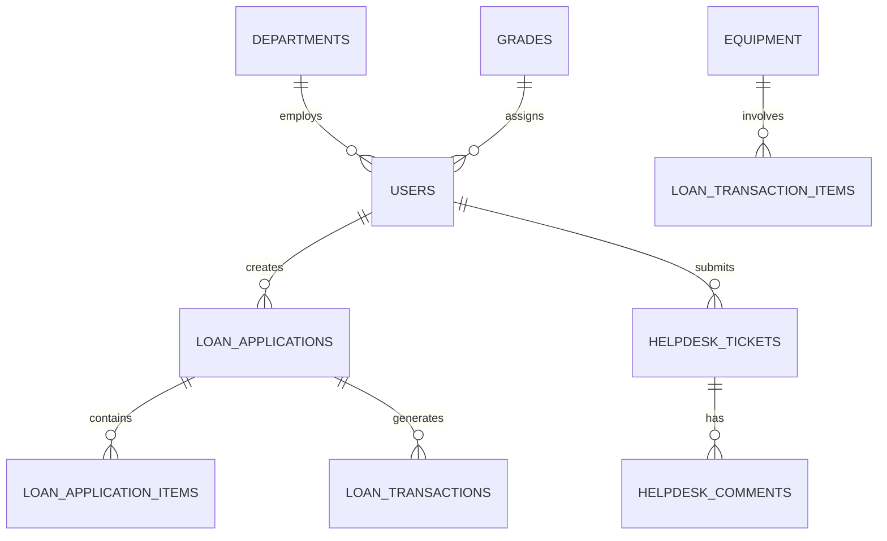
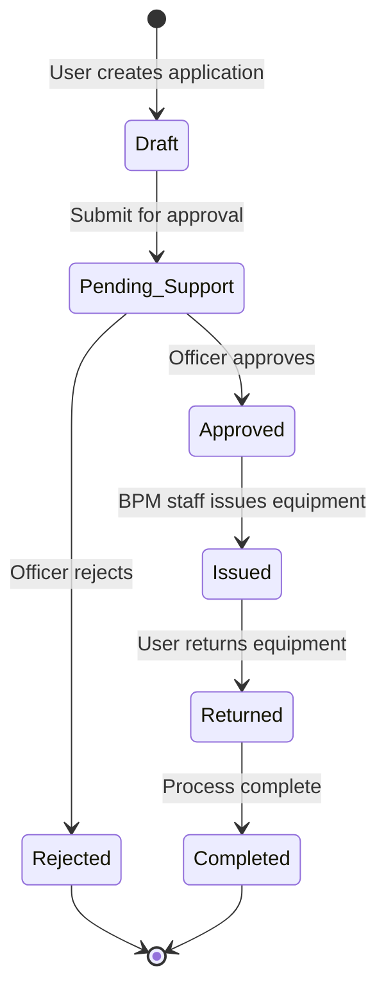
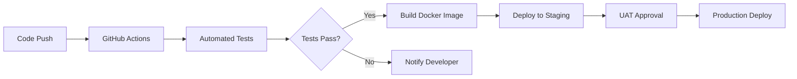
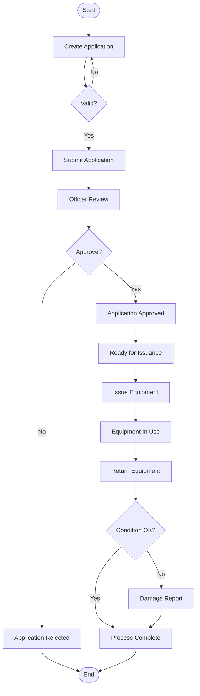
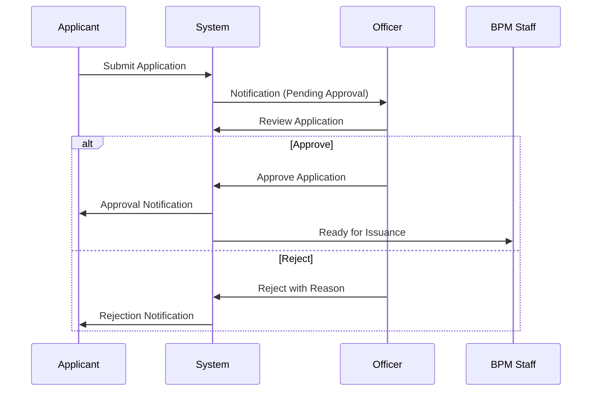
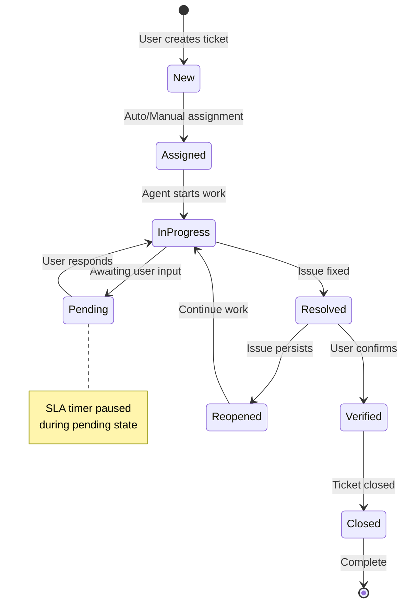

# ICTServe (iServe) Complete Documentation Suite

## Document Index

1. [System Design Documentation](#1-system-design-documentation)
2. [System Documentation](#2-system-documentation)
3. [ICT Asset Loan Application Flow](#3-ict-asset-loan-application-flow)
4. [Helpdesk & ServiceDesk Flow](#helpdesk--servicedesk-flow)
5. [Email Notification System](#email-notification-system)
6. [User & Organization Data Schema](#user--organization-data-schema)

---

## 1. System Design Documentation

| Atribut              | Nilai                        |
| -------------------- | ---------------------------- |
| **Versi Dokumen**    | 3.0.0                        |
| **Tarikh Kemaskini** | 6 Oktober 2025               |
| **Status**           | Aktif                        |
| **Klasifikasi**      | Dokumentasi Teknikal Dalaman |
| **Penulis**          | Pasukan Pembangunan ICTServe |

## Executive Summary — System Design

ICTServe (iServe) v1.0 is a comprehensive ICT service management platform for the Ministry of Tourism, Arts and Culture (MOTAC) Malaysia. Built on Laravel 12 with Livewire 3 and Filament 4, the system provides integrated management for ICT equipment loans and helpdesk operations while ensuring full compliance with Malaysian Government Design System (MYDS) and MyGOVEA principles.

## Table of Contents — System Design

- [1.1 System Overview](#11-system-overview)
- [1.2 Core Objectives](#12-core-objectives)
- [1.3 Technical Architecture](#13-technical-architecture)
- [1.4 Database Design](#14-database-design)
- [1.5 Business Workflows](#15-business-workflows)
- [1.6 User Interface Design](#16-user-interface-design)
- [1.7 Security & Compliance](#17-security--compliance)
- [1.8 Deployment Strategy](#18-deployment-strategy)

## 1.1 System Overview

ICTServe consolidates two critical operational domains:

### Core Modules

| Module                        | Description                               | Key Features                                                                |
| ----------------------------- | ----------------------------------------- | --------------------------------------------------------------------------- |
| **Equipment Loan Management** | Manages ICT equipment borrowing lifecycle | Request submission, approval workflow, issuance tracking, return processing |
| **Helpdesk & Support**        | Comprehensive IT support ticketing system | Ticket creation, assignment, resolution tracking, SLA monitoring            |

## 1.2 Core Objectives

<!-- Add your core objectives here -->

## 1.3 Technical Architecture

### Technology Stack

```yaml
Framework: Laravel 12
Frontend: Livewire 3, Alpine.js
Admin Panel: Filament 4
Database: MySQL 8.0+
Cache: Redis
Queue: Database/Redis
Mail: SMTP/Mailtrap
Container: Docker
CI/CD: GitHub Actions
```

| Layer          | Technology            | Purpose                     |
| -------------- | --------------------- | --------------------------- |
| Presentation   | Blade, Livewire       | User interface rendering    |
| Application    | Controllers, Services | Business logic processing   |
| Domain         | Models, Policies      | Core business rules         |
| Infrastructure | Repositories, APIs    | External system integration |

## 1.4 Database Design

### 1.4.1 Core Schema Overview



### 1.4.2 Key Tables

#### Users Table

```sql
CREATE TABLE users (
    id BIGINT PRIMARY KEY,
    title VARCHAR(50),
    name VARCHAR(255) NOT NULL,
    identification_number VARCHAR(20) UNIQUE,
    email VARCHAR(255) UNIQUE NOT NULL,
    department_id BIGINT FOREIGN KEY,
    grade_id BIGINT FOREIGN KEY,
    position_id BIGINT FOREIGN KEY,
    status ENUM('active', 'inactive', 'suspended'),
    created_by BIGINT,
    updated_by BIGINT,
    deleted_by BIGINT,
    created_at TIMESTAMP,
    updated_at TIMESTAMP,
    deleted_at TIMESTAMP
);
```

### 1.4.3 Audit Trail Implementation

All critical tables include audit fields automatically populated via Laravel Auditing:

- `created_by` - User who created the record
- `updated_by` - Last user to modify
- `deleted_by` - User who soft-deleted
- Timestamps for all operations

## 1.5 Business Workflows

### 1.5.1 Equipment Loan Workflow



### 1.5.2 Approval Matrix

| Requester Grade | Minimum Approver Grade | Authority Level   |
| --------------- | ---------------------- | ----------------- |
| 54 and below    | 41                     | Departmental      |
| 52-48           | 44                     | Divisional        |
| 44-41           | 48                     | Senior Management |
| JUSA and above  | JUSA B                 | Executive         |

## 1.6 User Interface Design

### 1.6.1 MYDS Compliance

All UI components strictly adhere to MYDS guidelines:

```css
/* MYDS Color Palette */
:root {
    --myds-primary: #2563eb;
    --myds-success: #10b981;
    --myds-warning: #f59e0b;
    --myds-danger: #ef4444;
    --myds-neutral: #6b7280;
}

/* Typography */
.myds-heading {
    font-family: 'Poppins', sans-serif;
    font-weight: 600;
}

.myds-body {
    font-family: 'Inter', sans-serif;
    font-weight: 400;
}
```

### 1.6.2 Responsive Design

| Breakpoint | Width      | Columns | Use Case               |
| ---------- | ---------- | ------- | ---------------------- |
| Mobile     | < 640px    | 4       | Smartphones            |
| Tablet     | 640-1024px | 8       | Tablets, small laptops |
| Desktop    | > 1024px   | 12      | Desktop computers      |

### 1.6.3 Component Library

```php
// MYDS Button Component
<x-myds.button
    type="primary"
    size="medium"
    icon="check"
    :loading="$isProcessing">
    {{ __('Submit Application') }}
</x-myds.button>
```

## 1.7 Security & Compliance

### 1.7.1 Security Measures

| Layer              | Implementation        | Purpose                    |
| ------------------ | --------------------- | -------------------------- |
| Authentication     | LDAP/Active Directory | User identity verification |
| Authorization      | Spatie Permissions    | Role-based access control  |
| Data Protection    | Encryption at rest    | Sensitive data security    |
| Session Management | Redis sessions        | Secure session handling    |
| API Security       | Sanctum tokens        | API authentication         |
| Input Validation   | Form Requests         | Data integrity             |

### 1.7.2 Compliance Standards

- **PDPA Compliance** - Personal data protection
- **ISO 27001** - Information security management
- **MAMPU Standards** - Government IT guidelines
- **WCAG 2.1 AA** - Web accessibility

## 1.8 Deployment Strategy

### 1.8.1 Environment Configuration

```yaml
## Production Environment
APP_ENV: production
APP_DEBUG: false
APP_URL: https://ictserve.motac.gov.my

## Database
DB_CONNECTION: mysql
DB_HOST: ${RDS_HOSTNAME}
DB_DATABASE: ictserve_prod

## Cache & Session
CACHE_DRIVER: redis
SESSION_DRIVER: redis
QUEUE_CONNECTION: redis

## Security
FORCE_HTTPS: true
SESSION_SECURE_COOKIE: true
```

### 1.8.2 CI/CD Pipeline



### 1.8.3 Monitoring & Maintenance

| Aspect                  | Tool       | Frequency  |
| ----------------------- | ---------- | ---------- |
| Application Performance | New Relic  | Real-time  |
| Error Tracking          | Sentry     | Real-time  |
| Database Backup         | AWS RDS    | Daily      |
| Security Scanning       | SonarQube  | Weekly     |
| Log Analysis            | CloudWatch | Continuous |

---

## 2. System Documentation

**Document Version:** 2.0  
**Last Updated:** September 25, 2025  
**Status:** Production Ready  
**Classification:** Technical Reference

## 2.0 Executive Summary

This document provides comprehensive technical documentation for the ICTServe system, covering installation, configuration, operation, and maintenance procedures. It serves as the primary reference for system administrators, developers, and support personnel.

## Table of Contents — System Documentation

- [2.1 System Requirements](#21-system-requirements)
- [2.2 Installation Guide](#22-installation-guide)
- [2.3 Configuration](#23-configuration)
- [2.4 System Components](#24-system-components)
- [2.5 API Documentation](#25-api-documentation)
- [2.6 Troubleshooting](#26-troubleshooting)
- [2.7 Maintenance Procedures](#27-maintenance-procedures)

## 2.1 System Requirements

### 2.1.1 Server Requirements

| Component | Minimum          | Recommended      |
| --------- | ---------------- | ---------------- |
| CPU       | 4 cores          | 8 cores          |
| RAM       | 8 GB             | 16 GB            |
| Storage   | 100 GB SSD       | 500 GB NVMe      |
| OS        | Ubuntu 20.04 LTS | Ubuntu 22.04 LTS |
| PHP       | 8.2              | 8.3              |
| MySQL     | 8.0              | 8.0.30+          |
| Redis     | 6.0              | 7.0              |
| Node.js   | 18.x             | 20.x             |

### 2.1.2 Software Dependencies

```json
{
    "laravel/framework": "^12.0",
    "livewire/livewire": "^3.0",
    "filament/filament": "^4.0",
    "spatie/laravel-permission": "^6.0",
    "barryvdh/laravel-dompdf": "^2.0",
    "directory-tree/ldap-record": "^3.4",
    "laravel/jetstream": "^4.0"
}
```

## 2.2 Installation Guide

### 2.2.1 Prerequisites

```bash
## Update system packages
sudo apt update && sudo apt upgrade -y

## Install required packages
sudo apt install -y git curl zip unzip nginx mysql-server redis-server

## Install PHP and extensions
sudo apt install -y php8.3-fpm php8.3-mysql php8.3-xml php8.3-mbstring \
    php8.3-curl php8.3-gd php8.3-intl php8.3-zip php8.3-redis

## Install Composer
curl -sS https://getcomposer.org/installer | php
sudo mv composer.phar /usr/local/bin/composer

## Install Node.js and npm
curl -fsSL https://deb.nodesource.com/setup_20.x | sudo -E bash -
sudo apt install -y nodejs
```

### 2.2.2 Application Setup

```bash
## Clone repository
git clone https://github.com/motac/ictserve.git
cd ictserve

## Install PHP dependencies
composer install --optimize-autoloader --no-dev

## Install Node dependencies
npm install && npm run build

## Configure environment
cp .env.example .env
php artisan key:generate

## Configure database
mysql -u root -p -e "CREATE DATABASE ictserve;"
mysql -u root -p -e "CREATE USER 'ictserve'@'localhost' IDENTIFIED BY 'secure_password';"
mysql -u root -p -e "GRANT ALL ON ictserve.* TO 'ictserve'@'localhost';"

## Run migrations and seeders
php artisan migrate --force
php artisan db:seed --class=ProductionSeeder

## Set permissions
sudo chown -R www-data:www-data storage bootstrap/cache
sudo chmod -R 775 storage bootstrap/cache

## Optimize application
php artisan config:cache
php artisan route:cache
php artisan view:cache
php artisan filament:cache-components
```

### 2.2.3 Web Server Configuration

```nginx
## /etc/nginx/sites-available/ictserve
server {
    listen 80;
    server_name ictserve.motac.gov.my;
    return 301 https://$server_name$request_uri;
}

server {
    listen 443 ssl http2;
    server_name ictserve.motac.gov.my;
    root /var/www/ictserve/public;

    ssl_certificate /etc/ssl/certs/ictserve.crt;
    ssl_certificate_key /etc/ssl/private/ictserve.key;

    index index.php;

    location / {
        try_files $uri $uri/ /index.php?$query_string;
    }

    location ~ \.php$ {
        fastcgi_pass unix:/var/run/php/php8.3-fpm.sock;
        fastcgi_param SCRIPT_FILENAME $realpath_root$fastcgi_script_name;
        include fastcgi_params;
    }

    location ~ /\.(?!well-known).* {
        deny all;
    }
}
```

## 2.3 Configuration

### 2.3.1 Environment Variables

```env
## Application
APP_NAME="ICTServe"
APP_ENV=production
APP_KEY=base64:generated_key_here
APP_DEBUG=false
APP_URL=https://ictserve.motac.gov.my

# Database
DB_CONNECTION=mysql
DB_HOST=127.0.0.1
DB_PORT=3306
DB_DATABASE=ictserve
DB_USERNAME=ictserve
DB_PASSWORD=secure_password

# Cache & Session
CACHE_DRIVER=redis
SESSION_DRIVER=redis
SESSION_LIFETIME=120

# Queue
QUEUE_CONNECTION=redis

# Mail
MAIL_MAILER=smtp
MAIL_HOST=smtp.gov.my
MAIL_PORT=587
MAIL_USERNAME=ictserve@motac.gov.my
MAIL_PASSWORD=mail_password
MAIL_ENCRYPTION=tls
MAIL_FROM_ADDRESS=noreply@motac.gov.my
MAIL_FROM_NAME="${APP_NAME}"

# Redis
REDIS_HOST=127.0.0.1
REDIS_PASSWORD=null
REDIS_PORT=6379

# Security
FORCE_HTTPS=true
SESSION_SECURE_COOKIE=true
```

### 2.3.2 Application Configuration

```php
// config/ictserve.php
return [
    'approval' => [
        'minimum_grade_level' => 41,
        'executive_grades' => ['JUSA A', 'JUSA B', 'JUSA C'],
    ],

    'loan' => [
        'max_duration_days' => 30,
        'reminder_days_before' => [7, 3, 1],
        'accessories' => [
            'laptop' => ['charger', 'bag', 'mouse'],
            'projector' => ['remote', 'cable_hdmi', 'cable_vga'],
        ],
    ],

    'helpdesk' => [
        'priority_levels' => ['low', 'medium', 'high', 'critical'],
        'sla_hours' => [
            'critical' => 4,
            'high' => 8,
            'medium' => 24,
            'low' => 48,
        ],
    ],
];
```

## 2.4 System Components

### 2.4.1 Core Modules

| Module               | Namespace                        | Description                      |
| -------------------- | -------------------------------- | -------------------------------- |
| Authentication       | `App\Http\Controllers\Auth`      | User authentication and 2FA      |
| Equipment Management | `App\Http\Controllers\Equipment` | Equipment inventory and tracking |
| Loan Processing      | `App\Http\Controllers\Loan`      | Loan application workflow        |
| Helpdesk             | `App\Http\Controllers\Helpdesk`  | Support ticket management        |
| Reporting            | `App\Http\Controllers\Reports`   | Analytics and reporting          |
| Admin Panel          | `App\Filament`                   | Administrative interface         |

### 2.4.2 Service Classes

```php
namespace App\Services;

class LoanApplicationService
{
    public function createApplication(array $data): LoanApplication;
    public function approveApplication(int $id, User $approver): bool;
    public function rejectApplication(int $id, string $reason): bool;
    public function issueEquipment(int $applicationId, array $items): LoanTransaction;
    public function returnEquipment(int $transactionId, array $items): bool;
}

class HelpdeskService
{
    public function createTicket(array $data): HelpdeskTicket;
    public function assignTicket(int $id, User $agent): bool;
    public function updateStatus(int $id, string $status): bool;
    public function addComment(int $id, string $comment, bool $internal): bool;
    public function resolveTicket(int $id, string $resolution): bool;
}
```

### 2.4.3 Livewire Components

| Component         | Path                                    | Purpose                       |
| ----------------- | --------------------------------------- | ----------------------------- |
| ApplicationForm   | `app/Livewire/Loan/ApplicationForm.php` | Dynamic loan application form |
| TicketList        | `app/Livewire/Helpdesk/TicketList.php`  | Real-time ticket listing      |
| ApprovalDashboard | `app/Livewire/Approval/Dashboard.php`   | Approval management interface |
| EquipmentSearch   | `app/Livewire/Equipment/Search.php`     | Equipment availability search |

## 2.5 API Documentation

### 2.5.1 Authentication

```http
POST /api/login
Content-Type: application/json

{
    "email": "user@motac.gov.my",
    "password": "password123"
}

Response:
{
    "token": "bearer_token_here",
    "user": {
        "id": 1,
        "name": "John Doe",
        "role": "staff"
    }
}
```

### 2.5.2 Equipment Endpoints

| Method | Endpoint                            | Description                       |
| ------ | ----------------------------------- | --------------------------------- |
| GET    | `/api/equipment`                    | List available equipment          |
| GET    | `/api/equipment/{id}`               | Get equipment details             |
| POST   | `/api/equipment/check-availability` | Check availability for date range |

### 2.5.3 Loan Application Endpoints

| Method | Endpoint                     | Description              |
| ------ | ---------------------------- | ------------------------ |
| POST   | `/api/loans/apply`           | Submit new application   |
| GET    | `/api/loans/my-applications` | Get user's applications  |
| PUT    | `/api/loans/{id}/cancel`     | Cancel application       |
| GET    | `/api/loans/{id}/status`     | Check application status |

## 2.6 Troubleshooting

### 2.6.1 Common Issues

| Issue                | Symptoms                   | Solution                             |
| -------------------- | -------------------------- | ------------------------------------ |
| 500 Error            | White screen, error page   | Check Laravel logs in `storage/logs` |
| Database Connection  | "Connection refused" error | Verify MySQL service and credentials |
| Permission Denied    | Cannot write to storage    | Run `chmod -R 775 storage`           |
| Queue Not Processing | Jobs stuck in queue        | Ensure queue worker is running       |
| Mail Not Sending     | No email notifications     | Check SMTP configuration             |

### 2.6.2 Debug Commands

```bash
# Clear all caches
php artisan optimize:clear

# Check application health
php artisan health:check

# View failed jobs
php artisan queue:failed

# Test database connection
php artisan db:show

# Check route list
php artisan route:list

# Verify configuration
php artisan config:show app
```

### 2.6.3 Log Locations

| Log Type    | Location                   | Purpose                  |
| ----------- | -------------------------- | ------------------------ |
| Application | `storage/logs/laravel.log` | General application logs |
| Queue       | `storage/logs/queue.log`   | Queue processing logs    |
| Mail        | `storage/logs/mail.log`    | Email sending logs       |
| Audit       | `storage/logs/audit.log`   | User action audit trail  |

## 2.7 Maintenance Procedures

### 2.7.1 Daily Maintenance

```bash
#!/bin/bash
# Daily maintenance script

# Backup database
mysqldump -u ictserve -p ictserve > /backup/ictserve_$(date +%Y%m%d).sql

# Clear old logs
find /var/www/ictserve/storage/logs -name "*.log" -mtime +30 -delete

# Check disk space
df -h | grep -E '^/dev/'

# Check service status
systemctl status nginx mysql redis php8.3-fpm
```

### 2.7.2 Weekly Maintenance

- Review error logs for patterns
- Update security patches
- Check backup integrity
- Review performance metrics
- Clean temporary files

### 2.7.3 Monthly Maintenance

- Full system backup
- Database optimization
- Security audit
- Performance tuning
- Update dependencies

---

## 3. ICT Asset Loan Application Flow

**Document Version:** 2.0  
**Last Updated:** September 25, 2025  
**Status:** Production Ready  
**Classification:** Process Documentation

## Executive Summary

This document details the complete workflow for ICT asset loan applications within the ICTServe system, from initial request through equipment return and process completion.

## Table of Contents

- [3.1 Process Overview](#31-process-overview)
- [3.2 User Roles & Responsibilities](#32-user-roles--responsibilities)
- [3.3 Application Submission](#33-application-submission)
- [3.4 Approval Workflow](#34-approval-workflow)
- [3.5 Equipment Issuance](#35-equipment-issuance)
- [3.6 Equipment Return](#36-equipment-return)
- [3.7 Process Metrics](#37-process-metrics)

## 3.1 Process Overview

### 3.1.1 Workflow Diagram



### 3.1.2 Process Stages

| Stage                | Duration          | Responsible Party  |
| -------------------- | ----------------- | ------------------ |
| Application Creation | 5-10 minutes      | Applicant          |
| Approval Review      | 1-2 business days | Supporting Officer |
| Equipment Issuance   | 30 minutes        | BPM Staff          |
| Usage Period         | As approved       | Applicant          |
| Return Processing    | 30 minutes        | BPM Staff          |

## 3.2 User Roles & Responsibilities

### 3.2.1 Role Matrix

| Role                   | Responsibilities                              | System Access                     |
| ---------------------- | --------------------------------------------- | --------------------------------- |
| **Applicant**          | Submit applications, collect/return equipment | Create, view own applications     |
| **Supporting Officer** | Review and approve/reject applications        | View, approve/reject applications |
| **BPM Staff**          | Issue and receive equipment                   | Process issuance/returns          |
| **IT Administrator**   | System oversight, reporting                   | Full system access                |

### 3.2.2 Approval Authority

```php
// Approval grade requirements
$approvalMatrix = [
    'grade_54_below' => 'minimum_grade_41',
    'grade_52_48' => 'minimum_grade_44',
    'grade_44_41' => 'minimum_grade_48',
    'jusa_above' => 'minimum_jusa_b',
];
```

## 3.3 Application Submission

### 3.3.1 Required Information

```yaml
Applicant Details:
    - Name
    - Staff ID
    - Department
    - Position/Grade
    - Contact Number
    - Email

Loan Details:
    - Purpose of Loan
    - Usage Location
    - Start Date
    - End Date
    - Equipment Required

Equipment Items:
    - Type (Laptop/Projector/etc)
    - Quantity
    - Specific Requirements
```

### 3.3.2 Submission Process

1. **Access System**

```text
URL: https://ictserve.motac.gov.my/loans/new
Authentication: Required
```

1. **Complete Form**

- Fill in all required fields
- Select equipment from available inventory
- Specify loan period (maximum 30 days)
- Provide justification

1. **Review & Submit**

- Verify information accuracy
- Accept terms and conditions
- Submit for approval

1. **Confirmation**

- Receive application number
- Email notification sent
- Status: "Pending Approval"

### 3.3.3 Validation Rules

| Field      | Validation         | Error Message                             |
| ---------- | ------------------ | ----------------------------------------- |
| Start Date | >= Today + 1 day   | "Start date must be at least tomorrow"    |
| End Date   | <= Start + 30 days | "Maximum loan period is 30 days"          |
| Quantity   | <= Available stock | "Requested quantity exceeds availability" |
| Purpose    | Min 20 characters  | "Please provide detailed purpose"         |

## 3.4 Approval Workflow

### 3.4.1 Approval Process



### 3.4.2 Approval Criteria

| Criterion                  | Description                             | Weight |
| -------------------------- | --------------------------------------- | ------ |
| **Purpose Validity**       | Legitimate business need                | 40%    |
| **Equipment Availability** | Stock availability for requested period | 30%    |
| **User History**           | Previous loan compliance                | 20%    |
| **Priority Level**         | Urgency of request                      | 10%    |

### 3.4.3 Decision Actions

```php
// Approval action
public function approve(LoanApplication $application, Request $request)
{
    $application->update([
        'status' => 'approved',
        'approved_by' => auth()->id(),
        'approved_at' => now(),
        'approval_notes' => $request->notes,
    ]);

    // Notify stakeholders
    $application->user->notify(new ApplicationApprovedNotification($application));
    BPMTeam::notify(new EquipmentReadyForIssuanceNotification($application));
}

// Rejection action
public function reject(LoanApplication $application, Request $request)
{
    $application->update([
        'status' => 'rejected',
        'rejected_by' => auth()->id(),
        'rejected_at' => now(),
        'rejection_reason' => $request->reason,
    ]);

    $application->user->notify(new ApplicationRejectedNotification($application));
}
```

## 3.5 Equipment Issuance

### 3.5.1 Pre-Issuance Checklist

- [ ] Application approved
- [ ] Equipment available
- [ ] Equipment tested and functional
- [ ] Accessories complete
- [ ] Applicant identity verified

### 3.5.2 Issuance Process

1. **Equipment Preparation**

    ```yaml
    Tasks:
        - Select specific equipment units
        - Test functionality
        - Gather accessories
        - Document serial numbers
        - Update inventory status
    ```

2. **Documentation**

    ```php
    $transaction = LoanTransaction::create([
        'loan_application_id' => $application->id,
        'type' => 'issue',
        'transaction_date' => now(),
        'issuing_officer_id' => auth()->id(),
        'accessories_checklist' => $checklist,
        'issue_notes' => $notes,
    ]);
    ```

3. **Handover Process**
    - Verify recipient identity
    - Demonstrate equipment condition
    - Complete accessories checklist
    - Obtain recipient signature
    - Provide return instructions

### 3.6 Equipment Return

#### Return Inspection Checklist

**Physical Condition:**

- [ ] No physical damage
- [ ] All ports functioning
- [ ] Screen/display intact
- [ ] Keyboard/buttons working
- [ ] No missing parts

**Functional Testing:**

- [ ] Powers on properly
- [ ] Operating system boots
- [ ] Network connectivity works
- [ ] All features operational
- [ ] Data properly wiped (if applicable)

**Accessories Check:**

- [ ] All accessories returned
- [ ] Accessories in working condition
- [ ] Serial numbers match

**Documentation:**

- [ ] Return form completed
- [ ] Damage report (if any)
- [ ] User feedback collected

### 3.7 Process Metrics

(Add process metrics content here or leave as a placeholder for now)

## 4. Modul Helpdesk & ServiceDesk (Complete)

---

## Helpdesk & ServiceDesk Flow

## Ticket Lifecycle Management



## SLA Management

| Priority | Response Time | Resolution Time | Escalation Levels      |
| -------- | ------------- | --------------- | ---------------------- |
| Critical | 30 min        | 4 hours         | L1 → L2 (2h) → L3 (3h) |
| High     | 2 hours       | 8 hours         | L1 → L2 (6h) → L3 (7h) |
| Medium   | 4 hours       | 24 hours        | L1 → L2 (20h)          |
| Low      | 8 hours       | 48 hours        | L1 → L2 (40h)          |

## Helpdesk Ticket Categories

**Hardware Issues:**

- Computer/Laptop problems
- Printer/Scanner issues
- Network equipment
- Peripheral devices

**Software Issues:**

- Operating system errors
- Application crashes
- License problems
- Installation requests

**Network & Connectivity:**

- Internet access issues
- VPN problems
- Wi-Fi connectivity
- Email access

**Account & Access:**

- Password reset
- Account lockout
- Permission requests
- Profile updates

**Data & Storage:**

- File recovery
- Backup requests
- Storage allocation
- Data migration

    4.2 SLA Management
    PriorityResponse TimeResolution Time Escalation Levels
    PriorityResponse TimeResolution TimeEscalation LevelsCritical30 minit4 jamL1 → L2 (2 jam) → L3 (3 jam)High2 jam8 jamL1 → L2 (6 jam) → L3 (7 jam)Medium4 jam24 jamL1 → L2 (20 jam)Low8 jam48 jamL1 → L2 (40 jam)
    4.3 Kategori Tiket Helpdesk
    yamlHardware Issues:

- Computer/Laptop problems
- Printer/Scanner issues
- Network equipment
- Peripheral devices

Software Issues:

- Operating system errors
- Application crashes
- License problems
- Installation requests

Network & Connectivity:

- Internet access issues
- VPN problems
- Wi-Fi connectivity
- Email access

Account & Access:

- Password reset
- Account lockout
- Permission requests
- Profile updates

Data & Storage:

- File recovery
- Backup requests
- Storage allocation
- Data migration

---

## Email Notification System

### 5.1 Template Management System

```php
// app/Mail/Templates/TemplateManager.php
class TemplateManager
{
    protected array $templates = [
        'loan_approved' => LoanApprovedTemplate::class,
        'loan_rejected' => LoanRejectedTemplate::class,
        'equipment_ready' => EquipmentReadyTemplate::class,
        'return_reminder' => ReturnReminderTemplate::class,
        'ticket_created' => TicketCreatedTemplate::class,
        'ticket_resolved' => TicketResolvedTemplate::class,
    ];

    public function render(string $template, array $data): string
    {
        $templateClass = $this->templates[$template];
        return (new $templateClass($data))->render();
    }
}
```

### 5.2 Notification Channels Configuration

| Channel | Use Case             | Priority | Retry Policy               |
| ------- | -------------------- | -------- | -------------------------- |
| Email   | All notifications    | High     | 3 attempts, 5 min interval |
| SMS     | Critical/Urgent only | Critical | 2 attempts, 2 min interval |
| In-App  | All notifications    | Normal   | No retry needed            |
| Push    | Mobile app users     | Normal   | 1 attempt only             |

---

## User & Organization Data Schema

6.1 Equipment Management Tables (Continued)

```sql
-- equipment_maintenance table
CREATE TABLE equipment_maintenance (
    id BIGINT UNSIGNED AUTO_INCREMENT PRIMARY KEY,
    equipment_id BIGINT UNSIGNED NOT NULL,
    maintenance_type ENUM('preventive', 'corrective', 'upgrade') NOT NULL,
    description TEXT,
    performed_by VARCHAR(255),
    performed_at DATETIME NOT NULL,
    next_maintenance_date DATE,
    cost DECIMAL(10, 2),
    status ENUM('scheduled', 'in_progress', 'completed', 'cancelled'),
    created_by BIGINT UNSIGNED,
    updated_by BIGINT UNSIGNED,
    created_at TIMESTAMP DEFAULT CURRENT_TIMESTAMP,
    updated_at TIMESTAMP DEFAULT CURRENT_TIMESTAMP ON UPDATE CURRENT_TIMESTAMP,

    INDEX idx_equipment (equipment_id),
    INDEX idx_status (status),
    INDEX idx_next_maintenance (next_maintenance_date),

    FOREIGN KEY (equipment_id) REFERENCES equipment(id),
    FOREIGN KEY (created_by) REFERENCES users(id),
    FOREIGN KEY (updated_by) REFERENCES users(id)
) ENGINE=InnoDB DEFAULT CHARSET=utf8mb4 COLLATE=utf8mb4_unicode_ci;

-- equipment_specifications table
CREATE TABLE equipment_specifications (
    id BIGINT UNSIGNED AUTO_INCREMENT PRIMARY KEY,
    equipment_id BIGINT UNSIGNED NOT NULL,
    spec_key VARCHAR(100) NOT NULL,
    spec_value TEXT NOT NULL,
    spec_unit VARCHAR(50),
    display_order INT DEFAULT 0,

  UNIQUE KEY unique_equipment_spec (equipment_id, spec_key),
  INDEX idx_equipment (equipment_id),

  FOREIGN KEY (equipment_id) REFERENCES equipment(id) ON DELETE CASCADE
)
ENGINE=InnoDB DEFAULT CHARSET=utf8mb4 COLLATE=utf8mb4_unicode_ci;
```

6.2 Audit & Logging Tables
sql-- audit_logs table
CREATE TABLE audit_logs (
id BIGINT UNSIGNED AUTO_INCREMENT PRIMARY KEY,
user_id BIGINT UNSIGNED,
event_type VARCHAR(100) NOT NULL,
auditable_type VARCHAR(255),
auditable_id BIGINT UNSIGNED,
old_values JSON,
new_values JSON,
url TEXT,
ip_address VARCHAR(45),
user_agent VARCHAR(255),
tags JSON,
created_at TIMESTAMP DEFAULT CURRENT_TIMESTAMP,

INDEX idx_user (user_id),
INDEX idx_auditable (auditable_type, auditable_id),
INDEX idx_event (event_type),
INDEX idx_created (created_at),

FOREIGN KEY (user_id) REFERENCES users(id) ON DELETE SET NULL
)
ENGINE=InnoDB DEFAULT CHARSET=utf8mb4 COLLATE=utf8mb4_unicode_ci;

-- system_logs table
CREATE TABLE system_logs (
id BIGINT UNSIGNED AUTO_INCREMENT PRIMARY KEY,
level ENUM('debug', 'info', 'notice', 'warning', 'error', 'critical', 'alert', 'emergency'),
message TEXT NOT NULL,
context JSON,
channel VARCHAR(100) DEFAULT 'application',
created_at TIMESTAMP DEFAULT CURRENT_TIMESTAMP,

INDEX idx_level (level),
INDEX idx_channel (channel),
INDEX idx_created (created_at)
)
ENGINE=InnoDB DEFAULT CHARSET=utf8mb4 COLLATE=utf8mb4_unicode_ci;

---

## API Documentation (Extended)

7.1 Authentication Endpoints
yamlPOST /api/v1/auth/login:
Request:
email: string (required)
password: string (required)
remember: boolean (optional)
Response:
token: string
token_type: "Bearer"
expires_in: integer
user: object

POST /api/v1/auth/logout:
Headers:
Authorization: Bearer {token}
Response:
message: "Successfully logged out"

POST /api/v1/auth/refresh:
Headers:
Authorization: Bearer {token}
Response:
token: string
token_type: "Bearer"
expires_in: integer

POST /api/v1/auth/forgot-password:
Request:
email: string (required)
Response:
message: "Password reset link sent"
7.2 Equipment Management Endpoints
yamlGET /api/v1/equipment:
Parameters:
page: integer (default: 1)
per_page: integer (default: 15, max: 100)
search: string
category: string
status: string (available|on_loan|maintenance|retired)
sort: string (name|brand|model|created_at)
order: string (asc|desc)
Response:
data: array of equipment
meta: pagination metadata
links: pagination links

GET /api/v1/equipment/{id}:
Response:
data: equipment object with relationships

POST /api/v1/equipment/check-availability:
Request:
equipment_ids: array of integers
start_date: date (Y-m-d)
end_date: date (Y-m-d)
Response:
available: array of available equipment
unavailable: array with conflict dates

PUT /api/v1/equipment/{id}:
Request:
All equipment fields (partial update supported)
Response:
data: updated equipment object

DELETE /api/v1/equipment/{id}:
Response:
message: "Equipment deleted successfully"

---

## Deployment & Infrastructure

8.1 Production Architecture

````yaml
Load Balancer:
  Type: AWS Application Load Balancer
  Health Check: /health
  SSL: AWS Certificate Manager

Web Servers:
  Count: 2 (minimum)
  Type: EC2 t3.large
  Auto-scaling: 2-10 instances

Application:
  PHP-FPM: 8.2
  Workers: 4-8 per server
  Memory Limit: 512M

Database:
  Primary: AWS RDS MySQL 8.0 (db.r5.xlarge)
  Read Replicas: 2
  Backup: Daily snapshots, 30-day retention

Cache:
  Redis: AWS ElastiCache (cache.r6g.large)
  Persistence: AOF enabled

Queue:

```yaml
Driver: Redis
Workers: 4 (supervisor managed)
````

Storage:
User uploads: AWS S3
Static assets: CloudFront CDN
Backups: S3 with lifecycle policies

8.2 Monitoring & Alerting

### Application Monitoring

- New Relic APM
- Custom Laravel metrics
- Error tracking with Sentry

Infrastructure Monitoring:

- CloudWatch for AWS resources
- Uptime monitoring (Pingdom)
- SSL certificate monitoring

Log Management:

- CloudWatch Logs
- Log rotation: Daily
- Retention: 90 days

Alerting Rules:

- CPU > 80% for 5 minutes
- Memory > 85% for 5 minutes
- Error rate > 1% for 3 minutes
- Response time > 2s for 5 minutes
- Database connection failures
- Queue backlog > 1000 jobs
  8.3 Disaster Recovery Plan
  yamlRTO (Recovery Time Objective): 4 hours
  RPO (Recovery Point Objective): 1 hour

Backup Strategy:
Database: - Automated snapshots: Every 6 hours - Point-in-time recovery: 7 days - Cross-region replication: Yes

Application: - Code: Git repository (GitHub) - Configuration: AWS Systems Manager - Secrets: AWS Secrets Manager

Files: - S3 cross-region replication - Versioning enabled - MFA delete protection

Recovery Procedures:

1. Database failure:
    - Promote read replica to primary
    - Update application configuration
    - Verify data integrity

2. Application server failure:
    - Auto-scaling handles individual failures
    - Manual intervention for multiple failures
    - Deploy from backup AMI if needed

3. Complete region failure:
    - Switch DNS to DR region
    - Activate standby infrastructure
    - Restore from cross-region backups

---

## Performance Optimization

9.1 Database Optimization
sql-- Index optimization for common queries
CREATE INDEX idx_loans_user_status_date
ON loan_applications(user_id, status, created_at);

CREATE INDEX idx_tickets_assigned_status_priority
ON helpdesk_tickets(assigned_to_user_id, status, priority);

CREATE INDEX idx_equipment_category_status
ON equipment(equipment_category_id, status);

-- Partitioning for large tables
ALTER TABLE audit*logs
PARTITION BY RANGE (YEAR(created_at)) (
PARTITION p2024 VALUES LESS THAN (2025),
PARTITION p2025 VALUES LESS THAN (2026),
PARTITION p2026 VALUES LESS THAN (2027),
PARTITION pfuture VALUES LESS THAN MAXVALUE
);
9.2 Application Optimization
php// Cache configuration
'cache' => [
'default' => 'redis',
'stores' => [
'redis' => [
'driver' => 'redis',
'connection' => 'cache',
'lock_connection' => 'default',
],
],
'prefix' => 'ictserve_cache*',
'ttl' => [
'users' => 3600, // 1 hour
'equipment' => 1800, // 30 minutes
'departments' => 86400, // 24 hours
'settings' => 86400, // 24 hours
],
];

// Query optimization
class EquipmentRepository
{
public function getAvailable($category = null)
  {
    return Cache::remember(
      "equipment_available_{$category}",
1800,
function () use ($category) {
        return Equipment::with(['category', 'location'])
          ->where('status', 'available')
          ->when($category, function ($query, $category) {
return $query->where('equipment_category_id', $category);
})
->orderBy('name')
->get();
}
);
}
}

---

## Security Implementation

10.1 Security Checklist
yamlApplication Security:
✅ HTTPS enforced
✅ CSRF protection enabled
✅ XSS prevention (output escaping)
✅ SQL injection prevention (parameterized queries)
✅ Rate limiting implemented
✅ Input validation on all forms
✅ File upload restrictions
✅ Session security configured
✅ Password policy enforced
✅ 2FA available

Infrastructure Security:
✅ Firewall configured
✅ Security groups properly set
✅ Private subnets for database
✅ VPN access for administration
✅ Regular security updates
✅ Intrusion detection system
✅ DDoS protection
✅ Regular security audits

Data Security:
✅ Encryption at rest
✅ Encryption in transit
✅ Secure backup storage
✅ Data retention policies
✅ GDPR compliance
✅ Access logging
✅ Data anonymization for testing

### 10.2 Security Headers Implementation

```php
// app/Http/Middleware/SecurityHeaders.php
class SecurityHeaders
{
  public function handle($request, Closure $next)
  {
    $response = $next($request);

    $response->headers->set('X-Content-Type-Options', 'nosniff');
    $response->headers->set('X-Frame-Options', 'DENY');
    $response->headers->set('X-XSS-Protection', '1; mode=block');
    $response->headers->set('Strict-Transport-Security', 'max-age=31536000; includeSubDomains');
    $response->headers->set('Content-Security-Policy', $this->csp());
    $response->headers->set('Referrer-Policy', 'strict-origin-when-cross-origin');
    $response->headers->set('Permissions-Policy', 'geolocation=(), microphone=(), camera=()');

    return $response;
  }

  protected function csp()
  {
    return "default-src 'self'; " .
       "script-src 'self' 'unsafe-inline' 'unsafe-eval' https://cdn.jsdelivr.net; " .
       "style-src 'self' 'unsafe-inline' https://fonts.googleapis.com; " .
       "font-src 'self' https://fonts.gstatic.com; " .
       "img-src 'self' data: https:; " .
       "connect-src 'self';";
  }
}
```

Kesimpulan
Dokumentasi lengkap ICTServe ini menyediakan panduan komprehensif untuk pembangunan, deployment dan penyelenggaraan sistem. Dengan mengikuti standard dan best practices yang dinyatakan, sistem ini direka untuk memberikan perkhidmatan yang cekap, selamat dan boleh dipercayai kepada semua pengguna MOTAC.
Hubungi Pasukan
Untuk sebarang pertanyaan atau sokongan:

Email: <ictserve-support@motac.gov.my>
Portal: <https://ictserve.motac.gov.my/support>
Hotline: 03-8000 8000 (Waktu pejabat)

Penafian
Dokumen ini adalah hak milik eksklusif MOTAC dan tidak boleh diedarkan tanpa kebenaran bertulis.
