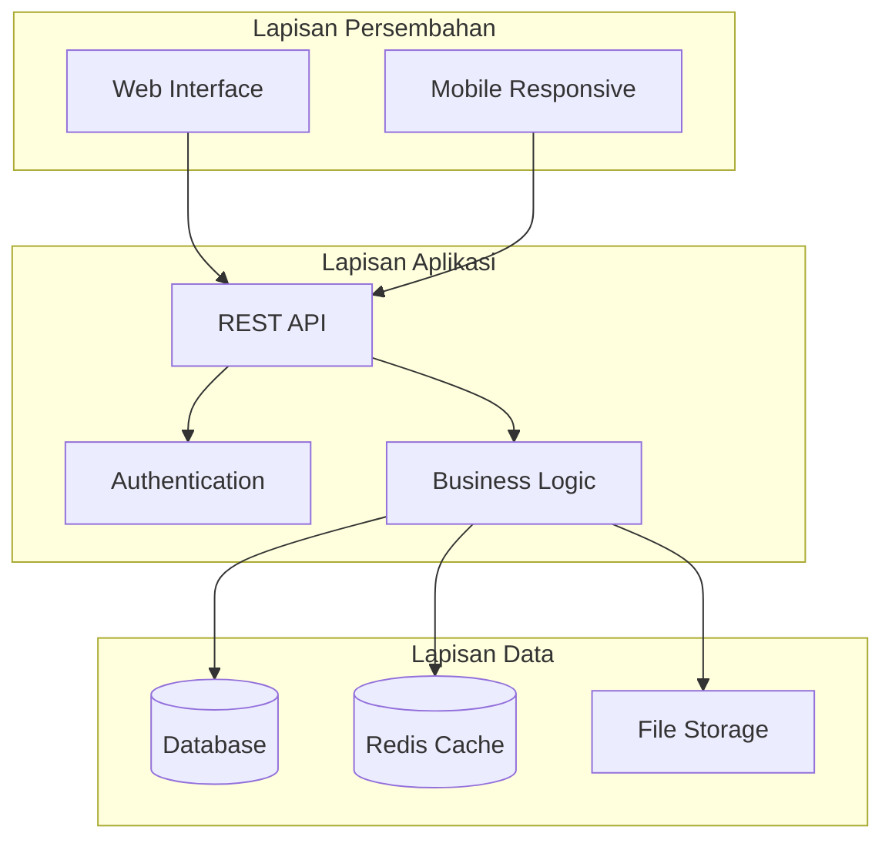
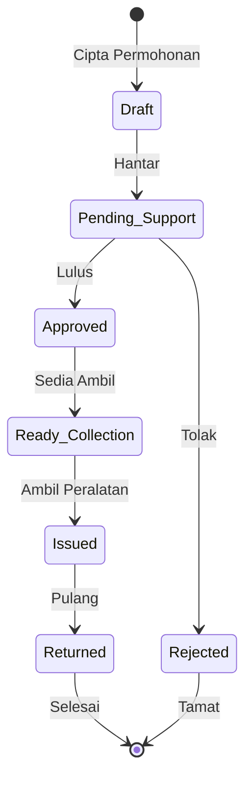
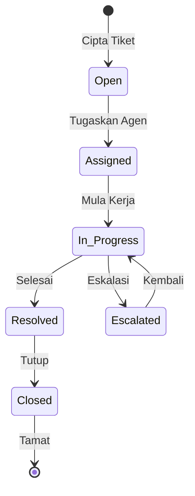
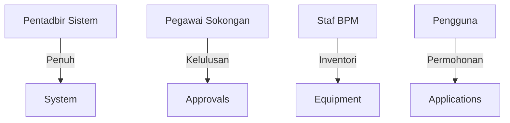
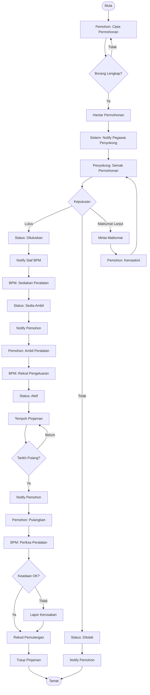
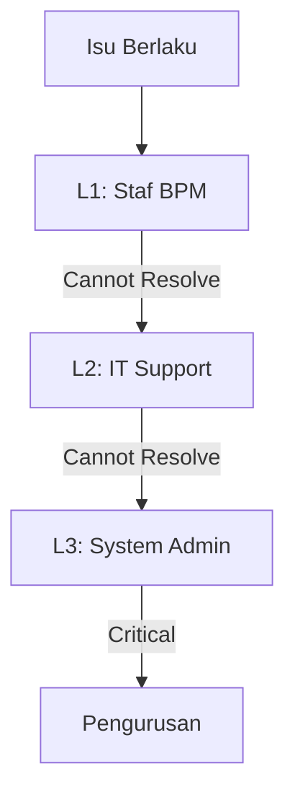
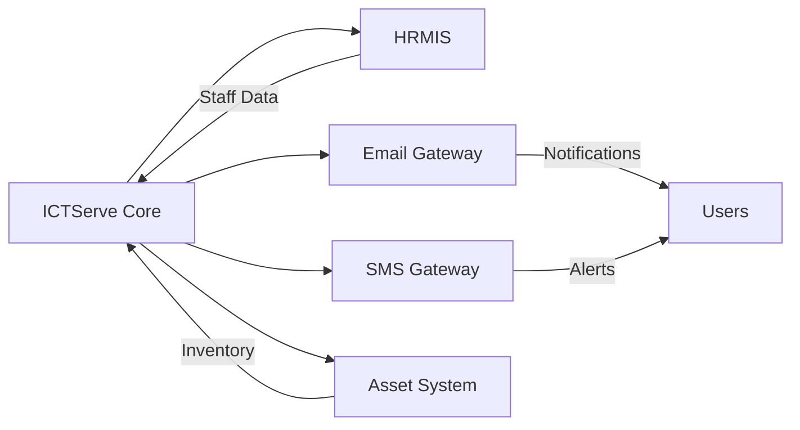

# Dokumentasi Lengkap Sistem ICTServe (iServe) v1.0

---

## 📄 Dokumentasi_Sistem_ICTServe(iServe).md

## Sistem Pengurusan Perkhidmatan ICT MOTAC (ICTServe)

## Maklumat Dokumen

| Atribut              | Nilai                        |
| -------------------- | ---------------------------- |
| **Versi Dokumen**    | 3.0.0                        |
| **Tarikh Kemaskini** | 6 Oktober 2025               |
| **Status**           | Aktif                        |
| **Klasifikasi**      | Dokumentasi Teknikal Dalaman |
| **Penulis**          | Pasukan Pembangunan ICTServe |

## Ringkasan Eksekutif

ICTServe adalah platform digital terintegrasi untuk mengurus perkhidmatan ICT di Kementerian Pelancongan, Seni dan Budaya Malaysia (MOTAC). Sistem ini menggantikan proses manual dengan penyelesaian digital yang cekap, selamat dan mesra pengguna.

## 1. Pengenalan

### 1.1 Tujuan Dokumen

Dokumen ini menyediakan panduan komprehensif untuk memahami, melaksana dan menyelenggara Sistem ICTServe. Ia merangkumi aspek teknikal, operasi dan pengurusan sistem.

### 1.2 Skop Sistem

ICTServe v1.0 merangkumi dua modul utama:

1. **Modul Pinjaman Peralatan ICT** - Pengurusan pinjaman aset ICT secara sistematik
2. **Modul Helpdesk & Sokongan** - Sistem tiket untuk isu teknikal dan sokongan

### 1.3 Sasaran Pengguna

- **Pengguna Akhir**: Semua warga kerja MOTAC
- **Pentadbir Sistem**: Staf IT dan BPM
- **Pihak Pengurusan**: Pegawai pelulus dan pengurus jabatan

## 2. Objektif Sistem

### 2.1 Objektif Perniagaan

| Objektif              | Penerangan                               | Metrik Kejayaan                  |
| --------------------- | ---------------------------------------- | -------------------------------- |
| **Kecekapan Operasi** | Mengurangkan masa pemprosesan permohonan | 50% pengurangan masa pemprosesan |
| **Ketelusan**         | Menyediakan jejak audit lengkap          | 100% transaksi direkod           |
| **Kepuasan Pengguna** | Meningkatkan pengalaman pengguna         | Skor kepuasan > 4.0/5.0          |
| **Penggunaan Sumber** | Mengoptimumkan penggunaan aset ICT       | 30% peningkatan penggunaan       |

### 2.2 Objektif Teknikal

- Melaksanakan seni bina modular dan boleh skala
- Memastikan keselamatan data mengikut piawaian industri
- Menyediakan API untuk integrasi masa depan
- Mencapai masa respons < 2 saat untuk semua operasi

## 3. Keperluan Sistem

### 3.1 Keperluan Fungsian

#### 3.1.1 Modul Pinjaman Peralatan

| ID  | Keperluan                        | Keutamaan |
| --- | -------------------------------- | --------- |
| F01 | Permohonan pinjaman dalam talian | Kritikal  |
| F02 | Proses kelulusan berperingkat    | Kritikal  |
| F03 | Pengurusan inventori peralatan   | Kritikal  |
| F04 | Penjanaan laporan pinjaman       | Tinggi    |
| F05 | Notifikasi automatik             | Tinggi    |

#### 3.1.2 Modul Helpdesk

| ID  | Keperluan                   | Keutamaan |
| --- | --------------------------- | --------- |
| H01 | Penciptaan tiket sokongan   | Kritikal  |
| H02 | Penugasan tiket kepada agen | Kritikal  |
| H03 | Penjejakan status tiket     | Kritikal  |
| H04 | Sistem komen dan komunikasi | Tinggi    |
| H05 | Laporan prestasi helpdesk   | Sederhana |

### 3.2 Keperluan Bukan Fungsian

| Kategori             | Keperluan         | Spesifikasi       |
| -------------------- | ----------------- | ----------------- |
| **Prestasi**         | Masa tindak balas | < 2 saat          |
| **Kebolehgunaan**    | Akses mudah alih  | Responsive design |
| **Keselamatan**      | Enkripsi data     | AES-256           |
| **Kebolehpercayaan** | Uptime            | 99.9%             |
| **Skalabiliti**      | Pengguna serentak | Minimum 500       |

## 4. Seni Bina Sistem

### 4.1 Seni Bina Keseluruhan



### 4.2 Teknologi Stack

| Lapisan         | Teknologi | Versi |
| --------------- | --------- | ----- |
| **Frontend**    | Livewire  | 3.x   |
| **Backend**     | Laravel   | 12.x  |
| **Database**    | MySQL     | 8.0+  |
| **Cache**       | Redis     | 7.0+  |
| **Admin Panel** | Filament  | 4.x   |

## 5. Modul Sistem

### 5.1 Modul Pinjaman Peralatan ICT

#### 5.1.1 Komponen Utama

- **Pengurusan Permohonan**: Borang permohonan, status tracking
- **Proses Kelulusan**: Aliran kerja kelulusan berperingkat
- **Pengurusan Inventori**: Tracking peralatan dan ketersediaan
- **Transaksi**: Pengeluaran dan pemulangan peralatan

#### 5.1.2 Aliran Proses



### 5.2 Modul Helpdesk & Sokongan

#### 5.2.1 Komponen Utama

- **Pengurusan Tiket**: Cipta, edit, dan tutup tiket
- **Penugasan Agen**: Assign tiket kepada staf IT
- **Sistem Komunikasi**: Komen dan maklum balas
- **Dashboard Pemantauan**: Status dan prestasi

#### 5.2.2 Aliran Proses



## 6. Pengurusan Data

### 6.1 Model Data Utama

| Entiti               | Penerangan               | Hubungan                       |
| -------------------- | ------------------------ | ------------------------------ |
| **Users**            | Maklumat pengguna sistem | Has many Applications, Tickets |
| **Departments**      | Jabatan organisasi       | Has many Users, Equipment      |
| **Equipment**        | Peralatan ICT            | Belongs to Category            |
| **LoanApplications** | Permohonan pinjaman      | Has many Items, Approvals      |
| **HelpdeskTickets**  | Tiket sokongan           | Has many Comments              |

### 6.2 Strategi Backup

- **Frekuensi**: Harian (penuh), Setiap jam (incremental)
- **Retension**: 30 hari (harian), 12 bulan (bulanan)
- **Lokasi**: On-premise + Cloud backup
- **RTO**: 4 jam
- **RPO**: 1 jam

## 7. Keselamatan

### 7.1 Langkah Keselamatan

| Aspek                  | Implementasi                | Standard  |
| ---------------------- | --------------------------- | --------- |
| **Autentikasi**        | Multi-factor authentication | ISO 27001 |
| **Autorisasi**         | Role-based access control   | RBAC      |
| **Enkripsi**           | AES-256 untuk data at rest  | NIST      |
| **Audit Trail**        | Comprehensive logging       | ISO 27001 |
| **Session Management** | Secure session tokens       | OWASP     |

### 7.2 Pengurusan Peranan



## 8. Integrasi

### 8.1 API Endpoints

| Endpoint            | Method    | Fungsi              |
| ------------------- | --------- | ------------------- |
| `/api/v1/loans`     | GET, POST | Pengurusan pinjaman |
| `/api/v1/tickets`   | GET, POST | Pengurusan tiket    |
| `/api/v1/equipment` | GET       | Senarai peralatan   |
| `/api/v1/users`     | GET       | Maklumat pengguna   |

### 8.2 Sistem Luaran

- **HRMIS**: Sinkronisasi data pegawai
- **Asset Management**: Integrasi inventori
- **Email Gateway**: Penghantaran notifikasi

## 9. Pemantauan & Penyelenggaraan

### 9.1 Metrik Pemantauan

| Metrik        | Threshold | Tindakan         |
| ------------- | --------- | ---------------- |
| CPU Usage     | > 80%     | Alert & Scale    |
| Memory        | > 85%     | Alert & Optimize |
| Response Time | > 2s      | Investigate      |
| Error Rate    | > 1%      | Alert Team       |

### 9.2 Jadual Penyelenggaraan

- **Harian**: Backup, log rotation
- **Mingguan**: Security scanning, performance review
- **Bulanan**: Update dependencies, audit review
- **Tahunan**: Penetration testing, disaster recovery drill

## 10. Sokongan & Bantuan

### 10.1 Saluran Sokongan

| Saluran  | Waktu Operasi     | SLA          |
| -------- | ----------------- | ------------ |
| Helpdesk | 8:00 AM - 5:00 PM | 4 jam        |
| Email    | 24/7              | 24 jam       |
| Portal   | 24/7              | Self-service |

### 10.2 Eskalasi

1. **L1 Support**: Isu asas (< 4 jam)
2. **L2 Support**: Isu teknikal (< 8 jam)
3. **L3 Support**: Isu kritikal (< 2 jam)

## Lampiran

### A. Glosari

| Istilah | Definisi                     |
| ------- | ---------------------------- |
| **BPM** | Bahagian Pengurusan Maklumat |
| **SLA** | Service Level Agreement      |
| **RTO** | Recovery Time Objective      |
| **RPO** | Recovery Point Objective     |

### B. Rujukan

- [Laravel Documentation](https://laravel.com/docs)
- [Filament Documentation](https://filamentphp.com/docs)
- [OWASP Security Guidelines](https://owasp.org)

### C. Sejarah Perubahan

| Versi | Tarikh     | Perubahan    | Penulis      |
| ----- | ---------- | ------------ | ------------ |
| 1.0   | 12/09/2025 | Dokumen awal | IzzatFirdaus |

---

## 📄 Dokumentasi_Flow_Sistem_Permohonan_Pinjaman_Aset_ICT_ICTServe(iServe).md

### Aliran Proses Permohonan Pinjaman Aset ICT

### Maklumat Dokumen — Modul Pinjaman

| Atribut            | Nilai                        |
| ------------------ | ---------------------------- |
| **Versi**          | 1.0                          |
| **Tarikh**         | 12 September 2025            |
| **Modul**          | Pinjaman Peralatan ICT       |
| **Pemilik Proses** | Bahagian Pengurusan Maklumat |

## 1. Gambaran Keseluruhan

### 1.1 Tujuan

Dokumen ini menerangkan aliran kerja lengkap untuk proses permohonan pinjaman aset ICT dalam sistem ICTServe, dari permohonan awal hingga pemulangan peralatan.

### 1.2 Skop

Proses ini meliputi:

- Permohonan pinjaman oleh pengguna
- Proses kelulusan berperingkat
- Pengurusan inventori dan pengeluaran
- Pemulangan dan penutupan pinjaman

### 1.3 Pihak Berkepentingan

| Peranan               | Tanggungjawab                      | Sistem Access        |
| --------------------- | ---------------------------------- | -------------------- |
| **Pemohon**           | Membuat permohonan pinjaman        | User Portal          |
| **Pegawai Penyokong** | Meluluskan permohonan              | Approval Dashboard   |
| **Staf BPM**          | Menguruskan pengeluaran/pemulangan | Inventory Management |
| **Pentadbir Sistem**  | Pemantauan dan konfigurasi         | Admin Panel          |

## 2. Proses Utama

### 2.1 Carta Aliran Proses



### 2.2 Penerangan Langkah Proses

#### Fasa 1: Permohonan (Steps 1-3)

| Langkah | Aktiviti              | Pelaku  | Sistem/UI                 | Output           |
| ------- | --------------------- | ------- | ------------------------- | ---------------- |
| 1.1     | Log masuk sistem      | Pemohon | Login Page                | Session aktif    |
| 1.2     | Akses borang pinjaman | Pemohon | Dashboard > Pinjaman Baru | Borang pinjaman  |
| 1.3     | Isi maklumat pinjaman | Pemohon | LoanApplicationForm       | Draft permohonan |
| 1.4     | Pilih peralatan       | Pemohon | Equipment Selector        | Item list        |
| 1.5     | Tentukan tarikh       | Pemohon | Date Picker               | Tempoh pinjaman  |
| 1.6     | Hantar permohonan     | Pemohon | Submit Button             | Status: Pending  |

#### Fasa 2: Kelulusan (Steps 4-6)

| Langkah | Aktiviti                 | Pelaku    | Sistem/UI          | Output              |
| ------- | ------------------------ | --------- | ------------------ | ------------------- |
| 2.1     | Terima notifikasi        | Penyokong | Email/System Alert | Permohonan baru     |
| 2.2     | Semak permohonan         | Penyokong | Approval Dashboard | Review data         |
| 2.3     | Verify kelayakan         | Penyokong | Applicant Profile  | Validation          |
| 2.4     | Check ketersediaan       | Sistem    | Inventory Check    | Availability status |
| 2.5     | Buat keputusan           | Penyokong | Approval Actions   | Lulus/Tolak         |
| 2.6     | Rekod sebab (jika tolak) | Penyokong | Comments Field     | Justifikasi         |

#### Fasa 3: Pengeluaran (Steps 7-9)

| Langkah | Aktiviti             | Pelaku   | Sistem/UI            | Output               |
| ------- | -------------------- | -------- | -------------------- | -------------------- |
| 3.1     | Terima tugasan       | Staf BPM | Task Dashboard       | New task             |
| 3.2     | Sediakan peralatan   | Staf BPM | Physical preparation | Ready items          |
| 3.3     | Update status sistem | Staf BPM | Inventory Update     | Ready for collection |
| 3.4     | Notify pemohon       | Sistem   | Auto notification    | Collection notice    |
| 3.5     | Verifikasi pemohon   | Staf BPM | ID verification      | Identity confirmed   |
| 3.6     | Rekod pengeluaran    | Staf BPM | Issue Form           | Transaction record   |
| 3.7     | Dapatkan tandatangan | Staf BPM | Digital/Physical     | Acknowledgment       |

#### Fasa 4: Pemulangan (Steps 10-12)

| Langkah | Aktiviti            | Pelaku   | Sistem/UI            | Output               |
| ------- | ------------------- | -------- | -------------------- | -------------------- |
| 4.1     | Reminder automatik  | Sistem   | Scheduled Job        | Return reminder      |
| 4.2     | Pulangkan peralatan | Pemohon  | Physical return      | Equipment returned   |
| 4.3     | Periksa kondisi     | Staf BPM | Inspection checklist | Condition report     |
| 4.4     | Update inventori    | Staf BPM | Inventory System     | Stock updated        |
| 4.5     | Rekod pemulangan    | Staf BPM | Return Form          | Transaction complete |
| 4.6     | Tutup pinjaman      | Sistem   | Auto closure         | Loan closed          |

## 3. Peraturan Perniagaan

### 3.1 Syarat Kelayakan

| Peraturan | Penerangan                            | Penguatkuasaan    |
| --------- | ------------------------------------- | ----------------- |
| BR001     | Pemohon mestilah staf aktif MOTAC     | Sistem validation |
| BR002     | Tiada pinjaman tertunggak             | Auto check        |
| BR003     | Gred minimum untuk peralatan tertentu | Role-based        |
| BR004     | Tempoh pinjaman maksimum 30 hari      | Date validation   |
| BR005     | Maksimum 3 item per permohonan        | Form limit        |

### 3.2 Kelulusan Matrix

| Nilai Peralatan  | Pegawai Pelulus  | Tempoh Proses  |
| ---------------- | ---------------- | -------------- |
| < RM 1,000       | Pegawai Gred 41+ | 1 hari bekerja |
| RM 1,000 - 5,000 | Pegawai Gred 44+ | 2 hari bekerja |
| > RM 5,000       | Ketua Bahagian   | 3 hari bekerja |

### 3.3 Polisi Pemulangan

- **Lewat 1-3 hari**: Peringatan automatik
- **Lewat 4-7 hari**: Eskalasi kepada penyelia
- **Lewat > 7 hari**: Sekatan permohonan baru
- **Kerosakan**: Laporan dan tindakan susulan

## 4. Notifikasi & Komunikasi

### 4.1 Trigger Notifikasi

| Event           | Penerima          | Saluran        | Template             |
| --------------- | ----------------- | -------------- | -------------------- |
| Permohonan baru | Penyokong         | Email + System | NEW_APPLICATION      |
| Kelulusan       | Pemohon, BPM      | Email + SMS    | APPLICATION_APPROVED |
| Penolakan       | Pemohon           | Email          | APPLICATION_REJECTED |
| Sedia ambil     | Pemohon           | Email + SMS    | READY_COLLECTION     |
| Reminder pulang | Pemohon           | Email + SMS    | RETURN_REMINDER      |
| Lewat pulang    | Pemohon, Penyelia | Email          | OVERDUE_NOTICE       |

### 4.2 Kandungan Notifikasi

```text
Subject: [ICTServe] Permohonan Pinjaman #{ID} - {STATUS}

Kepada {USER_NAME},

Status permohonan pinjaman anda telah dikemaskini:
- No. Permohonan: {APPLICATION_ID}
- Status: {STATUS}
- Tarikh: {DATE}
- Tindakan: {ACTION_REQUIRED}

Sila log masuk ke sistem untuk maklumat lanjut.

Terima kasih.
```

## 5. Pengendalian Pengecualian

### 5.1 Senario Pengecualian

| Senario                         | Pengendalian      | Tindakan Pemulihan |
| ------------------------------- | ----------------- | ------------------ |
| Peralatan rosak semasa pinjaman | Laporan insiden   | Gantian atau baiki |
| Pemohon bertukar jabatan        | Update permohonan | Transfer ownership |
| Peralatan hilang                | Laporan polis     | Proses tuntutan    |
| System downtime                 | Manual fallback   | Paper form backup  |
| Pegawai pelulus tidak ada       | Delegation rule   | Auto-delegate      |

### 5.2 Eskalasi Path



## 6. Laporan & Analitik

### 6.1 Laporan Standard

| Laporan           | Frekuensi | Penerima        | Format    |
| ----------------- | --------- | --------------- | --------- |
| Pinjaman Aktif    | Harian    | BPM             | Dashboard |
| Peralatan Popular | Mingguan  | Management      | PDF       |
| Overdue Report    | Harian    | BPM, Management | Email     |
| Utilization Rate  | Bulanan   | Management      | Excel     |
| Audit Trail       | On-demand | Audit           | CSV       |

### 6.2 KPI Monitoring

| KPI               | Target   | Formula                                | Threshold             |
| ----------------- | -------- | -------------------------------------- | --------------------- |
| Processing Time   | < 2 hari | Avg(Approval Date - Submit Date)       | Yellow: 3, Red: 5     |
| Utilization Rate  | > 70%    | (Active Loans / Total Equipment) × 100 | Yellow: 60%, Red: 50% |
| Overdue Rate      | < 5%     | (Overdue / Total Active) × 100         | Yellow: 10%, Red: 15% |
| User Satisfaction | > 4.0    | Average Rating                         | Yellow: 3.5, Red: 3.0 |

## 7. Integrasi Sistem

### 7.1 Integration Points



### 7.2 Data Exchange

| Sistem        | Data In        | Data Out      | Protocol |
| ------------- | -------------- | ------------- | -------- |
| HRMIS         | Staff profiles | -             | REST API |
| Email Gateway | -              | Notifications | SMTP     |
| SMS Gateway   | -              | Alerts        | HTTP API |
| Asset System  | Equipment data | Usage data    | REST API |

## 8. Keselamatan & Audit

### 8.1 Access Control

| Tindakan              | Pemohon | Penyokong | BPM | Admin |
| --------------------- | ------- | --------- | --- | ----- |
| Create Application    | ✓       | -         | -   | ✓     |
| View Own Application  | ✓       | -         | -   | ✓     |
| View All Applications | -       | ✓         | ✓   | ✓     |
| Approve Application   | -       | ✓         | -   | ✓     |
| Issue Equipment       | -       | -         | ✓   | ✓     |
| System Configuration  | -       | -         | -   | ✓     |

### 8.2 Audit Requirements

Semua tindakan kritikal mesti direkod:

- WHO: User ID, Name, Role
- WHAT: Action performed, Data affected
- WHEN: Timestamp (UTC+8)
- WHERE: IP Address, Location
- WHY: Business context

## 9. Performance Requirements

| Metrik            | Requirement  | Measurement     |
| ----------------- | ------------ | --------------- |
| Page Load         | < 2 seconds  | 95th percentile |
| Form Submit       | < 3 seconds  | Average         |
| Search Query      | < 1 second   | Average         |
| Report Generation | < 30 seconds | Maximum         |
| Concurrent Users  | 100+         | Peak load       |

## 10. Training & Support

### 10.1 Training Matrix

| Role      | Module           | Duration | Method        |
| --------- | ---------------- | -------- | ------------- |
| Pemohon   | Basic Usage      | 1 hour   | Online        |
| Penyokong | Approval Process | 2 hours  | Workshop      |
| BPM Staff | Full System      | 4 hours  | Hands-on      |
| Admin     | Administration   | 8 hours  | Comprehensive |

### 10.2 Support Documentation

- User Manual: `/docs/user-manual.pdf`
- Quick Start Guide: `/docs/quick-start.pdf`
- FAQ: `/support/faq`
- Video Tutorials: `/support/videos`
