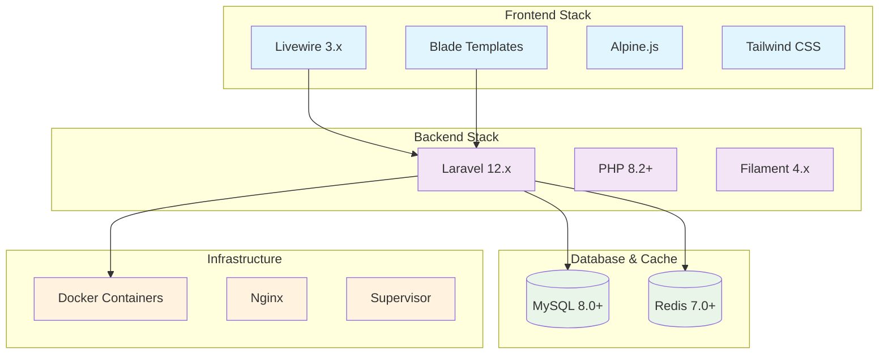
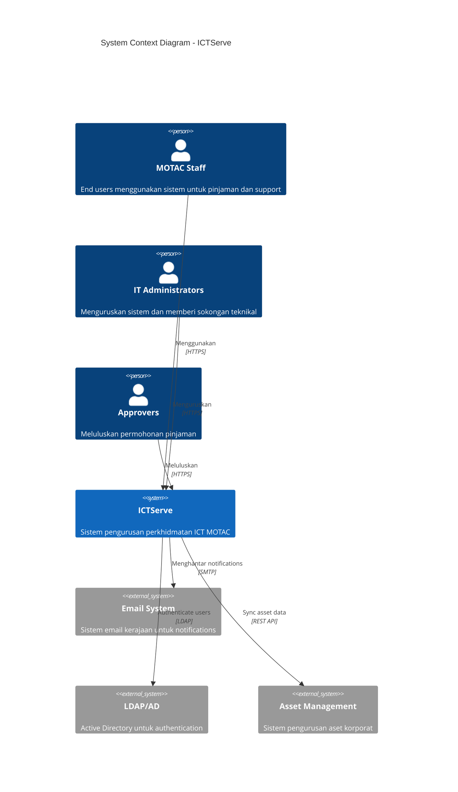
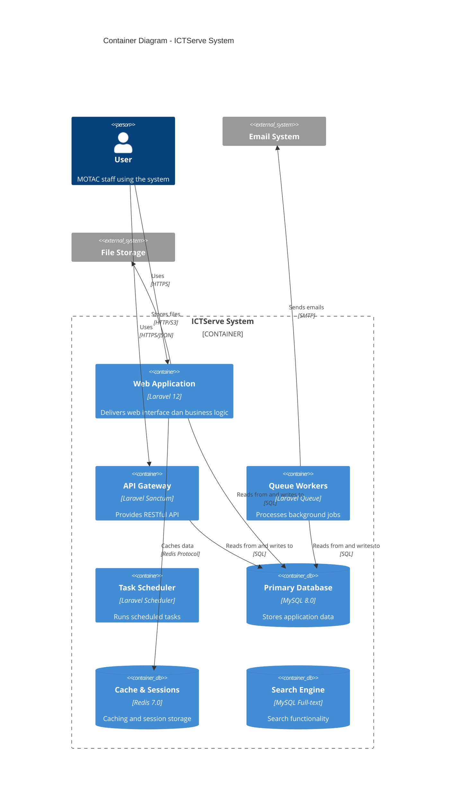
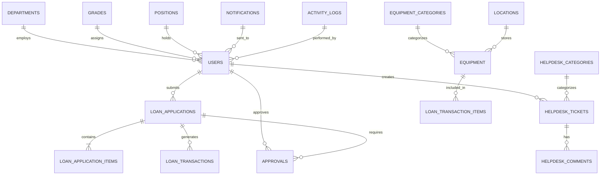
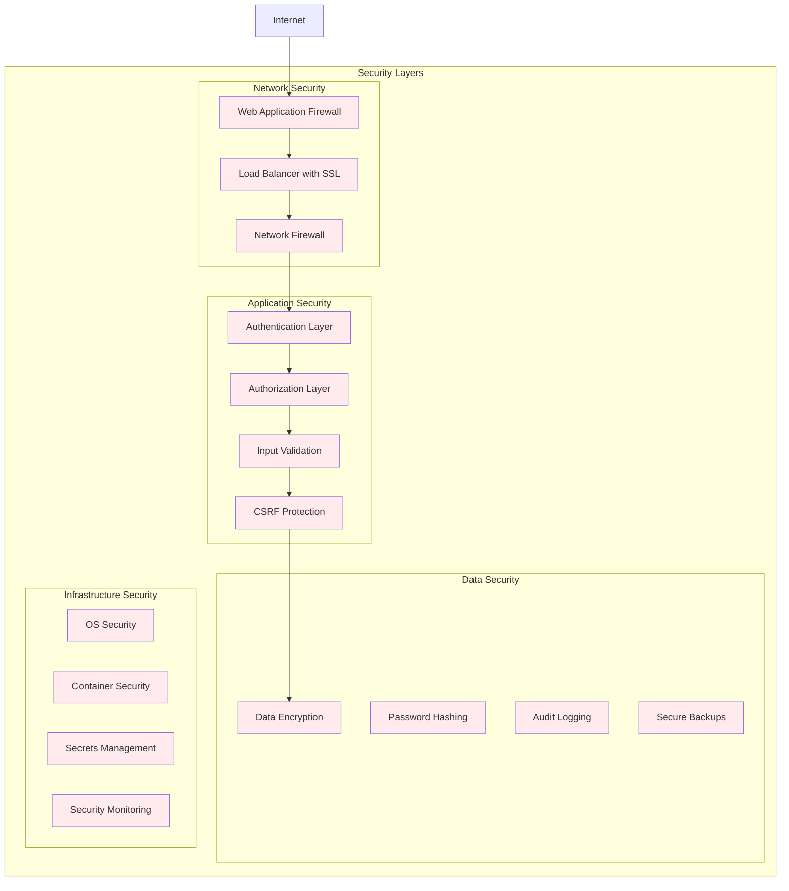

# Dokumentasi Reka Bentuk Sistem ICTServe (iServe) v2.0

| Atribut              | Nilai                                                |
| -------------------- | ---------------------------------------------------- |
| **Versi Dokumen**    | 3.0.0                                                |
| **Tarikh Kemaskini** | 6 Oktober 2025                                       |
| **Status**           | Aktif                                                |
| **Klasifikasi**      | Dokumentasi Seni Bina Sistem                         |
| **Penulis**          | Pasukan Pembangunan ICTServe                         |
| **Sasaran Audiens**  | Arkitek Sistem, Pembangun Senior, Pentadbir Teknikal |

## Kandungan

- [Ringkasan Eksekutif](#ringkasan-eksekutif)
- [Pengenalan Sistem](#pengenalan-sistem)
- [Seni Bina Sistem Tahap Tinggi](#seni-bina-sistem-tahap-tinggi)
- [Komponen Teras Sistem](#komponen-teras-sistem)
- [Reka Bentuk Pangkalan Data](#reka-bentuk-pangkalan-data)
- [Seni Bina API dan Integrasi](#seni-bina-api-dan-integrasi)
- [Keselamatan dan Pematuhan](#keselamatan-dan-pematuhan)
- [Prestasi dan Skalabiliti](#prestasi-dan-skalabiliti)
- [Pemantauan dan Observabiliti](#pemantauan-dan-observabiliti)
- [Strategi Deployment](#strategi-deployment)
- [Pengurusan Konfigurasi](#pengurusan-konfigurasi)
- [Panduan Pelaksanaan](#panduan-pelaksanaan)
- [Rujukan](#rujukan)

## Ringkasan Eksekutif

### Gambaran Keseluruhan

ICTServe (iServe) v2.0 adalah sistem pengurusan perkhidmatan ICT berasaskan cloud yang direka khusus untuk Kementerian Pelancongan, Seni dan Budaya Malaysia (MOTAC). Sistem ini mengintegrasikan pengurusan pinjaman aset ICT dan operasi helpdesk dalam satu platform yang boleh skala, selamat, dan mesra pengguna.

### Objektif Seni Bina

| Objektif                | Penerangan                                        | Metrik Sasaran            |
| ----------------------- | ------------------------------------------------- | ------------------------- |
| **Skalabiliti**         | Mampu mengendalikan pertumbuhan pengguna dan data | 10,000+ pengguna serentak |
| **Ketersediaan**        | Sistem operasi 24/7 dengan downtime minimum       | 99.9% uptime              |
| **Keselamatan**         | Perlindungan data menyeluruh dan audit trail      | Zero security breaches    |
| **Prestasi**            | Respons pantas untuk semua operasi                | < 2s response time        |
| **Kebolehselenggaraan** | Mudah dikonfigurasi, dipantau, dan diselenggara   | < 4 jam MTTR              |

### Teknologi Utama



## Pengenalan Sistem

### Tujuan Dokumen

Dokumen ini menyediakan panduan komprehensif untuk reka bentuk sistem ICTServe, merangkumi seni bina teknikal, keputusan reka bentuk, dan rasional di sebalik pemilihan teknologi. Ia berfungsi sebagai rujukan utama untuk pembangun, arkitek sistem, dan pentadbir teknikal.

### Skop Sistem

ICTServe menguruskan dua domain perniagaan utama:

1. **Pengurusan Pinjaman Peralatan ICT**
    - Permohonan dan kelulusan pinjaman
    - Pengurusan inventori peralatan
    - Transaksi pengeluaran dan pemulangan
    - Laporan penggunaan dan analitik

2. **Sistem Helpdesk dan Sokongan**
    - Pengurusan tiket sokongan IT
    - Kategorizasi dan prioriti isu
    - Sistem komunikasi dan eskalasi
    - Knowledge base dan penyelesaian

### Prinsip Reka Bentuk

| Prinsip                  | Implementasi                                     | Benefit                       |
| ------------------------ | ------------------------------------------------ | ----------------------------- |
| **Domain-Driven Design** | Pemisahan jelas antara loan dan helpdesk modules | Maintainability yang tinggi   |
| **SOLID Principles**     | Single responsibility, dependency injection      | Code quality yang konsisten   |
| **Microservice-Ready**   | Modular architecture dengan clear boundaries     | Future scalability            |
| **Event-Driven**         | Event sourcing untuk audit dan notifications     | Loose coupling, observability |
| **Security by Design**   | Built-in security controls dan data protection   | Regulatory compliance         |

## Seni Bina Sistem Tahap Tinggi

### Gambaran Seni Bina



### Container Architecture



### Layered Architecture

```text
┌─────────────────────────────────────────────────────────────────┐
│                    Presentation Layer                           │
│  ┌─────────────┐ ┌─────────────┐ ┌─────────────┐ ┌─────────────┐ │
│  │    Blade    │ │  Livewire   │ │  Filament   │ │ REST API    │ │
│  │  Templates  │ │ Components  │ │   Admin     │ │ Controllers │ │
│  └─────────────┘ └─────────────┘ └─────────────┘ └─────────────┘ │
└─────────────────────────────────────────────────────────────────┘
                              │
┌─────────────────────────────────────────────────────────────────┐
│                    Application Layer                            │
│  ┌─────────────┐ ┌─────────────┐ ┌─────────────┐ ┌─────────────┐ │
│  │ Controllers │ │   Services  │ │  Policies   │ │    Jobs     │ │
│  │             │ │             │ │             │ │             │ │
│  └─────────────┘ └─────────────┘ └─────────────┘ └─────────────┘ │
└─────────────────────────────────────────────────────────────────┘
                              │
┌─────────────────────────────────────────────────────────────────┐
│                     Domain Layer                                │
│  ┌─────────────┐ ┌─────────────┐ ┌─────────────┐ ┌─────────────┐ │
│  │   Models    │ │   Events    │ │ Observers   │ │   Rules     │ │
│  │ (Eloquent)  │ │             │ │             │ │             │ │
│  └─────────────┘ └─────────────┘ └─────────────┘ └─────────────┘ │
└─────────────────────────────────────────────────────────────────┘
                              │
┌─────────────────────────────────────────────────────────────────┐
│                   Infrastructure Layer                          │
│  ┌─────────────┐ ┌─────────────┐ ┌─────────────┐ ┌─────────────┐ │
│  │   Database  │ │    Cache    │ │    Queue    │ │ File System │ │
│  │   (MySQL)   │ │   (Redis)   │ │             │ │             │ │
│  └─────────────┘ └─────────────┘ └─────────────┘ └─────────────┘ │
└─────────────────────────────────────────────────────────────────┘
```

## Komponen Teras Sistem

### Struktur Direktori Laravel

```text
app/
├── Console/                    # Artisan commands
│   └── Commands/
├── Events/                     # Domain events
├── Exceptions/                 # Custom exceptions
├── Filament/                   # Admin panel resources
│   ├── Resources/
│   ├── Pages/
│   └── Widgets/
├── Http/                       # HTTP layer
│   ├── Controllers/
│   ├── Middleware/
│   ├── Requests/
│   └── Resources/
├── Jobs/                       # Queue jobs
├── Livewire/                   # Livewire components
│   ├── Helpdesk/
│   └── LoanManagement/
├── Models/                     # Eloquent models
├── Notifications/              # Notification classes
├── Observers/                  # Model observers
├── Policies/                   # Authorization policies
├── Providers/                  # Service providers
├── Rules/                      # Custom validation rules
└── Services/                   # Business logic services
    ├── Helpdesk/
    ├── LoanManagement/
    └── Shared/
```

### Komponen Utama dan Tanggungjawab

| Komponen                    | Lokasi                         | Tanggungjawab                 | Dependencies                  |
| --------------------------- | ------------------------------ | ----------------------------- | ----------------------------- |
| **LoanApplicationService**  | `app/Services/LoanManagement/` | Business logic untuk pinjaman | Models, Notifications, Events |
| **HelpdeskService**         | `app/Services/Helpdesk/`       | Pengurusan tiket dan workflow | Models, Queue, Cache          |
| **NotificationService**     | `app/Services/Shared/`         | Unified notification handling | Mail, SMS, Database           |
| **ApprovalWorkflowService** | `app/Services/Shared/`         | Generic approval workflows    | Models, Events, Policies      |
| **AuditService**            | `app/Services/Shared/`         | Comprehensive audit logging   | Database, Events              |

### Service Layer Implementation

```php
<?php

namespace App\Services\LoanManagement;

use App\Models\LoanApplication;
use App\Models\User;
use App\Events\LoanApplicationSubmitted;
use App\Services\Shared\NotificationService;
use App\Services\Shared\ApprovalWorkflowService;
use Illuminate\Support\Facades\DB;
use Illuminate\Support\Facades\Log;

class LoanApplicationService
{
    public function __construct(
        private NotificationService $notificationService,
        private ApprovalWorkflowService $approvalService
    ) {}

    /**
     * Submit loan application dengan comprehensive validation
     */
    public function submitApplication(array $data, User $user): LoanApplication
    {
        return DB::transaction(function () use ($data, $user) {
            // Create application
            $application = LoanApplication::create([
                'user_id' => $user->id,
                'application_number' => $this->generateApplicationNumber(),
                ...$data
            ]);

            // Create application items
            foreach ($data['items'] as $itemData) {
                $application->items()->create($itemData);
            }

            // Initialize approval workflow
            $this->approvalService->initializeWorkflow(
                $application,
                $this->determineApprovalChain($user, $application)
            );

            // Fire domain event
            event(new LoanApplicationSubmitted($application));

            // Send notifications
            $this->notificationService->sendSubmissionNotifications($application);

            Log::info('Loan application submitted', [
                'application_id' => $application->id,
                'user_id' => $user->id,
                'items_count' => count($data['items'])
            ]);

            return $application;
        });
    }

    /**
     * Process approval dengan business rules
     */
    public function processApproval(LoanApplication $application, User $approver, array $decision): bool
    {
        // Validate approver authority
        if (!$this->canApprove($approver, $application)) {
            throw new UnauthorizedException('Insufficient approval authority');
        }

        return DB::transaction(function () use ($application, $approver, $decision) {
            // Update approval status
            $approval = $application->approvals()->pending()->first();
            $approval->update([
                'status' => $decision['status'],
                'comments' => $decision['comments'] ?? null,
                'approved_by' => $approver->id,
                'approved_at' => now(),
            ]);

            // Update application status
            $this->updateApplicationStatus($application, $decision['status']);

            // Process next approval stage if needed
            if ($decision['status'] === 'approved' && $this->hasNextApprovalStage($application)) {
                $this->approvalService->advanceWorkflow($application);
            }

            // Send notifications based on decision
            $this->sendApprovalNotifications($application, $decision['status']);

            return true;
        });
    }

    /**
     * Generate unique application number
     */
    private function generateApplicationNumber(): string
    {
        $prefix = 'LA';
        $year = now()->year;
        $month = now()->format('m');
        $sequence = LoanApplication::whereYear('created_at', $year)
                                  ->whereMonth('created_at', now()->month)
                                  ->count() + 1;

        return sprintf('%s-%d-%s-%05d', $prefix, $year, $month, $sequence);
    }

    /**
     * Determine approval chain based on business rules
     */
    private function determineApprovalChain(User $user, LoanApplication $application): array
    {
        $chain = [];

        // Rule 1: Grade-based approval
        if ($user->grade->level <= 41) {
            $chain[] = $this->findDepartmentHead($user->department_id);
        }

        // Rule 2: High-value items need additional approval
        if ($this->isHighValueApplication($application)) {
            $chain[] = $this->findFinanceApprover();
        }

        // Rule 3: Duration-based approval
        if ($application->duration_days > 30) {
            $chain[] = $this->findSeniorManagementApprover();
        }

        return array_unique($chain);
    }

    /**
     * Check if user can approve the application
     */
    private function canApprove(User $approver, LoanApplication $application): bool
    {
        return $approver->grade->level >= 41 &&
               $approver->department_id === $application->user->department_id;
    }
}
```

## Reka Bentuk Pangkalan Data

### Entity Relationship Overview



### Database Schema Principles

| Prinsip                   | Implementasi                                 | Rasional                                |
| ------------------------- | -------------------------------------------- | --------------------------------------- |
| **Normalization**         | 3NF untuk semua core tables                  | Data consistency dan storage efficiency |
| **Indexing Strategy**     | Composite indexes berdasarkan query patterns | Query performance optimization          |
| **Soft Deletes**          | Implemented untuk all business entities      | Data recovery dan audit compliance      |
| **Audit Trail**           | Created/updated/deleted by fields            | Comprehensive change tracking           |
| **Polymorphic Relations** | Approvals, notifications, comments           | Flexible data modeling                  |

### Performance Optimization

```sql
-- Optimized indexes untuk query patterns yang lazim
CREATE INDEX idx_loan_applications_status_user
ON loan_applications(status, user_id, created_at);

CREATE INDEX idx_helpdesk_tickets_assigned_status
ON helpdesk_tickets(assigned_to_user_id, status, priority, created_at);

CREATE INDEX idx_equipment_availability
ON equipment(status, equipment_category_id, location_id);

-- Partitioning untuk large tables
ALTER TABLE activity_logs PARTITION BY RANGE (YEAR(created_at)) (
    PARTITION p2024 VALUES LESS THAN (2025),
    PARTITION p2025 VALUES LESS THAN (2026),
    PARTITION p2026 VALUES LESS THAN (2027),
    PARTITION pfuture VALUES LESS THAN MAXVALUE
);

-- Full-text search indexes
ALTER TABLE equipment
ADD FULLTEXT idx_equipment_search (brand, model, description);

ALTER TABLE helpdesk_tickets
ADD FULLTEXT idx_tickets_content (subject, description);
```

### Data Archiving Strategy

```php
<?php

namespace App\Console\Commands;

use Illuminate\Console\Command;
use Carbon\Carbon;

class ArchiveOldRecords extends Command
{
    protected $signature = 'data:archive {--dry-run}';
    protected $description = 'Archive old records to maintain performance';

    public function handle()
    {
        $cutoffDate = Carbon::now()->subYears(2);
        $isDryRun = $this->option('dry-run');

        $tables = [
            'activity_logs' => ['created_at', 1], // 1 year retention
            'notifications' => ['created_at', 6], // 6 months retention
            'helpdesk_tickets' => ['closed_at', 3], // 3 years for closed tickets
        ];

        foreach ($tables as $table => [$dateColumn, $retentionMonths]) {
            $archiveDate = Carbon::now()->subMonths($retentionMonths);

            $query = DB::table($table)->where($dateColumn, '<', $archiveDate);

            if ($table === 'helpdesk_tickets') {
                $query->where('status', 'closed');
            }

            $count = $query->count();

            if ($isDryRun) {
                $this->info("Would archive {$count} records from {$table}");
            } else {
                // Move to archive table
                $this->archiveRecords($table, $query, $count);
                $this->info("Archived {$count} records from {$table}");
            }
        }
    }

    private function archiveRecords($table, $query, $count)
    {
        $archiveTable = "archived_{$table}";

        // Create archive table if not exists
        $this->createArchiveTable($table, $archiveTable);

        // Move records in batches
        $query->chunk(1000, function ($records) use ($archiveTable) {
            DB::table($archiveTable)->insert($records->toArray());

            $ids = collect($records)->pluck('id');
            DB::table($table)->whereIn('id', $ids)->delete();
        });
    }
}
```

## Seni Bina API dan Integrasi

### API Design Principles

```php
<?php

namespace App\Http\Controllers\Api\V1;

use App\Http\Controllers\Controller;
use App\Http\Requests\Api\LoanApplicationRequest;
use App\Http\Resources\LoanApplicationResource;
use App\Services\LoanManagement\LoanApplicationService;
use Illuminate\Http\JsonResponse;

/**
 * @group Loan Applications
 *
 * APIs untuk pengurusan permohonan pinjaman peralatan ICT
 */
class LoanApplicationController extends Controller
{
    public function __construct(
        private LoanApplicationService $loanService
    ) {
        $this->middleware('auth:sanctum');
        $this->middleware('throttle:api');
    }

    /**
     * List loan applications
     *
     * Dapatkan senarai permohonan pinjaman dengan pagination dan filtering
     *
     * @queryParam status string Filter by status (draft,submitted,approved,etc.)
     * @queryParam user_id int Filter by user ID
     * @queryParam date_from string Filter applications from date (Y-m-d)
     * @queryParam date_to string Filter applications to date (Y-m-d)
     * @queryParam per_page int Results per page (max 100). Example: 15
     *
     * @response 200 scenario="Success" {
     *   "data": [
     *     {
     *       "id": 1,
     *       "application_number": "LA-2025-09-00001",
     *       "status": "approved",
     *       "user": {
     *         "id": 123,
     *         "name": "Ahmad Ali"
     *       },
     *       "items": [
     *         {
     *           "equipment_type": "laptop",
     *           "quantity_requested": 2
     *         }
     *       ],
     *       "created_at": "2025-09-26T10:00:00Z"
     *     }
     *   ],
     *   "meta": {
     *     "current_page": 1,
     *     "total": 25,
     *     "per_page": 15
     *   }
     * }
     */
    public function index(Request $request): JsonResponse
    {
        $this->authorize('viewAny', LoanApplication::class);

        $applications = $this->loanService->getApplications(
            $request->validated()
        );

        return $this->success(
            LoanApplicationResource::collection($applications),
            'Applications retrieved successfully'
        );
    }

    /**
     * Create loan application
     *
     * Cipta permohonan pinjaman baharu
     *
     * @bodyParam purpose string required Tujuan pinjaman
     * @bodyParam location string required Lokasi penggunaan
     * @bodyParam loan_start_date date required Tarikh mula pinjaman
     * @bodyParam loan_end_date date required Tarikh akhir pinjaman
     * @bodyParam items array required Array of equipment items
     * @bodyParam items.*.equipment_type string required Jenis peralatan
     * @bodyParam items.*.quantity_requested integer required Kuantiti diperlukan
     *
     * @response 201 scenario="Success" {
     *   "data": {
     *     "id": 1,
     *     "application_number": "LA-2025-09-00001",
     *     "status": "draft",
     *     "purpose": "Training session",
     *     "items": [
     *       {
     *         "equipment_type": "laptop",
     *         "quantity_requested": 2
     *       }
     *     ]
     *   },
     *   "message": "Application created successfully"
     * }
     *
     * @response 422 scenario="Validation Error" {
     *   "message": "The given data was invalid.",
     *   "errors": {
     *     "purpose": ["Purpose is required"],
     *     "loan_start_date": ["Start date must be in the future"]
     *   }
     * }
     */
    public function store(LoanApplicationRequest $request): JsonResponse
    {
        $this->authorize('create', LoanApplication::class);

        try {
            $application = $this->loanService->submitApplication(
                $request->validated(),
                $request->user()
            );

            return $this->success(
                new LoanApplicationResource($application),
                'Application submitted successfully',
                201
            );

        } catch (BusinessLogicException $e) {
            return $this->error($e->getMessage(), 422);
        }
    }

    /**
     * Approve loan application
     *
     * Luluskan permohonan pinjaman
     *
     * @urlParam id int required Application ID
     * @bodyParam comments string Komen kelulusan
     * @bodyParam modifications array Optional modifications to items
     *
     * @response 200 scenario="Success" {
     *   "data": {
     *     "id": 1,
     *     "status": "approved",
     *     "approved_at": "2025-09-26T14:30:00Z"
     *   },
     *   "message": "Application approved successfully"
     * }
     */
    public function approve(Request $request, LoanApplication $application): JsonResponse
    {
        $this->authorize('approve', $application);

        $this->loanService->processApproval(
            $application,
            $request->user(),
            array_merge($request->validated(), ['status' => 'approved'])
        );

        return $this->success(
            new LoanApplicationResource($application->fresh()),
            'Application approved successfully'
        );
    }
}
```

### API Response Standards

```php
<?php

namespace App\Http\Controllers;

use Illuminate\Http\JsonResponse;
use Illuminate\Foundation\Auth\Access\AuthorizesRequests;
use Illuminate\Foundation\Validation\ValidatesRequests;
use Illuminate\Routing\Controller as BaseController;

class Controller extends BaseController
{
    use AuthorizesRequests, ValidatesRequests;

    /**
     * Return success JSON response
     */
    protected function success($data = null, string $message = '', int $code = 200): JsonResponse
    {
        return response()->json([
            'success' => true,
            'message' => $message,
            'data' => $data,
            'meta' => [
                'timestamp' => now()->toISOString(),
                'version' => config('app.api_version', 'v1'),
                'request_id' => request()->header('X-Request-ID', uniqid()),
            ]
        ], $code);
    }

    /**
     * Return error JSON response
     */
    protected function error(string $message, int $code = 400, $errors = null): JsonResponse
    {
        $response = [
            'success' => false,
            'message' => $message,
            'meta' => [
                'timestamp' => now()->toISOString(),
                'version' => config('app.api_version', 'v1'),
                'request_id' => request()->header('X-Request-ID', uniqid()),
            ]
        ];

        if ($errors) {
            $response['errors'] = $errors;
        }

        return response()->json($response, $code);
    }
}
```

### External Integration Layer

```php
<?php

namespace App\Services\Integration;

use GuzzleHttp\Client;
use GuzzleHttp\Exception\RequestException;
use Illuminate\Support\Facades\Log;
use Illuminate\Support\Facades\Cache;

class AssetManagementIntegration
{
    private Client $client;
    private string $baseUrl;
    private array $defaultHeaders;

    public function __construct()
    {
        $this->baseUrl = config('integrations.asset_management.base_url');
        $this->client = new Client([
            'timeout' => 30,
            'verify' => config('integrations.asset_management.verify_ssl', true),
        ]);

        $this->defaultHeaders = [
            'Content-Type' => 'application/json',
            'Accept' => 'application/json',
            'Authorization' => 'Bearer ' . config('integrations.asset_management.token'),
            'X-Client-ID' => config('app.name'),
        ];
    }

    /**
     * Sync equipment data dengan external asset management system
     */
    public function syncEquipmentData(): array
    {
        $cacheKey = 'asset_sync_last_run';
        $lastSync = Cache::get($cacheKey, now()->subDays(1));

        try {
            $response = $this->client->get('/api/v1/assets', [
                'headers' => $this->defaultHeaders,
                'query' => [
                    'updated_since' => $lastSync->toISOString(),
                    'department' => 'MOTAC',
                    'status' => 'active',
                ]
            ]);

            $assets = json_decode($response->getBody()->getContents(), true);
            $syncResults = $this->processAssetData($assets['data']);

            Cache::put($cacheKey, now(), 3600);

            Log::info('Asset data sync completed', [
                'total_assets' => count($assets['data']),
                'updated' => $syncResults['updated'],
                'created' => $syncResults['created'],
                'errors' => $syncResults['errors'],
            ]);

            return $syncResults;

        } catch (RequestException $e) {
            Log::error('Asset sync failed', [
                'error' => $e->getMessage(),
                'response' => $e->getResponse()?->getBody()?->getContents(),
            ]);

            throw new IntegrationException(
                'Failed to sync with asset management system: ' . $e->getMessage(),
                $e->getCode(),
                $e
            );
        }
    }

    /**
     * Process dan update asset data dalam local database
     */
    private function processAssetData(array $assets): array
    {
        $results = ['updated' => 0, 'created' => 0, 'errors' => 0];

        foreach ($assets as $assetData) {
            try {
                $equipment = Equipment::updateOrCreate(
                    ['external_id' => $assetData['id']],
                    [
                        'asset_type' => $assetData['type'],
                        'brand' => $assetData['brand'],
                        'model' => $assetData['model'],
                        'serial_number' => $assetData['serial_number'],
                        'purchase_date' => $assetData['purchase_date'],
                        'warranty_expiry_date' => $assetData['warranty_expiry'],
                        'status' => $this->mapAssetStatus($assetData['status']),
                        'last_sync_at' => now(),
                    ]
                );

                $equipment->wasRecentlyCreated ? $results['created']++ : $results['updated']++;

            } catch (\Exception $e) {
                $results['errors']++;
                Log::warning('Failed to process asset', [
                    'asset_id' => $assetData['id'],
                    'error' => $e->getMessage(),
                ]);
            }
        }

        return $results;
    }

    /**
     * Map external status ke internal status
     */
    private function mapAssetStatus(string $externalStatus): string
    {
        return match(strtolower($externalStatus)) {
            'active', 'available' => 'available',
            'in_use', 'deployed' => 'on_loan',
            'maintenance' => 'under_maintenance',
            'retired', 'disposed' => 'retired',
            'damaged' => 'damaged',
            default => 'available',
        };
    }
}
```

## Keselamatan dan Pematuhan

### Security Architecture



### Authentication & Authorization

```php
<?php

namespace App\Services\Security;

use App\Models\User;
use Illuminate\Support\Facades\Hash;
use Illuminate\Support\Facades\RateLimiter;
use Laravel\Sanctum\PersonalAccessToken;

class AuthenticationService
{
    /**
     * Authenticate user dengan enhanced security
     */
    public function authenticate(array $credentials): array
    {
        $email = $credentials['email'];
        $password = $credentials['password'];

        // Rate limiting untuk login attempts
        $key = 'login_attempts:' . $email;
        if (RateLimiter::tooManyAttempts($key, 5)) {
            throw new TooManyAttemptsException(
                'Too many login attempts. Please try again in ' .
                RateLimiter::availableIn($key) . ' seconds.'
            );
        }

        $user = User::where('email', $email)->first();

        if (!$user || !Hash::check($password, $user->password)) {
            RateLimiter::hit($key, 300); // 5 minutes lockout

            Log::warning('Failed login attempt', [
                'email' => $email,
                'ip' => request()->ip(),
                'user_agent' => request()->userAgent(),
            ]);

            throw new InvalidCredentialsException('Invalid credentials');
        }

        // Check user status
        if ($user->status !== 'active') {
            throw new InactiveUserException('User account is not active');
        }

        // Clear rate limiting on successful login
        RateLimiter::clear($key);

        // Generate access token
        $token = $user->createToken('ICTServe Access', $this->getTokenAbilities($user));

        Log::info('User logged in', [
            'user_id' => $user->id,
            'email' => $email,
            'ip' => request()->ip(),
        ]);

        return [
            'user' => $user,
            'token' => $token->plainTextToken,
            'expires_at' => $token->accessToken->expires_at,
        ];
    }

    private function getTokenAbilities(User $user): array
    {
        $abilities = ['basic'];

        if ($user->hasRole('admin')) {
            $abilities[] = 'admin';
        }

        if ($user->hasRole('bmp-staff')) {
            $abilities[] = 'manage-equipment';
        }

        if ($user->hasPermissionTo('approve-loans')) {
            $abilities[] = 'approve-loans';
        }

        return $abilities;
    }
}
```

### Data Protection & Privacy

```php
<?php

namespace App\Services\Security;

use Illuminate\Support\Facades\Crypt;
use Illuminate\Support\Facades\Log;
use App\Models\User;

class DataProtectionService
{
    /**
     * Encrypt personal identifiable information
     */
    public function encryptPII(array $data): array
    {
        $piiFields = [
            'identification_number',
            'passport_number',
            'mobile_number',
            'personal_email',
            'address',
        ];

        foreach ($piiFields as $field) {
            if (isset($data[$field]) && !empty($data[$field])) {
                $data[$field] = Crypt::encryptString($data[$field]);
            }
        }

        return $data;
    }

    /**
     * Decrypt PII data for authorized access
     */
    public function decryptPII(array $data, User $accessor): array
    {
        // Check if user is authorized to access PII
        if (!$accessor->hasPermissionTo('view-pii')) {
            return $this->maskPII($data);
        }

        $piiFields = [
            'identification_number',
            'passport_number',
            'mobile_number',
            'personal_email',
            'address',
        ];

        foreach ($piiFields as $field) {
            if (isset($data[$field]) && !empty($data[$field])) {
                try {
                    $data[$field] = Crypt::decryptString($data[$field]);
                } catch (DecryptException $e) {
                    $data[$field] = '[ENCRYPTED]';
                    Log::warning('PII decryption failed', [
                        'field' => $field,
                        'accessor_id' => $accessor->id,
                    ]);
                }
            }
        }

        // Log PII access
        Log::info('PII data accessed', [
            'accessor_id' => $accessor->id,
            'fields' => array_keys(array_intersect_key(array_flip($piiFields), $data)),
        ]);

        return $data;
    }

    private function maskPII(array $data): array
    {
        $maskingRules = [
            'identification_number' => fn($value) => substr($value, 0, 6) . '****',
            'mobile_number' => fn($value) => substr($value, 0, 3) . '***' . substr($value, -2),
            'personal_email' => fn($value) => substr($value, 0, 3) . '***@***.' .
                                           substr(strrchr($value, '.'), 1),
        ];

        foreach ($maskingRules as $field => $maskingRule) {
            if (isset($data[$field]) && !empty($data[$field])) {
                $data[$field] = $maskingRule($data[$field]);
            }
        }

        return $data;
    }
}
```

## Prestasi dan Skalabiliti

### Performance Optimization Strategy

```php
<?php

namespace App\Services\Performance;

use Illuminate\Support\Facades\Cache;
use Illuminate\Support\Facades\Redis;
use Illuminate\Support\Facades\DB;

class PerformanceOptimizationService
{
    /**
     * Multi-layer caching strategy
     */
    public function getCachedData(string $key, callable $callback, array $tags = []): mixed
    {
        // L1 Cache: In-memory (APCu)
        $l1Key = "l1:{$key}";
        if (extension_loaded('apcu') && apcu_exists($l1Key)) {
            return apcu_fetch($l1Key);
        }

        // L2 Cache: Redis
        $l2Key = "l2:{$key}";
        $data = Cache::tags($tags)->remember($l2Key, 3600, $callback);

        // Store in L1 cache for fastest access
        if (extension_loaded('apcu')) {
            apcu_store($l1Key, $data, 300); // 5 minutes
        }

        return $data;
    }

    /**
     * Database query optimization dengan intelligent caching
     */
    public function optimizedQuery(string $query, array $params = [], int $ttl = 300): Collection
    {
        $cacheKey = 'query:' . md5($query . serialize($params));

        return Cache::remember($cacheKey, $ttl, function () use ($query, $params) {
            return DB::select($query, $params);
        });
    }

    /**
     * Preload frequently accessed data
     */
    public function preloadSystemData(): void
    {
        $preloadTasks = [
            'departments' => fn() => Department::with('users')->active()->get(),
            'equipment_categories' => fn() => EquipmentCategory::active()->get(),
            'helpdesk_categories' => fn() => HelpdeskCategory::active()->get(),
            'system_settings' => fn() => Setting::pluck('value', 'key'),
        ];

        foreach ($preloadTasks as $key => $task) {
            Cache::put("preload:{$key}", $task(), 3600);
        }
    }

    /**
     * Database connection pooling optimization
     */
    public function optimizeDatabaseConnections(): void
    {
        // Configure read/write splitting
        config([
            'database.connections.mysql.read' => [
                'host' => config('database.read_host'),
                'port' => config('database.read_port', 3306),
            ],
            'database.connections.mysql.write' => [
                'host' => config('database.write_host'),
                'port' => config('database.write_port', 3306),
            ],
            'database.connections.mysql.sticky' => true,
        ]);

        // Set connection pool size
        DB::connection()->getConfig()['options'][PDO::MYSQL_ATTR_MAX_BUFFER_SIZE] = 1024 * 1024;
    }

    /**
     * Image dan asset optimization
     */
    public function optimizeAssets(): void
    {
        // Enable Gzip compression
        if (!ob_get_level()) {
            ob_start('ob_gzhandler');
        }

        // Set appropriate cache headers for static assets
        if (request()->is('assets/*') || request()->is('images/*')) {
            $response = response()->make();
            $response->header('Cache-Control', 'public, max-age=31536000'); // 1 year
            $response->header('Expires', now()->addYear()->toRfc2822String());
        }
    }
}
```

### Auto-scaling Configuration

```yaml
# docker-compose.yml - Auto-scaling setup
version: '3.8'

services:
    nginx:
        image: nginx:alpine
        deploy:
            replicas: 2
            update_config:
                parallelism: 1
                delay: 10s
            restart_policy:
                condition: on-failure

    app:
        build: .
        deploy:
            replicas: 3
            resources:
                limits:
                    memory: 512M
                    cpus: '0.5'
                reservations:
                    memory: 256M
                    cpus: '0.25'
            update_config:
                parallelism: 1
                delay: 30s
            restart_policy:
                condition: on-failure
        environment:
            - APP_ENV=production
            - DB_CONNECTION=mysql
            - REDIS_HOST=redis

    worker:
        build: .
        command: php artisan queue:work
        deploy:
            replicas: 4
            resources:
                limits:
                    memory: 256M
                    cpus: '0.3'
        environment:
            - APP_ENV=production

    redis:
        image: redis:7-alpine
        deploy:
            replicas: 1
            resources:
                limits:
                    memory: 512M
        volumes:
            - redis_data:/data

    mysql:
        image: mysql:8.0
        deploy:
            replicas: 1
            resources:
                limits:
                    memory: 2G
                    cpus: '1.0'
        environment:
            MYSQL_ROOT_PASSWORD: ${DB_PASSWORD}
            MYSQL_DATABASE: ${DB_DATABASE}
        volumes:
            - mysql_data:/var/lib/mysql

volumes:
    redis_data:
    mysql_data:
```

## Pemantauan dan Observabiliti

### Application Performance Monitoring

```php
<?php

namespace App\Services\Monitoring;

use Illuminate\Support\Facades\Log;
use Illuminate\Support\Facades\Redis;
use Illuminate\Http\Request;

class ApplicationMonitoringService
{
    /**
     * Track application metrics
     */
    public function trackMetrics(Request $request, $response, float $executionTime): void
    {
        $metrics = [
            'timestamp' => now()->timestamp,
            'route' => $request->route()?->getName(),
            'method' => $request->method(),
            'status_code' => $response->getStatusCode(),
            'execution_time' => $executionTime,
            'memory_usage' => memory_get_peak_usage(true),
            'user_id' => auth()->id(),
            'ip_address' => $request->ip(),
        ];

        // Store metrics in Redis for real-time monitoring
        Redis::lpush('app_metrics', json_encode($metrics));
        Redis::ltrim('app_metrics', 0, 1000); // Keep last 1000 metrics

        // Log slow requests
        if ($executionTime > 2.0) {
            Log::warning('Slow request detected', $metrics);
        }

        // Track error rates
        if ($response->getStatusCode() >= 500) {
            Redis::incr('error_count:' . now()->format('Y-m-d-H'));
            Redis::expire('error_count:' . now()->format('Y-m-d-H'), 86400);
        }
    }

    /**
     * Generate performance report
     */
    public function getPerformanceReport(int $hours = 24): array
    {
        $metrics = Redis::lrange('app_metrics', 0, -1);
        $data = array_map('json_decode', $metrics);

        $cutoff = now()->subHours($hours)->timestamp;
        $recentData = array_filter($data, fn($metric) => $metric->timestamp >= $cutoff);

        return [
            'request_count' => count($recentData),
            'avg_response_time' => $this->calculateAverage($recentData, 'execution_time'),
            'error_rate' => $this->calculateErrorRate($recentData),
            'slowest_endpoints' => $this->getSlowestEndpoints($recentData),
            'memory_usage' => [
                'avg' => $this->calculateAverage($recentData, 'memory_usage'),
                'peak' => $this->calculateMax($recentData, 'memory_usage'),
            ],
            'status_codes' => $this->groupByStatusCode($recentData),
        ];
    }

    /**
     * Database performance monitoring
     */
    public function monitorDatabasePerformance(): array
    {
        $queries = DB::getQueryLog();

        return [
            'slow_queries' => array_filter($queries, fn($query) => $query['time'] > 1000),
            'total_queries' => count($queries),
            'avg_query_time' => array_sum(array_column($queries, 'time')) / count($queries),
            'connection_count' => $this->getDatabaseConnectionCount(),
        ];
    }

    /**
     * Queue monitoring
     */
    public function monitorQueues(): array
    {
        $queues = ['high-priority', 'notifications', 'default', 'failed'];
        $stats = [];

        foreach ($queues as $queue) {
            $size = Redis::llen("queues:{$queue}");
            $stats[$queue] = [
                'size' => $size,
                'status' => $size > 100 ? 'warning' : 'normal',
            ];
        }

        return $stats;
    }

    private function calculateAverage(array $data, string $field): float
    {
        if (empty($data)) return 0;

        $values = array_column($data, $field);
        return array_sum($values) / count($values);
    }

    private function calculateErrorRate(array $data): float
    {
        if (empty($data)) return 0;

        $errors = array_filter($data, fn($metric) => $metric->status_code >= 400);
        return (count($errors) / count($data)) * 100;
    }
}
```

### Health Check Endpoints

```php
<?php

namespace App\Http\Controllers\System;

use App\Http\Controllers\Controller;
use App\Services\Monitoring\HealthCheckService;

class HealthCheckController extends Controller
{
    public function __construct(
        private HealthCheckService $healthCheck
    ) {}

    /**
     * Overall system health check
     */
    public function index()
    {
        $checks = [
            'database' => $this->healthCheck->checkDatabase(),
            'redis' => $this->healthCheck->checkRedis(),
            'queue' => $this->healthCheck->checkQueues(),
            'storage' => $this->healthCheck->checkStorage(),
            'external_apis' => $this->healthCheck->checkExternalAPIs(),
        ];

        $overallHealth = collect($checks)->every(fn($check) => $check['status'] === 'healthy');

        return response()->json([
            'status' => $overallHealth ? 'healthy' : 'unhealthy',
            'timestamp' => now()->toISOString(),
            'checks' => $checks,
            'version' => config('app.version'),
            'environment' => app()->environment(),
        ], $overallHealth ? 200 : 503);
    }

    /**
     * Detailed system metrics
     */
    public function metrics()
    {
        return response()->json([
            'system' => [
                'php_version' => PHP_VERSION,
                'laravel_version' => app()->version(),
                'memory_usage' => memory_get_usage(true),
                'memory_peak' => memory_get_peak_usage(true),
                'memory_limit' => ini_get('memory_limit'),
            ],
            'database' => $this->healthCheck->getDatabaseMetrics(),
            'cache' => $this->healthCheck->getCacheMetrics(),
            'queues' => $this->healthCheck->getQueueMetrics(),
        ]);
    }
}
```

## Strategi Deployment

### CI/CD Pipeline

```yaml
# .github/workflows/deploy.yml
name: ICTServe Deployment Pipeline

on:
    push:
        branches: [main, staging]
    pull_request:
        branches: [main]

jobs:
    test:
        runs-on: ubuntu-latest
        services:
            mysql:
                image: mysql:8.0
                env:
                    MYSQL_ROOT_PASSWORD: password
                    MYSQL_DATABASE: ictserve_test
                options: --health-cmd="mysqladmin ping" --health-interval=10s

        steps:
            - uses: actions/checkout@v3

            - name: Setup PHP
              uses: shivammathur/setup-php@v2
              with:
                  php-version: 8.2
                  extensions: mbstring, dom, fileinfo, mysql

            - name: Install dependencies
              run: |
                  composer install --no-progress --no-interaction --prefer-dist --optimize-autoloader
                  npm install

            - name: Setup application
              run: |
                  cp .env.testing .env
                  php artisan key:generate
                  php artisan config:cache

            - name: Run database migrations
              run: php artisan migrate --force

            - name: Run tests
              run: |
                  php artisan test --coverage --min=80
                  npm run test

            - name: Security scan
              run: |
                  composer audit
                  npm audit --audit-level=high

    deploy-staging:
        needs: test
        runs-on: ubuntu-latest
        if: github.ref == 'refs/heads/staging'

        steps:
            - name: Deploy to staging
              run: |
                  # Deployment script untuk staging environment

    deploy-production:
        needs: test
        runs-on: ubuntu-latest
        if: github.ref == 'refs/heads/main'
        environment: production

        steps:
            - name: Deploy to production
              run: |
                  # Blue-green deployment script
```

### Blue-Green Deployment

```bash
#!/bin/bash
# scripts/blue-green-deploy.sh

set -e

ENVIRONMENT=${1:-production}
NEW_VERSION=${2:-$(git rev-parse --short HEAD)}

echo "Starting blue-green deployment for $ENVIRONMENT"
echo "New version: $NEW_VERSION"

# Determine current and new slots
CURRENT_SLOT=$(kubectl get service ictserve-$ENVIRONMENT -o jsonpath='{.spec.selector.slot}')
NEW_SLOT=$([ "$CURRENT_SLOT" = "blue" ] && echo "green" || echo "blue")

echo "Current slot: $CURRENT_SLOT"
echo "Deploying to slot: $NEW_SLOT"

# Deploy to new slot
kubectl set image deployment/ictserve-$ENVIRONMENT-$NEW_SLOT \
    app=ictserve:$NEW_VERSION \
    --record

# Wait for rollout to complete
kubectl rollout status deployment/ictserve-$ENVIRONMENT-$NEW_SLOT

# Run health checks
echo "Running health checks..."
HEALTH_CHECK_URL="http://ictserve-$ENVIRONMENT-$NEW_SLOT/health"

for i in {1..30}; do
    if curl -f $HEALTH_CHECK_URL > /dev/null 2>&1; then
        echo "Health check passed"
        break
    fi

    if [ $i -eq 30 ]; then
        echo "Health check failed after 30 attempts"
        exit 1
    fi

    sleep 10
done

# Switch traffic to new slot
kubectl patch service ictserve-$ENVIRONMENT \
    -p '{"spec":{"selector":{"slot":"'$NEW_SLOT'"}}}'

echo "Traffic switched to $NEW_SLOT slot"

# Verify new deployment
sleep 30
if curl -f http://ictserve-$ENVIRONMENT/health > /dev/null 2>&1; then
    echo "Deployment successful!"

    # Scale down old slot
    kubectl scale deployment ictserve-$ENVIRONMENT-$CURRENT_SLOT --replicas=0
else
    echo "Deployment verification failed, rolling back..."

    # Rollback traffic
    kubectl patch service ictserve-$ENVIRONMENT \
        -p '{"spec":{"selector":{"slot":"'$CURRENT_SLOT'"}}}'

    exit 1
fi
```

## Pengurusan Konfigurasi

### Configuration Management

```php
<?php
// config/ictserve.php

return [
    /*
    |--------------------------------------------------------------------------
    | System Configuration
    |--------------------------------------------------------------------------
    */
    'system' => [
        'name' => env('APP_NAME', 'ICTServe'),
        'version' => '2.0.0',
        'maintenance_mode' => env('MAINTENANCE_MODE', false),
        'max_file_upload_size' => env('MAX_FILE_UPLOAD_SIZE', '10M'),
        'allowed_file_types' => explode(',', env('ALLOWED_FILE_TYPES', 'pdf,jpg,png,doc,docx')),
    ],

    /*
    |--------------------------------------------------------------------------
    | Business Rules Configuration
    |--------------------------------------------------------------------------
    */
    'business_rules' => [
        'loan_application' => [
            'max_duration_days' => env('LOAN_MAX_DURATION', 30),
            'max_items_per_application' => env('LOAN_MAX_ITEMS', 5),
            'approval_required_grade' => env('APPROVAL_MIN_GRADE', 41),
            'auto_expire_days' => env('LOAN_AUTO_EXPIRE_DAYS', 90),
        ],

        'helpdesk' => [
            'auto_close_resolved_days' => env('HELPDESK_AUTO_CLOSE_DAYS', 7),
            'max_attachments' => env('HELPDESK_MAX_ATTACHMENTS', 3),
            'sla_hours' => [
                'critical' => env('SLA_CRITICAL_HOURS', 4),
                'high' => env('SLA_HIGH_HOURS', 8),
                'medium' => env('SLA_MEDIUM_HOURS', 24),
                'low' => env('SLA_LOW_HOURS', 72),
            ],
        ],
    ],
];
```

## Panduan Pelaksanaan

Panduan pelaksanaan ICTServe merangkumi langkah-langkah utama untuk deployment, konfigurasi, dan onboarding pengguna:

1. **Deployment**: Ikuti strategi blue-green deployment dan CI/CD pipeline seperti yang didokumentasikan.
2. **Konfigurasi**: Pastikan semua environment variable dan konfigurasi sistem telah ditetapkan mengikut keperluan organisasi.
3. **Onboarding Pengguna**: Sediakan latihan dan dokumentasi kepada pengguna akhir dan pentadbir sistem.
4. **Pemantauan**: Aktifkan pemantauan aplikasi dan log audit untuk memastikan prestasi dan keselamatan.

## Rujukan

- Dokumentasi Laravel: <https://laravel.com/docs>
- Dokumentasi Filament: <https://filamentphp.com/docs>
- Dokumentasi Livewire: <https://livewire.laravel.com/docs>
- Dokumentasi Tailwind CSS: <https://tailwindcss.com/docs>
- Dokumentasi MySQL: <https://dev.mysql.com/doc/>
- Dokumentasi Redis: <https://redis.io/docs/>
