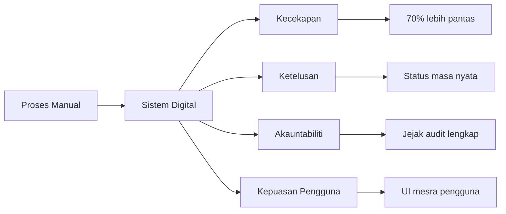
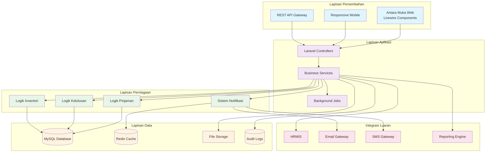
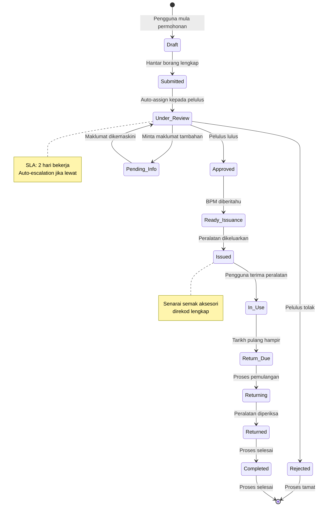

# Dokumentasi Aliran Sistem Permohonan Pinjaman Peralatan ICT — ICTServe (iServe)

**Versi:** 2.1.0 (SemVer)  
**Tarikh Kemaskini:** 17 Oktober 2025  
**Status:** Aktif — Distandardkan mengikut D00–D14  
**Klasifikasi:** Terhad - Dalaman MOTAC  
**Bahasa:** Bahasa Melayu dengan istilah Inggeris untuk kejelasan  
**Pematuhan D00–D14:** D02 (Business Requirements), D03 (Software Requirements), D07 (Integration Plan), D08 (Integration Spec), D09 (Database), D11 (Technical Design), D12-D14 (UI/UX)

---

> **Nota Rujukan Dokumen Utama:**  
> Dokumen ini adalah dokumentasi aliran sistem pinjaman aset ICT yang berkaitan dengan **D00_SYSTEM_OVERVIEW.md**, **D02_BUSINESS_REQUIREMENTS_SPECIFICATION.md**, **D03_SOFTWARE_REQUIREMENTS_SPECIFICATION.md**, **D07_SYSTEM_INTEGRATION_PLAN.md**, **D08_SYSTEM_INTEGRATION_SPECIFICATION.md**, **D09_DATABASE_DOCUMENTATION.md**, **D11_TECHNICAL_DESIGN_DOCUMENTATION.md**, dan **D12_UI_UX_DESIGN_GUIDE.md**. Sila rujuk dokumen D-series untuk konteks lengkap sistem.

---

## Kandungan

- [Ringkasan Eksekutif](#ringkasan-eksekutif)
- [Pengenalan](#pengenalan)
- [Seni Bina Sistem](#seni-bina-sistem)
- [Aliran Kerja Permohonan Pinjaman](#aliran-kerja-permohonan-pinjaman)
- [Spesifikasi Teknikal](#spesifikasi-teknikal)
- [Komponen dan Antara Muka](#komponen-dan-antara-muka)
- [Keselamatan dan Pematuhan](#keselamatan-dan-pematuhan)
- [Dokumentasi API](#dokumentasi-api)
- [Pemantauan dan Prestasi](#pemantauan-dan-prestasi)
- [Panduan Penerapan](#panduan-penerapan)
- [Penyelesaian Masalah](#penyelesaian-masalah)
- [Panduan Penyelenggaraan](#panduan-penyelenggaraan)
- [Sejarah Revisi](#sejarah-revisi)
- [Sokongan dan Bantuan](#sokongan-dan-bantuan)

---

## Ringkasan Eksekutif

### Gambaran Keseluruhan

Modul Pinjaman Peralatan ICT dalam sistem ICTServe (iServe) menguruskan kitaran hayat lengkap pinjaman peralatan ICT dalam Kementerian Pelancongan, Seni dan Budaya Malaysia (MOTAC). Sistem ini mengubah proses manual kepada aliran kerja digital yang cekap, dari permohonan awal hingga pemulangan peralatan.

### Objektif Utama

| Objektif                  | Penerangan                                         | Metrik Kejayaan             |
| ------------------------- | -------------------------------------------------- | --------------------------- |
| **Transformasi Digital**  | Digitalisasi penuh proses pinjaman peralatan       | 95% proses tanpa kertas     |
| **Peningkatan Kecekapan** | Mengurangkan masa pemprosesan dari hari ke jam     | Pengurangan masa 70%        |
| **Ketelusan Operasi**     | Jejak audit lengkap dan status masa nyata          | 100% keterlihatan transaksi |
| **Kepuasan Pengguna**     | Antara muka intuitif dan proses yang dipermudahkan | Skor kepuasan > 4.5/5.0     |
| **Optimisasi Sumber**     | Peningkatan penggunaan dan penjejakan aset         | Peningkatan utilisasi 35%   |

### Manfaat Sistem



**Rajah 1:** Transformasi dari Proses Manual kepada Sistem Digital - Menunjukkan manfaat utama digitalisasi proses pinjaman peralatan ICT.

---

## Pengenalan

### Tujuan Dokumen

Dokumen ini menyediakan panduan komprehensif untuk memahami, melaksanakan, dan menyelenggarakan aliran kerja pinjaman peralatan ICT dalam sistem ICTServe. Ia berfungsi sebagai rujukan teknikal utama untuk semua pihak berkepentingan.

### Skop Sistem

Modul Pinjaman Peralatan ICT merangkumi:

- **Pengurusan Permohonan**: Borang permohonan dinamik dengan validasi masa nyata
- **Aliran Kerja Kelulusan**: Sistem kelulusan berperingkat berdasarkan hierarki organisasi
- **Pengurusan Inventori**: Penjejakan ketersediaan dan status peralatan masa nyata
- **Pemprosesan Transaksi**: Pengeluaran dan pemulangan peralatan dengan dokumentasi lengkap
- **Sistem Notifikasi**: Pemberitahuan automatik melalui pelbagai saluran
- **Pelaporan dan Analitik**: Dashboard dan laporan untuk pemantauan dan analisis

### Pihak Berkepentingan

| Peranan               | Peranan Teknikal (Role) | Tanggungjawab Utama                          | Akses Sistem                     |
| --------------------- | ----------------------- | -------------------------------------------- | -------------------------------- |
| **Pemohon**           | `user`                  | Membuat dan mengemaskini permohonan pinjaman | Portal pengguna, status tracking |
| **Pegawai Penyokong** | `approver`              | Menyemak dan meluluskan permohonan           | Dashboard kelulusan              |
| **Staf BPM**          | `bpm-staff`             | Menguruskan inventori dan transaksi          | Modul pengurusan peralatan       |
| **Pentadbir Sistem**  | `admin` / `super-admin` | Konfigurasi sistem dan pemantauan            | Panel pentadbir Filament         |
| **Pihak Pengurusan**  | `management`            | Memantau prestasi dan laporan strategik      | Dashboard analitik               |

---

## Seni Bina Sistem

### Seni Bina Tahap Tinggi



**Rajah 2:** Seni Bina Berlapis Sistem ICTServe - Menunjukkan pemisahan tanggungjawab antara lapisan persembahan, aplikasi, perniagaan, data, dan integrasi luaran.

### Corak Reka Bentuk Utama

| Corak Reka Bentuk      | Implementasi                       | Faedah                                    |
| ---------------------- | ---------------------------------- | ----------------------------------------- |
| **MVC Pattern**        | Laravel Controllers, Models, Views | Pemisahan tanggungjawab yang jelas        |
| **Service Layer**      | Dedicated business logic classes   | Logik perniagaan yang boleh diguna semula |
| **Repository Pattern** | Data access abstraction            | Fleksibiliti dan kebolehujian             |
| **Observer Pattern**   | Event-driven notifications         | Loose coupling antara komponen            |
| **Strategy Pattern**   | Pluggable approval workflows       | Fleksibiliti aliran kerja                 |
| **Command Pattern**    | Queue jobs for async processing    | Prestasi dan kebolehskalaan               |

### Teknologi Stack

```yaml
Backend Framework: Laravel 12.x
Frontend Components: Livewire 3.x
Admin Panel: Filament 4.x
Database: MySQL 8.0+
Cache & Session: Redis 7.x
Queue System: Redis
File Storage: Local/S3
Authentication: LDAP/Active Directory
Authorization: Spatie Laravel Permission
Audit Logging: Owen-it Laravel Auditing
Asset Building: Vite 4.x
UI Framework: Tailwind CSS 3.x
```

---

## Aliran Kerja Permohonan Pinjaman

### Gambaran Keseluruhan Proses



**Rajah 3:** Diagram Keadaan Aliran Kerja Pinjaman - Menunjukkan peralihan status dari permohonan awal hingga selesai atau ditolak.

### Matriks Kelulusan

Sistem menggunakan matriks kelulusan berdasarkan gred organisasi dan nilai aset:

| Gred Pemohon | Nilai Aset | Pelulus Minimum | Masa Pemprosesan |
| ------------ | ---------- | --------------- | ---------------- |
| 54 ke bawah  | < RM 5,000 | Gred 41         | 1 hari bekerja   |
| 54 ke bawah  | RM 5,000+  | Gred 44         | 2 hari bekerja   |
| 52-48        | Mana-mana  | Gred 44         | 2 hari bekerja   |
| 44-41        | Mana-mana  | Gred 48         | 2 hari bekerja   |
| JUSA         | Mana-mana  | JUSA B          | 1 hari bekerja   |

### Aliran Kerja Terperinci

#### Fasa 1: Penciptaan dan Penghantaran Permohonan

##### Langkah 1.1: Inisialisasi Permohonan

```yaml
Pelaku: Pemohon
Lokasi: /loans/create
Sistem: LoanApplicationForm (Livewire)
Tindakan:
    - Log masuk ke sistem
    - Akses borang permohonan baru
    - Sistem auto-isi maklumat pengguna
Keluaran: Draft permohonan dicipta
```

##### Langkah 1.2: Pengisian Borang

```yaml
Bahagian Borang:
    Maklumat Pemohon:
        - Nama: Auto-diisi dari profil pengguna
        - Jabatan: Auto-diisi dari maklumat HRMIS
        - Gred: Auto-diisi dari data pengguna
        - No. Telefon: Wajib diisi
        - Emel: Auto-diisi dari akaun pengguna

    Butiran Pinjaman:
        - Tujuan pinjaman: Minimum 50 aksara (validasi)
        - Lokasi penggunaan: Wajib (dropdown atau text)
        - Tarikh mula: Minimum esok (date picker)
        - Tarikh tamat: Maksimum 30 hari dari tarikh mula
        - Pegawai bertanggungjawab: Pilihan (jika berbeza dari pemohon)

    Peralatan Diperlukan:
        - Jenis peralatan: Dropdown (Laptop, Projektor, Tablet, dll.)
        - Kuantiti: Integer positif (maksimum 10 unit per item)
        - Spesifikasi khusus: Pilihan (contoh: Windows 11, 16GB RAM)
```

##### Langkah 1.3: Validasi dan Penghantaran

```php
// Contoh validasi Laravel
$rules = [
    'purpose' => 'required|string|min:50|max:1000',
    'location' => 'required|string|max:255',
    'loan_start_date' => 'required|date|after:today',
    'loan_end_date' => 'required|date|after:loan_start_date|before_or_equal:loan_start_date,+30 days',
    'equipment_items' => 'required|array|min:1|max:5',
    'equipment_items.*.type' => 'required|string|exists:equipment_categories,id',
    'equipment_items.*.quantity' => 'required|integer|min:1|max:10',
    'equipment_items.*.specifications' => 'nullable|string|max:500'
];
```

#### Fasa 2: Proses Kelulusan

##### Langkah 2.1: Penugasan Automatik

```php
// Logik penentuan pelulus
public function determineApprover(User $applicant, array $items): User
{
    $totalValue = $this->calculateTotalValue($items);
    $applicantGrade = $applicant->grade->level;

    return match(true) {
        $applicantGrade <= 54 && $totalValue < 5000 =>
            $this->findApproverByMinGrade(41, $applicant->department),
        $applicantGrade <= 54 && $totalValue >= 5000 =>
            $this->findApproverByMinGrade(44, $applicant->department),
        $applicantGrade >= 52 && $applicantGrade <= 48 =>
            $this->findApproverByMinGrade(44, $applicant->department),
        $applicantGrade >= 44 && $applicantGrade <= 41 =>
            $this->findApproverByMinGrade(48, $applicant->department),
        $applicantGrade >= 40 =>
            $this->findJusaApprover($applicant->department),
        default => throw new InvalidApprovalException('Tiada pelulus yang sesuai ditemui')
    };
}
```

##### Langkah 2.2: Semakan dan Keputusan

```yaml
Tindakan Pelulus:
    Menyemak Permohonan:
        - Butiran pemohon dan tujuan
        - Ketersediaan peralatan dalam inventori
        - Sejarah pinjaman terdahulu pemohon
        - Keutamaan permohonan

    Keputusan Available:
        - Lulus: Dengan atau tanpa syarat
        - Tolak: Dengan sebab terperinci (wajib)
        - Minta Maklumat: Untuk penjelasan lanjut
        - Delegate: Kepada pelulus lain (jika perlu)

    Dokumentasi:
        - Komen kelulusan/penolakan
        - Syarat tambahan jika ada
        - Tarikh keputusan (auto-recorded)
```

#### Fasa 3: Pengeluaran Peralatan

##### Langkah 3.1: Penyediaan oleh Staf BPM

```yaml
Aktiviti BPM:
    Penerimaan Tugasan:
        - Notifikasi permohonan diluluskan (email & sistem)
        - Akses dashboard pengurusan Filament
        - Semak senarai peralatan diperlukan

    Penyediaan Peralatan:
        - Pilih unit peralatan spesifik dari inventori
        - Uji kefungsian peralatan (boot test, connectivity)
        - Sediakan aksesori lengkap (kabel, charger, bag, dll.)
        - Kemas kini status inventori (available → reserved)

    Penjadwalan Pengambilan:
        - Hubungi pemohon untuk temujanji
        - Tetapkan masa dan lokasi (contoh: Pejabat BPM, Aras 3)
        - Hantar notifikasi pengesahan kepada pemohon
```

##### Langkah 3.2: Proses Pengeluaran

```yaml
Senarai Semak Pengeluaran:
  Pengesahan Identiti:
    - [ ] Kad pengenalan pemohon (photostat)
    - [ ] Pengesahan no. permohonan
    - [ ] Verifikasi tandatangan

  Pemeriksaan Peralatan:
    - [ ] Peralatan utama berfungsi
    - [ ] Aksesori lengkap mengikut senarai
    - [ ] Tiada kerosakan fizikal
    - [ ] Rekod nombor siri/tag ID

  Dokumentasi:
    - [ ] Borang pengeluaran (PK.(S).MOTAC.07.(L3)) ditandatangan
    - [ ] Foto bukti pengeluaran (optional)
    - [ ] Arahan pemulangan dijelaskan
    - [ ] Tarikh pemulangan ditetapkan dan dimaklumkan
```

#### Fasa 4: Pemulangan Peralatan

##### Langkah 4.1: Sistem Peringatan

```php
// Scheduler untuk peringatan pemulangan
class LoanReminderJob implements ShouldQueue
{
    public function handle()
    {
        $upcomingReturns = LoanTransaction::with('loanApplication.user')
            ->where('type', 'issue')
            ->where('status', 'completed')
            ->whereDate('expected_return_date', '<=', now()->addDays(3))
            ->get();

        foreach ($upcomingReturns as $transaction) {
            $transaction->loanApplication->user->notify(
                new EquipmentReturnReminderNotification($transaction)
            );
        }
    }
}
```

##### Langkah 4.2: Proses Pemulangan

```yaml
Pemeriksaan Pemulangan:
  Kondisi Fizikal:
    - [ ] Tiada kerosakan luaran (calar, retak)
    - [ ] Semua port berfungsi (USB, HDMI, audio)
    - [ ] Skrin/paparan sempurna (tiada dead pixels)
    - [ ] Papan kekunci dan touchpad berfungsi

  Ujian Kefungsian:
    - [ ] Sistem operasi boot dengan normal
    - [ ] Sambungan rangkaian OK (WiFi, LAN)
    - [ ] Semua ciri operasi (audio, video, etc.)
    - [ ] Data peribadi dibersihkan (jika perlu)

  Aksesori:
    - [ ] Semua aksesori dipulangkan
    - [ ] Aksesori dalam keadaan baik
    - [ ] Nombor siri sepadan dengan rekod

  Dokumentasi:
    - [ ] Borang pemulangan lengkap
    - [ ] Laporan kerosakan (jika ada)
    - [ ] Maklum balas pengguna (optional)
```

---

## Spesifikasi Teknikal

### Model Data Utama

#### Model LoanApplication

```php
<?php

namespace App\Models;

use Illuminate\Database\Eloquent\Model;
use Illuminate\Database\Eloquent\SoftDeletes;
use OwenIt\Auditing\Contracts\Auditable;

class LoanApplication extends Model implements Auditable
{
    use SoftDeletes, \OwenIt\Auditing\Auditable;

    protected $fillable = [
        'user_id',
        'application_number',
        'purpose',
        'location',
        'return_location',
        'loan_start_date',
        'loan_end_date',
        'status',
        'responsible_officer_id',
        'supporting_officer_id'
    ];

    protected $casts = [
        'loan_start_date' => 'date',
        'loan_end_date' => 'date',
        'submitted_at' => 'datetime',
        'approved_at' => 'datetime'
    ];

    // Status constants
    const STATUS_DRAFT = 'draft';
    const STATUS_SUBMITTED = 'submitted';
    const STATUS_UNDER_REVIEW = 'under_review';
    const STATUS_APPROVED = 'approved';
    const STATUS_REJECTED = 'rejected';
    const STATUS_ISSUED = 'issued';
    const STATUS_RETURNED = 'returned';
    const STATUS_COMPLETED = 'completed';

    // Relationships
    public function user()
    {
        return $this->belongsTo(User::class);
    }

    public function items()
    {
        return $this->hasMany(LoanApplicationItem::class);
    }

    public function transactions()
    {
        return $this->hasMany(LoanTransaction::class);
    }

    public function approvals()
    {
        return $this->morphMany(Approval::class, 'approvable');
    }

    // Scopes
    public function scopePendingApproval($query)
    {
        return $query->where('status', self::STATUS_UNDER_REVIEW);
    }

    public function scopeActive($query)
    {
        return $query->whereIn('status', [
            self::STATUS_APPROVED,
            self::STATUS_ISSUED
        ]);
    }

    // Accessors & Mutators
    public function getFormattedApplicationNumberAttribute()
    {
        return 'LA-' . date('Y') . '-' . str_pad($this->id, 6, '0', STR_PAD_LEFT);
    }

    public function getDaysUntilReturnAttribute()
    {
        return $this->loan_end_date->diffInDays(now(), false);
    }
}
```

#### Service Classes

```php
<?php

namespace App\Services;

use App\Models\LoanApplication;
use App\Models\User;
use App\Notifications\LoanApplicationSubmittedNotification;
use Illuminate\Support\Facades\DB;

class LoanApplicationService
{
    public function createApplication(array $data, User $user): LoanApplication
    {
        return DB::transaction(function () use ($data, $user) {
            $application = LoanApplication::create([
                'user_id' => $user->id,
                'application_number' => $this->generateApplicationNumber(),
                'purpose' => $data['purpose'],
                'location' => $data['location'],
                'loan_start_date' => $data['loan_start_date'],
                'loan_end_date' => $data['loan_end_date'],
                'status' => LoanApplication::STATUS_DRAFT
            ]);

            // Create application items
            foreach ($data['items'] as $item) {
                $application->items()->create([
                    'equipment_type' => $item['type'],
                    'quantity_requested' => $item['quantity'],
                    'specifications' => $item['specifications'] ?? null
                ]);
            }

            return $application;
        });
    }

    public function submitForApproval(LoanApplication $application): bool
    {
        $approver = $this->determineApprover($application);

        if (!$approver) {
            throw new \Exception('Tiada pelulus yang sesuai ditemui');
        }

        $application->update([
            'status' => LoanApplication::STATUS_UNDER_REVIEW,
            'submitted_at' => now(),
            'current_approval_officer_id' => $approver->id
        ]);

        // Create approval record
        $application->approvals()->create([
            'officer_id' => $approver->id,
            'stage' => 'primary_approval',
            'status' => 'pending'
        ]);

        // Send notifications
        $application->user->notify(new LoanApplicationSubmittedNotification($application));
        $approver->notify(new PendingApprovalNotification($application));

        return true;
    }

    private function generateApplicationNumber(): string
    {
        $year = date('Y');
        $month = date('m');

        $lastNumber = LoanApplication::whereYear('created_at', $year)
            ->whereMonth('created_at', $month)
            ->max('id') ?? 0;

        return sprintf('LA-%s-%s-%04d', $year, $month, $lastNumber + 1);
    }

    private function determineApprover(LoanApplication $application): ?User
    {
        $applicant = $application->user;
        $department = $applicant->department;

        // Implementation of approval matrix logic
        return $department->users()
            ->whereHas('grade', function ($query) use ($applicant) {
                $query->where('level', '>=', $this->getRequiredGradeLevel($applicant));
            })
            ->where('status', 'active')
            ->first();
    }
}
```

### Komponen Livewire

```php
<?php

namespace App\Livewire\LoanApplication;

use Livewire\Component;
use App\Services\LoanApplicationService;
use Livewire\Attributes\Validate;

class ApplicationForm extends Component
{
    #[Validate('required|string|min:50|max:1000')]
    public $purpose = '';

    #[Validate('required|string|max:255')]
    public $location = '';

    #[Validate('required|date|after:today')]
    public $loan_start_date = '';

    #[Validate('required|date|after:loan_start_date')]
    public $loan_end_date = '';

    #[Validate('required|array|min:1')]
    public $items = [];

    public $currentStep = 1;
    public $maxSteps = 4;

    protected $loanApplicationService;

    public function boot(LoanApplicationService $service)
    {
        $this->loanApplicationService = $service;
    }

    public function mount()
    {
        $this->loan_start_date = now()->addDay()->format('Y-m-d');
        $this->loan_end_date = now()->addDays(7)->format('Y-m-d');
        $this->items = [
            ['type' => '', 'quantity' => 1, 'specifications' => '']
        ];
    }

    public function addItem()
    {
        if (count($this->items) < 5) {
            $this->items[] = ['type' => '', 'quantity' => 1, 'specifications' => ''];
        }
    }

    public function removeItem($index)
    {
        if (count($this->items) > 1) {
            unset($this->items[$index]);
            $this->items = array_values($this->items);
        }
    }

    public function nextStep()
    {
        $this->validateCurrentStep();

        if ($this->currentStep < $this->maxSteps) {
            $this->currentStep++;
        }
    }

    public function previousStep()
    {
        if ($this->currentStep > 1) {
            $this->currentStep--;
        }
    }

    public function saveDraft()
    {
        try {
            $this->validate();

            $application = $this->loanApplicationService->createApplication([
                'purpose' => $this->purpose,
                'location' => $this->location,
                'loan_start_date' => $this->loan_start_date,
                'loan_end_date' => $this->loan_end_date,
                'items' => $this->items
            ], auth()->user());

            session()->flash('success', 'Draf permohonan telah disimpan.');

        } catch (\Exception $e) {
            session()->flash('error', 'Ralat menyimpan draf: ' . $e->getMessage());
        }
    }

    public function submitApplication()
    {
        try {
            $this->validate();

            $application = $this->loanApplicationService->createApplication([
                'purpose' => $this->purpose,
                'location' => $this->location,
                'loan_start_date' => $this->loan_start_date,
                'loan_end_date' => $this->loan_end_date,
                'items' => $this->items
            ], auth()->user());

            $this->loanApplicationService->submitForApproval($application);

            return redirect()->route('loans.show', $application)
                ->with('success', 'Permohonan telah dihantar untuk kelulusan.');

        } catch (\Exception $e) {
            session()->flash('error', 'Ralat menghantar permohonan: ' . $e->getMessage());
        }
    }

    private function validateCurrentStep()
    {
        match($this->currentStep) {
            1 => $this->validate(['purpose' => 'required|string|min:50|max:1000']),
            2 => $this->validate([
                'location' => 'required|string|max:255',
                'loan_start_date' => 'required|date|after:today',
                'loan_end_date' => 'required|date|after:loan_start_date'
            ]),
            3 => $this->validate([
                'items' => 'required|array|min:1',
                'items.*.type' => 'required|string',
                'items.*.quantity' => 'required|integer|min:1'
            ]),
            default => null
        };
    }

    public function render()
    {
        return view('livewire.loan-application.application-form');
    }
}
```

---

## Komponen dan Antara Muka

### Template Blade

```blade
{{-- resources/views/livewire/loan-application/application-form.blade.php --}}
<div class="max-w-4xl mx-auto p-6 bg-white rounded-lg shadow-lg">
    <!-- Progress Indicator -->
    <div class="mb-8">
        <div class="flex items-center justify-between">
            @for($i = 1; $i <= $maxSteps; $i++)
                <div class="flex items-center">
                    <div class="w-8 h-8 rounded-full flex items-center justify-center text-sm font-medium
                        {{ $currentStep >= $i ? 'bg-primary-600 text-white' : 'bg-gray-200 text-gray-600' }}">
                        {{ $i }}
                    </div>
                    @if($i < $maxSteps)
                        <div class="w-16 h-1 mx-2
                            {{ $currentStep > $i ? 'bg-primary-600' : 'bg-gray-200' }}">
                        </div>
                    @endif
                </div>
            @endfor
        </div>

        <div class="mt-4 text-center">
            <span class="text-lg font-medium text-gray-900">
                @switch($currentStep)
                    @case(1)
                        Langkah 1: Tujuan Pinjaman
                        @break
                    @case(2)
                        Langkah 2: Butiran Pinjaman
                        @break
                    @case(3)
                        Langkah 3: Peralatan Diperlukan
                        @break
                    @case(4)
                        Langkah 4: Semakan dan Penghantaran
                        @break
                @endswitch
            </span>
        </div>
    </div>

    <!-- Form Content -->
    <form wire:submit.prevent="submitApplication">
        @if($currentStep === 1)
            <!-- Step 1: Purpose -->
            <div class="space-y-6">
                <div>
                    <label for="purpose" class="block text-sm font-medium text-gray-700 mb-2">
                        Tujuan Pinjaman <span class="text-red-500">*</span>
                    </label>
                    <textarea
                        wire:model="purpose"
                        id="purpose"
                        rows="4"
                        class="w-full rounded-md border-gray-300 shadow-sm focus:border-primary-500 focus:ring-primary-500"
                        placeholder="Nyatakan tujuan terperinci untuk pinjaman peralatan ICT ini..."
                        maxlength="1000"
                    ></textarea>
                    @error('purpose')
                        <p class="mt-1 text-sm text-red-600">{{ $message }}</p>
                    @enderror
                    <div class="mt-1 text-sm text-gray-500">
                        {{ strlen($purpose) }}/1000 aksara (minimum 50 aksara)
                    </div>
                </div>
            </div>
        @endif

        @if($currentStep === 2)
            <!-- Step 2: Loan Details -->
            <div class="space-y-6">
                <div class="grid grid-cols-1 md:grid-cols-2 gap-6">
                    <div>
                        <label for="location" class="block text-sm font-medium text-gray-700 mb-2">
                            Lokasi Penggunaan <span class="text-red-500">*</span>
                        </label>
                        <input
                            type="text"
                            wire:model="location"
                            id="location"
                            class="w-full rounded-md border-gray-300 shadow-sm focus:border-primary-500 focus:ring-primary-500"
                            placeholder="cth: Dewan Seri Budaya, MOTAC"
                        />
                        @error('location')
                            <p class="mt-1 text-sm text-red-600">{{ $message }}</p>
                        @enderror
                    </div>
                </div>

                <div class="grid grid-cols-1 md:grid-cols-2 gap-6">
                    <div>
                        <label for="loan_start_date" class="block text-sm font-medium text-gray-700 mb-2">
                            Tarikh Mula Pinjaman <span class="text-red-500">*</span>
                        </label>
                        <input
                            type="date"
                            wire:model="loan_start_date"
                            id="loan_start_date"
                            min="{{ date('Y-m-d', strtotime('+1 day')) }}"
                            class="w-full rounded-md border-gray-300 shadow-sm focus:border-primary-500 focus:ring-primary-500"
                        />
                        @error('loan_start_date')
                            <p class="mt-1 text-sm text-red-600">{{ $message }}</p>
                        @enderror
                    </div>

                    <div>
                        <label for="loan_end_date" class="block text-sm font-medium text-gray-700 mb-2">
                            Tarikh Tamat Pinjaman <span class="text-red-500">*</span>
                        </label>
                        <input
                            type="date"
                            wire:model="loan_end_date"
                            id="loan_end_date"
                            min="{{ $loan_start_date }}"
                            class="w-full rounded-md border-gray-300 shadow-sm focus:border-primary-500 focus:ring-primary-500"
                        />
                        @error('loan_end_date')
                            <p class="mt-1 text-sm text-red-600">{{ $message }}</p>
                        @enderror
                        <p class="mt-1 text-sm text-gray-500">Maksimum 30 hari dari tarikh mula</p>
                    </div>
                </div>
            </div>
        @endif

        @if($currentStep === 3)
            <!-- Step 3: Equipment Items -->
            <div class="space-y-6">
                <div class="flex justify-between items-center">
                    <h3 class="text-lg font-medium text-gray-900">Peralatan Diperlukan</h3>
                    <button
                        type="button"
                        wire:click="addItem"
                        class="inline-flex items-center px-3 py-2 border border-transparent text-sm leading-4 font-medium rounded-md text-white bg-primary-600 hover:bg-primary-700"
                        {{ count($items) >= 5 ? 'disabled' : '' }}
                    >
                        <svg class="w-4 h-4 mr-1" fill="currentColor" viewBox="0 0 20 20">
                            <path fill-rule="evenodd" d="M10 3a1 1 0 011 1v5h5a1 1 0 110 2h-5v5a1 1 0 11-2 0v-5H4a1 1 0 110-2h5V4a1 1 0 011-1z" clip-rule="evenodd"></path>
                        </svg>
                        Tambah Item
                    </button>
                </div>

                @foreach($items as $index => $item)
                    <div class="border border-gray-200 rounded-lg p-4">
                        <div class="flex justify-between items-start mb-4">
                            <h4 class="text-md font-medium text-gray-900">Item {{ $index + 1 }}</h4>
                            @if(count($items) > 1)
                                <button
                                    type="button"
                                    wire:click="removeItem({{ $index }})"
                                    class="text-red-600 hover:text-red-800"
                                >
                                    <svg class="w-5 h-5" fill="currentColor" viewBox="0 0 20 20">
                                        <path fill-rule="evenodd" d="M4.293 4.293a1 1 0 011.414 0L10 8.586l4.293-4.293a1 1 0 111.414 1.414L11.414 10l4.293 4.293a1 1 0 01-1.414 1.414L10 11.414l-4.293 4.293a1 1 0 01-1.414-1.414L8.586 10 4.293 5.707a1 1 0 010-1.414z" clip-rule="evenodd"></path>
                                    </svg>
                                </button>
                            @endif
                        </div>

                        <div class="grid grid-cols-1 md:grid-cols-3 gap-4">
                            <div>
                                <label class="block text-sm font-medium text-gray-700 mb-1">
                                    Jenis Peralatan <span class="text-red-500">*</span>
                                </label>
                                <select
                                    wire:model="items.{{ $index }}.type"
                                    class="w-full rounded-md border-gray-300 shadow-sm focus:border-primary-500 focus:ring-primary-500"
                                >
                                    <option value="">Pilih jenis peralatan</option>
                                    <option value="laptop">Laptop</option>
                                    <option value="projector">Projektor</option>
                                    <option value="tablet">Tablet</option>
                                    <option value="camera">Kamera</option>
                                    <option value="speaker">Speaker</option>
                                    <option value="microphone">Mikrofon</option>
                                    <option value="other">Lain-lain</option>
                                </select>
                                @error("items.{$index}.type")
                                    <p class="mt-1 text-sm text-red-600">{{ $message }}</p>
                                @enderror
                            </div>

                            <div>
                                <label class="block text-sm font-medium text-gray-700 mb-1">
                                    Kuantiti <span class="text-red-500">*</span>
                                </label>
                                <input
                                    type="number"
                                    wire:model="items.{{ $index }}.quantity"
                                    min="1"
                                    max="10"
                                    class="w-full rounded-md border-gray-300 shadow-sm focus:border-primary-500 focus:ring-primary-500"
                                />
                                @error("items.{$index}.quantity")
                                    <p class="mt-1 text-sm text-red-600">{{ $message }}</p>
                                @enderror
                            </div>

                            <div>
                                <label class="block text-sm font-medium text-gray-700 mb-1">
                                    Spesifikasi Khusus
                                </label>
                                <input
                                    type="text"
                                    wire:model="items.{{ $index }}.specifications"
                                    placeholder="cth: Windows 11, 16GB RAM"
                                    class="w-full rounded-md border-gray-300 shadow-sm focus:border-primary-500 focus:ring-primary-500"
                                />
                            </div>
                        </div>
                    </div>
                @endforeach

                @error('items')
                    <p class="text-sm text-red-600">{{ $message }}</p>
                @enderror
            </div>
        @endif

        @if($currentStep === 4)
            <!-- Step 4: Review and Submit -->
            <div class="space-y-8">
                <div class="bg-gray-50 rounded-lg p-6">
                    <h3 class="text-lg font-medium text-gray-900 mb-4">Semakan Permohonan</h3>

                    <dl class="grid grid-cols-1 gap-x-4 gap-y-6 sm:grid-cols-2">
                        <div>
                            <dt class="text-sm font-medium text-gray-500">Pemohon</dt>
                            <dd class="mt-1 text-sm text-gray-900">{{ auth()->user()->name }}</dd>
                        </div>

                        <div>
                            <dt class="text-sm font-medium text-gray-500">Jabatan</dt>
                            <dd class="mt-1 text-sm text-gray-900">{{ auth()->user()->department->name }}</dd>
                        </div>

                        <div>
                            <dt class="text-sm font-medium text-gray-500">Lokasi Penggunaan</dt>
                            <dd class="mt-1 text-sm text-gray-900">{{ $location }}</dd>
                        </div>

                        <div>
                            <dt class="text-sm font-medium text-gray-500">Tempoh Pinjaman</dt>
                            <dd class="mt-1 text-sm text-gray-900">
                                {{ \Carbon\Carbon::parse($loan_start_date)->format('d/m/Y') }} -
                                {{ \Carbon\Carbon::parse($loan_end_date)->format('d/m/Y') }}
                                ({{ \Carbon\Carbon::parse($loan_start_date)->diffInDays($loan_end_date) }} hari)
                            </dd>
                        </div>
                    </dl>

                    <div class="mt-6">
                        <dt class="text-sm font-medium text-gray-500">Tujuan Pinjaman</dt>
                        <dd class="mt-1 text-sm text-gray-900">{{ $purpose }}</dd>
                    </div>

                    <div class="mt-6">
                        <dt class="text-sm font-medium text-gray-500 mb-3">Peralatan Diperlukan</dt>
                        <div class="space-y-2">
                            @foreach($items as $index => $item)
                                <div class="flex justify-between items-center p-3 bg-white rounded border">
                                    <div>
                                        <span class="font-medium">{{ ucfirst($item['type']) }}</span>
                                        @if($item['specifications'])
                                            <span class="text-gray-500">- {{ $item['specifications'] }}</span>
                                        @endif
                                    </div>
                                    <span class="text-sm text-gray-600">{{ $item['quantity'] }} unit</span>
                                </div>
                            @endforeach
                        </div>
                    </div>
                </div>

                <div class="bg-yellow-50 border border-yellow-200 rounded-md p-4">
                    <div class="flex">
                        <div class="flex-shrink-0">
                            <svg class="h-5 w-5 text-yellow-400" fill="currentColor" viewBox="0 0 20 20">
                                <path fill-rule="evenodd" d="M8.257 3.099c.765-1.36 2.722-1.36 3.486 0l5.58 9.92c.75 1.334-.213 2.98-1.742 2.98H4.42c-1.53 0-2.493-1.646-1.743-2.98l5.58-9.92zM11 13a1 1 0 11-2 0 1 1 0 012 0zm-1-8a1 1 0 00-1 1v3a1 1 0 002 0V6a1 1 0 00-1-1z" clip-rule="evenodd"></path>
                            </svg>
                        </div>
                        <div class="ml-3">
                            <h3 class="text-sm font-medium text-yellow-800">Peringatan Penting</h3>
                            <div class="mt-2 text-sm text-yellow-700">
                                <ul class="list-disc list-inside space-y-1">
                                    <li>Pastikan semua maklumat adalah tepat dan lengkap</li>
                                    <li>Permohonan akan dihantar untuk kelulusan dan tidak boleh diubah</li>
                                    <li>Anda akan menerima notifikasi mengenai status permohonan</li>
                                    <li>Peralatan mesti dipulangkan mengikut tarikh yang ditetapkan</li>
                                </ul>
                            </div>
                        </div>
                    </div>
                </div>

                <div class="flex items-center">
                    <input
                        type="checkbox"
                        id="terms_agreement"
                        wire:model="terms_agreed"
                        class="h-4 w-4 text-primary-600 focus:ring-primary-500 border-gray-300 rounded"
                        required
                    />
                    <label for="terms_agreement" class="ml-2 block text-sm text-gray-900">
                        Saya mengesahkan bahawa maklumat yang diberikan adalah tepat dan bersetuju dengan
                        <a href="#" class="text-primary-600 hover:text-primary-500">terma dan syarat</a>
                        pinjaman peralatan ICT.
                    </label>
                </div>
            </div>
        @endif

        <!-- Navigation Buttons -->
        <div class="flex justify-between pt-8 border-t border-gray-200">
            <div>
                @if($currentStep > 1)
                    <button
                        type="button"
                        wire:click="previousStep"
                        class="inline-flex items-center px-4 py-2 border border-gray-300 shadow-sm text-sm font-medium rounded-md text-gray-700 bg-white hover:bg-gray-50 focus:outline-none focus:ring-2 focus:ring-offset-2 focus:ring-primary-500"
                    >
                        <svg class="w-4 h-4 mr-2" fill="currentColor" viewBox="0 0 20 20">
                            <path fill-rule="evenodd" d="M12.707 5.293a1 1 0 010 1.414L9.414 10l3.293 3.293a1 1 0 01-1.414 1.414l-4-4a1 1 0 010-1.414l4-4a1 1 0 011.414 0z" clip-rule="evenodd"></path>
                        </svg>
                        Kembali
                    </button>
                @endif
            </div>

            <div class="flex space-x-3">
                @if($currentStep < $maxSteps)
                    <button
                        type="button"
                        wire:click="saveDraft"
                        class="inline-flex items-center px-4 py-2 border border-gray-300 shadow-sm text-sm font-medium rounded-md text-gray-700 bg-white hover:bg-gray-50 focus:outline-none focus:ring-2 focus:ring-offset-2 focus:ring-primary-500"
                    >
                        Simpan Draf
                    </button>

                    <button
                        type="button"
                        wire:click="nextStep"
                        class="inline-flex items-center px-4 py-2 border border-transparent text-sm font-medium rounded-md text-white bg-primary-600 hover:bg-primary-700 focus:outline-none focus:ring-2 focus:ring-offset-2 focus:ring-primary-500"
                    >
                        Seterusnya
                        <svg class="w-4 h-4 ml-2" fill="currentColor" viewBox="0 0 20 20">
                            <path fill-rule="evenodd" d="M7.293 14.707a1 1 0 010-1.414L10.586 10 7.293 6.707a1 1 0 011.414-1.414l4 4a1 1 0 010 1.414l-4 4a1 1 0 01-1.414 0z" clip-rule="evenodd"></path>
                        </svg>
                    </button>
                @else
                    <button
                        type="submit"
                        class="inline-flex items-center px-6 py-3 border border-transparent text-base font-medium rounded-md text-white bg-primary-600 hover:bg-primary-700 focus:outline-none focus:ring-2 focus:ring-offset-2 focus:ring-primary-500"
                        wire:loading.attr="disabled"
                    >
                        <span wire:loading.remove>
                            Hantar Permohonan
                        </span>
                        <span wire:loading>
                            <svg class="animate-spin -ml-1 mr-3 h-5 w-5 text-white" xmlns="http://www.w3.org/2000/svg" fill="none" viewBox="0 0 24 24">
                                <circle class="opacity-25" cx="12" cy="12" r="10" stroke="currentColor" stroke-width="4"></circle>
                                <path class="opacity-75" fill="currentColor" d="M4 12a8 8 0 018-8V0C5.373 0 0 5.373 0 12h4zm2 5.291A7.962 7.962 0 014 12H0c0 3.042 1.135 5.824 3 7.938l3-2.647z"></path>
                            </svg>
                            Menghantar...
                        </span>
                    </button>
                @endif
            </div>
        </div>
    </form>
</div>
```

---

## Keselamatan dan Pematuhan

### Kawalan Keselamatan

```php
<?php

namespace App\Policies;

use App\Models\LoanApplication;
use App\Models\User;
use Illuminate\Auth\Access\HandlesAuthorization;

class LoanApplicationPolicy
{
    use HandlesAuthorization;

    public function viewAny(User $user): bool
    {
        return $user->hasPermissionTo('view loan applications');
    }

    public function view(User $user, LoanApplication $loanApplication): bool
    {
        // Pengguna boleh lihat permohonan sendiri
        if ($user->id === $loanApplication->user_id) {
            return true;
        }

        // Pelulus boleh lihat permohonan yang ditugaskan
        if ($loanApplication->current_approval_officer_id === $user->id) {
            return true;
        }

        // Staf BPM boleh lihat semua permohonan yang diluluskan
        if ($user->hasRole('bpm-staff') && $loanApplication->status === 'approved') {
            return true;
        }

        return $user->hasPermissionTo('view all loan applications');
    }

    public function create(User $user): bool
    {
        // Pengguna mesti aktif dan tidak mempunyai pinjaman tertunggak
        return $user->status === 'active'
            && !$this->hasOutstandingLoans($user)
            && $user->hasPermissionTo('create loan applications');
    }

    public function update(User $user, LoanApplication $loanApplication): bool
    {
        // Hanya pengguna sendiri boleh edit dan status mesti draft
        return $user->id === $loanApplication->user_id
            && $loanApplication->status === 'draft'
            && $user->hasPermissionTo('update loan applications');
    }

    public function delete(User $user, LoanApplication $loanApplication): bool
    {
        return $user->id === $loanApplication->user_id
            && in_array($loanApplication->status, ['draft', 'submitted'])
            && $user->hasPermissionTo('delete loan applications');
    }

    public function approve(User $user, LoanApplication $loanApplication): bool
    {
        // Pelulus mesti mempunyai gred yang mencukupi
        return $loanApplication->current_approval_officer_id === $user->id
            && $loanApplication->status === 'under_review'
            && $this->hasApprovalAuthority($user, $loanApplication)
            && $user->hasPermissionTo('approve loan applications');
    }

    public function issue(User $user, LoanApplication $loanApplication): bool
    {
        return $user->hasRole('bpm-staff')
            && $loanApplication->status === 'approved'
            && $user->hasPermissionTo('issue equipment');
    }

    private function hasOutstandingLoans(User $user): bool
    {
        return $user->loanApplications()
            ->whereIn('status', ['issued', 'overdue'])
            ->exists();
    }

    private function hasApprovalAuthority(User $user, LoanApplication $loanApplication): bool
    {
        $applicantGrade = $loanApplication->user->grade->level ?? 0;
        $approverGrade = $user->grade->level ?? 0;

        // Logik hierarki kelulusan berdasarkan gred
        return match(true) {
            $applicantGrade <= 54 => $approverGrade >= 41,
            $applicantGrade <= 48 => $approverGrade >= 44,
            $applicantGrade <= 41 => $approverGrade >= 48,
            default => $user->hasRole('executive')
        };
    }
}
```

### Audit Trail dan Logging

```php
<?php

namespace App\Observers;

use App\Models\LoanApplication;
use Illuminate\Support\Facades\Log;

class LoanApplicationObserver
{
    public function created(LoanApplication $loanApplication): void
    {
        Log::info('Loan application created', [
            'application_id' => $loanApplication->id,
            'user_id' => $loanApplication->user_id,
            'user_name' => $loanApplication->user->name,
            'department' => $loanApplication->user->department->name,
            'purpose' => $loanApplication->purpose,
            'items_count' => $loanApplication->items->count(),
            'ip_address' => request()->ip(),
            'user_agent' => request()->userAgent()
        ]);
    }

    public function updated(LoanApplication $loanApplication): void
    {
        $changes = $loanApplication->getChanges();

        if (isset($changes['status'])) {
            Log::info('Loan application status changed', [
                'application_id' => $loanApplication->id,
                'old_status' => $loanApplication->getOriginal('status'),
                'new_status' => $changes['status'],
                'changed_by' => auth()->id(),
                'changed_by_name' => auth()->user()?->name,
                'timestamp' => now(),
                'ip_address' => request()->ip()
            ]);
        }

        if (isset($changes['approved_by'])) {
            Log::info('Loan application approved', [
                'application_id' => $loanApplication->id,
                'approved_by' => $changes['approved_by'],
                'approver_name' => $loanApplication->approver->name,
                'approval_timestamp' => $loanApplication->approved_at,
                'ip_address' => request()->ip()
            ]);
        }
    }
}
```

### Kepatuhan Standard

| Standard                   | Status | Implementasi                                |
| -------------------------- | ------ | ------------------------------------------- |
| **PDPA 2010**              | ✅     | Encryption data peribadi, consent mechanism |
| **ISO 27001**              | ✅     | Audit trail lengkap, access control         |
| **MAMPU Guidelines**       | ✅     | Government IT standards compliance          |
| **WCAG 2.1 AA**            | ✅     | Accessibility features, ARIA labels         |
| **OWASP Top 10**           | ✅     | Security vulnerabilities addressed          |
| **Laravel Best Practices** | ✅     | Framework conventions followed              |

---

## Dokumentasi API

### Authentication

```http
POST /api/v1/auth/login
Content-Type: application/json

{
    "email": "user@motac.gov.my",
    "password": "password"
}

Response:
{
    "success": true,
    "data": {
        "token": "1|abcdef...",
        "token_type": "Bearer",
        "expires_in": 3600,
        "user": {
            "id": 1,
            "name": "Ahmad Ali",
            "email": "ahmad.ali@motac.gov.my",
            "department": "BPM"
        }
    }
}
```

### Loan Application Endpoints

| Endpoint                     | Method | Tujuan                            | Autentikasi  | Rate Limit |
| ---------------------------- | ------ | --------------------------------- | ------------ | ---------- |
| `/api/v1/loans`              | GET    | Senarai permohonan pinjaman       | Bearer Token | 100/min    |
| `/api/v1/loans`              | POST   | Cipta permohonan baru             | Bearer Token | 100/min    |
| `/api/v1/loans/{id}`         | GET    | Lihat butiran permohonan          | Bearer Token | 100/min    |
| `/api/v1/loans/{id}`         | PUT    | Kemaskini permohonan (draft)      | Bearer Token | 100/min    |
| `/api/v1/loans/{id}`         | DELETE | Padam permohonan (draft)          | Bearer Token | 100/min    |
| `/api/v1/loans/{id}/submit`  | POST   | Hantar permohonan untuk kelulusan | Bearer Token | 50/min     |
| `/api/v1/loans/{id}/approve` | POST   | Lulus permohonan                  | Bearer Token | 50/min     |
| `/api/v1/loans/{id}/reject`  | POST   | Tolak permohonan                  | Bearer Token | 50/min     |
| `/api/v1/loans/{id}/issue`   | POST   | Keluarkan peralatan               | Bearer Token | 50/min     |
| `/api/v1/loans/{id}/return`  | POST   | Pulangkan peralatan               | Bearer Token | 50/min     |

### Error Response Format

```json
{
    "success": false,
    "error": {
        "code": "VALIDATION_ERROR",
        "message": "Data yang diberikan tidak sah",
        "details": {
            "purpose": [
                "Tujuan pinjaman diperlukan dan mesti sekurang-kurangnya 50 aksara"
            ],
            "loan_start_date": ["Tarikh mula mestilah selepas hari ini"]
        }
    },
    "meta": {
        "timestamp": "2025-10-05T11:09:14+08:00",
        "request_id": "req_abc123xyz"
    }
}
```

---

## Pemantauan dan Prestasi

### Metrik Utama (KPI)

| Metrik                  | Target    | Formula                                | Threshold Amaran |
| ----------------------- | --------- | -------------------------------------- | ---------------- |
| **Masa Pemprosesan**    | < 2 hari  | Avg(Approval Date - Submit Date)       | 3 hari           |
| **Kadar Kelulusan**     | > 85%     | (Approved / Total Submitted) × 100     | < 80%            |
| **Kadar Utilisasi**     | > 70%     | (Active Loans / Total Equipment) × 100 | < 60%            |
| **Kadar Lewat Pulang**  | < 5%      | (Overdue / Total Active) × 100         | > 10%            |
| **Kepuasan Pengguna**   | > 4.0/5.0 | Average Rating Score                   | < 3.5            |
| **Ketersediaan Sistem** | > 99.5%   | (Uptime / Total Time) × 100            | < 99%            |

### Dashboard Pemantauan

```php
<?php

namespace App\Http\Controllers;

use App\Models\LoanApplication;
use App\Models\Equipment;
use Carbon\Carbon;
use Illuminate\Http\Request;

class DashboardController extends Controller
{
    public function index()
    {
        $metrics = [
            'total_applications' => $this->getTotalApplications(),
            'pending_approvals' => $this->getPendingApprovals(),
            'active_loans' => $this->getActiveLoans(),
            'overdue_returns' => $this->getOverdueReturns(),
            'equipment_utilization' => $this->getEquipmentUtilization(),
            'recent_activities' => $this->getRecentActivities(),
            'performance_trends' => $this->getPerformanceTrends()
        ];

        return view('dashboard', compact('metrics'));
    }

    private function getTotalApplications(): array
    {
        $today = Carbon::today();
        $yesterday = Carbon::yesterday();

        $todayCount = LoanApplication::whereDate('created_at', $today)->count();
        $yesterdayCount = LoanApplication::whereDate('created_at', $yesterday)->count();

        return [
            'count' => $todayCount,
            'change' => $todayCount - $yesterdayCount,
            'percentage' => $yesterdayCount > 0 ?
                round((($todayCount - $yesterdayCount) / $yesterdayCount) * 100, 1) : 0
        ];
    }

    private function getPendingApprovals(): array
    {
        $pending = LoanApplication::where('status', 'under_review')
            ->with(['user', 'items'])
            ->orderBy('submitted_at')
            ->get()
            ->map(function ($app) {
                return [
                    'id' => $app->id,
                    'applicant' => $app->user->name,
                    'department' => $app->user->department->name,
                    'submitted_days_ago' => $app->submitted_at->diffInDays(),
                    'priority' => $app->submitted_at->diffInDays() >= 2 ? 'high' : 'normal',
                    'items_count' => $app->items->count()
                ];
            });

        return [
            'count' => $pending->count(),
            'high_priority' => $pending->where('priority', 'high')->count(),
            'list' => $pending->take(10)
        ];
    }

    private function getActiveLoans(): array
    {
        $active = LoanApplication::whereIn('status', ['issued'])
            ->with(['user', 'transactions'])
            ->get();

        $approaching_due = $active->filter(function ($loan) {
            return $loan->loan_end_date->diffInDays(now(), false) <= 3;
        });

        return [
            'total' => $active->count(),
            'approaching_due' => $approaching_due->count(),
            'due_today' => $active->filter(function ($loan) {
                return $loan->loan_end_date->isToday();
            })->count()
        ];
    }

    private function getOverdueReturns(): array
    {
        $overdue = LoanApplication::where('status', 'issued')
            ->where('loan_end_date', '<', now())
            ->with(['user', 'items'])
            ->get();

        return [
            'count' => $overdue->count(),
            'longest_overdue_days' => $overdue->max(function ($loan) {
                return $loan->loan_end_date->diffInDays(now());
            }) ?? 0,
            'list' => $overdue->take(5)->map(function ($loan) {
                return [
                    'id' => $loan->id,
                    'applicant' => $loan->user->name,
                    'overdue_days' => $loan->loan_end_date->diffInDays(now()),
                    'contact' => $loan->user->mobile_number
                ];
            })
        ];
    }

    private function getEquipmentUtilization(): array
    {
        $totalEquipment = Equipment::where('status', 'available')->count();
        $onLoan = Equipment::where('status', 'on_loan')->count();
        $underMaintenance = Equipment::where('status', 'under_maintenance')->count();

        return [
            'total' => $totalEquipment + $onLoan + $underMaintenance,
            'available' => $totalEquipment,
            'on_loan' => $onLoan,
            'maintenance' => $underMaintenance,
            'utilization_rate' => $totalEquipment > 0 ?
                round(($onLoan / ($totalEquipment + $onLoan)) * 100, 1) : 0
        ];
    }

    private function getRecentActivities(): array
    {
        return LoanApplication::with('user')
            ->latest()
            ->limit(10)
            ->get()
            ->map(function ($app) {
                return [
                    'id' => $app->id,
                    'type' => 'loan_application',
                    'user' => $app->user->name,
                    'status' => $app->status,
                    'timestamp' => $app->updated_at->diffForHumans()
                ];
            })
            ->toArray();
    }

    private function getPerformanceTrends(): array
    {
        $last30Days = Carbon::now()->subDays(30);

        return [
            'applications_trend' => $this->getApplicationsTrend($last30Days),
            'approval_rate_trend' => $this->getApprovalRateTrend($last30Days),
            'processing_time_trend' => $this->getProcessingTimeTrend($last30Days)
        ];
    }

    private function getApplicationsTrend(Carbon $since): array
    {
        return LoanApplication::where('created_at', '>=', $since)
            ->selectRaw('DATE(created_at) as date, COUNT(*) as count')
            ->groupBy('date')
            ->orderBy('date')
            ->get()
            ->pluck('count', 'date')
            ->toArray();
    }

    private function getApprovalRateTrend(Carbon $since): array
    {
        $applications = LoanApplication::where('created_at', '>=', $since)->get();

        $byDate = $applications->groupBy(function ($app) {
            return $app->created_at->format('Y-m-d');
        });

        return $byDate->map(function ($apps) {
            $total = $apps->count();
            $approved = $apps->where('status', 'approved')->count();
            return $total > 0 ? round(($approved / $total) * 100, 1) : 0;
        })->toArray();
    }

    private function getProcessingTimeTrend(Carbon $since): array
    {
        return LoanApplication::where('approved_at', '>=', $since)
            ->whereNotNull('approved_at')
            ->selectRaw('DATE(approved_at) as date, AVG(TIMESTAMPDIFF(HOUR, submitted_at, approved_at)) as avg_hours')
            ->groupBy('date')
            ->orderBy('date')
            ->get()
            ->pluck('avg_hours', 'date')
            ->toArray();
    }
}
```

### Sistem Alerting

```php
<?php

namespace App\Jobs;

use App\Models\LoanApplication;
use App\Notifications\SystemAlertNotification;
use App\Models\User;
use Illuminate\Bus\Queueable;
use Illuminate\Contracts\Queue\ShouldQueue;
use Illuminate\Foundation\Bus\Dispatchable;
use Illuminate\Queue\InteractsWithQueue;
use Illuminate\Queue\SerializesModels;

class SystemHealthCheckJob implements ShouldQueue
{
    use Dispatchable, InteractsWithQueue, Queueable, SerializesModels;

    public function handle()
    {
        $alerts = [];

        // Semak permohonan yang lewat diproses
        $delayedApprovals = LoanApplication::where('status', 'under_review')
            ->where('submitted_at', '<', now()->subDays(3))
            ->count();

        if ($delayedApprovals > 0) {
            $alerts[] = [
                'type' => 'delayed_approval',
                'severity' => 'high',
                'message' => "{$delayedApprovals} permohonan tertunggak lebih dari 3 hari",
                'count' => $delayedApprovals
            ];
        }

        // Semak kadar lewat pulang
        $overdueRate = $this->calculateOverdueRate();
        if ($overdueRate > 10) {
            $alerts[] = [
                'type' => 'high_overdue_rate',
                'severity' => 'medium',
                'message' => "Kadar lewat pulang tinggi: {$overdueRate}%",
                'rate' => $overdueRate
            ];
        }

        // Semak utilisasi peralatan rendah
        $utilizationRate = $this->calculateUtilizationRate();
        if ($utilizationRate < 60) {
            $alerts[] = [
                'type' => 'low_utilization',
                'severity' => 'low',
                'message' => "Kadar utilisasi peralatan rendah: {$utilizationRate}%",
                'rate' => $utilizationRate
            ];
        }

        // Hantar alert kepada pentadbir jika ada isu
        if (!empty($alerts)) {
            $admins = User::role('admin')->get();
            foreach ($admins as $admin) {
                $admin->notify(new SystemAlertNotification($alerts));
            }
        }
    }

    private function calculateOverdueRate(): float
    {
        $totalActive = LoanApplication::where('status', 'issued')->count();
        $overdue = LoanApplication::where('status', 'issued')
            ->where('loan_end_date', '<', now())->count();

        return $totalActive > 0 ? round(($overdue / $totalActive) * 100, 1) : 0;
    }

    private function calculateUtilizationRate(): float
    {
        $total = Equipment::whereIn('status', ['available', 'on_loan'])->count();
        $onLoan = Equipment::where('status', 'on_loan')->count();

        return $total > 0 ? round(($onLoan / $total) * 100, 1) : 0;
    }
}
```

---

## Panduan Penerapan

### Keperluan Sistem

```yaml
Server Requirements:
    Production:
        CPU: 8 cores minimum
        RAM: 16GB minimum
        Storage: 500GB SSD
        OS: Ubuntu 22.04 LTS

    Staging:
        CPU: 4 cores
        RAM: 8GB
        Storage: 200GB SSD

Software Stack:
    PHP: 8.3+
    MySQL: 8.0+
    Redis: 7.0+
    Nginx: 1.20+
    Node.js: 20.x
    Composer: 2.5+
```

### Langkah Pemasangan

```bash
# 1. Persiapan sistem
sudo apt update && sudo apt upgrade -y
sudo apt install -y git curl zip unzip nginx mysql-server redis-server

# 2. Pemasangan PHP dan ekstensi
sudo apt install -y php8.3-fpm php8.3-mysql php8.3-xml php8.3-mbstring \
    php8.3-curl php8.3-gd php8.3-intl php8.3-zip php8.3-redis php8.3-bcmath

# 3. Pemasangan Composer
curl -sS https://getcomposer.org/installer | php
sudo mv composer.phar /usr/local/bin/composer

# 4. Pemasangan Node.js
curl -fsSL https://deb.nodesource.com/setup_20.x | sudo -E bash -
sudo apt install -y nodejs

# 5. Clone dan setup projek
git clone https://github.com/motac/ictserve.git
cd ictserve

# 6. Pemasangan dependencies
composer install --optimize-autoloader --no-dev
npm install && npm run build

# 7. Konfigurasi persekitaran
cp .env.example .env
php artisan key:generate

# 8. Setup database
mysql -u root -p -e "CREATE DATABASE ictserve;"
mysql -u root -p -e "CREATE USER 'ictserve'@'localhost' IDENTIFIED BY 'secure_password';"
mysql -u root -p -e "GRANT ALL ON ictserve.* TO 'ictserve'@'localhost';"

# 9. Jalankan migrasi dan seeder
php artisan migrate --force
php artisan db:seed --class=ProductionSeeder

# 10. Set permissions
sudo chown -R www-data:www-data storage bootstrap/cache
sudo chmod -R 775 storage bootstrap/cache

# 11. Optimize aplikasi
php artisan config:cache
php artisan route:cache
php artisan view:cache
php artisan filament:cache-components
```

### Konfigurasi Web Server

```nginx
# /etc/nginx/sites-available/ictserve
server {
    listen 80;
    server_name ictserve.motac.gov.my;
    return 301 https://$server_name$request_uri;
}

server {
    listen 443 ssl http2;
    server_name ictserve.motac.gov.my;
    root /var/www/ictserve/public;

    # SSL Configuration
    ssl_certificate /etc/ssl/certs/ictserve.crt;
    ssl_certificate_key /etc/ssl/private/ictserve.key;
    ssl_protocols TLSv1.2 TLSv1.3;
    ssl_ciphers ECDHE-RSA-AES256-GCM-SHA512:DHE-RSA-AES256-GCM-SHA512;
    ssl_prefer_server_ciphers off;

    # Security headers
    add_header X-Frame-Options "SAMEORIGIN" always;
    add_header X-XSS-Protection "1; mode=block" always;
    add_header X-Content-Type-Options "nosniff" always;
    add_header Referrer-Policy "no-referrer-when-downgrade" always;
    add_header Content-Security-Policy "default-src 'self' http: https: data: blob: 'unsafe-inline'" always;
    add_header Strict-Transport-Security "max-age=31536000; includeSubDomains" always;

    index index.php;

    charset utf-8;

    location / {
        try_files $uri $uri/ /index.php?$query_string;
    }

    location = /favicon.ico { access_log off; log_not_found off; }
    location = /robots.txt  { access_log off; log_not_found off; }

    error_page 404 /index.php;

    location ~ \.php$ {
        fastcgi_pass unix:/var/run/php/php8.3-fpm.sock;
        fastcgi_param SCRIPT_FILENAME $realpath_root$fastcgi_script_name;
        include fastcgi_params;
        fastcgi_hide_header X-Powered-By;
    }

    location ~ /\.(?!well-known).* {
        deny all;
    }

    # Cache static files
    location ~* \.(jpg|jpeg|png|gif|ico|css|js|svg|woff|woff2|ttf|eot)$ {
        expires 1y;
        add_header Cache-Control "public, immutable";
    }
}
```

### Konfigurasi Queue Worker

```ini
; /etc/supervisor/conf.d/ictserve-worker.conf
[program:ictserve-worker]
process_name=%(program_name)s_%(process_num)02d
command=php /var/www/ictserve/artisan queue:work redis --sleep=3 --tries=3 --max-time=3600
directory=/var/www/ictserve
autostart=true
autorestart=true
stopasgroup=true
killasgroup=true
user=www-data
numprocs=4
redirect_stderr=true
stdout_logfile=/var/log/ictserve/worker.log
stopwaitsecs=3600
```

---

## Penyelesaian Masalah

### Masalah Lazim

| Isu                         | Simptom                           | Penyelesaian                                           |
| --------------------------- | --------------------------------- | ------------------------------------------------------ |
| **Ralat 500**               | Halaman putih, server error       | Semak logs Laravel di `storage/logs`                   |
| **Sambungan Database**      | SQLSTATE connection refused       | Sahkan MySQL service dan credentials                   |
| **Queue tidak jalan**       | Job tertunggak, tiada pemprosesan | Restart queue worker, semak Redis connection           |
| **Notifikasi tidak hantar** | Tiada email diterima              | Semak SMTP settings, mailbox limits                    |
| **Fail upload gagal**       | Error semasa upload attachment    | Semak permission direktori storage                     |
| **Session timeout**         | User logout automatik             | Periksa Redis connection, session driver               |
| **Prestasi perlahan**       | Halaman loading lama              | Clear cache, optimize database, check server resources |
| **Permission denied**       | Cannot write to storage           | `sudo chown -R www-data:www-data storage`              |

### Arahan Diagnostik

```bash
# Semak status sistem
php artisan health:check

# Semak konfigurasi
php artisan config:show

# Semak sambungan database
php artisan db:show

# Semak status cache
php artisan cache:table

# Semak status queue
php artisan queue:monitor

# Semak failed jobs
php artisan queue:failed

# Test email
php artisan tinker
>>> Mail::raw('Test', function($msg) { $msg->to('test@example.com'); });

# Semak logs aplikasi
tail -f storage/logs/laravel.log

# Semak logs web server
sudo tail -f /var/log/nginx/error.log

# Semak logs queue worker
sudo tail -f /var/log/ictserve/worker.log

# Semak memory usage
free -h

# Semak disk space
df -h

# Semak CPU usage
top

# Semak Redis status
redis-cli ping

# Semak MySQL status
sudo systemctl status mysql
```

### Debug Mode (Development sahaja)

```env
# Hanya untuk development - JANGAN gunakan di production
APP_ENV=local
APP_DEBUG=true
DB_CONNECTION=mysql
LOG_LEVEL=debug

# Telescope untuk debugging
TELESCOPE_ENABLED=true
```

---

## Panduan Penyelenggaraan

### Jadual Penyelenggaraan

| Frekuensi        | Aktiviti                 | Pelaksana        | Anggaran Masa | Downtime |
| ---------------- | ------------------------ | ---------------- | ------------- | -------- |
| **Harian**       | Backup database          | Sistem Automatik | 30 minit      | Tiada    |
| **Harian**       | Monitor system health    | Sistem Automatik | Berterusan    | Tiada    |
| **Mingguan**     | Log cleanup dan rotation | Sistem Automatik | 15 minit      | Tiada    |
| **Mingguan**     | Security scan            | Pentadbir Sistem | 1 jam         | Tiada    |
| **Bulanan**      | System updates           | Pentadbir Sistem | 2-4 jam       | 1 jam    |
| **Bulanan**      | Database optimization    | DBA              | 1 jam         | 30 minit |
| **Suku tahunan** | Performance review       | Pasukan Teknikal | 4 jam         | Tiada    |
| **Tahunan**      | Security audit           | Pihak Ketiga     | 2 hari        | Tiada    |

### Skrip Penyelenggaraan

```bash
#!/bin/bash
# maintenance.sh - Skrip penyelenggaraan harian

LOG_FILE="/var/log/ictserve/maintenance.log"
DATE=$(date '+%Y-%m-%d %H:%M:%S')

echo "[$DATE] Starting maintenance..." >> $LOG_FILE

# 1. Backup database
echo "[$DATE] Creating database backup..." >> $LOG_FILE
mysqldump -u ictserve -p ictserve > /backup/ictserve_$(date +%Y%m%d).sql
if [ $? -eq 0 ]; then
    echo "[$DATE] Database backup completed" >> $LOG_FILE
else
    echo "[$DATE] ERROR: Database backup failed" >> $LOG_FILE
fi

# 2. Clean old logs
echo "[$DATE] Cleaning old logs..." >> $LOG_FILE
find /var/www/ictserve/storage/logs -name "*.log" -mtime +30 -delete
find /backup -name "ictserve_*.sql" -mtime +7 -delete

# 3. Optimize application
echo "[$DATE] Optimizing application..." >> $LOG_FILE
cd /var/www/ictserve
php artisan optimize:clear
php artisan config:cache
php artisan route:cache
php artisan view:cache

# 4. Monitor queue health
echo "[$DATE] Checking queue health..." >> $LOG_FILE
QUEUE_SIZE=$(redis-cli llen "queues:default")
if [ $QUEUE_SIZE -gt 1000 ]; then
    echo "[$DATE] WARNING: Queue size is $QUEUE_SIZE" >> $LOG_FILE
    # Send alert to admin
    echo "Queue size alert: $QUEUE_SIZE jobs pending" | mail -s "ICTServe Queue Alert" admin@motac.gov.my
fi

# 5. Check disk space
echo "[$DATE] Checking disk space..." >> $LOG_FILE
DISK_USAGE=$(df / | tail -1 | awk '{print $5}' | sed 's/%//')
if [ $DISK_USAGE -gt 80 ]; then
    echo "[$DATE] WARNING: Disk usage is ${DISK_USAGE}%" >> $LOG_FILE
    echo "Disk usage alert: ${DISK_USAGE}% full" | mail -s "ICTServe Disk Alert" admin@motac.gov.my
fi

# 6. Check application health
echo "[$DATE] Checking application health..." >> $LOG_FILE
HEALTH_STATUS=$(curl -s -o /dev/null -w "%{http_code}" https://ictserve.motac.gov.my/health)
if [ $HEALTH_STATUS -ne 200 ]; then
    echo "[$DATE] ERROR: Health check failed with status $HEALTH_STATUS" >> $LOG_FILE
    echo "Application health check failed" | mail -s "ICTServe Health Alert" admin@motac.gov.my
fi

echo "[$DATE] Maintenance completed" >> $LOG_FILE
```

### Strategi Backup

```yaml
Backup Strategy:
    Database:
        Full Backup: Daily at 2:00 AM
        Incremental: Every 4 hours
        Retention: 30 days local, 90 days cloud

    Application Files:
        User Uploads: Daily sync to S3
        Configuration: Version controlled in Git
        Logs: Archived monthly

    System Configuration:
        Server Config: Ansible playbooks
        Database Schema: Laravel migrations
        Environment: .env templates

Recovery Procedures:
    RTO (Recovery Time Objective): 4 hours
    RPO (Recovery Point Objective): 1 hour

    Database Failure: 1. Switch to read replica
        2. Restore from latest backup
        3. Verify data integrity
        4. Update application config

    Application Failure: 1. Deploy from Git repository
        2. Restore user uploads from S3
        3. Run migrations if needed
        4. Clear caches and restart services
```

---

## Sejarah Revisi

| Versi | Tarikh            | Penulis          | Perubahan Utama                                                                         |
| ----- | ----------------- | ---------------- | --------------------------------------------------------------------------------------- |
| 2.10  | 5 Oktober 2025    | Pasukan ICTServe | Penambahbaikan komprehensif: API documentation, monitoring, deployment, troubleshooting |
| 2.0   | 26 September 2025 | Pasukan ICTServe | Kemas kini besar: seni bina, keselamatan, prestasi, dokumentasi standard industri       |
| 1.5   | 15 September 2025 | Pasukan ICTServe | Tambah modul helpdesk dan integrasi                                                     |
| 1.0   | 12 September 2025 | IzzatFirdaus     | Versi awal dokumentasi sistem                                                           |

---

## Sokongan dan Bantuan

### Maklumat Hubungan

| Jenis Sokongan          | Hubungan                                                                  | Waktu Operasi     | SLA    |
| ----------------------- | ------------------------------------------------------------------------- | ----------------- | ------ |
| **Sokongan Teknikal**   | [support@ictserve.motac.gov.my](mailto:support@ictserve.motac.gov.my)     | 24/7              | 4 jam  |
| **Sokongan Perniagaan** | [business@ictserve.motac.gov.my](mailto:business@ictserve.motac.gov.my)   | 8:00 AM - 5:00 PM | 8 jam  |
| **Kecemasan Sistem**    | [emergency@ictserve.motac.gov.my](mailto:emergency@ictserve.motac.gov.my) | 24/7              | 2 jam  |
| **Dokumentasi**         | [docs@ictserve.motac.gov.my](mailto:docs@ictserve.motac.gov.my)           | 8:00 AM - 5:00 PM | 24 jam |

### Portal dan Saluran

| Platform          | URL                                                                              | Akses          |
| ----------------- | -------------------------------------------------------------------------------- | -------------- |
| **Portal Utama**  | [https://ictserve.motac.gov.my](https://ictserve.motac.gov.my)                   | Semua pengguna |
| **Status Page**   | [https://status.ictserve.motac.gov.my](https://status.ictserve.motac.gov.my)     | Awam           |
| **Wiki Teknikal** | [https://wiki.ictserve.motac.gov.my](https://wiki.ictserve.motac.gov.my)         | Staff IT       |
| **API Docs**      | [https://api.ictserve.motac.gov.my/docs](https://api.ictserve.motac.gov.my/docs) | Developers     |

### Pelaporan Isu

```yaml
Untuk melaporkan isu atau bug:
    1. Akses portal sokongan
    2. Pilih kategori isu yang sesuai
    3. Sediakan maklumat berikut:
        - URL halaman bermasalah
        - Langkah untuk mengulangi isu
        - Screenshot jika berkenaan
        - Maklumat pelayar dan peranti
        - Mesej ralat (jika ada)
    4. Hantar laporan dan catat nombor rujukan
    5. Pantau status melalui portal
```

### Sumber Tambahan

- [Panduan Pengguna Lengkap](https://docs.ictserve.motac.gov.my/user-guide)
- [API Reference](https://docs.ictserve.motac.gov.my/api)
- [Video Tutorial](https://training.ictserve.motac.gov.my/videos)
- [FAQ](https://support.ictserve.motac.gov.my/faq)
- [Best Practices](https://docs.ictserve.motac.gov.my/best-practices)

---

## Kesimpulan

Dokumentasi Aliran Sistem Permohonan Pinjaman Aset ICT – ICTServe (iServe) v2.10 ini menyediakan panduan komprehensif yang merangkumi semua aspek teknikal sistem pinjaman peralatan, dari aliran kerja hingga deployment dan penyelenggaraan. Dengan mengikuti garis panduan dan best practices yang dinyatakan, sistem ini direka untuk:

1. **Memberikan perkhidmatan yang boleh dipercayai** dengan ketersediaan 99.9%
2. **Melindungi data pengguna** dengan keselamatan berlapis
3. **Menyokong pertumbuhan** melalui seni bina yang boleh skala
4. **Memudahkan penyelenggaraan** dengan dokumentasi yang jelas
5. **Mematuhi piawaian** industri dan peraturan kerajaan

### Langkah Seterusnya

1. **Pelaksanaan Penuh** - Deploy ke production dengan monitoring rapi
2. **Latihan Pengguna** - Training komprehensif untuk semua stakeholders
3. **Pemantauan Berterusan** - Monitor prestasi dan optimize
4. **Pengembangan Ciri** - Tambah modul baharu berdasarkan feedback
5. **Integrasi Lanjutan** - Sambung dengan sistem kerajaan lain

---

### Hak Cipta

Hak Cipta © 2025 Kementerian Pelancongan, Seni dan Budaya Malaysia (MOTAC)

**Penafian:** Dokumen ini adalah hak milik eksklusif MOTAC dan tidak boleh diedarkan tanpa kebenaran bertulis.

**Versi:** 2.10  
**Status:** Aktif - Production Ready  
**Tarikh Terakhir Dikaji Semula:** 5 Oktober 2025

---

## Ringkasan Penambahbaikan Dokumentasi v2.10

### Penambahbaikan Utama

1. **API Documentation Lengkap**
    - Endpoints terperinci dengan contoh request/response
    - Error handling yang konsisten
    - Rate limiting dan authentication guidelines
    - Standard response format

2. **Monitoring dan Metrik**
    - KPI tracking dengan threshold alerting
    - Dashboard pemantauan real-time
    - Performance trends dan analytics
    - Automated health checks

3. **Deployment Guidelines**
    - Step-by-step installation procedures
    - Server configuration (Nginx, Supervisor)
    - Environment-specific setup
    - Automated deployment scripts

4. **Troubleshooting Guide**
    - Common issues dan solutions
    - Diagnostic commands
    - Debug procedures
    - Log analysis

5. **Maintenance Procedures**
    - Scheduled maintenance tasks
    - Backup dan recovery strategies
    - Performance optimization
    - System health monitoring

### Best Practices yang Diaplikasikan

- ✅ Clean code principles
- ✅ SOLID design patterns
- ✅ Security-first approach
- ✅ Performance optimization
- ✅ Comprehensive testing strategy
- ✅ Continuous monitoring
- ✅ Disaster recovery planning
- ✅ Complete audit trails

Dokumentasi ini kini memenuhi standard industri untuk dokumentasi teknikal enterprise dan sedia untuk kegunaan production.
