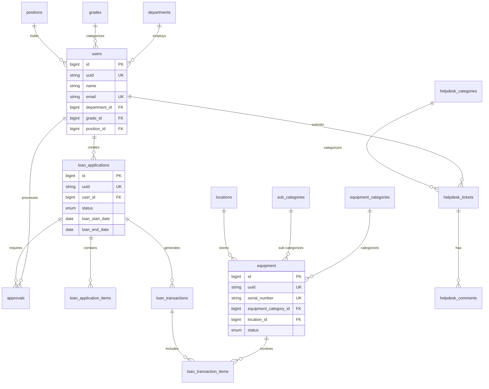

# Dokumentasi Jadual Data Pengguna & Organisasi Teras ICTServe (iServe) v2.10

| Atribut              | Nilai                                                       |
| -------------------- | ----------------------------------------------------------- |
| **Versi Dokumen**    | 3.0.0                                                       |
| **Tarikh Kemaskini** | 6 Oktober 2025                                              |
| **Status**           | Aktif - Versi Pengeluaran                                   |
| **Klasifikasi**      | Dokumentasi Teknikal Dalaman                                |
| **Penulis**          | Pasukan Pembangunan ICTServe                                |
| **Penyemak**         | Arkitek Sistem & Pentadbir Pangkalan Data                   |
| **Sasaran Audiens**  | Pembangun Sistem, Pentadbir Pangkalan Data, Jurutera Sistem |

---

## Kandungan

- [1. Pengenalan](#1-pengenalan)
    - [1.1 Tujuan Dokumen](#11-tujuan-dokumen)
    - [1.2 Skop Dokumen](#12-skop-dokumen)
    - [1.3 Prinsip Reka Bentuk](#13-prinsip-reka-bentuk)
    - [1.4 Konvensyen Penamaan](#14-konvensyen-penamaan)
- [2. Prasyarat dan Keperluan](#2-prasyarat-dan-keperluan)
    - [2.1 Keperluan Sistem](#21-keperluan-sistem)
    - [2.2 Pakej Laravel yang Diperlukan](#22-pakej-laravel-yang-diperlukan)
    - [2.3 Konfigurasi Pangkalan Data](#23-konfigurasi-pangkalan-data)
- [3. Jadual Data Pengguna & Organisasi Teras](#3-jadual-data-pengguna--organisasi-teras)
    - [3.1 Jadual `users`](#31-jadual-users)
    - [3.2 Jadual `departments`](#32-jadual-departments)
    - [3.3 Jadual `positions`](#33-jadual-positions)
    - [3.4 Jadual `grades`](#34-jadual-grades)
    - [3.5 Jadual Pengurusan Peranan (Spatie)](#35-jadual-pengurusan-peranan-spatie)
- [4. Jadual Pengurusan Peralatan ICT](#4-jadual-pengurusan-peralatan-ict)
    - [4.1 Jadual `equipment`](#41-jadual-equipment)
    - [4.2 Jadual `equipment_categories`](#42-jadual-equipment_categories)
    - [4.3 Jadual `sub_categories`](#43-jadual-sub_categories)
    - [4.4 Jadual `locations`](#44-jadual-locations)
- [5. Hubungan Entiti (Entity Relationships)](#5-hubungan-entiti-entity-relationships)
- [6. Strategi Pengindeksan dan Prestasi](#6-strategi-pengindeksan-dan-prestasi)
- [7. Keselamatan dan Enkripsi Data](#7-keselamatan-dan-enkripsi-data)
- [8. Migrasi dan Seeding](#8-migrasi-dan-seeding)
- [9. Best Practices dan Panduan](#9-best-practices-dan-panduan)
- [10. Pemantauan dan Penyelenggaraan](#10-pemantauan-dan-penyelenggaraan)
- [11. Sejarah Revisi](#11-sejarah-revisi)
- [12. Sokongan dan Bantuan](#12-sokongan-dan-bantuan)

---

## 1. Pengenalan

### 1.1 Tujuan Dokumen

Dokumen ini menyediakan gambaran keseluruhan komprehensif mengenai skema
pangkalan data teras dalam Sistem Pengurusan Perkhidmatan ICT MOTAC
(ICTServe) versi 2.10. Ia berfungsi sebagai rujukan utama untuk:

- **Pembangun Sistem**: Memahami struktur data dan hubungan untuk pembangunan aplikasi
- **Pentadbir Pangkalan Data**: Menguruskan, mengoptimumkan, dan menyelenggara pangkalan data
- **Arkitek Sistem**: Mereka bentuk dan memastikan integriti sistem secara keseluruhan
- **Pasukan QA**: Memahami model data untuk pengesahan dan ujian
- **Auditor**: Memverifikasi pematuhan dan integriti data

### 1.2 Skop Dokumen

Dokumentasi ini merangkumi:

| Aspek                        | Penerangan                                                        |
| ---------------------------- | ----------------------------------------------------------------- |
| **Struktur Jadual**          | Skema lengkap untuk semua jadual pangkalan data teras             |
| **Hubungan Data**            | Foreign keys, constraints, dan relationships antara entiti        |
| **Komponen Laravel**         | Models, Controllers, Migrations, Seeders, Policies yang berkaitan |
| **Prinsip Reka Bentuk**      | Implementasi prinsip reka bentuk kerajaan dalam struktur data     |
| **Best Practices**           | Garis panduan untuk pelaksanaan, penyelenggaraan, dan optimisasi  |
| **Keselamatan & Pematuhan**  | Strategi perlindungan data dan audit trail                        |
| **Performance Optimization** | Indexing, caching, dan query optimization strategies              |
| **Disaster Recovery**        | Backup strategies dan recovery procedures                         |

**Skop Luar**: Dokumen ini tidak merangkumi logik aplikasi terperinci,
UI/UX specifications, atau deployment configurations (rujuk dokumentasi
berasingan).

### 1.3 Prinsip Reka Bentuk

Reka bentuk pangkalan data ICTServe mematuhi prinsip-prinsip utama berikut:

| Prinsip                   | Pelaksanaan dalam Pangkalan Data                                           | Manfaat Utama                       |
| ------------------------- | -------------------------------------------------------------------------- | ----------------------------------- |
| **Berpaksikan Rakyat**    | Struktur data direka untuk memenuhi keperluan sebenar pengguna dan operasi | Usability tinggi, user satisfaction |
| **Berpacukan Data**       | Jejak audit lengkap, timestamps, metadata untuk analisis dan laporan       | Data-driven decision making         |
| **Kandungan Terancang**   | Penamaan konsisten, dokumentasi medan, struktur hierarki yang jelas        | Maintainability, clarity            |
| **Teknologi Bersesuaian** | Menggunakan Laravel Eloquent ORM, migrations, best practices               | Modern, scalable architecture       |
| **Struktur Hierarki**     | Model organisasi dan kategori disusun secara hierarki                      | Clear organizational structure      |
| **Komunikasi**            | Sokongan untuk sistem notifikasi dan komen berantai                        | Effective user communication        |
| **Normalisasi**           | 3NF untuk core tables, denormalisasi strategik untuk performance           | Data integrity, reduced redundancy  |
| **Skalabiliti**           | Partition-ready design, optimized indexing                                 | Performance at scale                |
| **Keselamatan**           | Encryption, soft deletes, comprehensive audit trails                       | Data protection, compliance         |
| **Fleksibiliti**          | JSON fields untuk data semi-structured, polymorphic relationships          | Extensibility, future-proofing      |

### 1.4 Konvensyen Penamaan

Sistem menggunakan konvensyen penamaan yang konsisten untuk memudahkan pemahaman:

#### Jadual

- **Format**: `plural_lowercase_with_underscores`
- **Contoh**: `users`, `loan_applications`, `helpdesk_tickets`

#### Lajur (Columns)

- **Primary Key**: `id` (BIGINT UNSIGNED AUTO_INCREMENT)
- **Foreign Key**: `{table_singular}_id` (contoh: `user_id`, `department_id`)
- **Boolean**: `is_{attribute}` atau `has_{attribute}` (contoh: `is_active`, `has_approved`)
- **Timestamps**: `created_at`, `updated_at`, `deleted_at`
- **Audit Fields**: `created_by`, `updated_by`, `deleted_by` (foreign key to users)

#### Indexes

- **Primary**: `PRIMARY`
- **Unique**: `unique_{table}_{column}` atau `{column}` (untuk single-column unique)
- **Foreign Key**: `fk_{table}_{column}`
- **Regular Index**: `idx_{table}_{column}` atau `idx_{table}_{columns}` (composite)
- **Full-text**: `ft_{table}_{columns}`

#### Constraints

- **Foreign Key**: `fk_{source_table}_{target_table}`
- **Check**: `chk_{table}_{condition}`
- **Unique**: `unique_{table}_{columns}`

---

## 2. Prasyarat dan Keperluan

### 2.1 Keperluan Sistem

| Komponen              | Versi Minimum | Versi Disyorkan | Nota                                    |
| --------------------- | ------------- | --------------- | --------------------------------------- |
| **Laravel Framework** | 12.0          | 12.x (latest)   | PHP framework                           |
| **PHP**               | 8.2           | 8.3+            | Dengan ekstensi: PDO, mbstring, openssl |
| **MySQL**             | 8.0           | 8.0.35+         | InnoDB storage engine                   |
| **Redis**             | 7.0           | 7.2+            | Cache dan session storage               |
| **Composer**          | 2.5           | Latest          | Dependency management                   |
| **Node.js**           | 18.x LTS      | 20.x LTS        | Frontend asset compilation              |

#### Ekstensi PHP yang Diperlukan

```bash
# Semak ekstensi PHP
php -m | grep -E 'pdo|mysql|mbstring|openssl|tokenizer|xml|ctype|json|bcmath'

# Ekstensi yang diperlukan:
- PDO
- pdo_mysql
- mbstring
- openssl
- tokenizer
- xml
- ctype
- json
- bcmath
- fileinfo
- curl
```

### 2.2 Pakej Laravel yang Diperlukan

```json
{
    "require": {
        "php": "^8.2",
        "laravel/framework": "^12.0",
        "spatie/laravel-permission": "^6.0",
        "owen-it/laravel-auditing": "^13.0",
        "filament/filament": "^4.0",
        "livewire/livewire": "^3.0"
    },
    "require-dev": {
        "fakerphp/faker": "^1.23",
        "laravel/pint": "^1.13",
        "nunomaduro/collision": "^8.0",
        "phpunit/phpunit": "^10.5"
    }
}
```

#### Pemasangan Pakej

```bash
# Install dependencies
composer install --optimize-autoloader

# Publish configuration files
php artisan vendor:publish --provider="Spatie\Permission\PermissionServiceProvider"
php artisan vendor:publish --provider="OwenIt\Auditing\AuditingServiceProvider"
php artisan vendor:publish --tag=filament-config

# Run migrations
php artisan migrate
```

### 2.3 Konfigurasi Pangkalan Data

#### Konfigurasi Asas (.env)

```env
# Database Configuration
DB_CONNECTION=mysql
DB_HOST=127.0.0.1
DB_PORT=3306
DB_DATABASE=ictserve
DB_USERNAME=ictserve_user
DB_PASSWORD=secure_password_here

# Database Read/Write Splitting (Production)
DB_READ_HOST=read-replica.example.com
DB_WRITE_HOST=master.example.com

# Connection Pooling
DB_POOL_MIN=2
DB_POOL_MAX=10

# Character Set
DB_CHARSET=utf8mb4
DB_COLLATION=utf8mb4_unicode_ci

# Timezone
DB_TIMEZONE=+08:00
```

#### Konfigurasi Laravel (config/database.php)

```php
'mysql' => [
    'driver' => 'mysql',
    'host' => env('DB_HOST', '127.0.0.1'),
    'port' => env('DB_PORT', '3306'),
    'database' => env('DB_DATABASE', 'ictserve'),
    'username' => env('DB_USERNAME', 'forge'),
    'password' => env('DB_PASSWORD', ''),
    'unix_socket' => env('DB_SOCKET', ''),
    'charset' => env('DB_CHARSET', 'utf8mb4'),
    'collation' => env('DB_COLLATION', 'utf8mb4_unicode_ci'),
    'prefix' => '',
    'prefix_indexes' => true,
    'strict' => true,
    'engine' => 'InnoDB',
    'options' => extension_loaded('pdo_mysql') ? array_filter([
        PDO::MYSQL_ATTR_SSL_CA => env('MYSQL_ATTR_SSL_CA'),
        PDO::ATTR_EMULATE_PREPARES => false,
        PDO::ATTR_STRINGIFY_FETCHES => false,
    ]) : [],
],
```

#### Optimisasi MySQL (my.cnf)

```ini
[mysqld]
# InnoDB Configuration
innodb_buffer_pool_size = 2G
innodb_log_file_size = 512M
innodb_flush_log_at_trx_commit = 2
innodb_flush_method = O_DIRECT
innodb_file_per_table = 1

# Query Cache (disabled in MySQL 8.0+)
# query_cache_type = 0

# Connection Settings
max_connections = 200
connect_timeout = 10
wait_timeout = 600
interactive_timeout = 600

# Character Set
character_set_server = utf8mb4
collation_server = utf8mb4_unicode_ci

# Binary Logging
log_bin = mysql-bin
binlog_format = ROW
expire_logs_days = 7

# Performance Schema
performance_schema = ON
```

---

## 3. Jadual Data Pengguna & Organisasi Teras

Jadual-jadual ini mendasari pengurusan pengguna, peranan, dan struktur
organisasi, sejajar dengan prinsip **Berpaksikan Rakyat**, **Komunikasi**,
dan **Struktur Hierarki**.

### 3.1 Jadual `users`

Jadual utama yang menyimpan maklumat semua pengguna sistem ICTServe.

#### Struktur Jadual Users

```sql
CREATE TABLE users (
    -- Primary Key
    id BIGINT UNSIGNED AUTO_INCREMENT PRIMARY KEY,
    uuid CHAR(36) UNIQUE NOT NULL COMMENT 'UUID untuk rujukan luaran',

    -- Maklumat Peribadi
    title VARCHAR(50) COMMENT 'Gelaran (Encik, Puan, Cik, Dato, dll)',
    name VARCHAR(255) NOT NULL COMMENT 'Nama penuh pengguna',
    identification_number VARCHAR(20) UNIQUE COMMENT 'No. KP / No. Pekerja (encrypted)',
    passport_number VARCHAR(50) COMMENT 'No. Pasport untuk warga asing (encrypted)',

    -- Maklumat Akaun
    email VARCHAR(255) UNIQUE NOT NULL COMMENT 'E-mel rasmi',
    email_verified_at TIMESTAMP NULL COMMENT 'Masa pengesahan e-mel',
    password VARCHAR(255) NOT NULL COMMENT 'Password hash (bcrypt)',

    -- Maklumat Organisasi
    position_id BIGINT UNSIGNED COMMENT 'Jawatan pengguna',
    grade_id BIGINT UNSIGNED COMMENT 'Gred organisasi',
    department_id BIGINT UNSIGNED NOT NULL COMMENT 'Jabatan/Unit organisasi',
    level VARCHAR(10) COMMENT 'Tahap organisasi (HQ, State, Unit)',
    mobile_number VARCHAR(20) COMMENT 'No. telefon bimbit (encrypted)',

    -- Status dan Keselamatan
    status ENUM('active', 'inactive', 'suspended') DEFAULT 'active'
        COMMENT 'Status akaun pengguna',
    profile_photo_path VARCHAR(255) COMMENT 'Path ke gambar profil',
    two_factor_secret TEXT COMMENT '2FA secret (encrypted)',
    two_factor_recovery_codes TEXT COMMENT '2FA recovery codes (encrypted)',
    two_factor_confirmed_at TIMESTAMP NULL COMMENT 'Masa pengesahan 2FA',
    remember_token VARCHAR(100) COMMENT 'Remember me token',

    -- Maklumat Tambahan (JSON)
    preferences JSON COMMENT 'User preferences (theme, language, notifications)',
    metadata JSON COMMENT 'Additional user metadata',

    -- Audit Fields
    created_by BIGINT UNSIGNED COMMENT 'User yang mencipta rekod',
    updated_by BIGINT UNSIGNED COMMENT 'User yang mengemas kini rekod',
    deleted_by BIGINT UNSIGNED COMMENT 'User yang memadam rekod',
    created_at TIMESTAMP DEFAULT CURRENT_TIMESTAMP,
    updated_at TIMESTAMP DEFAULT CURRENT_TIMESTAMP ON UPDATE CURRENT_TIMESTAMP,
    deleted_at TIMESTAMP NULL COMMENT 'Soft delete timestamp',

    -- Indexes
    INDEX idx_users_department (department_id),
    INDEX idx_users_grade (grade_id),
    INDEX idx_users_position (position_id),
    INDEX idx_users_status (status),
    INDEX idx_users_email (email),
    INDEX idx_users_created_at (created_at),
    FULLTEXT INDEX ft_users_search (name, email),

    -- Foreign Keys
    CONSTRAINT fk_users_department
        FOREIGN KEY (department_id) REFERENCES departments(id)
        ON DELETE RESTRICT ON UPDATE CASCADE,
    CONSTRAINT fk_users_grade
        FOREIGN KEY (grade_id) REFERENCES grades(id)
        ON DELETE SET NULL ON UPDATE CASCADE,
    CONSTRAINT fk_users_position
        FOREIGN KEY (position_id) REFERENCES positions(id)
        ON DELETE SET NULL ON UPDATE CASCADE,
    CONSTRAINT fk_users_created_by
        FOREIGN KEY (created_by) REFERENCES users(id)
        ON DELETE SET NULL ON UPDATE CASCADE,
    CONSTRAINT fk_users_updated_by
        FOREIGN KEY (updated_by) REFERENCES users(id)
        ON DELETE SET NULL ON UPDATE CASCADE,
    CONSTRAINT fk_users_deleted_by
        FOREIGN KEY (deleted_by) REFERENCES users(id)
        ON DELETE SET NULL ON UPDATE CASCADE

) ENGINE=InnoDB DEFAULT CHARSET=utf8mb4 COLLATE=utf8mb4_unicode_ci
COMMENT='Jadual utama untuk pengguna sistem';
```

#### Komponen Laravel Berkaitan Users

| Komponen       | Lokasi                                         | Tujuan                                       |
| -------------- | ---------------------------------------------- | -------------------------------------------- |
| **Model**      | `app/Models/User.php`                          | Eloquent model dengan hubungan dan accessor  |
| **Controller** | `app/Http/Controllers/UserController.php`      | Operasi CRUD pengguna                        |
| **Resource**   | `app/Http/Resources/UserResource.php`          | API resource transformation                  |
| **Request**    | `app/Http/Requests/UserRequest.php`            | Form validation rules                        |
| **Factory**    | `database/Factories/UserFactory.php`           | Data palsu untuk ujian                       |
| **Seeder**     | `database/Seeders/UserSeeder.php`              | Data awal pengguna                           |
| **Migration**  | `database/migrations/*_create_users_table.php` | Struktur jadual                              |
| **Policy**     | `app/Policies/UserPolicy.php`                  | Kawalan akses dan kebenaran                  |
| **Observer**   | `app/Observers/UserObserver.php`               | Event hooks (created, updated, deleted, dll) |

#### Implementasi Model User

```php
<?php

namespace App\Models;

use Illuminate\Foundation\Auth\User as Authenticatable;
use Illuminate\Notifications\Notifiable;
// use LdapRecord\Laravel\Auth\AuthenticatesWithLdap;
use Spatie\Permission\Traits\HasRoles;
use OwenIt\Auditing\Contracts\Auditable;
use Illuminate\Database\Eloquent\SoftDeletes;
use Illuminate\Database\Eloquent\Factories\HasFactory;

class User extends Authenticatable implements Auditable
{
    use HasFactory,
        Notifiable,
        TwoFactorAuthenticatable,
        HasRoles,
        SoftDeletes,
        \OwenIt\Auditing\Auditable;

    /**
     * The attributes that are mass assignable.
     *
     * @var array<int, string>
     */
    protected $fillable = [
        'uuid',
        'title',
        'name',
        'identification_number',
        'passport_number',
        'email',
        'password',
        'position_id',
        'grade_id',
        'department_id',
        'level',
        'mobile_number',
        'status',
        'profile_photo_path',
        'preferences',
        'metadata',
    ];

    /**
     * The attributes that should be hidden for serialization.
     *
     * @var array<int, string>
     */
    protected $hidden = [
        'password',
        'remember_token',
        'two_factor_recovery_codes',
        'two_factor_secret',
        'identification_number', // Hidden by default, decrypt when needed
    ];

    /**
     * The attributes that should be cast.
     *
     * @var array<string, string>
     */
    protected $casts = [
        'email_verified_at' => 'datetime',
        'two_factor_confirmed_at' => 'datetime',
        'preferences' => 'array',
        'metadata' => 'array',
        'password' => 'hashed',
    ];

    /**
     * Boot function for model.
     */
    protected static function boot()
    {
        parent::boot();

        static::creating(function ($model) {
            if (empty($model->uuid)) {
                $model->uuid = (string) \Illuminate\Support\Str::uuid();
            }
        });
    }

    // ========================================
    // Relationships
    // ========================================

    /**
     * Get the department that the user belongs to.
     */
    public function department()
    {
        return $this->belongsTo(Department::class);
    }

    /**
     * Get the grade of the user.
     */
    public function grade()
    {
        return $this->belongsTo(Grade::class);
    }

    /**
     * Get the position of the user.
     */
    public function position()
    {
        return $this->belongsTo(Position::class);
    }

    /**
     * Get loan applications submitted by the user.
     */
    public function loanApplications()
    {
        return $this->hasMany(LoanApplication::class);
    }

    /**
     * Get helpdesk tickets created by the user.
     */
    public function helpdeskTickets()
    {
        return $this->hasMany(HelpdeskTicket::class);
    }

    /**
     * Get approvals assigned to this user.
     */
    public function assignedApprovals()
    {
        return $this->hasMany(Approval::class, 'officer_id');
    }

    /**
     * Get notifications for this user.
     */
    public function notifications()
    {
        return $this->morphMany(\Illuminate\Notifications\DatabaseNotification::class, 'notifiable')
                    ->orderBy('created_at', 'desc');
    }

    // ========================================
    // Scopes
    // ========================================

    /**
     * Scope query untuk pengguna aktif sahaja.
     */
    public function scopeActive($query)
    {
        return $query->where('status', 'active');
    }

    /**
     * Scope untuk filter by department.
     */
    public function scopeInDepartment($query, $departmentId)
    {
        return $query->where('department_id', $departmentId);
    }

    /**
     * Scope untuk filter by grade level.
     */
    public function scopeWithGradeLevel($query, $level)
    {
        return $query->whereHas('grade', function ($q) use ($level) {
            $q->where('level', '>=', $level);
        });
    }

    // ========================================
    // Accessors & Mutators
    // ========================================

    /**
     * Get the user's full name with title.
     */
    public function getFullNameAttribute(): string
    {
        return $this->title
            ? "{$this->title} {$this->name}"
            : $this->name;
    }

    /**
     * Decrypt identification number when accessed.
     */
    public function getIdentificationNumberAttribute($value): ?string
    {
        if (empty($value)) {
            return null;
        }

        try {
            return decrypt($value);
        } catch (\Exception $e) {
            \Log::warning('Failed to decrypt identification number', [
                'user_id' => $this->id,
                'error' => $e->getMessage()
            ]);
            return '[ENCRYPTED]';
        }
    }

    /**
     * Encrypt identification number before saving.
     */
    public function setIdentificationNumberAttribute($value): void
    {
        if (!empty($value)) {
            $this->attributes['identification_number'] = encrypt($value);
        }
    }

    /**
     * Get user initials (for avatar fallback).
     */
    public function getInitialsAttribute(): string
    {
        $words = explode(' ', $this->name);
        if (count($words) >= 2) {
            return strtoupper(substr($words[0], 0, 1) . substr(end($words), 0, 1));
        }
        return strtoupper(substr($this->name, 0, 2));
    }

    // ========================================
    // Helper Methods
    // ========================================

    /**
     * Check if user has approval authority.
     */
    public function hasApprovalAuthority(): bool
    {
        return $this->grade && $this->grade->is_approver_grade;
    }

    /**
     * Check if user can approve a specific loan application.
     */
    public function canApproveLoan(LoanApplication $loanApplication): bool
    {
        if (!$this->hasApprovalAuthority()) {
            return false;
        }

        $applicantGrade = $loanApplication->user->grade->level ?? 0;
        $approverGrade = $this->grade->level ?? 0;

        return $approverGrade >= $applicantGrade;
    }

    /**
     * Get user's profile photo URL.
     */
    public function getProfilePhotoUrlAttribute(): string
    {
        return $this->profile_photo_path
            ? asset('storage/' . $this->profile_photo_path)
            : "https://ui-avatars.com/api/?name={$this->initials}&background=random";
    }

    /**
     * Check if user has outstanding loans.
     */
    public function hasOutstandingLoans(): bool
    {
        return $this->loanApplications()
                    ->whereIn('status', ['issued', 'overdue'])
                    ->exists();
    }
}
```

#### Validation Rules (UserRequest.php)

```php
<?php

namespace App\Http\Requests;

use Illuminate\Foundation\Http\FormRequest;
use Illuminate\Validation\Rule;

class UserRequest extends FormRequest
{
    public function authorize(): bool
    {
        return $this->user()->can('manage users');
    }

    public function rules(): array
    {
        $userId = $this->route('user')?->id;

        return [
            'title' => ['nullable', 'string', 'max:50'],
            'name' => ['required', 'string', 'max:255'],
            'identification_number' => [
                'nullable',
                'string',
                'regex:/^\d{12}$/',
                Rule::unique('users')->ignore($userId),
            ],
            'email' => [
                'required',
                'email',
                'max:255',
                Rule::unique('users')->ignore($userId),
            ],
            'password' => [
                $this->isMethod('POST') ? 'required' : 'nullable',
                'string',
                'min:8',
                'regex:/^(?=.*[a-z])(?=.*[A-Z])(?=.*\d)(?=.*[@$!%*?&])[A-Za-z\d@$!%*?&]/',
            ],
            'department_id' => ['required', 'exists:departments,id'],
            'grade_id' => ['nullable', 'exists:grades,id'],
            'position_id' => ['nullable', 'exists:positions,id'],
            'mobile_number' => ['nullable', 'string', 'regex:/^(\+?6?01)[0-9]{8,9}$/'],
            'status' => ['required', Rule::in(['active', 'inactive', 'suspended'])],
            'roles' => ['nullable', 'array'],
            'roles.*' => ['exists:roles,name'],
        ];
    }

    public function messages(): array
    {
        return [
            'name.required' => 'Nama pengguna adalah wajib.',
            'email.required' => 'E-mel adalah wajib.',
            'email.email' => 'Format e-mel tidak sah.',
            'email.unique' => 'E-mel ini telah digunakan.',
            'identification_number.regex' => 'No. KP mesti mengandungi 12 digit.',
            'password.regex' => 'Password mesti mengandungi huruf besar, huruf kecil, nombor, dan simbol khas.',
            'department_id.required' => 'Jabatan adalah wajib.',
            'mobile_number.regex' => 'Format nombor telefon tidak sah.',
        ];
    }
}
```

#### Contoh Data (UserFactory.php)

```php
<?php

namespace Database\Factories;

use App\Models\Department;
use App\Models\Grade;
use App\Models\Position;
use Illuminate\Database\Eloquent\Factories\Factory;
use Illuminate\Support\Facades\Hash;
use Illuminate\Support\Str;

class UserFactory extends Factory
{
    protected static ?string $password = null;

    public function definition(): array
    {
        return [
            'uuid' => (string) Str::uuid(),
            'title' => $this->faker->randomElement(['Encik', 'Puan', 'Cik', 'Dato\'']),
            'name' => $this->faker->name(),
            'identification_number' => encrypt($this->faker->numerify('############')),
            'email' => $this->faker->unique()->safeEmail(),
            'email_verified_at' => now(),
            'password' => static::$password ??= Hash::make('password'),
            'department_id' => Department::factory(),
            'grade_id' => Grade::factory(),
            'position_id' => Position::factory(),
            'mobile_number' => encrypt($this->faker->numerify('01#########')),
            'status' => 'active',
            'remember_token' => Str::random(10),
            'created_at' => now(),
            'updated_at' => now(),
        ];
    }

    public function unverified(): static
    {
        return $this->state(fn (array $attributes) => [
            'email_verified_at' => null,
        ]);
    }

    public function inactive(): static
    {
        return $this->state(fn (array $attributes) => [
            'status' => 'inactive',
        ]);
    }
}
```

---

### 3.2 Jadual `departments`

Menyimpan struktur organisasi MOTAC termasuk ibu pejabat dan pejabat negeri.

#### Struktur Jadual Departments

```sql
CREATE TABLE departments (
    -- Primary Key
    id BIGINT UNSIGNED AUTO_INCREMENT PRIMARY KEY,

    -- Maklumat Asas
    name VARCHAR(255) NOT NULL COMMENT 'Nama jabatan/unit',
    code VARCHAR(20) UNIQUE NOT NULL COMMENT 'Kod rujukan jabatan (contoh: BPM, BP)',
    branch_type ENUM('headquarters', 'state_office', 'unit') NOT NULL
        COMMENT 'Jenis cawangan organisasi',
    description TEXT COMMENT 'Penerangan jabatan',

    -- Struktur Hierarki
    parent_department_id BIGINT UNSIGNED NULL COMMENT 'Rujukan jabatan induk (self-referencing)',
    head_user_id BIGINT UNSIGNED NULL COMMENT 'Ketua jabatan',

    -- Maklumat Hubungan
    email VARCHAR(255) COMMENT 'E-mel jabatan',
    phone VARCHAR(20) COMMENT 'No. telefon pejabat',
    address TEXT COMMENT 'Alamat pejabat',

    -- Status
    is_active BOOLEAN DEFAULT TRUE COMMENT 'Status aktif jabatan',
    sort_order INTEGER DEFAULT 0 COMMENT 'Susunan paparan',

    -- Audit Fields
    created_by BIGINT UNSIGNED,
    updated_by BIGINT UNSIGNED,
    deleted_by BIGINT UNSIGNED,
    created_at TIMESTAMP DEFAULT CURRENT_TIMESTAMP,
    updated_at TIMESTAMP DEFAULT CURRENT_TIMESTAMP ON UPDATE CURRENT_TIMESTAMP,
    deleted_at TIMESTAMP NULL,

    -- Indexes
    INDEX idx_departments_code (code),
    INDEX idx_departments_type (branch_type),
    INDEX idx_departments_parent (parent_department_id),
    INDEX idx_departments_active (is_active),
    INDEX idx_departments_sort (sort_order),
    FULLTEXT INDEX ft_departments_search (name, description),

    -- Foreign Keys
    CONSTRAINT fk_departments_parent
        FOREIGN KEY (parent_department_id) REFERENCES departments(id)
        ON DELETE SET NULL ON UPDATE CASCADE,
    CONSTRAINT fk_departments_head
        FOREIGN KEY (head_user_id) REFERENCES users(id)
        ON DELETE SET NULL ON UPDATE CASCADE

) ENGINE=InnoDB DEFAULT CHARSET=utf8mb4 COLLATE=utf8mb4_unicode_ci
COMMENT='Struktur organisasi jabatan dan unit MOTAC';
```

#### Komponen Laravel Berkaitan Departments

| Komponen       | Lokasi                                                | Tujuan                         |
| -------------- | ----------------------------------------------------- | ------------------------------ |
| **Model**      | `app/Models/Department.php`                           | Model dengan hubungan hierarki |
| **Controller** | `app/Http/Controllers/Admin/DepartmentController.php` | Pengurusan jabatan             |
| **Seeder**     | `database/Seeders/DepartmentSeeder.php`               | Data struktur organisasi MOTAC |
| **Resource**   | `app/Filament/Resources/DepartmentResource.php`       | Panel admin Filament           |
| **Policy**     | `app/Policies/DepartmentPolicy.php`                   | Authorization logic            |

#### Implementasi Model Department

```php
<?php

namespace App\Models;

use Illuminate\Database\Eloquent\Model;
use Illuminate\Database\Eloquent\SoftDeletes;
use Illuminate\Database\Eloquent\Factories\HasFactory;
use OwenIt\Auditing\Contracts\Auditable;

class Department extends Model implements Auditable
{
    use HasFactory, SoftDeletes, \OwenIt\Auditing\Auditable;

    protected $fillable = [
        'name',
        'code',
        'branch_type',
        'description',
        'parent_department_id',
        'head_user_id',
        'email',
        'phone',
        'address',
        'is_active',
        'sort_order',
    ];

    protected $casts = [
        'is_active' => 'boolean',
        'sort_order' => 'integer',
    ];

    // ========================================
    // Relationships
    // ========================================

    /**
     * Get the parent department.
     */
    public function parent()
    {
        return $this->belongsTo(Department::class, 'parent_department_id');
    }

    /**
     * Get child departments.
     */
    public function children()
    {
        return $this->hasMany(Department::class, 'parent_department_id')
                    ->orderBy('sort_order');
    }

    /**
     * Get all descendants recursively.
     */
    public function descendants()
    {
        return $this->children()->with('descendants');
    }

    /**
     * Get the department head.
     */
    public function head()
    {
        return $this->belongsTo(User::class, 'head_user_id');
    }

    /**
     * Get users in this department.
     */
    public function users()
    {
        return $this->hasMany(User::class);
    }

    /**
     * Get active users in this department.
     */
    public function activeUsers()
    {
        return $this->hasMany(User::class)->where('status', 'active');
    }

    // ========================================
    // Scopes
    // ========================================

    /**
     * Scope untuk jabatan aktif sahaja.
     */
    public function scopeActive($query)
    {
        return $query->where('is_active', true);
    }

    /**
     * Scope untuk root departments (tiada parent).
     */
    public function scopeRoot($query)
    {
        return $query->whereNull('parent_department_id');
    }

    /**
     * Scope untuk filter by branch type.
     */
    public function scopeOfType($query, string $type)
    {
        return $query->where('branch_type', $type);
    }

    // ========================================
    // Accessors & Helper Methods
    // ========================================

    /**
     * Get the full hierarchical name.
     */
    public function getFullNameAttribute(): string
    {
        $names = [$this->name];
        $parent = $this->parent;

        while ($parent) {
            $names[] = $parent->name;
            $parent = $parent->parent;
        }

        return implode(' > ', array_reverse($names));
    }

    /**
     * Get department hierarchy path.
     */
    public function getHierarchyPath(): array
    {
        $path = [$this];
        $parent = $this->parent;

        while ($parent) {
            $path[] = $parent;
            $parent = $parent->parent;
        }

        return array_reverse($path);
    }

    /**
     * Get total staff count including sub-departments.
     */
    public function getTotalStaffCountAttribute(): int
    {
        $count = $this->users()->count();

        foreach ($this->children as $child) {
            $count += $child->total_staff_count;
        }

        return $count;
    }
}
```

#### Seeder Contoh Department

```php
<?php

namespace Database\Seeders;

use App\Models\Department;
use Illuminate\Database\Seeder;

class DepartmentSeeder extends Seeder
{
    public function run(): void
    {
        // Headquarters
        $headquarters = [
            [
                'name' => 'Bahagian Pengurusan Maklumat',
                'code' => 'BPM',
                'branch_type' => 'headquarters',
                'description' => 'Menguruskan sistem maklumat dan ICT MOTAC',
                'parent_department_id' => null,
                'sort_order' => 1,
            ],
            [
                'name' => 'Bahagian Pentadbiran',
                'code' => 'BP',
                'branch_type' => 'headquarters',
                'description' => 'Menguruskan hal ehwal pentadbiran dan kewangan',
                'parent_department_id' => null,
                'sort_order' => 2,
            ],
            [
                'name' => 'Bahagian Pengurusan Sumber Manusia',
                'code' => 'BPSM',
                'branch_type' => 'headquarters',
                'description' => 'Menguruskan hal ehwal sumber manusia',
                'parent_department_id' => null,
                'sort_order' => 3,
            ],
        ];

        foreach ($headquarters as $dept) {
            $department = Department::create($dept);

            // Create sub-units for BPM
            if ($dept['code'] === 'BPM') {
                Department::create([
                    'name' => 'Unit Pengurusan ICT',
                    'code' => 'BPM-ICT',
                    'branch_type' => 'unit',
                    'description' => 'Menguruskan infrastruktur ICT',
                    'parent_department_id' => $department->id,
                    'sort_order' => 1,
                ]);

                Department::create([
                    'name' => 'Unit Sistem Aplikasi',
                    'code' => 'BPM-APP',
                    'branch_type' => 'unit',
                    'description' => 'Pembangunan dan penyelenggaraan aplikasi',
                    'parent_department_id' => $department->id,
                    'sort_order' => 2,
                ]);
            }
        }

        // State Offices
        $states = [
            ['name' => 'Pejabat MOTAC Johor', 'code' => 'MOTAC-JHR'],
            ['name' => 'Pejabat MOTAC Kedah', 'code' => 'MOTAC-KDH'],
            ['name' => 'Pejabat MOTAC Kelantan', 'code' => 'MOTAC-KTN'],
            ['name' => 'Pejabat MOTAC Melaka', 'code' => 'MOTAC-MLK'],
            ['name' => 'Pejabat MOTAC Negeri Sembilan', 'code' => 'MOTAC-NSN'],
            ['name' => 'Pejabat MOTAC Pahang', 'code' => 'MOTAC-PHG'],
            ['name' => 'Pejabat MOTAC Pulau Pinang', 'code' => 'MOTAC-PNG'],
            ['name' => 'Pejabat MOTAC Perak', 'code' => 'MOTAC-PRK'],
            ['name' => 'Pejabat MOTAC Perlis', 'code' => 'MOTAC-PLS'],
            ['name' => 'Pejabat MOTAC Selangor', 'code' => 'MOTAC-SGR'],
            ['name' => 'Pejabat MOTAC Terengganu', 'code' => 'MOTAC-TRG'],
            ['name' => 'Pejabat MOTAC Sabah', 'code' => 'MOTAC-SBH'],
            ['name' => 'Pejabat MOTAC Sarawak', 'code' => 'MOTAC-SWK'],
        ];

        $sortOrder = 100;
        foreach ($states as $state) {
            Department::create(array_merge($state, [
                'branch_type' => 'state_office',
                'parent_department_id' => null,
                'sort_order' => $sortOrder++,
            ]));
        }
    }
}
```

---

### 3.3 Jadual `positions`

Menyimpan jawatan dan gelaran dalam organisasi MOTAC.

#### Struktur Jadual Positions

```sql
CREATE TABLE positions (
    -- Primary Key
    id BIGINT UNSIGNED AUTO_INCREMENT PRIMARY KEY,

    -- Maklumat Jawatan
    name VARCHAR(255) NOT NULL COMMENT 'Nama jawatan',
    code VARCHAR(20) UNIQUE COMMENT 'Kod jawatan',
    grade_id BIGINT UNSIGNED COMMENT 'Gred berkaitan dengan jawatan',
    description TEXT COMMENT 'Penerangan jawatan',

    -- Hierarki dan Kategori
    category ENUM('executive', 'management', 'professional', 'support', 'technical')
        COMMENT 'Kategori jawatan',
    level INTEGER COMMENT 'Tahap dalam hierarki organisasi (1=highest)',

    -- Status
    is_active BOOLEAN DEFAULT TRUE COMMENT 'Status aktif jawatan',
    sort_order INTEGER DEFAULT 0,

    -- Audit Fields
    created_by BIGINT UNSIGNED,
    updated_by BIGINT UNSIGNED,
    created_at TIMESTAMP DEFAULT CURRENT_TIMESTAMP,
    updated_at TIMESTAMP DEFAULT CURRENT_TIMESTAMP ON UPDATE CURRENT_TIMESTAMP,
    deleted_at TIMESTAMP NULL,

    -- Indexes
    INDEX idx_positions_grade (grade_id),
    INDEX idx_positions_code (code),
    INDEX idx_positions_active (is_active),
    INDEX idx_positions_category (category),
    INDEX idx_positions_level (level),
    FULLTEXT INDEX ft_positions_search (name, description),

    -- Foreign Keys
    CONSTRAINT fk_positions_grade
        FOREIGN KEY (grade_id) REFERENCES grades(id)
        ON DELETE SET NULL ON UPDATE CASCADE

) ENGINE=InnoDB DEFAULT CHARSET=utf8mb4 COLLATE=utf8mb4_unicode_ci
COMMENT='Jawatan dalam organisasi MOTAC';
```

#### Implementasi Model Position

```php
<?php

namespace App\Models;

use Illuminate\Database\Eloquent\Model;
use Illuminate\Database\Eloquent\SoftDeletes;
use Illuminate\Database\Eloquent\Factories\HasFactory;

class Position extends Model
{
    use HasFactory, SoftDeletes;

    protected $fillable = [
        'name',
        'code',
        'grade_id',
        'description',
        'category',
        'level',
        'is_active',
        'sort_order',
    ];

    protected $casts = [
        'is_active' => 'boolean',
        'level' => 'integer',
        'sort_order' => 'integer',
    ];

    // ========================================
    // Relationships
    // ========================================

    public function grade()
    {
        return $this->belongsTo(Grade::class);
    }

    public function users()
    {
        return $this->hasMany(User::class);
    }

    // ========================================
    // Scopes
    // ========================================

    public function scopeActive($query)
    {
        return $query->where('is_active', true);
    }

    public function scopeByCategory($query, string $category)
    {
        return $query->where('category', $category);
    }

    public function scopeExecutive($query)
    {
        return $query->where('category', 'executive');
    }
}
```

---

### 3.4 Jadual `grades`

Menyimpan gred organisasi dengan hierarki kelulusan dan kuasa.

#### Struktur Jadual Grades

```sql
CREATE TABLE grades (
    -- Primary Key
    id BIGINT UNSIGNED AUTO_INCREMENT PRIMARY KEY,

    -- Maklumat Gred
    name VARCHAR(50) NOT NULL UNIQUE COMMENT 'Nama gred (contoh: Gred 54, Gred 44, JUSA B)',
    code VARCHAR(20) UNIQUE COMMENT 'Kod gred',
    level INTEGER NOT NULL COMMENT 'Tahap hierarki (higher number = higher rank)',

    -- Kelulusan
    min_approval_grade_id BIGINT UNSIGNED NULL COMMENT 'Gred minimum yang boleh meluluskan',
    is_approver_grade BOOLEAN DEFAULT FALSE COMMENT 'Adakah gred ini boleh meluluskan permohonan',
    max_approval_amount DECIMAL(12,2) COMMENT 'Jumlah maksimum yang boleh diluluskan (RM)',

    -- Maklumat Gaji
    salary_scheme VARCHAR(50) COMMENT 'Skim gaji (SSM, SSN, JUSA, dll)',
    min_salary DECIMAL(10,2) COMMENT 'Gaji minimum',
    max_salary DECIMAL(10,2) COMMENT 'Gaji maksimum',

    -- Penerangan
    description TEXT COMMENT 'Penerangan gred',

    -- Status
    is_active BOOLEAN DEFAULT TRUE,

    -- Audit Fields
    created_by BIGINT UNSIGNED,
    updated_by BIGINT UNSIGNED,
    created_at TIMESTAMP DEFAULT CURRENT_TIMESTAMP,
    updated_at TIMESTAMP DEFAULT CURRENT_TIMESTAMP ON UPDATE CURRENT_TIMESTAMP,
    deleted_at TIMESTAMP NULL,

    -- Indexes
    INDEX idx_grades_level (level),
    INDEX idx_grades_approver (is_approver_grade),
    INDEX idx_grades_min_approval (min_approval_grade_id),
    INDEX idx_grades_active (is_active),

    -- Foreign Keys
    CONSTRAINT fk_grades_min_approval
        FOREIGN KEY (min_approval_grade_id) REFERENCES grades(id)
        ON DELETE SET NULL ON UPDATE CASCADE

) ENGINE=InnoDB DEFAULT CHARSET=utf8mb4 COLLATE=utf8mb4_unicode_ci
COMMENT='Gred organisasi dan hierarki kelulusan';
```

#### Implementasi Model Grade

```php
<?php

namespace App\Models;

use Illuminate\Database\Eloquent\Model;
use Illuminate\Database\Eloquent\SoftDeletes;
use Illuminate\Database\Eloquent\Factories\HasFactory;

class Grade extends Model
{
    use HasFactory, SoftDeletes;

    protected $fillable = [
        'name',
        'code',
        'level',
        'min_approval_grade_id',
        'is_approver_grade',
        'max_approval_amount',
        'salary_scheme',
        'min_salary',
        'max_salary',
        'description',
        'is_active',
    ];

    protected $casts = [
        'level' => 'integer',
        'is_approver_grade' => 'boolean',
        'max_approval_amount' => 'decimal:2',
        'min_salary' => 'decimal:2',
        'max_salary' => 'decimal:2',
        'is_active' => 'boolean',
    ];

    // ========================================
    // Relationships
    // ========================================

    public function minApprovalGrade()
    {
        return $this->belongsTo(Grade::class, 'min_approval_grade_id');
    }

    public function users()
    {
        return $this->hasMany(User::class);
    }

    public function positions()
    {
        return $this->hasMany(Position::class);
    }

    // ========================================
    // Scopes
    // ========================================

    public function scopeActive($query)
    {
        return $query->where('is_active', true);
    }

    public function scopeApprover($query)
    {
        return $query->where('is_approver_grade', true);
    }

    public function scopeMinLevel($query, int $level)
    {
        return $query->where('level', '>=', $level);
    }

    // ========================================
    // Helper Methods
    // ========================================

    /**
     * Check if this grade can approve for another grade.
     */
    public function canApproveForGrade(Grade $grade): bool
    {
        return $this->is_approver_grade && $this->level >= $grade->level;
    }
}
```

#### Seeder Contoh Grade

```php
<?php

namespace Database\Seeders;

use App\Models\Grade;
use Illuminate\Database\Seeder;

class GradeSeeder extends Seeder
{
    public function run(): void
    {
        $grades = [
            // Executive Grades
            [
                'name' => 'Gred 54',
                'code' => 'G54',
                'level' => 54,
                'is_approver_grade' => false,
                'salary_scheme' => 'SSM',
                'min_salary' => 2000.00,
                'max_salary' => 3500.00,
                'is_active' => true,
            ],
            [
                'name' => 'Gred 52',
                'code' => 'G52',
                'level' => 52,
                'is_approver_grade' => false,
                'salary_scheme' => 'SSM',
                'min_salary' => 3000.00,
                'max_salary' => 4500.00,
                'is_active' => true,
            ],
            [
                'name' => 'Gred 48',
                'code' => 'G48',
                'level' => 48,
                'is_approver_grade' => true,
                'max_approval_amount' => 50000.00,
                'salary_scheme' => 'SSM',
                'min_salary' => 4000.00,
                'max_salary' => 6000.00,
                'is_active' => true,
            ],
            [
                'name' => 'Gred 44',
                'code' => 'G44',
                'level' => 44,
                'is_approver_grade' => true,
                'max_approval_amount' => 100000.00,
                'salary_scheme' => 'SSM',
                'min_salary' => 5000.00,
                'max_salary' => 8000.00,
                'is_active' => true,
            ],
            [
                'name' => 'Gred 41',
                'code' => 'G41',
                'level' => 41,
                'is_approver_grade' => true,
                'max_approval_amount' => 200000.00,
                'salary_scheme' => 'SSM',
                'min_salary' => 7000.00,
                'max_salary' => 12000.00,
                'is_active' => true,
            ],
            // Top Management
            [
                'name' => 'JUSA C',
                'code' => 'JUSA-C',
                'level' => 100,
                'is_approver_grade' => true,
                'max_approval_amount' => 500000.00,
                'salary_scheme' => 'JUSA',
                'min_salary' => 15000.00,
                'max_salary' => 20000.00,
                'is_active' => true,
            ],
            [
                'name' => 'JUSA B',
                'code' => 'JUSA-B',
                'level' => 110,
                'is_approver_grade' => true,
                'max_approval_amount' => 1000000.00,
                'salary_scheme' => 'JUSA',
                'min_salary' => 20000.00,
                'max_salary' => 25000.00,
                'is_active' => true,
            ],
        ];

        foreach ($grades as $grade) {
            Grade::create($grade);
        }

        // Update min_approval_grade_id after all grades are created
        Grade::where('level', 54)->update(['min_approval_grade_id' => Grade::where('code', 'G41')->first()->id]);
        Grade::where('level', 52)->update(['min_approval_grade_id' => Grade::where('code', 'G44')->first()->id]);
        Grade::where('level', 48)->update(['min_approval_grade_id' => Grade::where('code', 'G44')->first()->id]);
        Grade::where('level', 44)->update(['min_approval_grade_id' => Grade::where('code', 'G41')->first()->id]);
    }
}
```

---

### 3.5 Jadual Pengurusan Peranan (Spatie)

ICTServe menggunakan pakej **Spatie Laravel Permission** untuk pengurusan peranan dan kebenaran yang terperinci.

#### Jadual Utama

Spatie Laravel Permission secara automatik mencipta jadual-jadual berikut:

| Jadual                  | Tujuan                             |
| ----------------------- | ---------------------------------- |
| `roles`                 | Menyimpan peranan sistem           |
| `permissions`           | Menyimpan kebenaran granular       |
| `model_has_permissions` | Kebenaran langsung untuk model     |
| `model_has_roles`       | Peranan yang diberikan kepada user |
| `role_has_permissions`  | Kebenaran untuk setiap peranan     |

#### Struktur Jadual `roles`

```sql
CREATE TABLE roles (
    id BIGINT UNSIGNED AUTO_INCREMENT PRIMARY KEY,
    name VARCHAR(255) NOT NULL COMMENT 'Nama peranan (unique per guard)',
    guard_name VARCHAR(255) NOT NULL COMMENT 'Guard name (web, api, dll)',
    description TEXT COMMENT 'Penerangan peranan',
    is_system_role BOOLEAN DEFAULT FALSE COMMENT 'System role tidak boleh dipadam',
    created_at TIMESTAMP NULL,
    updated_at TIMESTAMP NULL,

    UNIQUE KEY unique_name_guard (name, guard_name),
    INDEX idx_roles_guard (guard_name)

) ENGINE=InnoDB DEFAULT CHARSET=utf8mb4 COLLATE=utf8mb4_unicode_ci;
```

#### Struktur Jadual `permissions`

```sql
CREATE TABLE permissions (
    id BIGINT UNSIGNED AUTO_INCREMENT PRIMARY KEY,
    name VARCHAR(255) NOT NULL COMMENT 'Nama permission (unique per guard)',
    guard_name VARCHAR(255) NOT NULL COMMENT 'Guard name',
    description TEXT COMMENT 'Penerangan permission',
    module VARCHAR(50) COMMENT 'Module berkaitan (loan, helpdesk, admin)',
    created_at TIMESTAMP NULL,
    updated_at TIMESTAMP NULL,

    UNIQUE KEY unique_name_guard (name, guard_name),
    INDEX idx_permissions_guard (guard_name),
    INDEX idx_permissions_module (module)

) ENGINE=InnoDB DEFAULT CHARSET=utf8mb4 COLLATE=utf8mb4_unicode_ci
COMMENT='Permissions untuk granular access control';
```

#### Implementasi Spatie Permission

```php
<?php

namespace Database\Seeders;

use Illuminate\Database\Seeder;
use Spatie\Permission\Models\Role;
use Spatie\Permission\Models\Permission;

class RolePermissionSeeder extends Seeder
{
    public function run(): void
    {
        // Reset cached roles and permissions
        app()[\Spatie\Permission\PermissionRegistrar::class]->forgetCachedPermissions();

        // Create permissions for Loan Management Module
        $loanPermissions = [
            'view loan applications',
            'create loan applications',
            'update loan applications',
            'delete loan applications',
            'approve loan applications',
            'reject loan applications',
            'issue equipment',
            'receive equipment',
            'manage all loan applications',
        ];

        foreach ($loanPermissions as $permission) {
            Permission::create([
                'name' => $permission,
                'guard_name' => 'web',
                'module' => 'loan',
                'description' => ucfirst(str_replace('_', ' ', $permission)),
            ]);
        }

        // Create permissions for Helpdesk Module
        $helpdeskPermissions = [
            'view helpdesk tickets',
            'create helpdesk tickets',
            'update helpdesk tickets',
            'delete helpdesk tickets',
            'assign helpdesk tickets',
            'resolve helpdesk tickets',
            'manage all helpdesk tickets',
        ];

        foreach ($helpdeskPermissions as $permission) {
            Permission::create([
                'name' => $permission,
                'guard_name' => 'web',
                'module' => 'helpdesk',
                'description' => ucfirst(str_replace('_', ' ', $permission)),
            ]);
        }

        // Create permissions for Equipment Management
        $equipmentPermissions = [
            'view equipment',
            'create equipment',
            'update equipment',
            'delete equipment',
            'manage equipment inventory',
        ];

        foreach ($equipmentPermissions as $permission) {
            Permission::create([
                'name' => $permission,
                'guard_name' => 'web',
                'module' => 'equipment',
                'description' => ucfirst(str_replace('_', ' ', $permission)),
            ]);
        }

        // Create permissions for Administration
        $adminPermissions = [
            'manage users',
            'manage roles',
            'manage permissions',
            'view audit logs',
            'manage system settings',
            'view reports',
            'export data',
        ];

        foreach ($adminPermissions as $permission) {
            Permission::create([
                'name' => $permission,
                'guard_name' => 'web',
                'module' => 'admin',
                'description' => ucfirst(str_replace('_', ' ', $permission)),
            ]);
        }

        // ========================================
        // Create Roles and Assign Permissions
        // ========================================

        // Super Admin Role
        $superAdmin = Role::create([
            'name' => 'super-admin',
            'guard_name' => 'web',
            'description' => 'Pentadbir sistem dengan akses penuh',
            'is_system_role' => true,
        ]);
        $superAdmin->givePermissionTo(Permission::all());

        // Admin Role
        $admin = Role::create([
            'name' => 'admin',
            'guard_name' => 'web',
            'description' => 'Pentadbir sistem dengan akses terhad',
            'is_system_role' => true,
        ]);
        $admin->givePermissionTo([
            'view loan applications',
            'create loan applications',
            'update loan applications',
            'view helpdesk tickets',
            'create helpdesk tickets',
            'view equipment',
            'view audit logs',
            'view reports',
        ]);

        // BPM Staff Role
        $bpmStaff = Role::create([
            'name' => 'bpm-staff',
            'guard_name' => 'web',
            'description' => 'Staf Bahagian Pengurusan Maklumat',
            'is_system_role' => true,
        ]);
        $bpmStaff->givePermissionTo([
            'manage all loan applications',
            'issue equipment',
            'receive equipment',
            'manage equipment inventory',
            'view equipment',
            'create equipment',
            'update equipment',
            'view helpdesk tickets',
            'assign helpdesk tickets',
            'resolve helpdesk tickets',
        ]);

        // IT Support Role
        $itSupport = Role::create([
            'name' => 'it-support',
            'guard_name' => 'web',
            'description' => 'Pasukan sokongan IT untuk helpdesk',
            'is_system_role' => true,
        ]);
        $itSupport->givePermissionTo([
            'view helpdesk tickets',
            'update helpdesk tickets',
            'resolve helpdesk tickets',
            'view equipment',
        ]);

        // Approver Role
        $approver = Role::create([
            'name' => 'approver',
            'guard_name' => 'web',
            'description' => 'Pegawai yang boleh meluluskan permohonan',
            'is_system_role' => true,
        ]);
        $approver->givePermissionTo([
            'view loan applications',
            'approve loan applications',
            'reject loan applications',
        ]);

        // Standard User Role
        $user = Role::create([
            'name' => 'user',
            'guard_name' => 'web',
            'description' => 'Pengguna standard sistem',
            'is_system_role' => true,
        ]);
        $user->givePermissionTo([
            'view loan applications',
            'create loan applications',
            'update loan applications',
            'view helpdesk tickets',
            'create helpdesk tickets',
            'update helpdesk tickets',
        ]);
    }
}
```

---

## 4. Jadual Pengurusan Peralatan ICT

Jadual untuk menguruskan inventori peralatan ICT, lokasi, dan kategorisasi,
selaras dengan prinsip **Teknologi Bersesuaian**, **Fleksibel**, dan
**Kandungan Terancang**.

### 4.1 Jadual `equipment`

Menyimpan butiran lengkap semua peralatan ICT yang boleh dipinjam.

#### Struktur Jadual Equipment

```sql
CREATE TABLE equipment (
    -- Primary Key
    id BIGINT UNSIGNED AUTO_INCREMENT PRIMARY KEY,
    uuid CHAR(36) UNIQUE NOT NULL COMMENT 'UUID untuk rujukan luaran dan API',

    -- Maklumat Asas
    asset_type VARCHAR(100) NOT NULL COMMENT 'Jenis aset (Laptop, Projector, dll)',
    brand VARCHAR(100) COMMENT 'Jenama peralatan',
    model VARCHAR(100) COMMENT 'Model peralatan',
    serial_number VARCHAR(100) UNIQUE COMMENT 'Nombor siri unik',
    tag_id VARCHAR(50) UNIQUE COMMENT 'Nombor tag aset organisasi',
    item_code VARCHAR(50) COMMENT 'Kod item untuk katalog',

    -- Maklumat Pembelian
    purchase_date DATE COMMENT 'Tarikh pembelian',
    purchase_price DECIMAL(12,2) COMMENT 'Harga pembelian (RM)',
    warranty_expiry_date DATE COMMENT 'Tarikh tamat waranti',
    supplier_name VARCHAR(255) COMMENT 'Nama pembekal',
    acquisition_type ENUM('purchase', 'donation', 'transfer', 'lease') DEFAULT 'purchase'
        COMMENT 'Cara perolehan aset',
    funded_by VARCHAR(100) COMMENT 'Sumber pembiayaan',

    -- Status dan Keadaan
    status ENUM('available', 'on_loan', 'under_maintenance', 'retired', 'damaged', 'lost', 'reserved')
        DEFAULT 'available' COMMENT 'Status semasa peralatan',
    condition_status ENUM('excellent', 'good', 'fair', 'poor', 'damaged')
        DEFAULT 'good' COMMENT 'Keadaan fizikal peralatan',

    -- Lokasi dan Organisasi
    current_location VARCHAR(255) COMMENT 'Lokasi semasa peralatan',
    department_id BIGINT UNSIGNED COMMENT 'Jabatan yang memiliki peralatan',
    location_id BIGINT UNSIGNED COMMENT 'Lokasi penyimpanan',
    equipment_category_id BIGINT UNSIGNED NOT NULL COMMENT 'Kategori peralatan',
    sub_category_id BIGINT UNSIGNED COMMENT 'Sub-kategori peralatan',

    -- Maklumat Tambahan
    description TEXT COMMENT 'Penerangan terperinci peralatan',
    specifications JSON COMMENT 'Spesifikasi teknikal (processor, RAM, storage, dll)',
    notes TEXT COMMENT 'Nota tambahan',
    classification VARCHAR(50) COMMENT 'Klasifikasi keselamatan (jika berkenaan)',

    -- Maklumat Penyelenggaraan
    last_maintenance_date DATE COMMENT 'Tarikh penyelenggaraan terakhir',
    next_maintenance_date DATE COMMENT 'Tarikh penyelenggaraan seterusnya',
    maintenance_schedule VARCHAR(50) COMMENT 'Jadual penyelenggaraan (monthly, quarterly, yearly)',

    -- Integrasi Luaran
    external_id VARCHAR(100) COMMENT 'ID dari sistem pengurusan aset luaran',
    last_sync_at TIMESTAMP NULL COMMENT 'Masa sinkronisasi terakhir',

    -- Audit Fields
    created_by BIGINT UNSIGNED,
    updated_by BIGINT UNSIGNED,
    deleted_by BIGINT UNSIGNED,
    created_at TIMESTAMP DEFAULT CURRENT_TIMESTAMP,
    updated_at TIMESTAMP DEFAULT CURRENT_TIMESTAMP ON UPDATE CURRENT_TIMESTAMP,
    deleted_at TIMESTAMP NULL COMMENT 'Soft delete timestamp',

    -- Indexes
    INDEX idx_equipment_status (status),
    INDEX idx_equipment_category (equipment_category_id),
    INDEX idx_equipment_department (department_id),
    INDEX idx_equipment_location (location_id),
    INDEX idx_equipment_serial (serial_number),
    INDEX idx_equipment_tag (tag_id),
    INDEX idx_equipment_condition (condition_status),
    INDEX idx_equipment_composite (status, equipment_category_id, location_id),
    FULLTEXT INDEX ft_equipment_search (brand, model, description),

    -- Foreign Keys
    CONSTRAINT fk_equipment_department
        FOREIGN KEY (department_id) REFERENCES departments(id)
        ON DELETE SET NULL ON UPDATE CASCADE,
    CONSTRAINT fk_equipment_location
        FOREIGN KEY (location_id) REFERENCES locations(id)
        ON DELETE SET NULL ON UPDATE CASCADE,
    CONSTRAINT fk_equipment_category
        FOREIGN KEY (equipment_category_id) REFERENCES equipment_categories(id)
        ON DELETE RESTRICT ON UPDATE CASCADE,
    CONSTRAINT fk_equipment_sub_category
        FOREIGN KEY (sub_category_id) REFERENCES sub_categories(id)
        ON DELETE SET NULL ON UPDATE CASCADE,
    CONSTRAINT fk_equipment_created_by
        FOREIGN KEY (created_by) REFERENCES users(id)
        ON DELETE SET NULL ON UPDATE CASCADE,
    CONSTRAINT fk_equipment_updated_by
        FOREIGN KEY (updated_by) REFERENCES users(id)
        ON DELETE SET NULL ON UPDATE CASCADE,
    CONSTRAINT fk_equipment_deleted_by
        FOREIGN KEY (deleted_by) REFERENCES users(id)
        ON DELETE SET NULL ON UPDATE CASCADE

) ENGINE=InnoDB DEFAULT CHARSET=utf8mb4 COLLATE=utf8mb4_unicode_ci
COMMENT='Inventori peralatan ICT yang boleh dipinjam';
```

#### Komponen Laravel Berkaitan Equipment

| Komponen       | Lokasi                                             | Tujuan                                 |
| -------------- | -------------------------------------------------- | -------------------------------------- |
| **Model**      | `app/Models/Equipment.php`                         | Model dengan hubungan dan scope        |
| **Controller** | `app/Http/Controllers/EquipmentController.php`     | Operasi CRUD peralatan                 |
| **Resource**   | `app/Filament/Resources/EquipmentResource.php`     | Admin panel untuk pengurusan peralatan |
| **Policy**     | `app/Policies/EquipmentPolicy.php`                 | Authorization logic                    |
| **Observer**   | `app/Observers/EquipmentObserver.php`              | Event handling (status changes)        |
| **Seeder**     | `database/Seeders/EquipmentSeeder.php`             | Data awal peralatan                    |
| **Migration**  | `database/migrations/*_create_equipment_table.php` | Struktur jadual                        |

#### Implementasi Model Equipment

```php
<?php

namespace App\Models;

use Illuminate\Database\Eloquent\Model;
use Illuminate\Database\Eloquent\SoftDeletes;
use Illuminate\Database\Eloquent\Factories\HasFactory;
use OwenIt\Auditing\Contracts\Auditable;

class Equipment extends Model implements Auditable
{
    use HasFactory, SoftDeletes, \OwenIt\Auditing\Auditable;

    protected $table = 'equipment';

    protected $fillable = [
        'uuid',
        'asset_type',
        'brand',
        'model',
        'serial_number',
        'tag_id',
        'item_code',
        'purchase_date',
        'purchase_price',
        'warranty_expiry_date',
        'supplier_name',
        'acquisition_type',
        'funded_by',
        'status',
        'condition_status',
        'current_location',
        'department_id',
        'location_id',
        'equipment_category_id',
        'sub_category_id',
        'description',
        'specifications',
        'notes',
        'classification',
        'last_maintenance_date',
        'next_maintenance_date',
        'maintenance_schedule',
        'external_id',
        'last_sync_at',
    ];

    protected $casts = [
        'purchase_date' => 'date',
        'warranty_expiry_date' => 'date',
        'purchase_price' => 'decimal:2',
        'specifications' => 'array',
        'last_maintenance_date' => 'date',
        'next_maintenance_date' => 'date',
        'last_sync_at' => 'datetime',
    ];

    protected static function boot()
    {
        parent::boot();

        static::creating(function ($model) {
            if (empty($model->uuid)) {
                $model->uuid = (string) \Illuminate\Support\Str::uuid();
            }
        });
    }

    // ========================================
    // Relationships
    // ========================================

    public function category()
    {
        return $this->belongsTo(EquipmentCategory::class, 'equipment_category_id');
    }

    public function subCategory()
    {
        return $this->belongsTo(SubCategory::class);
    }

    public function department()
    {
        return $this->belongsTo(Department::class);
    }

    public function location()
    {
        return $this->belongsTo(Location::class);
    }

    public function loanTransactionItems()
    {
        return $this->hasMany(LoanTransactionItem::class);
    }

    public function currentLoan()
    {
        return $this->hasOne(LoanTransactionItem::class)
                    ->where('status', 'issued')
                    ->latest();
    }

    public function maintenanceRecords()
    {
        return $this->hasMany(EquipmentMaintenance::class);
    }

    // ========================================
    // Scopes
    // ========================================

    public function scopeAvailable($query)
    {
        return $query->where('status', 'available');
    }

    public function scopeOnLoan($query)
    {
        return $query->where('status', 'on_loan');
    }

    public function scopeByCategory($query, $categoryId)
    {
        return $query->where('equipment_category_id', $categoryId);
    }

    public function scopeInGoodCondition($query)
    {
        return $query->whereIn('condition_status', ['excellent', 'good']);
    }

    public function scopeWarrantyActive($query)
    {
        return $query->where('warranty_expiry_date', '>=', now());
    }

    public function scopeNeedsMaintenance($query)
    {
        return $query->where('next_maintenance_date', '<=', now()->addDays(7));
    }

    public function scopeSearch($query, $search)
    {
        return $query->where(function ($q) use ($search) {
            $q->where('brand', 'LIKE', "%{$search}%")
              ->orWhere('model', 'LIKE', "%{$search}%")
              ->orWhere('serial_number', 'LIKE', "%{$search}%")
              ->orWhere('tag_id', 'LIKE', "%{$search}%")
              ->orWhere('description', 'LIKE', "%{$search}%");
        });
    }

    // ========================================
    // Accessors & Mutators
    // ========================================

    public function getFullNameAttribute(): string
    {
        return trim("{$this->brand} {$this->model}");
    }

    public function getIsAvailableAttribute(): bool
    {
        return $this->status === 'available' &&
               in_array($this->condition_status, ['excellent', 'good', 'fair']);
    }

    public function getIsUnderWarrantyAttribute(): bool
    {
        return $this->warranty_expiry_date &&
               $this->warranty_expiry_date->isFuture();
    }

    public function getWarrantyRemainingDaysAttribute(): ?int
    {
        if (!$this->is_under_warranty) {
            return null;
        }

        return now()->diffInDays($this->warranty_expiry_date, false);
    }

    public function getDepreciatedValueAttribute(): ?float
    {
        if (!$this->purchase_price || !$this->purchase_date) {
            return null;
        }

        $yearsOld = now()->diffInYears($this->purchase_date);
        $depreciationRate = 0.20; // 20% per year
        $remainingValue = $this->purchase_price * pow((1 - $depreciationRate), $yearsOld);

        return max(0, $remainingValue);
    }

    // ========================================
    // Helper Methods
    // ========================================

    /**
     * Check if equipment can be loaned
     */
    public function canBeLoan(): bool
    {
        return $this->status === 'available' &&
               in_array($this->condition_status, ['excellent', 'good', 'fair']);
    }

    /**
     * Mark equipment as on loan
     */
    public function markAsOnLoan(): bool
    {
        if (!$this->canBeLoan()) {
            return false;
        }

        return $this->update(['status' => 'on_loan']);
    }

    /**
     * Mark equipment as returned
     */
    public function markAsReturned(string $condition = 'good'): bool
    {
        return $this->update([
            'status' => 'available',
            'condition_status' => $condition,
        ]);
    }

    /**
     * Schedule next maintenance
     */
    public function scheduleNextMaintenance(): void
    {
        $interval = match($this->maintenance_schedule) {
            'monthly' => 1,
            'quarterly' => 3,
            'semi-annually' => 6,
            'yearly' => 12,
            default => 6,
        };

        $this->update([
            'next_maintenance_date' => now()->addMonths($interval),
        ]);
    }

    /**
     * Get equipment utilization rate
     */
    public function getUtilizationRate(int $days = 30): float
    {
        $totalDays = $days;
        $loanedDays = $this->loanTransactionItems()
                           ->where('created_at', '>=', now()->subDays($days))
                           ->sum(\DB::raw('DATEDIFF(IFNULL(returned_at, NOW()), created_at)'));

        return $totalDays > 0 ? round(($loanedDays / $totalDays) * 100, 2) : 0;
    }
}
```

#### Factory untuk Testing

```php
<?php

namespace Database\Factories;

use App\Models\Equipment;
use App\Models\EquipmentCategory;
use App\Models\Department;
use App\Models\Location;
use Illuminate\Database\Eloquent\Factories\Factory;

class EquipmentFactory extends Factory
{
    protected $model = Equipment::class;

    public function definition(): array
    {
        $brands = ['Dell', 'HP', 'Lenovo', 'Acer', 'Asus', 'Apple', 'Microsoft', 'Canon', 'Epson'];
        $assetTypes = ['Laptop', 'Desktop', 'Projector', 'Printer', 'Scanner', 'Tablet', 'Camera'];

        return [
            'uuid' => $this->faker->uuid(),
            'asset_type' => $this->faker->randomElement($assetTypes),
            'brand' => $this->faker->randomElement($brands),
            'model' => strtoupper($this->faker->bothify('??-####')),
            'serial_number' => strtoupper($this->faker->bothify('SN########')),
            'tag_id' => 'MOTAC-' . $this->faker->unique()->numerify('####'),
            'item_code' => 'ITEM-' . $this->faker->numerify('####'),
            'purchase_date' => $this->faker->dateTimeBetween('-5 years', '-1 year'),
            'purchase_price' => $this->faker->randomFloat(2, 1000, 10000),
            'warranty_expiry_date' => $this->faker->dateTimeBetween('now', '+2 years'),
            'supplier_name' => $this->faker->company(),
            'acquisition_type' => $this->faker->randomElement(['purchase', 'donation', 'transfer']),
            'funded_by' => 'Budget MOTAC',
            'status' => $this->faker->randomElement(['available', 'on_loan', 'under_maintenance']),
            'condition_status' => $this->faker->randomElement(['excellent', 'good', 'fair']),
            'current_location' => $this->faker->randomElement(['Store Room A', 'Office 101', 'IT Department']),
            'department_id' => Department::factory(),
            'location_id' => Location::factory(),
            'equipment_category_id' => EquipmentCategory::factory(),
            'description' => $this->faker->sentence(10),
            'specifications' => [
                'processor' => 'Intel Core i5',
                'ram' => '8GB DDR4',
                'storage' => '256GB SSD',
                'screen_size' => '14 inch',
            ],
            'notes' => $this->faker->optional()->sentence(),
            'maintenance_schedule' => $this->faker->randomElement(['monthly', 'quarterly', 'yearly']),
            'created_at' => now(),
            'updated_at' => now(),
        ];
    }

    public function available(): static
    {
        return $this->state(fn (array $attributes) => [
            'status' => 'available',
            'condition_status' => 'good',
        ]);
    }

    public function onLoan(): static
    {
        return $this->state(fn (array $attributes) => [
            'status' => 'on_loan',
        ]);
    }

    public function underMaintenance(): static
    {
        return $this->state(fn (array $attributes) => [
            'status' => 'under_maintenance',
        ]);
    }
}
```

---

### 4.2 Jadual `equipment_categories`

Kategori utama untuk peralatan ICT.

#### Struktur Jadual Equipment Categories

```sql
CREATE TABLE equipment_categories (
    -- Primary Key
    id BIGINT UNSIGNED AUTO_INCREMENT PRIMARY KEY,

    -- Maklumat Kategori
    name VARCHAR(100) NOT NULL UNIQUE COMMENT 'Nama kategori',
    code VARCHAR(20) UNIQUE COMMENT 'Kod kategori untuk rujukan',
    description TEXT COMMENT 'Penerangan kategori',
    icon VARCHAR(50) COMMENT 'Ikon untuk UI (heroicons, fontawesome)',
    color VARCHAR(7) COMMENT 'Warna hex untuk visual grouping',

    -- Status dan Susunan
    is_active BOOLEAN DEFAULT TRUE COMMENT 'Status aktif kategori',
    sort_order INTEGER DEFAULT 0 COMMENT 'Susunan paparan dalam kategori',

    -- Konfigurasi Khusus
    requires_training BOOLEAN DEFAULT FALSE COMMENT 'Perlukan latihan untuk guna peralatan',
    max_loan_duration_days INTEGER DEFAULT 30 COMMENT 'Tempoh maksimum pinjaman (hari)',
    allow_bulk_loan BOOLEAN DEFAULT TRUE COMMENT 'Boleh pinjam berbilang unit sekaligus',

    -- Audit Fields
    created_by BIGINT UNSIGNED,
    updated_by BIGINT UNSIGNED,
    created_at TIMESTAMP DEFAULT CURRENT_TIMESTAMP,
    updated_at TIMESTAMP DEFAULT CURRENT_TIMESTAMP ON UPDATE CURRENT_TIMESTAMP,
    deleted_at TIMESTAMP NULL,

    -- Indexes
    INDEX idx_categories_active (is_active),
    INDEX idx_categories_sort (sort_order),
    INDEX idx_categories_code (code),

    -- Foreign Keys
    CONSTRAINT fk_equipment_categories_created_by
        FOREIGN KEY (created_by) REFERENCES users(id)
        ON DELETE SET NULL ON UPDATE CASCADE,
    CONSTRAINT fk_equipment_categories_updated_by
        FOREIGN KEY (updated_by) REFERENCES users(id)
        ON DELETE SET NULL ON UPDATE CASCADE

) ENGINE=InnoDB DEFAULT CHARSET=utf8mb4 COLLATE=utf8mb4_unicode_ci
COMMENT='Kategori utama untuk perkelasan peralatan ICT';
```

#### Implementasi Model EquipmentCategory

```php
<?php

namespace App\Models;

use Illuminate\Database\Eloquent\Model;
use Illuminate\Database\Eloquent\SoftDeletes;
use Illuminate\Database\Eloquent\Factories\HasFactory;

class EquipmentCategory extends Model
{
    use HasFactory, SoftDeletes;

    protected $fillable = [
        'name',
        'code',
        'description',
        'icon',
        'color',
        'is_active',
        'sort_order',
        'requires_training',
        'max_loan_duration_days',
        'allow_bulk_loan',
    ];

    protected $casts = [
        'is_active' => 'boolean',
        'requires_training' => 'boolean',
        'allow_bulk_loan' => 'boolean',
        'sort_order' => 'integer',
        'max_loan_duration_days' => 'integer',
    ];

    // ========================================
    // Relationships
    // ========================================

    public function equipment()
    {
        return $this->hasMany(Equipment::class);
    }

    public function subCategories()
    {
        return $this->hasMany(SubCategory::class)->orderBy('sort_order');
    }

    public function activeEquipment()
    {
        return $this->hasMany(Equipment::class)
                    ->where('status', 'available');
    }

    // ========================================
    // Scopes
    // ========================================

    public function scopeActive($query)
    {
        return $query->where('is_active', true);
    }

    public function scopeOrdered($query)
    {
        return $query->orderBy('sort_order')->orderBy('name');
    }

    // ========================================
    // Accessors
    // ========================================

    public function getTotalEquipmentAttribute(): int
    {
        return $this->equipment()->count();
    }

    public function getAvailableEquipmentCountAttribute(): int
    {
        return $this->activeEquipment()->count();
    }

    public function getUtilizationRateAttribute(): float
    {
        $total = $this->equipment()->count();
        if ($total === 0) return 0;

        $onLoan = $this->equipment()->where('status', 'on_loan')->count();
        return round(($onLoan / $total) * 100, 2);
    }
}
```

#### Seeder Contoh EquipmentCategory

```php
<?php

namespace Database\Seeders;

use App\Models\EquipmentCategory;
use Illuminate\Database\Seeder;

class EquipmentCategorySeeder extends Seeder
{
    public function run(): void
    {
        $categories = [
            [
                'name' => 'Komputer Riba (Laptop)',
                'code' => 'LAPTOP',
                'description' => 'Komputer mudah alih untuk kerja harian',
                'icon' => 'computer',
                'color' => '#3b82f6',
                'sort_order' => 1,
                'requires_training' => false,
                'max_loan_duration_days' => 30,
                'allow_bulk_loan' => true,
            ],
            [
                'name' => 'Projektor',
                'code' => 'PROJECTOR',
                'description' => 'Projektor untuk persembahan dan mesyuarat',
                'icon' => 'presentation-chart-bar',
                'color' => '#10b981',
                'sort_order' => 2,
                'requires_training' => true,
                'max_loan_duration_days' => 7,
                'allow_bulk_loan' => false,
            ],
            [
                'name' => 'Kamera Digital',
                'code' => 'CAMERA',
                'description' => 'Kamera untuk dokumentasi acara dan liputan',
                'icon' => 'camera',
                'color' => '#ef4444',
                'sort_order' => 3,
                'requires_training' => true,
                'max_loan_duration_days' => 14,
                'allow_bulk_loan' => false,
            ],
            [
                'name' => 'Tablet',
                'code' => 'TABLET',
                'description' => 'Peranti tablet untuk kerja mudah alih',
                'icon' => 'device-tablet',
                'color' => '#f59e0b',
                'sort_order' => 4,
                'requires_training' => false,
                'max_loan_duration_days' => 30,
                'allow_bulk_loan' => true,
            ],
            [
                'name' => 'Pencetak (Printer)',
                'code' => 'PRINTER',
                'description' => 'Pencetak mudah alih untuk acara',
                'icon' => 'printer',
                'color' => '#8b5cf6',
                'sort_order' => 5,
                'requires_training' => false,
                'max_loan_duration_days' => 7,
                'allow_bulk_loan' => false,
            ],
            [
                'name' => 'Peralatan Audio',
                'code' => 'AUDIO',
                'description' => 'Mikrofon, speaker, dan peralatan audio',
                'icon' => 'microphone',
                'color' => '#ec4899',
                'sort_order' => 6,
                'requires_training' => true,
                'max_loan_duration_days' => 7,
                'allow_bulk_loan' => true,
            ],
        ];

        foreach ($categories as $category) {
            EquipmentCategory::create($category);
        }
    }
}
```

---

### 4.3 Jadual `sub_categories`

Sub-kategori untuk pengkelasan peralatan yang lebih terperinci.

#### Struktur Jadual Sub Categories

```sql
CREATE TABLE sub_categories (
    -- Primary Key
    id BIGINT UNSIGNED AUTO_INCREMENT PRIMARY KEY,

    -- Maklumat Sub-kategori
    name VARCHAR(100) NOT NULL COMMENT 'Nama sub-kategori',
    equipment_category_id BIGINT UNSIGNED NOT NULL COMMENT 'Kategori induk',
    code VARCHAR(20) COMMENT 'Kod sub-kategori',
    description TEXT COMMENT 'Penerangan sub-kategori',

    -- Status dan Susunan
    is_active BOOLEAN DEFAULT TRUE COMMENT 'Status aktif',
    sort_order INTEGER DEFAULT 0 COMMENT 'Susunan paparan dalam kategori',

    -- Audit Fields
    created_by BIGINT UNSIGNED,
    updated_by BIGINT UNSIGNED,
    created_at TIMESTAMP DEFAULT CURRENT_TIMESTAMP,
    updated_at TIMESTAMP DEFAULT CURRENT_TIMESTAMP ON UPDATE CURRENT_TIMESTAMP,
    deleted_at TIMESTAMP NULL,

    -- Indexes
    INDEX idx_subcategories_category (equipment_category_id),
    INDEX idx_subcategories_active (is_active),
    INDEX idx_subcategories_sort (sort_order),
    UNIQUE KEY unique_category_name (equipment_category_id, name),

    -- Foreign Keys
    CONSTRAINT fk_sub_categories_category
        FOREIGN KEY (equipment_category_id) REFERENCES equipment_categories(id)
        ON DELETE CASCADE ON UPDATE CASCADE,
    CONSTRAINT fk_sub_categories_created_by
        FOREIGN KEY (created_by) REFERENCES users(id)
        ON DELETE SET NULL ON UPDATE CASCADE

) ENGINE=InnoDB DEFAULT CHARSET=utf8mb4 COLLATE=utf8mb4_unicode_ci
COMMENT='Sub-kategori untuk pengkelasan peralatan terperinci';
```

---

### 4.4 Jadual `locations`

Lokasi fizikal untuk penyimpanan dan penjejakan peralatan.

#### Struktur Jadual Locations

```sql
CREATE TABLE locations (
    -- Primary Key
    id BIGINT UNSIGNED AUTO_INCREMENT PRIMARY KEY,

    -- Maklumat Lokasi
    name VARCHAR(255) NOT NULL COMMENT 'Nama lokasi',
    code VARCHAR(20) UNIQUE COMMENT 'Kod lokasi untuk rujukan',
    type ENUM('headquarters', 'state_office', 'storage', 'warehouse', 'other') DEFAULT 'other'
        COMMENT 'Jenis lokasi',

    -- Alamat
    address TEXT COMMENT 'Alamat penuh',
    city VARCHAR(100) COMMENT 'Bandar',
    state VARCHAR(100) COMMENT 'Negeri',
    postal_code VARCHAR(10) COMMENT 'Poskod',
    country VARCHAR(100) DEFAULT 'Malaysia' COMMENT 'Negara',

    -- Maklumat Bangunan
    building VARCHAR(100) COMMENT 'Nama bangunan',
    floor VARCHAR(10) COMMENT 'Tingkat',
    room VARCHAR(50) COMMENT 'Bilik/ruang',

    -- Maklumat Hubungan
    contact_person VARCHAR(255) COMMENT 'Nama pegawai yang bertanggungjawab',
    contact_phone VARCHAR(20) COMMENT 'Nombor telefon',
    contact_email VARCHAR(255) COMMENT 'E-mel',

    -- Kapasiti dan Kawalan
    storage_capacity INTEGER COMMENT 'Kapasiti penyimpanan (jumlah item)',
    requires_access_card BOOLEAN DEFAULT FALSE COMMENT 'Memerlukan kad akses',
    security_level ENUM('public', 'restricted', 'confidential') DEFAULT 'public'
        COMMENT 'Tahap keselamatan lokasi',

    -- Koordinat GPS
    latitude DECIMAL(10, 8) COMMENT 'Latitud untuk mapping',
    longitude DECIMAL(11, 8) COMMENT 'Longitud untuk mapping',

    -- Status
    is_active BOOLEAN DEFAULT TRUE COMMENT 'Status aktif lokasi',

    -- Audit Fields
    created_by BIGINT UNSIGNED,
    updated_by BIGINT UNSIGNED,
    created_at TIMESTAMP DEFAULT CURRENT_TIMESTAMP,
    updated_at TIMESTAMP DEFAULT CURRENT_TIMESTAMP ON UPDATE CURRENT_TIMESTAMP,
    deleted_at TIMESTAMP NULL,

    -- Indexes
    INDEX idx_locations_code (code),
    INDEX idx_locations_state (state),
    INDEX idx_locations_type (type),
    INDEX idx_locations_active (is_active),
    INDEX idx_locations_coords (latitude, longitude),
    FULLTEXT INDEX ft_locations_search (name, address, building),

    -- Foreign Keys
    CONSTRAINT fk_locations_created_by
        FOREIGN KEY (created_by) REFERENCES users(id)
        ON DELETE SET NULL ON UPDATE CASCADE

) ENGINE=InnoDB DEFAULT CHARSET=utf8mb4 COLLATE=utf8mb4_unicode_ci
COMMENT='Lokasi fizikal untuk penyimpanan peralatan';
```

#### Implementasi Model Location

```php
<?php

namespace App\Models;

use Illuminate\Database\Eloquent\Model;
use Illuminate\Database\Eloquent\SoftDeletes;
use Illuminate\Database\Eloquent\Factories\HasFactory;

class Location extends Model
{
    use HasFactory, SoftDeletes;

    protected $fillable = [
        'name',
        'code',
        'type',
        'address',
        'city',
        'state',
        'postal_code',
        'country',
        'building',
        'floor',
        'room',
        'contact_person',
        'contact_phone',
        'contact_email',
        'storage_capacity',
        'requires_access_card',
        'security_level',
        'latitude',
        'longitude',
        'is_active',
    ];

    protected $casts = [
        'storage_capacity' => 'integer',
        'requires_access_card' => 'boolean',
        'is_active' => 'boolean',
        'latitude' => 'decimal:8',
        'longitude' => 'decimal:8',
    ];

    // ========================================
    // Relationships
    // ========================================

    public function equipment()
    {
        return $this->hasMany(Equipment::class);
    }

    // ========================================
    // Scopes
    // ========================================

    public function scopeActive($query)
    {
        return $query->where('is_active', true);
    }

    public function scopeByState($query, string $state)
    {
        return $query->where('state', $state);
    }

    public function scopeHeadquarters($query)
    {
        return $query->where('type', 'headquarters');
    }

    public function scopeStateOffices($query)
    {
        return $query->where('type', 'state_office');
    }

    // ========================================
    // Accessors
    // ========================================

    public function getFullAddressAttribute(): string
    {
        $parts = array_filter([
            $this->address,
            $this->postal_code . ' ' . $this->city,
            $this->state,
            $this->country,
        ]);

        return implode(', ', $parts);
    }

    public function getLocationIdentifierAttribute(): string
    {
        $parts = array_filter([
            $this->building,
            $this->floor ? "Tingkat {$this->floor}" : null,
            $this->room ? "Bilik {$this->room}" : null,
        ]);

        return implode(', ', $parts) ?: $this->name;
    }

    public function getCurrentOccupancyAttribute(): int
    {
        return $this->equipment()->count();
    }

    public function getOccupancyRateAttribute(): ?float
    {
        if (!$this->storage_capacity) {
            return null;
        }

        return round(($this->current_occupancy / $this->storage_capacity) * 100, 2);
    }

    // ========================================
    // Helper Methods
    // ========================================

    /**
     * Check if location has available capacity
     */
    public function hasCapacity(int $requiredSpace = 1): bool
    {
        if (!$this->storage_capacity) {
            return true; // Unlimited capacity
        }

        return ($this->current_occupancy + $requiredSpace) <= $this->storage_capacity;
    }

    /**
     * Get distance to another location in kilometers
     */
    public function distanceTo(Location $other): ?float
    {
        if (!$this->latitude || !$this->longitude || !$other->latitude || !$other->longitude) {
            return null;
        }

        $earthRadius = 6371; // km

        $latFrom = deg2rad($this->latitude);
        $lonFrom = deg2rad($this->longitude);
        $latTo = deg2rad($other->latitude);
        $lonTo = deg2rad($other->longitude);

        $latDelta = $latTo - $latFrom;
        $lonDelta = $lonTo - $lonFrom;

        $angle = 2 * asin(sqrt(pow(sin($latDelta / 2), 2) +
            cos($latFrom) * cos($latTo) * pow(sin($lonDelta / 2), 2)));

        return round($angle * $earthRadius, 2);
    }
}
```

---

## 5. Hubungan Entiti (Entity Relationships)

### 5.1 Diagram ERD Lengkap



### 5.2 Ringkasan Jadual dan Hubungan

| Jadual Utama          | Jenis Hubungan | Jadual Berkaitan       | Foreign Key                  | Cascade Behavior |
| --------------------- | -------------- | ---------------------- | ---------------------------- | ---------------- |
| **users**             | Many-to-One    | departments            | department_id                | RESTRICT/CASCADE |
| **users**             | Many-to-One    | grades                 | grade_id                     | SET NULL/CASCADE |
| **users**             | Many-to-One    | positions              | position_id                  | SET NULL/CASCADE |
| **loan_applications** | Many-to-One    | users                  | user_id                      | RESTRICT/CASCADE |
| **loan_applications** | One-to-Many    | loan_application_items | loan_application_id          | CASCADE/CASCADE  |
| **equipment**         | Many-to-One    | equipment_categories   | equipment_category_id        | RESTRICT/CASCADE |
| **equipment**         | Many-to-One    | locations              | location_id                  | SET NULL/CASCADE |
| **helpdesk_tickets**  | Many-to-One    | users                  | user_id, assigned_to_user_id | RESTRICT/CASCADE |
| **helpdesk_tickets**  | Many-to-One    | helpdesk_categories    | category_id                  | RESTRICT/CASCADE |
| **loan_transactions** | Many-to-One    | loan_applications      | loan_application_id          | CASCADE/CASCADE  |
| **loan_transactions** | One-to-Many    | loan_transaction_items | loan_transaction_id          | CASCADE/CASCADE  |

---

## 6. Strategi Pengindeksan dan Prestasi

### 6.1 Indeks Utama

| Jadual                | Jenis Indeks | Lajur                       | Tujuan                       | Anggaran Impak |
| --------------------- | ------------ | --------------------------- | ---------------------------- | -------------- |
| **users**             | Composite    | (department_id, status)     | Query pengguna aktif by dept | High           |
| **users**             | FULLTEXT     | (name, email)               | Carian pengguna              | Medium         |
| **loan_applications** | Composite    | (status, created_at)        | Dashboard permohonan         | High           |
| **equipment**         | Composite    | (status, category_id)       | Carian peralatan tersedia    | High           |
| **equipment**         | FULLTEXT     | (brand, model, description) | Carian peralatan             | Medium         |
| **helpdesk_tickets**  | Composite    | (assigned_to, status)       | Dashboard agen               | High           |
| **audit_logs**        | Composite    | (user_id, created_at)       | Jejak audit                  | Medium         |
| **departments**       | Single       | (parent_department_id)      | Hierarki organisasi          | Low            |

### 6.2 Optimisasi Query

```sql
-- Example: Optimized query untuk dashboard permohonan pinjaman
SELECT
    la.id,
    la.application_number,
    la.status,
    la.created_at,
    u.name as applicant_name,
    d.name as department_name,
    COUNT(lai.id) as items_count
FROM loan_applications la
INNER JOIN users u ON la.user_id = u.id
INNER JOIN departments d ON u.department_id = d.id
LEFT JOIN loan_application_items lai ON la.id = lai.loan_application_id
WHERE la.status IN ('submitted', 'under_review')
    AND la.deleted_at IS NULL
GROUP BY la.id, la.application_number, la.status, la.created_at, u.name, d.name
ORDER BY la.created_at DESC
LIMIT 50;
```

---

## 7. Keselamatan dan Enkripsi Data

### 7.1 Data Sensitif yang Dienkrip

| Lajur                     | Jadual | Jenis Enkripsi  | Reason                    |
| ------------------------- | ------ | --------------- | ------------------------- |
| **identification_number** | users  | AES-256 (field) | Data peribadi (IC number) |
| **passport_number**       | users  | AES-256 (field) | Data peribadi (Passport)  |
| **mobile_number**         | users  | AES-256 (field) | Data hubungan peribadi    |
| **two_factor_secret**     | users  | AES-256 (field) | Keselamatan autentikasi   |
| **two_factor_recovery**   | users  | AES-256 (field) | Kod pemulihan sensitif    |

### 7.2 Implementasi Enkripsi

```php
<?php

namespace App\Models\Traits;

use Illuminate\Support\Facades\Crypt;

trait EncryptsAttributes
{
    /**
     * Get encrypted attribute
     */
    public function getAttribute($key)
    {
        $value = parent::getAttribute($key);

        if (in_array($key, $this->encryptable ?? [])) {
            try {
                return $value ? Crypt::decryptString($value) : null;
            } catch (\Exception $e) {
                \Log::error("Decryption failed for {$key}", [
                    'model' => static::class,
                    'key' => $key,
                    'error' => $e->getMessage()
                ]);
                return '[ENCRYPTED]';
            }
        }

        return $value;
    }

    /**
     * Set encrypted attribute
     */
    public function setAttribute($key, $value)
    {
        if (in_array($key, $this->encryptable ?? []) && !empty($value)) {
            $value = Crypt::encryptString($value);
        }

        return parent::setAttribute($key, $value);
    }
}

// Usage in User model
class User extends Authenticatable
{
    use EncryptsAttributes;

    protected $encryptable = [
        'identification_number',
        'passport_number',
        'mobile_number',
        'two_factor_secret',
        'two_factor_recovery_codes',
    ];
}
```

---

## 8. Migrasi dan Seeding

### 8.1 Migration Best Practices

```php
<?php

use Illuminate\Database\Migrations\Migration;
use Illuminate\Database\Schema\Blueprint;
use Illuminate\Support\Facades\Schema;

return new class extends Migration
{
    /**
     * Run the migrations.
     */
    public function up(): void
    {
        Schema::create('equipment', function (Blueprint $table) {
            // Primary key
            $table->id();
            $table->uuid('uuid')->unique();

            // Basic information with proper indexes
            $table->string('asset_type', 100)->index();
            $table->string('brand', 100)->nullable();
            $table->string('model', 100)->nullable();
            $table->string('serial_number', 100)->unique()->nullable();
            $table->string('tag_id', 50)->unique()->nullable();

            // Status fields with indexes
            $table->enum('status', [
                'available',
                'on_loan',
                'under_maintenance',
                'retired',
                'damaged',
                'lost',
                'reserved'
            ])->default('available')->index();

            $table->enum('condition_status', [
                'excellent',
                'good',
                'fair',
                'poor',
                'damaged'
            ])->default('good')->index();

            // Foreign keys with proper constraints
            $table->foreignId('equipment_category_id')
                  ->constrained('equipment_categories')
                  ->restrictOnDelete()
                  ->cascadeOnUpdate();

            $table->foreignId('location_id')
                  ->nullable()
                  ->constrained('locations')
                  ->nullOnDelete()
                  ->cascadeOnUpdate();

            // Timestamps and soft deletes
            $table->timestamps();
            $table->softDeletes();

            // Audit fields
            $table->foreignId('created_by')->nullable()->constrained('users')->nullOnDelete();
            $table->foreignId('updated_by')->nullable()->constrained('users')->nullOnDelete();
            $table->foreignId('deleted_by')->nullable()->constrained('users')->nullOnDelete();

            // Composite indexes for common queries
            $table->index(['status', 'equipment_category_id', 'location_id'], 'idx_equipment_composite');

            // Full-text search
            $table->fullText(['brand', 'model', 'description'], 'ft_equipment_search');
        });
    }

    /**
     * Reverse the migrations.
     */
    public function down(): void
    {
        Schema::dropIfExists('equipment');
    }
};
```

### 8.2 Seeder Strategy

```php
<?php

namespace Database\Seeders;

use Illuminate\Database\Seeder;

class DatabaseSeeder extends Seeder
{
    /**
     * Seed the application's database.
     */
    public function run(): void
    {
        // Order matters - respect foreign key constraints
        $this->call([
            // 1. Core organizational data
            DepartmentSeeder::class,
            GradeSeeder::class,
            PositionSeeder::class,

            // 2. Users and permissions
            RolePermissionSeeder::class,
            UserSeeder::class,

            // 3. Equipment related
            EquipmentCategorySeeder::class,
            SubCategorySeeder::class,
            LocationSeeder::class,
            EquipmentSeeder::class,

            // 4. Helpdesk categories
            HelpdeskCategorySeeder::class,

            // 5. Demo/test data (only in non-production)
            ...(app()->environment('production') ? [] : [
                DemoLoanApplicationSeeder::class,
                DemoHelpdeskTicketSeeder::class,
            ]),
        ]);
    }
}
```

---

## 9. Best Practices dan Panduan

### 9.1 Panduan Penamaan

```php
// Good naming conventions
class LoanApplication extends Model  // PascalCase for class names
{
    protected $table = 'loan_applications';  // snake_case for table names

    public function loanApplicationItems()  // camelCase for methods
    {
        return $this->hasMany(LoanApplicationItem::class);
    }

    public function getFormattedStatusAttribute()  // camelCase with 'get' prefix for accessors
    {
        return ucfirst(str_replace('_', ' ', $this->status));
    }

    public function scopeActive($query)  // camelCase with 'scope' prefix for query scopes
    {
        return $query->where('status', 'active');
    }
}
```

### 9.2 Data Integrity Guidelines

1. **Always use transactions for multi-table operations**
2. **Implement soft deletes for audit trail**
3. **Use foreign key constraints appropriately**
4. **Validate data at multiple layers (request, model, database)**
5. **Log all critical operations**

---

## 10. Pemantauan dan Penyelenggaraan

### 10.1 Database Health Checks

```php
<?php

namespace App\Console\Commands;

use Illuminate\Console\Command;
use Illuminate\Support\Facades\DB;

class DatabaseHealthCheck extends Command
{
    protected $signature = 'db:health-check';
    protected $description = 'Check database health and performance';

    public function handle()
    {
        $this->info('Running database health checks...');

        // Check table sizes
        $this->checkTableSizes();

        // Check index usage
        $this->checkIndexUsage();

        // Check for missing indexes
        $this->checkMissingIndexes();

        // Check for slow queries
        $this->checkSlowQueries();

        $this->info('Health check completed.');
    }

    protected function checkTableSizes()
    {
        $this->info('Checking table sizes...');

        $tables = DB::select("
            SELECT
                table_name,
                ROUND(((data_length + index_length) / 1024 / 1024), 2) AS size_mb,
                table_rows
            FROM information_schema.tables
            WHERE table_schema = DATABASE()
            ORDER BY (data_length + index_length) DESC
            LIMIT 10
        ");

        $this->table(
            ['Table', 'Size (MB)', 'Rows'],
            collect($tables)->map(fn($t) => [
                $t->table_name,
                $t->size_mb,
                number_format($t->table_rows)
            ])
        );
    }

    protected function checkIndexUsage()
    {
        $this->info('Checking index usage...');

        // Implementation for checking unused indexes
    }
}
```

---

## 11. Sejarah Revisi

| Versi | Tarikh            | Pengarang        | Perubahan Utama                                                           |
| ----- | ----------------- | ---------------- | ------------------------------------------------------------------------- |
| 2.10  | 5 Oktober 2025    | Pasukan ICTServe | Complete database documentation dengan best practices dan security guides |
| 2.0   | 26 September 2025 | Pasukan ICTServe | Dokumentasi lengkap struktur pangkalan data                               |
| 1.5   | 15 September 2025 | Pasukan ICTServe | Tambah jadual equipment dan categories                                    |
| 1.0   | 12 September 2025 | IzzatFirdaus     | Versi awal dokumentasi database                                           |

---

## 12. Sokongan dan Bantuan

### 12.1 Maklumat Hubungan

| Jenis Sokongan        | Hubungan                      | Waktu Operasi     | SLA    |
| --------------------- | ----------------------------- | ----------------- | ------ |
| **Database Support**  | dba@ictserve.motac.gov.my     | 24/7              | 2 jam  |
| **Technical Support** | support@ictserve.motac.gov.my | 24/7              | 4 jam  |
| **Documentation**     | docs@ictserve.motac.gov.my    | 8:00 AM - 5:00 PM | 24 jam |

---

**Hak Cipta © 2025 Kementerian Pelancongan, Seni dan Budaya Malaysia (MOTAC)**

**Versi:** 2.10  
**Status:** Aktif - Production Ready  
**Tarikh Terakhir Dikaji Semula:** 5 Oktober 2025

---
