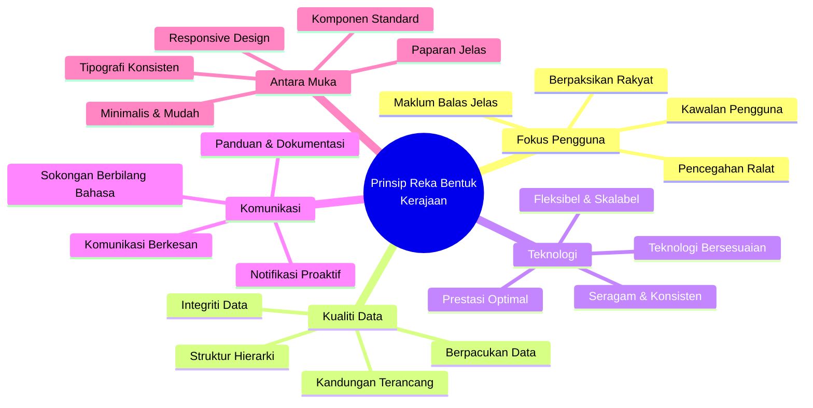
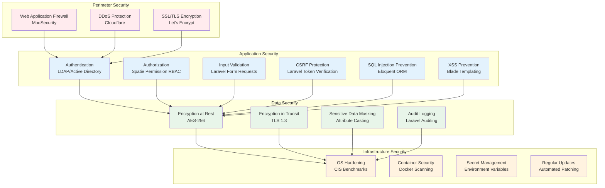
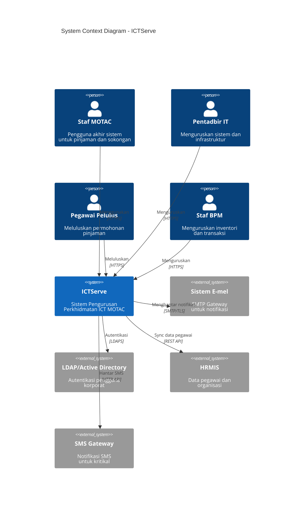
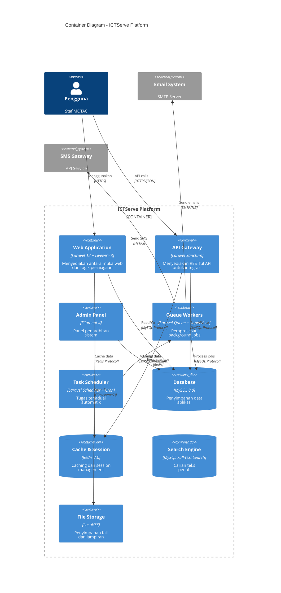
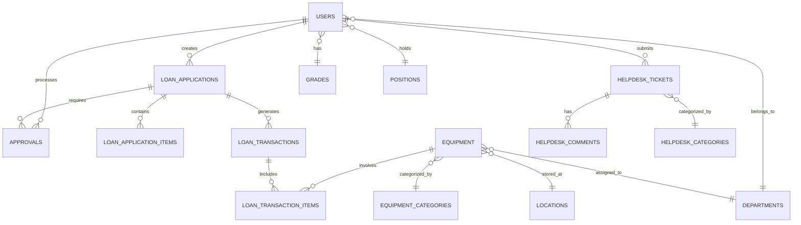

# Dokumentasi Reka Bentuk Sistem ICTServe (iServe) v2.10

| Atribut              | Nilai                                                      |
| -------------------- | ---------------------------------------------------------- |
| **Versi Dokumen**    | 3.0.0                                                      |
| **Tarikh Kemaskini** | 6 Oktober 2025                                             |
| **Status**           | Aktif - Versi Pengeluaran                                  |
| **Klasifikasi**      | Dokumentasi Teknikal Dalaman                               |
| **Penulis**          | Pasukan Pembangunan ICTServe                               |
| **Penyemak**         | IzzatFirdaus, Arkitek Sistem Senior                        |
| **Sasaran Audiens**  | Pembangun Sistem, Arkitek Perisian, Jurutera QA, Pentadbir |

---

## Kandungan

- [1. Ringkasan Eksekutif](#1-ringkasan-eksekutif)
    - [1.1 Pengenalan](#11-pengenalan)
    - [1.2 Objektif Reka Bentuk](#12-objektif-reka-bentuk)
    - [1.3 Skop Reka Bentuk](#13-skop-reka-bentuk)
    - [1.4 Khalayak Sasaran](#14-khalayak-sasaran)
- [2. Prinsip Reka Bentuk](#2-prinsip-reka-bentuk)
    - [2.1 Prinsip Reka Bentuk Kerajaan](#21-prinsip-reka-bentuk-kerajaan)
    - [2.2 Prinsip Reka Bentuk Teknikal](#22-prinsip-reka-bentuk-teknikal)
    - [2.3 Prinsip Keselamatan](#23-prinsip-keselamatan)
- [3. Seni Bina Sistem](#3-seni-bina-sistem)
    - [3.1 Gambaran Keseluruhan Seni Bina](#31-gambaran-keseluruhan-seni-bina)
    - [3.2 Seni Bina Lapisan (Layered Architecture)](#32-seni-bina-lapisan-layered-architecture)
    - [3.3 Komponen Utama Sistem](#33-komponen-utama-sistem)
    - [3.4 Teknologi Stack](#34-teknologi-stack)
- [4. Reka Bentuk Antara Muka Pengguna](#4-reka-bentuk-antara-muka-pengguna)
    - [4.1 Sistem Grid Responsif](#41-sistem-grid-responsif)
    - [4.2 Sistem Warna](#42-sistem-warna)
    - [4.3 Tipografi](#43-tipografi)
    - [4.4 Komponen UI Boleh Guna Semula](#44-komponen-ui-boleh-guna-semula)
    - [4.5 Aksesibiliti (WCAG 2.1 AA)](#45-aksesibiliti-wcag-21-aa)
- [5. Reka Bentuk Pangkalan Data](#5-reka-bentuk-pangkalan-data)
    - [5.1 Prinsip Reka Bentuk Pangkalan Data](#51-prinsip-reka-bentuk-pangkalan-data)
    - [5.2 Model Hubungan Entiti](#52-model-hubungan-entiti)
    - [5.3 Optimisasi dan Indexing](#53-optimisasi-dan-indexing)
    - [5.4 Strategi Backup dan Recovery](#54-strategi-backup-dan-recovery)
- [6. Reka Bentuk API](#6-reka-bentuk-api)
    - [6.1 Prinsip RESTful API](#61-prinsip-restful-api)
    - [6.2 Struktur Endpoint](#62-struktur-endpoint)
    - [6.3 Format Respons Standard](#63-format-respons-standard)
    - [6.4 Pengendalian Ralat](#64-pengendalian-ralat)
    - [6.5 Versioning dan Dokumentasi](#65-versioning-dan-dokumentasi)
- [7. Keselamatan Sistem](#7-keselamatan-sistem)
    - [7.1 Autentikasi dan Autorisasi](#71-autentikasi-dan-autorisasi)
    - [7.2 Perlindungan Data](#72-perlindungan-data)
    - [7.3 Security Headers](#73-security-headers)
    - [7.4 Audit Trail dan Logging](#74-audit-trail-dan-logging)
- [8. Pematuhan Standard](#8-pematuhan-standard)
    - [8.1 Senarai Semak Pematuhan Kerajaan](#81-senarai-semak-pematuhan-kerajaan)
    - [8.2 Pematuhan WCAG 2.1 AA](#82-pematuhan-wcag-21-aa)
    - [8.3 Pematuhan PDPA 2010](#83-pematuhan-pdpa-2010)
- [9. Panduan Pelaksanaan](#9-panduan-pelaksanaan)
    - [9.1 Persediaan Persekitaran](#91-persediaan-persekitaran)
    - [9.2 Langkah Pemasangan](#92-langkah-pemasangan)
    - [9.3 Konfigurasi](#93-konfigurasi)
    - [9.4 Strategi Ujian](#94-strategi-ujian)
- [10. Deployment dan DevOps](#10-deployment-dan-devops)
    - [10.1 Strategi Deployment](#101-strategi-deployment)
    - [10.2 CI/CD Pipeline](#102-cicd-pipeline)
    - [10.3 Monitoring dan Observability](#103-monitoring-dan-observability)
- [11. Prestasi dan Optimisasi](#11-prestasi-dan-optimisasi)
    - [11.1 Strategi Caching](#111-strategi-caching)
    - [11.2 Optimisasi Database](#112-optimisasi-database)
    - [11.3 Optimisasi Frontend](#113-optimisasi-frontend)
- [12. Penyelenggaraan dan Sokongan](#12-penyelenggaraan-dan-sokongan)
    - [12.1 Jadual Penyelenggaraan](#121-jadual-penyelenggaraan)
    - [12.2 Prosedur Backup](#122-prosedur-backup)
    - [12.3 Disaster Recovery](#123-disaster-recovery)
- [13. Lampiran](#13-lampiran)
    - [13.1 Glosari Teknikal](#131-glosari-teknikal)
    - [13.2 Rujukan](#132-rujukan)
    - [13.3 Sejarah Revisi](#133-sejarah-revisi)
- [14. Sokongan dan Bantuan](#14-sokongan-dan-bantuan)

---

## 1. Ringkasan Eksekutif

### 1.1 Pengenalan

ICTServe (iServe) adalah Sistem Pengurusan Perkhidmatan ICT yang komprehensif, direka khusus untuk Kementerian Pelancongan, Seni dan Budaya Malaysia (MOTAC). Sistem ini mengintegrasikan pengurusan pinjaman aset ICT dan operasi helpdesk dalam satu platform yang selamat, cekap, serta mesra pengguna, sejajar dengan inisiatif transformasi digital kerajaan.

#### Visi Sistem

Menyediakan platform perkhidmatan ICT yang bersepadu, responsif, dan berpacukan data untuk meningkatkan produktiviti dan kepuasan pengguna dalaman MOTAC.

#### Misi Sistem

- Memudahkan proses permohonan dan pengurusan pinjaman peralatan ICT
- Menyediakan sistem helpdesk yang efisien untuk sokongan teknikal
- Meningkatkan ketelusan dan akauntabiliti melalui jejak audit yang komprehensif
- Mengoptimumkan penggunaan aset ICT melalui analitik dan pelaporan

### 1.2 Objektif Reka Bentuk

| Objektif                | Penerangan                                                       | Metrik Kejayaan          | Keutamaan |
| ----------------------- | ---------------------------------------------------------------- | ------------------------ | --------- |
| **Kebolehgunaan**       | Antara muka intuitif yang mudah dipelajari dan digunakan         | Skor SUS > 80            | Tinggi    |
| **Prestasi**            | Sistem responsif dengan masa pemuatan yang pantas                | Masa respons < 2s        | Tinggi    |
| **Skalabiliti**         | Menyokong pertumbuhan pengguna dan data tanpa degradasi          | 500+ pengguna serentak   | Sederhana |
| **Keselamatan**         | Perlindungan data menyeluruh dan kawalan akses yang ketat        | Tiada pelanggaran data   | Kritikal  |
| **Kebolehselenggaraan** | Mudah dikemas kini, diselenggara, dan diperbaiki                 | < 4 jam masa henti/tahun | Tinggi    |
| **Kebolehskalaan**      | Reka bentuk modular yang membolehkan penambahan fitur masa depan | Extensibility score > 8  | Sederhana |

### 1.3 Skop Reka Bentuk

Dokumen ini merangkumi aspek-aspek berikut:

#### Skop Termasuk

- Prinsip dan garis panduan reka bentuk sistem
- Seni bina sistem dan komponen
- Spesifikasi antara muka pengguna (UI/UX)
- Struktur dan reka bentuk pangkalan data
- Reka bentuk API dan integrasi
- Protokol keselamatan dan pematuhan
- Standard kualiti kod dan best practices
- Panduan deployment dan penyelenggaraan

#### Skop Tidak Termasuk

- Keperluan perniagaan terperinci (lihat Dokumen BRD)
- Spesifikasi teknikal peralatan perkakasan
- Prosedur operasi standard pengguna akhir
- Latihan pengguna dan bahan kursus
- Kontrak vendor dan perjanjian SLA

### 1.4 Khalayak Sasaran

| Peranan                   | Penggunaan Dokumen                                  | Keperluan Teknikal |
| ------------------------- | --------------------------------------------------- | ------------------ |
| **Arkitek Sistem**        | Rujukan reka bentuk keseluruhan dan keputusan       | Tinggi             |
| **Pembangun Frontend**    | Panduan UI/UX, komponen, dan styling                | Sederhana - Tinggi |
| **Pembangun Backend**     | Seni bina API, pangkalan data, dan logik perniagaan | Tinggi             |
| **Jurutera QA**           | Standard ujian dan kriteria penerimaan              | Sederhana          |
| **Pentadbir Sistem**      | Konfigurasi, deployment, dan penyelenggaraan        | Sederhana - Tinggi |
| **Pengurus Projek**       | Overview teknikal dan milestone                     | Rendah - Sederhana |
| **Stakeholder Eksekutif** | Ringkasan keputusan reka bentuk dan implikasi       | Rendah             |

---

## 2. Prinsip Reka Bentuk

### 2.1 Prinsip Reka Bentuk Kerajaan

ICTServe mematuhi **Kerangka Reka Bentuk Digital Kerajaan Malaysia** untuk memastikan kualiti, kebolehgunaan, dan pematuhan standard kerajaan.



**Rajah 1:** Peta Minda Prinsip Reka Bentuk Kerajaan - Menunjukkan lima aspek utama: Fokus Pengguna, Kualiti Data, Teknologi, Komunikasi, dan Antara Muka.

#### Pematuhan Terhadap 18 Prinsip Reka Bentuk Kerajaan

| No  | Prinsip               | Implementasi dalam ICTServe                                         | Status |
| --- | --------------------- | ------------------------------------------------------------------- | ------ |
| 1   | Berpaksikan Rakyat    | User research, persona development, usability testing               | ✅     |
| 2   | Berpacukan Data       | Comprehensive analytics, audit trails, reporting dashboards         | ✅     |
| 3   | Kandungan Terancang   | Content strategy, information architecture, structured metadata     | ✅     |
| 4   | Teknologi Bersesuaian | Modern tech stack (Laravel 12, Livewire 3), progressive enhancement | ✅     |
| 5   | Antara Muka Minimalis | Clean UI, focused workflows, reduced cognitive load                 | ✅     |
| 6   | Seragam               | Design system, component library, style guide                       | ✅     |
| 7   | Paparan/Menu Jelas    | Logical navigation, breadcrumbs, clear CTAs                         | ✅     |
| 8   | Realistik             | Real-world workflows, practical features                            | ✅     |
| 9   | Kognitif              | Reduced mental effort, intuitive interactions                       | ✅     |
| 10  | Fleksibel             | Modular architecture, configurable settings                         | ✅     |
| 11  | Komunikasi            | Multi-channel notifications (email, SMS, in-app)                    | ✅     |
| 12  | Struktur Hierarki     | Organizational hierarchy, role-based access                         | ✅     |
| 13  | Komponen UI/UX        | Reusable components (Livewire, Filament)                            | ✅     |
| 14  | Tipografi             | Accessible typography, clear hierarchy                              | ✅     |
| 15  | Tetapan Lalai         | Smart defaults, pre-populated forms                                 | ✅     |
| 16  | Kawalan Pengguna      | User preferences, customizable dashboards                           | ✅     |
| 17  | Pencegahan Ralat      | Validation, confirmation dialogs, undo mechanisms                   | ✅     |
| 18  | Panduan & Dokumentasi | Inline help, tooltips, comprehensive documentation                  | ✅     |

### 2.2 Prinsip Reka Bentuk Teknikal

#### SOLID Principles

Sistem ICTServe mengaplikasikan prinsip SOLID untuk memastikan kod yang berkualiti tinggi:

| Prinsip                   | Aplikasi dalam ICTServe                                | Contoh                          |
| ------------------------- | ------------------------------------------------------ | ------------------------------- |
| **S**ingle Responsibility | Setiap kelas mempunyai satu tanggungjawab sahaja       | `LoanApplicationService`        |
| **O**pen/Closed           | Terbuka untuk extension, tertutup untuk modification   | Strategy pattern untuk approval |
| **L**iskov Substitution   | Subclass boleh menggantikan parent class               | Notification implementations    |
| **I**nterface Segregation | Interface khusus berbanding interface umum             | Repository interfaces           |
| **D**ependency Inversion  | Depend on abstractions, bukan concrete implementations | Service layer dependencies      |

#### Domain-Driven Design (DDD)

```text
┌─────────────────────────────────────────────────────────────┐
│                    Domain Layer (Core)                      │
│  ┌───────────────────────────────────────────────────────┐  │
│  │ Entities: LoanApplication, Equipment, HelpdeskTicket  │  │
│  └───────────────────────────────────────────────────────┘  │
│  ┌───────────────────────────────────────────────────────┐  │
│  │ Value Objects: Money, DateRange, ContactInfo          │  │
│  └───────────────────────────────────────────────────────┘  │
│  ┌───────────────────────────────────────────────────────┐  │
│  │ Domain Services: ApprovalService, InventoryService    │  │
│  └───────────────────────────────────────────────────────┘  │
└─────────────────────────────────────────────────────────────┘
                              │
                              ↓
┌─────────────────────────────────────────────────────────────┐
│                   Application Layer                         │
│  ┌───────────────────────────────────────────────────────┐  │
│  │ Use Cases: SubmitLoan, ApproveLoan, IssueEquipment   │  │
│  └───────────────────────────────────────────────────────┘  │
│  ┌───────────────────────────────────────────────────────┐  │
│  │ DTOs: LoanApplicationDTO, ApprovalDTO                 │  │
│  └───────────────────────────────────────────────────────┘  │
└─────────────────────────────────────────────────────────────┘
                              │
                              ↓
┌─────────────────────────────────────────────────────────────┐
│                 Infrastructure Layer                        │
│  ┌───────────────────────────────────────────────────────┐  │
│  │ Repositories: Eloquent implementations                │  │
│  └───────────────────────────────────────────────────────┘  │
│  ┌───────────────────────────────────────────────────────┐  │
│  │ External Services: Email, SMS, File Storage           │  │
│  └───────────────────────────────────────────────────────┘  │
└─────────────────────────────────────────────────────────────┘
```

**Rajah 2:** Seni Bina Domain-Driven Design (DDD) - Menunjukkan lapisan Domain, Application, dan Infrastructure dengan komponen masing-masing.

### 2.3 Prinsip Keselamatan

#### Security by Design

ICTServe mengintegrasikan keselamatan dalam setiap lapisan reka bentuk:



**Rajah 3:** Lapisan Keselamatan Sistem - Menunjukkan Perimeter Security, Application Security, Data Security, dan Infrastructure Security dengan komponen spesifik.

---

## 3. Seni Bina Sistem

### 3.1 Gambaran Keseluruhan Seni Bina

#### C4 Model - System Context



**Rajah 4:** C4 Model - System Context - Menunjukkan interaksi antara ICTServe dengan pengguna (Staff, Admin, Approver, BPM) dan sistem luaran (Email, LDAP, HRMIS, SMS Gateway).

#### C4 Model - Container Diagram



**Rajah 5:** C4 Model - Container Diagram - Menunjukkan container utama dalam platform ICTServe termasuk Web Application, API Gateway, Admin Panel, Queue Workers, Database, Cache, dan integrasi dengan sistem luaran.

### 3.2 Seni Bina Lapisan (Layered Architecture)

```text
┌──────────────────────────────────────────────────────────────────────┐
│                      PRESENTATION LAYER                              │
│  ┌────────────────┐ ┌────────────────┐ ┌────────────────┐           │
│  │ Blade Views    │ │ Livewire       │ │ Filament       │           │
│  │ Templates      │ │ Components     │ │ Admin Panel    │           │
│  └────────────────┘ └────────────────┘ └────────────────┘           │
│  ┌────────────────────────────────────────────────────────┐          │
│  │              API Controllers (REST)                     │          │
│  └────────────────────────────────────────────────────────┘          │
└──────────────────────────────────────────────────────────────────────┘
                              │
                              ↓
┌──────────────────────────────────────────────────────────────────────┐
│                      APPLICATION LAYER                               │
│  ┌────────────────┐ ┌────────────────┐ ┌────────────────┐           │
│  │ Controllers    │ │ Form Requests  │ │ Resources      │           │
│  │                │ │ (Validation)   │ │ (API Response) │           │
│  └────────────────┘ └────────────────┘ └────────────────┘           │
│  ┌────────────────┐ ┌────────────────┐ ┌────────────────┐           │
│  │ Middleware     │ │ Jobs (Queue)   │ │ Policies       │           │
│  │ (Auth, RBAC)   │ │                │ │ (Authorization)│           │
│  └────────────────┘ └────────────────┘ └────────────────┘           │
└──────────────────────────────────────────────────────────────────────┘
                              │
                              ↓
┌──────────────────────────────────────────────────────────────────────┐
│                       BUSINESS LAYER                                 │
│  ┌────────────────────────────────────────────────────────┐          │
│  │                  Service Classes                        │          │
│  │  • LoanApplicationService                               │          │
│  │  • ApprovalWorkflowService                              │          │
│  │  • EquipmentInventoryService                            │          │
│  │  • HelpdeskTicketService                                │          │
│  │  • NotificationService                                  │          │
│  └────────────────────────────────────────────────────────┘          │
│  ┌────────────────┐ ┌────────────────┐ ┌────────────────┐           │
│  │ Events         │ │ Listeners      │ │ Observers      │           │
│  └────────────────┘ └────────────────┘ └────────────────┘           │
└──────────────────────────────────────────────────────────────────────┘
                              │
                              ↓
┌──────────────────────────────────────────────────────────────────────┐
│                        DOMAIN LAYER                                  │
│  ┌────────────────────────────────────────────────────────┐          │
│  │                Eloquent Models                          │          │
│  │  • User, Department, Grade, Position                    │          │
│  │  • LoanApplication, Equipment, Transaction              │          │
│  │  • HelpdeskTicket, Category, Comment                    │          │
│  └────────────────────────────────────────────────────────┘          │
│  ┌────────────────┐ ┌────────────────┐ ┌────────────────┐           │
│  │ Value Objects  │ │ Domain Events  │ │ Business Rules │           │
│  └────────────────┘ └────────────────┘ └────────────────┘           │
└──────────────────────────────────────────────────────────────────────┘
                              │
                              ↓
┌──────────────────────────────────────────────────────────────────────┐
│                    INFRASTRUCTURE LAYER                              │
│  ┌────────────────┐ ┌────────────────┐ ┌────────────────┐           │
│  │ MySQL Database │ │ Redis Cache    │ │ File Storage   │           │
│  └────────────────┘ └────────────────┘ └────────────────┘           │
│  ┌────────────────┐ ┌────────────────┐ ┌────────────────┐           │
│  │ Email Service  │ │ SMS Gateway    │ │ LDAP/AD        │           │
│  └────────────────┘ └────────────────┘ └────────────────┘           │
└──────────────────────────────────────────────────────────────────────┘
```

**Rajah 6:** Seni Bina Berlapis - Menunjukkan Presentation Layer, Application Layer, Business Layer, Domain Layer, dan Infrastructure Layer dengan komponen spesifik di setiap lapisan.

### 3.3 Komponen Utama Sistem

#### Struktur Direktori Aplikasi

```text
ictserve/
├── app/
│   ├── Console/              # Artisan commands
│   │   └── Commands/
│   ├── Events/               # Domain events
│   ├── Exceptions/           # Custom exceptions
│   ├── Filament/             # Admin panel resources
│   │   ├── Resources/
│   │   ├── Pages/
│   │   └── Widgets/
│   ├── Http/                 # HTTP layer
│   │   ├── Controllers/
│   │   │   ├── Api/          # API controllers
│   │   │   └── Web/          # Web controllers
│   │   ├── Middleware/
│   │   ├── Requests/         # Form validation
│   │   └── Resources/        # API resources
│   ├── Jobs/                 # Queue jobs
│   ├── Livewire/             # Livewire components
│   │   ├── Helpdesk/
│   │   └── LoanManagement/
│   ├── Models/               # Eloquent models
│   ├── Notifications/        # Notification classes
│   ├── Observers/            # Model observers
│   ├── Policies/             # Authorization policies
│   ├── Providers/            # Service providers
│   ├── Rules/                # Custom validation rules
│   └── Services/             # Business logic services
│       ├── Helpdesk/
│       ├── LoanManagement/
│       └── Shared/
├── bootstrap/
├── config/                   # Configuration files
├── database/
│   ├── factories/
│   ├── migrations/
│   └── seeders/
├── public/
├── resources/
│   ├── css/
│   ├── js/
│   └── views/
│       ├── components/
│       ├── layouts/
│       └── livewire/
├── routes/
│   ├── api.php
│   ├── channels.php
│   ├── console.php
│   └── web.php
├── storage/
│   ├── app/
│   ├── framework/
│   └── logs/
├── tests/
│   ├── Feature/
│   └── Unit/
└── vendor/
```

#### Komponen Utama dan Tanggungjawab

| Komponen                      | Lokasi                         | Tanggungjawab                                | Dependencies                   |
| ----------------------------- | ------------------------------ | -------------------------------------------- | ------------------------------ |
| **LoanApplicationService**    | `app/Services/LoanManagement/` | Logik perniagaan pinjaman peralatan          | Models, Events, Notifications  |
| **HelpdeskService**           | `app/Services/Helpdesk/`       | Logik perniagaan helpdesk dan tiket sokongan | Models, Queue, Cache           |
| **ApprovalWorkflowService**   | `app/Services/Shared/`         | Aliran kerja kelulusan generik               | Models, Events, Policies       |
| **NotificationService**       | `app/Services/Shared/`         | Pengurusan notifikasi multi-channel          | Mail, SMS, Database, Broadcast |
| **EquipmentInventoryService** | `app/Services/LoanManagement/` | Pengurusan inventori peralatan               | Models, Cache                  |
| **AuditService**              | `app/Services/Shared/`         | Audit logging dan compliance                 | Database, Events               |

### 3.4 Teknologi Stack

#### Backend Stack

```yaml
Framework & Core:
    Framework: Laravel 12.x
    PHP Version: 8.3+
    Package Manager: Composer 2.6+

Database & Storage:
    Primary DB: MySQL 8.0+
    Cache & Session: Redis 7.0+
    Search: MySQL Full-text Search
    File Storage: Local Filesystem / AWS S3

Authentication & Authorization:
    Authentication: LDAP/Active Directory
    Two-Factor Auth: Integrated with LDAP/AD
    Authorization: Spatie Laravel Permission
    API Auth: Laravel Sanctum

Admin Panel:
    Framework: Filament 4.x
    Components: Filament Form Builder, Table Builder

Background Processing:
    Queue Driver: Redis
    Process Manager: Supervisor
    Scheduler: Laravel Scheduler (Cron)

Audit & Logging:
    Audit Trail: Owen-it Laravel Auditing
    Application Logs: Monolog
    Error Tracking: Laravel Log Viewer
```

#### Frontend Stack

```yaml
UI Framework & Components:
    Component Framework: Livewire 3.x
    JavaScript: Alpine.js 3.x
    CSS Framework: Tailwind CSS 3.x
    Build Tool: Vite 5.x

UI Libraries:
    Icons: Heroicons
    Charts: Chart.js / ApexCharts
    Date Picker: Flatpickr
    Rich Text Editor: TipTap / Quill

Asset Management:
    Compiler: Vite
    CSS Processor: PostCSS
    JavaScript: ES6+ with Babel
```

#### DevOps & Infrastructure

```yaml
Development:
    IDE: Visual Studio Code / PhpStorm
    Version Control: Git
    Local Environment: Laravel Sail / Docker

Testing:
    Unit Testing: PHPUnit
    Feature Testing: PHPUnit + Laravel Dusk
    API Testing: Postman / Insomnia

CI/CD:
    Pipeline: GitHub Actions / GitLab CI
    Code Quality: PHPStan, Laravel Pint
    Security Scanning: Snyk, OWASP Dependency Check

Deployment:
    Web Server: Nginx
    Application Server: PHP-FPM
    Process Manager: Supervisor
    Container Platform: Docker (optional)

Monitoring:
    Application: Laravel Telescope (dev)
    Server: Uptime Kuma / Netdata
    Logs: Laravel Log Viewer
    Performance: New Relic / Blackfire (optional)
```

---

## 4. Reka Bentuk Antara Muka Pengguna

### 4.1 Sistem Grid Responsif

ICTServe menggunakan sistem grid responsif 12-kolum yang menyesuaikan dengan saiz skrin:

```css
/* Sistem Grid: 12-8-4 untuk Desktop-Tablet-Mobile */

/* Container utama */
.container {
    width: 100%;
    margin-left: auto;
    margin-right: auto;
    padding-left: 1rem;
    padding-right: 1rem;
}

/* Desktop (1024px+): 12 lajur */
@media (min-width: 1024px) {
    .container {
        max-width: 1280px;
    }

    .grid {
        display: grid;
        grid-template-columns: repeat(12, 1fr);
        gap: 1.5rem;
    }

    .col-span-1 {
        grid-column: span 1;
    }
    .col-span-2 {
        grid-column: span 2;
    }
    .col-span-3 {
        grid-column: span 3;
    }
    .col-span-4 {
        grid-column: span 4;
    }
    .col-span-6 {
        grid-column: span 6;
    }
    .col-span-8 {
        grid-column: span 8;
    }
    .col-span-12 {
        grid-column: span 12;
    }
}

/* Tablet (768px - 1023px): 8 lajur */
@media (min-width: 768px) and (max-width: 1023px) {
    .container {
        max-width: 768px;
    }

    .grid {
        display: grid;
        grid-template-columns: repeat(8, 1fr);
        gap: 1rem;
    }

    .md\:col-span-1 {
        grid-column: span 1;
    }
    .md\:col-span-2 {
        grid-column: span 2;
    }
    .md\:col-span-4 {
        grid-column: span 4;
    }
    .md\:col-span-8 {
        grid-column: span 8;
    }
}

/* Mobile (0-767px): 4 lajur */
@media (max-width: 767px) {
    .container {
        max-width: 100%;
    }

    .grid {
        display: grid;
        grid-template-columns: repeat(4, 1fr);
        gap: 0.75rem;
    }

    .sm\:col-span-1 {
        grid-column: span 1;
    }
    .sm\:col-span-2 {
        grid-column: span 2;
    }
    .sm\:col-span-4 {
        grid-column: span 4;
    }
}
```

#### Breakpoint Sistem

| Breakpoint | Saiz Skrin | Peranti Tipikal  | Lajur Grid | Gutter |
| ---------- | ---------- | ---------------- | ---------- | ------ |
| **xs**     | < 640px    | Mobile portrait  | 4          | 12px   |
| **sm**     | ≥ 640px    | Mobile landscape | 4          | 16px   |
| **md**     | ≥ 768px    | Tablet portrait  | 8          | 16px   |
| **lg**     | ≥ 1024px   | Tablet landscape | 12         | 24px   |
| **xl**     | ≥ 1280px   | Desktop          | 12         | 24px   |
| **2xl**    | ≥ 1536px   | Large desktop    | 12         | 32px   |

### 4.2 Sistem Warna

Palet warna direka untuk memenuhi standard aksesibiliti WCAG 2.1 AA dan mencerminkan identiti kerajaan.

```scss
// config/colors.scss

// Warna Utama (Primary) - Biru Kerajaan
$primary-50: #eff6ff;
$primary-100: #dbeafe;
$primary-200: #bfdbfe;
$primary-300: #93c5fd;
$primary-400: #60a5fa;
$primary-500: #3b82f6; // Warna utama
$primary-600: #2563eb; // Hover states
$primary-700: #1d4ed8; // Active states
$primary-800: #1e40af;
$primary-900: #1e3a8a;

// Warna Sekunder (Secondary) - Kelabu
$secondary-50: #f8fafc;
$secondary-100: #f1f5f9;
$secondary-200: #e2e8f0;
$secondary-300: #cbd5e1;
$secondary-400: #94a3b8;
$secondary-500: #64748b; // Warna sekunder
$secondary-600: #475569;
$secondary-700: #334155;
$secondary-800: #1e293b;
$secondary-900: #0f172a;

// Warna Semantik
$success-50: #f0fdf4;
$success-500: #10b981; // Kejayaan/Lulus
$success-600: #059669;
$success-700: #047857;

$warning-50: #fffbeb;
$warning-500: #f59e0b; // Amaran
$warning-600: #d97706;
$warning-700: #b45309;

$danger-50: #fef2f2;
$danger-500: #ef4444; // Ralat/Tolak
$danger-600: #dc2626;
$danger-700: #b91c1c;

$info-50: #f0f9ff;
$info-500: #06b6d4; // Maklumat
$info-600: #0891b2;
$info-700: #0e7490;

// Warna Neutral
$gray-50: #f9fafb;
$gray-100: #f3f4f6;
$gray-200: #e5e7eb;
$gray-300: #d1d5db;
$gray-400: #9ca3af;
$gray-500: #6b7280;
$gray-600: #4b5563;
$gray-700: #374151;
$gray-800: #1f2937;
$gray-900: #111827;
```

#### Nisbah Kontras (WCAG AA Compliant)

| Kombinasi Warna     | Nisbah Kontras | Status | Penggunaan                 |
| ------------------- | -------------- | ------ | -------------------------- |
| Primary-500 / White | 7.04:1         | ✅ AAA | Teks pada background putih |
| Primary-600 / White | 8.59:1         | ✅ AAA | Button primary             |
| Success-500 / White | 4.93:1         | ✅ AA  | Success messages           |
| Warning-600 / White | 5.74:1         | ✅ AA  | Warning alerts             |
| Danger-500 / White  | 5.52:1         | ✅ AA  | Error states               |
| Gray-700 / White    | 9.25:1         | ✅ AAA | Body text                  |
| Gray-600 / White    | 7.23:1         | ✅ AAA | Secondary text             |

### 4.3 Tipografi

Sistem tipografi menggunakan font system stack untuk prestasi optimal dengan fallback yang sesuai.

```css
/* Font Families */
:root {
    /* Font untuk tajuk dan heading */
    --font-heading:
        'Poppins', -apple-system, BlinkMacSystemFont, 'Segoe UI', 'Roboto',
        'Oxygen', 'Ubuntu', 'Cantarell', 'Fira Sans', 'Droid Sans',
        'Helvetica Neue', sans-serif;

    /* Font untuk body text dan paragraph */
    --font-body:
        'Inter', -apple-system, BlinkMacSystemFont, 'Segoe UI', 'Roboto',
        'Oxygen', 'Ubuntu', 'Cantarell', 'Fira Sans', 'Droid Sans',
        'Helvetica Neue', sans-serif;

    /* Font untuk kod dan monospace */
    --font-mono:
        'JetBrains Mono', 'Fira Code', 'Monaco', 'Consolas', 'Courier New',
        monospace;
}

/* Heading Styles */
.heading {
    font-family: var(--font-heading);
    font-weight: 600;
    line-height: 1.2;
    letter-spacing: -0.02em;
}

.text-h1 {
    font-size: 3rem; /* 48px */
    line-height: 1.1;
}

.text-h2 {
    font-size: 2.25rem; /* 36px */
    line-height: 1.2;
}

.text-h3 {
    font-size: 1.875rem; /* 30px */
    line-height: 1.25;
}

.text-h4 {
    font-size: 1.5rem; /* 24px */
    line-height: 1.3;
}

.text-h5 {
    font-size: 1.25rem; /* 20px */
    line-height: 1.4;
}

.text-h6 {
    font-size: 1.125rem; /* 18px */
    line-height: 1.4;
}

/* Body Text Styles */
.body {
    font-family: var(--font-body);
    font-weight: 400;
    line-height: 1.6;
}

.text-xs {
    font-size: 0.75rem; /* 12px */
    line-height: 1.5;
}

.text-sm {
    font-size: 0.875rem; /* 14px */
    line-height: 1.5;
}

.text-base {
    font-size: 1rem; /* 16px - Default */
    line-height: 1.6;
}

.text-lg {
    font-size: 1.125rem; /* 18px */
    line-height: 1.6;
}

.text-xl {
    font-size: 1.25rem; /* 20px */
    line-height: 1.6;
}

/* Font Weight Scale */
.font-light {
    font-weight: 300;
}
.font-normal {
    font-weight: 400;
}
.font-medium {
    font-weight: 500;
}
.font-semibold {
    font-weight: 600;
}
.font-bold {
    font-weight: 700;
}
.font-extrabold {
    font-weight: 800;
}
```

#### Skala Tipografi

| Kelas        | Saiz | Line Height | Penggunaan                     |
| ------------ | ---- | ----------- | ------------------------------ |
| `.text-xs`   | 12px | 1.5         | Metadata, timestamps, captions |
| `.text-sm`   | 14px | 1.5         | Labels, helper text            |
| `.text-base` | 16px | 1.6         | Body text, paragraphs          |
| `.text-lg`   | 18px | 1.6         | Lead paragraphs                |
| `.text-xl`   | 20px | 1.6         | Subheadings                    |
| `.text-h6`   | 18px | 1.4         | Card headers                   |
| `.text-h5`   | 20px | 1.4         | Section headings               |
| `.text-h4`   | 24px | 1.3         | Minor headings                 |
| `.text-h3`   | 30px | 1.25        | Page section headings          |
| `.text-h2`   | 36px | 1.2         | Page headings                  |
| `.text-h1`   | 48px | 1.1         | Hero headings                  |

### 4.4 Komponen UI Boleh Guna Semula

#### Butang (Buttons)

```blade
{{-- resources/views/components/button.blade.php --}}
@props([
    'type' => 'primary',      // primary, secondary, success, danger, warning, ghost
    'size' => 'medium',       // small, medium, large
    'disabled' => false,
    'loading' => false,
    'fullWidth' => false,
    'iconLeft' => null,
    'iconRight' => null,
])

@php
$baseClasses = 'inline-flex items-center justify-center font-medium rounded-md transition-all duration-150 focus:outline-none focus:ring-2 focus:ring-offset-2 disabled:opacity-50 disabled:cursor-not-allowed';

$typeClasses = [
    'primary' => 'bg-primary-600 text-white hover:bg-primary-700 focus:ring-primary-500 active:bg-primary-800',
    'secondary' => 'bg-gray-200 text-gray-800 hover:bg-gray-300 focus:ring-gray-500 active:bg-gray-400',
    'success' => 'bg-success-600 text-white hover:bg-success-700 focus:ring-success-500 active:bg-success-800',
    'danger' => 'bg-danger-600 text-white hover:bg-danger-700 focus:ring-danger-500 active:bg-danger-800',
    'warning' => 'bg-warning-600 text-white hover:bg-warning-700 focus:ring-warning-500 active:bg-warning-800',
    'ghost' => 'bg-transparent text-gray-700 hover:bg-gray-100 focus:ring-gray-500 active:bg-gray-200',
];

$sizeClasses = [
    'small' => 'px-3 py-1.5 text-sm',
    'medium' => 'px-4 py-2 text-base',
    'large' => 'px-6 py-3 text-lg',
];

$widthClass = $fullWidth ? 'w-full' : '';

$classes = implode(' ', [
    $baseClasses,
    $typeClasses[$type] ?? $typeClasses['primary'],
    $sizeClasses[$size] ?? $sizeClasses['medium'],
    $widthClass
]);
@endphp

<button
    {{ $attributes->merge([
        'type' => 'button',
        'class' => $classes
    ]) }}
    {{ $disabled || $loading ? 'disabled' : '' }}
>
    @if($loading)
        <svg class="animate-spin -ml-1 mr-2 h-4 w-4" xmlns="http://www.w3.org/2000/svg" fill="none" viewBox="0 0 24 24">
            <circle class="opacity-25" cx="12" cy="12" r="10" stroke="currentColor" stroke-width="4"></circle>
            <path class="opacity-75" fill="currentColor" d="M4 12a8 8 0 018-8V0C5.373 0 0 5.373 0 12h4zm2 5.291A7.962 7.962 0 014 12H0c0 3.042 1.135 5.824 3 7.938l3-2.647z"></path>
        </svg>
    @elseif($iconLeft)
        <x-icon :name="$iconLeft" class="w-5 h-5 mr-2" />
    @endif

    {{ $slot }}

    @if($iconRight)
        <x-icon :name="$iconRight" class="w-5 h-5 ml-2" />
    @endif
</button>
```

**Penggunaan:**

```blade
<!-- Button primary default -->
<x-button type="primary">
    Hantar Permohonan
</x-button>

<!-- Button dengan ikon -->
<x-button type="success" iconLeft="check">
    Lulus
</x-button>

<!-- Button loading state -->
<x-button type="primary" :loading="true">
    Memproses...
</x-button>

<!-- Button full width -->
<x-button type="danger" :fullWidth="true">
    Padam
</x-button>
```

#### Input Borang (Form Input)

```blade
{{-- resources/views/components/form/input.blade.php --}}
@props([
    'label' => '',
    'name' => '',
    'type' => 'text',
    'placeholder' => '',
    'required' => false,
    'error' => null,
    'helpText' => null,
    'disabled' => false,
    'readonly' => false,
    'value' => '',
    'icon' => null,
])

@php
$inputId = $name ?: 'input_' . uniqid();
$errorMessage = $error ?? $errors->first($name);
$hasError = !empty($errorMessage);

$inputClasses = 'block w-full rounded-md shadow-sm transition-colors duration-150 ' .
    ($hasError
        ? 'border-danger-300 text-danger-900 placeholder-danger-300 focus:border-danger-500 focus:ring-danger-500'
        : 'border-gray-300 focus:border-primary-500 focus:ring-primary-500') .
    ($disabled || $readonly ? ' bg-gray-50 cursor-not-allowed' : '');
@endphp

<div class="form-group">
    @if($label)
        <label for="{{ $inputId }}" class="block text-sm font-medium text-gray-700 mb-1">
            {{ $label }}
            @if($required)
                <span class="text-danger-500" aria-label="wajib">*</span>
            @endif
        </label>
    @endif

    <div class="relative">
        @if($icon)
            <div class="absolute inset-y-0 left-0 pl-3 flex items-center pointer-events-none">
                <x-icon :name="$icon" class="h-5 w-5 text-gray-400" />
            </div>
        @endif

        <input
            type="{{ $type }}"
            name="{{ $name }}"
            id="{{ $inputId }}"
            value="{{ old($name, $value) }}"
            placeholder="{{ $placeholder }}"
            {{ $attributes->merge(['class' => $inputClasses . ($icon ? ' pl-10' : '')]) }}
            {{ $required ? 'required' : '' }}
            {{ $disabled ? 'disabled' : '' }}
            {{ $readonly ? 'readonly' : '' }}
            @if($hasError) aria-invalid="true" aria-describedby="{{ $inputId }}-error" @endif
            @if($helpText) aria-describedby="{{ $inputId }}-help" @endif
        />
    </div>

    @if($helpText && !$hasError)
        <p id="{{ $inputId }}-help" class="mt-1 text-sm text-gray-500">
            {{ $helpText }}
        </p>
    @endif

    @if($hasError)
        <p id="{{ $inputId }}-error" class="mt-1 text-sm text-danger-600" role="alert">
            {{ $errorMessage }}
        </p>
    @endif
</div>
```

**Penggunaan:**

```blade
<!-- Input standard -->
<x-form.input
    label="Nama Penuh"
    name="name"
    :required="true"
    placeholder="Masukkan nama penuh anda"
    helpText="Nama seperti dalam kad pengenalan"
/>

<!-- Input dengan ikon -->
<x-form.input
    label="E-mel"
    name="email"
    type="email"
    icon="envelope"
    :required="true"
/>

<!-- Input dengan error -->
<x-form.input
    label="No. Telefon"
    name="phone"
    :error="'Format nombor telefon tidak sah'"
/>
```

#### Card Component

```blade
{{-- resources/views/components/card.blade.php --}}
@props([
    'title' => null,
    'subtitle' => null,
    'footer' => null,
    'padding' => 'default', // none, small, default, large
    'shadow' => true,
])

@php
$paddingClasses = [
    'none' => '',
    'small' => 'p-4',
    'default' => 'p-6',
    'large' => 'p-8',
];

$cardClasses = 'bg-white rounded-lg border border-gray-200 ' .
    ($shadow ? 'shadow-sm hover:shadow-md transition-shadow duration-150' : '');
@endphp

<div {{ $attributes->merge(['class' => $cardClasses]) }}>
    @if($title || $subtitle)
        <div class="px-6 py-4 border-b border-gray-200">
            @if($title)
                <h3 class="text-lg font-semibold text-gray-900">{{ $title }}</h3>
            @endif
            @if($subtitle)
                <p class="mt-1 text-sm text-gray-500">{{ $subtitle }}</p>
            @endif
        </div>
    @endif

    <div class="{{ $paddingClasses[$padding] ?? $paddingClasses['default'] }}">
        {{ $slot }}
    </div>

    @if($footer)
        <div class="px-6 py-4 bg-gray-50 border-t border-gray-200 rounded-b-lg">
            {{ $footer }}
        </div>
    @endif
</div>
```

### 4.5 Aksesibiliti (WCAG 2.1 AA)

#### Prinsip Aksesibiliti

ICTServe direka untuk memenuhi **WCAG 2.1 Level AA** untuk memastikan akses menyeluruh kepada semua pengguna, termasuk mereka yang mempunyai keperluan khas.

##### 1. Perceivable (Boleh Dilihat)

```html
<!-- Teks alternatif untuk imej -->


<!-- Captions untuk video -->
<video controls>
    <source src="tutorial.mp4" type="video/mp4" />
    <track
        kind="captions"
        src="tutorial-ms.vtt"
        srclang="ms"
        label="Bahasa Melayu"
    />
</video>

<!-- Kontras warna yang mencukupi -->
<button class="bg-primary-600 text-white">
    <!-- Nisbah kontras 7.04:1 (AAA) -->
    Klik Di Sini
</button>

<!-- Label yang jelas untuk form -->
<label for="email" class="block text-sm font-medium text-gray-700">
    Alamat E-mel
    <span class="text-danger-500" aria-label="medan wajib">*</span>
</label>
<input
    type="email"
    id="email"
    name="email"
    aria-required="true"
    aria-describedby="email-help"
    class="form-input"
/>
<div id="email-help" class="text-sm text-gray-500">
    Gunakan e-mel rasmi organisasi
</div>
```

##### 2. Operable (Boleh Dikendalikan)

```html
<!-- Keyboard navigation -->
<nav aria-label="Navigasi utama">
    <ul class="flex space-x-4">
        <li><a href="/" class="nav-link" tabindex="0">Dashboard</a></li>
        <li><a href="/loans" class="nav-link" tabindex="0">Pinjaman</a></li>
        <li><a href="/helpdesk" class="nav-link" tabindex="0">Helpdesk</a></li>
        <li>
            <a href="/equipment" class="nav-link" tabindex="0">Peralatan</a>
        </li>
    </ul>
</nav>

<!-- Fokus yang jelas pada elemen interaktif -->
<button
    class="btn-primary focus:outline-none focus:ring-2 focus:ring-primary-500 focus:ring-offset-2"
    aria-label="Hantar permohonan pinjaman"
>
    Hantar
</button>

<!-- Skip links untuk pengguna keyboard -->
<a href="#main-content" class="skip-link"> Langkau ke kandungan utama </a>
```

##### 3. Understandable (Boleh Difahami)

```html
<!-- Label dan arahan yang jelas -->
<form>
    <div class="form-group">
        <label for="loan-purpose" class="form-label">
            Tujuan Pinjaman
            <span class="text-red-500" aria-label="medan wajib">*</span>
        </label>
        <p id="purpose-help" class="text-sm text-gray-600 mb-2">
            Terangkan tujuan penggunaan peralatan secara terperinci (minimum 50
            aksara)
        </p>
        <textarea
            id="loan-purpose"
            name="purpose"
            aria-required="true"
            aria-describedby="purpose-help purpose-error"
            class="form-textarea"
            placeholder="Contoh: Untuk persembahan projek pembangunan sistem..."
        ></textarea>
        <div
            id="purpose-error"
            role="alert"
            aria-live="polite"
            class="text-red-500 text-sm mt-1"
        >
            <!-- Mesej ralat akan dipaparkan di sini -->
        </div>
    </div>

    <!-- Pengesahan input dengan maklum balas jelas -->
    <div class="form-group">
        <label for="loan-date">Tarikh Pinjaman</label>
        <input
            type="date"
            id="loan-date"
            min="{{ date('Y-m-d', strtotime('+1 day')) }}"
            aria-invalid="false"
            aria-describedby="date-help"
        />
        <div id="date-help" class="help-text">
            Pilih tarikh sekurang-kurangnya satu hari dari hari ini
        </div>
    </div>
</form>

<!-- Mesej ralat yang deskriptif -->
<div role="alert" class="alert alert-error">
    <svg class="icon" aria-hidden="true">
        <use xlink:href="#icon-error"></use>
    </svg>
    <div>
        <strong>Ralat Pengesahan:</strong>
        <ul class="mt-2 space-y-1">
            <li>Tujuan pinjaman mesti sekurang-kurangnya 50 aksara</li>
            <li>Tarikh pinjaman tidak boleh pada masa lalu</li>
        </ul>
    </div>
</div>
```

##### 4. Robust (Teguh)

```html
<!-- Markup semantik yang betul -->
<article
    class="loan-application"
    itemscope
    itemtype="https://schema.org/LoanOrCredit"
>
    <header>
        <h1 itemprop="name">Permohonan Pinjaman Peralatan ICT</h1>
        <p itemprop="description">
            Borang permohonan pinjaman peralatan ICT untuk kakitangan MOTAC
        </p>
    </header>

    <section aria-labelledby="applicant-info">
        <h2 id="applicant-info">Maklumat Pemohon</h2>
        <!-- Kandungan seksyen -->
    </section>

    <section aria-labelledby="equipment-section">
        <h2 id="equipment-section">Peralatan Diperlukan</h2>
        <!-- Kandungan seksyen -->
    </section>
</article>

<!-- Sokongan teknologi bantuan -->
<div role="region" aria-label="Status permohonan">
    <div class="status-indicator" role="status" aria-live="polite">
        <span class="sr-only">Status semasa:</span>
        <span class="badge badge-{{ $status }}">{{ ucfirst($status) }}</span>
    </div>
</div>
```

### Pematuhan WCAG 2.1 Level AA - Checklist

| Kriteria Kejayaan                          | Level | Status | Implementasi                                     |
| ------------------------------------------ | ----- | ------ | ------------------------------------------------ |
| **1.1.1** Kandungan Bukan Teks             | A     | ✅     | Alt text untuk semua imej, ARIA labels           |
| **1.2.1** Audio-sahaja dan Video-sahaja    | A     | ✅     | Transkrip disediakan untuk media                 |
| **1.3.1** Info dan Hubungan                | A     | ✅     | Markup semantik, ARIA landmarks                  |
| **1.4.3** Kontras (Minimum)                | AA    | ✅     | Nisbah kontras 4.5:1 untuk teks                  |
| **1.4.4** Saiz Teks                        | AA    | ✅     | Teks boleh diperbesar hingga 200%                |
| **1.4.5** Imej Teks                        | AA    | ✅     | Teks sebenar digunakan, bukan imej               |
| **2.1.1** Papan Kekunci                    | A     | ✅     | Semua fungsi boleh diakses via keyboard          |
| **2.1.2** Tiada Perangkap Keyboard         | A     | ✅     | Fokus tidak terperangkap                         |
| **2.4.1** Blok Pintasan                    | A     | ✅     | Skip links disediakan                            |
| **2.4.2** Tajuk Halaman                    | A     | ✅     | Setiap halaman mempunyai tajuk unik              |
| **2.4.3** Susunan Fokus                    | A     | ✅     | Susunan fokus logik                              |
| **2.4.4** Tujuan Pautan (Dalam Konteks)    | A     | ✅     | Teks pautan deskriptif                           |
| **2.4.5** Pelbagai Cara                    | AA    | ✅     | Navigasi pelbagai kaedah (menu, carian, sitemap) |
| **2.4.6** Tajuk dan Label                  | AA    | ✅     | Tajuk dan label deskriptif                       |
| **2.4.7** Fokus Kelihatan                  | AA    | ✅     | Indikator fokus jelas                            |
| **3.1.1** Bahasa Halaman                   | A     | ✅     | Atribut lang pada elemen html                    |
| **3.1.2** Bahasa Bahagian                  | AA    | ✅     | lang untuk kandungan berbeza bahasa              |
| **3.2.1** Pada Fokus                       | A     | ✅     | Tiada perubahan konteks automatik                |
| **3.2.2** Pada Input                       | A     | ✅     | Perubahan konteks perlu pengesahan               |
| **3.2.3** Navigasi Konsisten               | AA    | ✅     | Navigasi konsisten merentasi halaman             |
| **3.2.4** Pengenalpastian Konsisten        | AA    | ✅     | Komponen dikenalpasti secara konsisten           |
| **3.3.1** Pengenalpastian Ralat            | A     | ✅     | Ralat dikenalpasti dengan jelas                  |
| **3.3.2** Label atau Arahan                | A     | ✅     | Label disediakan untuk input                     |
| **3.3.3** Cadangan Ralat                   | AA    | ✅     | Cadangan pembetulan diberikan                    |
| **3.3.4** Pencegahan Ralat (Undang-undang) | AA    | ✅     | Pengesahan dan pengesahan semula                 |
| **4.1.1** Parsing                          | A     | ✅     | HTML valid                                       |
| **4.1.2** Nama, Peranan, Nilai             | A     | ✅     | ARIA attributes yang betul                       |
| **4.1.3** Mesej Status                     | AA    | ✅     | Mesej status dapat diakses                       |

---

## 5. Reka Bentuk Pangkalan Data

### 5.1 Prinsip Reka Bentuk Pangkalan Data

Reka bentuk pangkalan data ICTServe mengikuti prinsip-prinsip berikut:

1. **Normalisasi**: Database dinormalisasikan hingga 3NF untuk mengurangkan redundansi
2. **Integriti Rujukan**: Foreign key constraints untuk menjaga konsistensi data
3. **Soft Deletes**: Menggunakan soft deletes untuk audit trail yang lengkap
4. **Audit Trail**: Setiap jadual mempunyai kolum audit (created_by, updated_by, deleted_by)
5. **UUID**: Penggunaan UUID untuk identifier yang tidak dapat diteka
6. **Indexing**: Index strategik untuk query performance yang optimum

### 5.2 Model Hubungan Entiti



**Rajah 7:** Entity Relationship Diagram - Menunjukkan hubungan antara entiti utama dalam sistem.

### 5.3 Optimisasi dan Indexing

#### Strategi Index

```sql
-- Index untuk User lookups
CREATE INDEX idx_users_email ON users(email);
CREATE INDEX idx_users_department_status ON users(department_id, status);
CREATE INDEX idx_users_identification ON users(identification_number);

-- Index untuk Loan Applications
CREATE INDEX idx_loans_status_created ON loan_applications(status, created_at DESC);
CREATE INDEX idx_loans_user_status ON loan_applications(user_id, status);
CREATE INDEX idx_loans_dates ON loan_applications(loan_start_date, loan_end_date);

-- Index untuk Equipment
CREATE INDEX idx_equipment_status_category ON equipment(status, equipment_category_id);
CREATE INDEX idx_equipment_location ON equipment(location_id, status);
CREATE INDEX idx_equipment_serial ON equipment(serial_number);

-- Index untuk Helpdesk Tickets
CREATE INDEX idx_tickets_status_priority ON helpdesk_tickets(status, priority, created_at DESC);
CREATE INDEX idx_tickets_assigned ON helpdesk_tickets(assigned_to_user_id, status);
CREATE INDEX idx_tickets_user ON helpdesk_tickets(user_id, created_at DESC);

-- Composite Index untuk complex queries
CREATE INDEX idx_loans_complex ON loan_applications(status, loan_start_date, user_id);
CREATE INDEX idx_tickets_complex ON helpdesk_tickets(assigned_to_user_id, status, priority);

-- Full-text Search Index
ALTER TABLE equipment ADD FULLTEXT idx_equipment_fulltext (brand, model, description);
ALTER TABLE helpdesk_tickets ADD FULLTEXT idx_tickets_fulltext (subject, description);
```

### 5.4 Strategi Backup dan Recovery

#### Backup Policy

```yaml
Backup Schedule:
    Full Backup:
        Frequency: Daily
        Time: 2:00 AM
        Retention: 30 days
        Location: On-premise + Cloud (S3)

    Incremental Backup:
        Frequency: Every 4 hours
        Retention: 7 days
        Location: On-premise

    Transaction Log Backup:
        Frequency: Every hour
        Retention: 24 hours
        Location: On-premise

Recovery Objectives:
    RTO (Recovery Time Objective): 4 hours
    RPO (Recovery Point Objective): 1 hour

Backup Verification:
    Frequency: Weekly
    Method: Restore to test environment
    Documentation: Required for each verification
```

#### Backup Procedure

```bash
#!/bin/bash
# backup-database.sh - Automated database backup script

TIMESTAMP=$(date +%Y%m%d_%H%M%S)
BACKUP_DIR="/backup/ictserve"
DB_NAME="ictserve"
DB_USER="backup_user"
RETENTION_DAYS=30

# Create backup directory if not exists
mkdir -p $BACKUP_DIR

# Perform backup
mysqldump \
    --user=$DB_USER \
    --password=$DB_PASSWORD \
    --single-transaction \
    --routines \
    --triggers \
    --events \
    --set-gtid-purged=OFF \
    $DB_NAME | gzip > $BACKUP_DIR/${DB_NAME}_${TIMESTAMP}.sql.gz

# Upload to S3
aws s3 cp $BACKUP_DIR/${DB_NAME}_${TIMESTAMP}.sql.gz \
    s3://ictserve-backups/database/ \
    --storage-class STANDARD_IA

# Cleanup old backups
find $BACKUP_DIR -name "*.sql.gz" -mtime +$RETENTION_DAYS -delete

# Verify backup integrity
gunzip -t $BACKUP_DIR/${DB_NAME}_${TIMESTAMP}.sql.gz

if [ $? -eq 0 ]; then
    echo "Backup completed successfully: ${DB_NAME}_${TIMESTAMP}.sql.gz"
    # Send success notification
else
    echo "Backup verification failed!"
    # Send alert notification
    exit 1
fi
```

---

## 6. Reka Bentuk API

### 6.1 Prinsip RESTful API

API ICTServe direka mengikut prinsip REST dengan standard berikut:

1. **Stateless**: Setiap request mengandungi semua maklumat yang diperlukan
2. **Resource-based**: URL merepresentasikan resources, bukan actions
3. **HTTP Methods**: Penggunaan method HTTP yang betul (GET, POST, PUT, DELETE)
4. **Status Codes**: Penggunaan HTTP status codes yang sesuai
5. **Versioning**: API versioning untuk backward compatibility
6. **HATEOAS**: Hypermedia as the Engine of Application State

### 6.2 Struktur Endpoint

```
Base URL: https://ictserve.motac.gov.my/api/v1

Authentication:
  POST   /auth/login
  POST   /auth/logout
  POST   /auth/refresh
  GET    /auth/user

Loan Applications:
  GET    /loans                    # List all loan applications
  POST   /loans                    # Create new loan application
  GET    /loans/{id}               # Get specific loan application
  PUT    /loans/{id}               # Update loan application
  DELETE /loans/{id}               # Delete loan application (soft delete)
  POST   /loans/{id}/submit        # Submit for approval
  POST   /loans/{id}/approve       # Approve application
  POST   /loans/{id}/reject        # Reject application
  GET    /loans/{id}/history       # Get approval history

Equipment:
  GET    /equipment                # List all equipment
  GET    /equipment/{id}           # Get specific equipment
  GET    /equipment/available      # Get available equipment
  GET    /equipment/categories     # Get equipment categories

Helpdesk Tickets:
  GET    /tickets                  # List all tickets
  POST   /tickets                  # Create new ticket
  GET    /tickets/{id}             # Get specific ticket
  PUT    /tickets/{id}             # Update ticket
  POST   /tickets/{id}/assign      # Assign ticket
  POST   /tickets/{id}/resolve     # Resolve ticket
  POST   /tickets/{id}/close       # Close ticket
  POST   /tickets/{id}/comments    # Add comment

Reports:
  GET    /reports/loans            # Loan statistics
  GET    /reports/equipment        # Equipment utilization
  GET    /reports/helpdesk         # Helpdesk metrics
```

### 6.3 Format Respons Standard

```json
{
    "success": true,
    "data": {
        "id": 1,
        "type": "loan_application",
        "attributes": {
            "application_number": "LA-2025-10-0001",
            "status": "approved",
            "purpose": "Training purposes",
            "loan_start_date": "2025-10-15",
            "loan_end_date": "2025-10-22",
            "created_at": "2025-10-06T14:30:00+08:00",
            "updated_at": "2025-10-06T15:45:00+08:00"
        },
        "relationships": {
            "user": {
                "data": {
                    "id": 123,
                    "type": "user",
                    "attributes": {
                        "name": "Ahmad Ali",
                        "email": "ahmad.ali@motac.gov.my",
                        "department": "Bahagian Pengurusan Maklumat"
                    }
                }
            },
            "items": {
                "data": [
                    {
                        "id": 1,
                        "type": "loan_application_item",
                        "attributes": {
                            "equipment_type": "laptop",
                            "quantity_requested": 2,
                            "quantity_approved": 2
                        }
                    }
                ]
            }
        }
    },
    "meta": {
        "timestamp": "2025-10-06T16:00:00+08:00",
        "version": "1.0",
        "request_id": "req_abc123xyz"
    },
    "links": {
        "self": "/api/v1/loans/1",
        "related": {
            "items": "/api/v1/loans/1/items",
            "history": "/api/v1/loans/1/history"
        }
    }
}
```

### 6.4 Pengendalian Ralat

```json
{
    "success": false,
    "error": {
        "code": "VALIDATION_ERROR",
        "message": "Pengesahan data gagal",
        "details": {
            "purpose": [
                "Medan tujuan pinjaman adalah wajib",
                "Tujuan pinjaman mesti sekurang-kurangnya 50 aksara"
            ],
            "loan_start_date": ["Tarikh mula pinjaman mesti selepas hari ini"]
        }
    },
    "meta": {
        "timestamp": "2025-10-06T16:00:00+08:00",
        "request_id": "req_error123"
    }
}
```

#### Error Codes

| Code                  | HTTP Status | Penerangan                      |
| --------------------- | ----------- | ------------------------------- |
| VALIDATION_ERROR      | 422         | Input validation failed         |
| AUTHENTICATION_ERROR  | 401         | Authentication required/failed  |
| AUTHORIZATION_ERROR   | 403         | Insufficient permissions        |
| NOT_FOUND             | 404         | Resource not found              |
| RESOURCE_CONFLICT     | 409         | Resource state conflict         |
| RATE_LIMIT_EXCEEDED   | 429         | Too many requests               |
| INTERNAL_SERVER_ERROR | 500         | Server error                    |
| SERVICE_UNAVAILABLE   | 503         | Service temporarily unavailable |

### 6.5 Versioning dan Dokumentasi

````php
<?php
// routes/api.php

Route::prefix('v1')->group(function () {
    // Public routes
    Route::post('/auth/login', [AuthController::class, 'login']);

    // Protected routes
    Route::middleware(['auth:sanctum', 'throttle:60,1'])->group(function () {
        // Loan Applications
        Route::apiResource('loans', LoanApplicationController::class);
        Route::post('/loans/{loan}/submit', [LoanApplicationController::class, 'submit']);
        Route::post('/loans/{loan}/approve', [LoanApplicationController::class, 'approve']);
        Route::post('/loans/{loan}/reject', [LoanApplicationController::class, 'reject']);

        // Equipment
        Route::apiResource('equipment', EquipmentController::class)->only(['index', 'show']);
        Route::get('/equipment/available', [EquipmentController::class, 'available']);

        // Helpdesk Tickets
        Route::apiResource('tickets', HelpdeskTicketController::class);
        Route::post('/tickets/{ticket}/assign', [HelpdeskTicketController::class, 'assign']);
        Route::post('/tickets/{ticket}/resolve', [HelpdeskTicketController::class, 'resolve']);
    });
});

## 7. Keselamatan Sistem

### 7.1 Autentikasi dan Autorisasi

#### 7.1.1 Autentikasi Multi-Faktor (2FA)

```php
<?php
// app/Http/Controllers/Auth/TwoFactorAuthenticationController.php

namespace App\Http\Controllers\Auth;

use App\Http\Controllers\Controller;
use Illuminate\Http\Request;


class TwoFactorAuthenticationController extends Controller
{
    /**
     * Aktifkan 2FA untuk pengguna
     */
    public function store(Request $request, EnableTwoFactorAuthentication $enable)
    {
        $enable($request->user());

        return response()->json([
            'message' => 'Autentikasi dua faktor telah diaktifkan',
            'qr_code' => $request->user()->twoFactorQrCodeSvg(),
            'recovery_codes' => $request->user()->recoveryCodes()
        ]);
    }

    /**
     * Nyahaktifkan 2FA
     */
    public function destroy(Request $request, DisableTwoFactorAuthentication $disable)
    {
        $disable($request->user());

        return response()->json([
            'message' => 'Autentikasi dua faktor telah dinyahaktifkan'
        ]);
    }

    /**
     * Jana semula recovery codes
     */
    public function regenerate(Request $request)
    {
        $request->user()->generateRecoveryCodes();

        return response()->json([
            'recovery_codes' => $request->user()->recoveryCodes()
        ]);
    }

    /**
     * Sahkan 2FA code
     */
    public function confirm(Request $request)
    {
        $request->validate([
            'code' => 'required|string'
        ]);


            $request->user(),
            $request->code
        );

        if (!$confirmed) {
            return response()->json([
                'message' => 'Kod pengesahan tidak sah'
            ], 422);
        }

        return response()->json([
            'message' => 'Autentikasi dua faktor telah disahkan'
        ]);
    }
}
````

#### 7.1.2 Role-Based Access Control (RBAC)

```php
<?php
// database/seeders/RolePermissionSeeder.php

namespace Database\Seeders;

use Illuminate\Database\Seeder;
use Spatie\Permission\Models\Role;
use Spatie\Permission\Models\Permission;

class RolePermissionSeeder extends Seeder
{
    public function run()
    {
        // Reset cached roles and permissions
        app()[\Spatie\Permission\PermissionRegistrar::class]->forgetCachedPermissions();

        // Definisi Permissions yang terperinci
        $permissions = [
            // Loan Management
            'view own loans' => 'Lihat pinjaman sendiri',
            'create loans' => 'Cipta permohonan pinjaman',
            'update own loans' => 'Kemaskini pinjaman sendiri',
            'delete own loans' => 'Padam pinjaman sendiri',
            'view all loans' => 'Lihat semua pinjaman',
            'approve loans' => 'Lulus pinjaman',
            'reject loans' => 'Tolak pinjaman',
            'issue equipment' => 'Keluarkan peralatan',
            'return equipment' => 'Terima pemulangan peralatan',

            // Equipment Management
            'view equipment' => 'Lihat peralatan',
            'create equipment' => 'Tambah peralatan baharu',
            'update equipment' => 'Kemaskini maklumat peralatan',
            'delete equipment' => 'Padam peralatan',
            'manage inventory' => 'Urus inventori peralatan',

            // Helpdesk
            'view own tickets' => 'Lihat tiket sendiri',
            'create tickets' => 'Cipta tiket sokongan',
            'update own tickets' => 'Kemaskini tiket sendiri',
            'view all tickets' => 'Lihat semua tiket',
            'assign tickets' => 'Tugaskan tiket',
            'resolve tickets' => 'Selesaikan tiket',
            'close tickets' => 'Tutup tiket',

            // Administration
            'manage users' => 'Urus pengguna',
            'manage roles' => 'Urus peranan',
            'manage permissions' => 'Urus kebenaran',
            'view audit logs' => 'Lihat jejak audit',
            'export data' => 'Eksport data',
            'manage settings' => 'Urus tetapan sistem',

            // Reporting
            'view reports' => 'Lihat laporan',
            'create reports' => 'Cipta laporan',
            'export reports' => 'Eksport laporan',
        ];

        foreach ($permissions as $name => $description) {
            Permission::create([
                'name' => $name,
                'description' => $description
            ]);
        }

        // Super Admin Role - akses penuh
        $superAdmin = Role::create(['name' => 'super-admin', 'description' => 'Pentadbir Utama']);
        $superAdmin->givePermissionTo(Permission::all());

        // Admin Role - pengurusan am
        $admin = Role::create(['name' => 'admin', 'description' => 'Pentadbir Sistem']);
        $admin->givePermissionTo([
            'view all loans',
            'view equipment',
            'view all tickets',
            'view audit logs',
            'view reports',
            'manage users',
        ]);

        // BPM Staff Role - pengurusan peralatan dan transaksi
        $bpmStaff = Role::create(['name' => 'bpm-staff', 'description' => 'Staf BPM']);
        $bpmStaff->givePermissionTo([
            'view all loans',
            'approve loans',
            'reject loans',
            'issue equipment',
            'return equipment',
            'view equipment',
            'create equipment',
            'update equipment',
            'manage inventory',
            'view all tickets',
            'assign tickets',
            'resolve tickets',
        ]);

        // Approver Role - kelulusan sahaja
        $approver = Role::create(['name' => 'approver', 'description' => 'Pegawai Pelulus']);
        $approver->givePermissionTo([
            'view all loans',
            'approve loans',
            'reject loans',
        ]);

        // IT Support Role - sokongan teknikal
        $itSupport = Role::create(['name' => 'it-support', 'description' => 'Sokongan IT']);
        $itSupport->givePermissionTo([
            'view all tickets',
            'assign tickets',
            'resolve tickets',
            'close tickets',
            'view equipment',
        ]);

        // User Role - pengguna standard
        $user = Role::create(['name' => 'user', 'description' => 'Pengguna Biasa']);
        $user->givePermissionTo([
            'view own loans',
            'create loans',
            'update own loans',
            'view own tickets',
            'create tickets',
            'update own tickets',
        ]);
    }
}
```

### 7.2 Perlindungan Data

#### 7.2.1 Enkripsi Data Sensitif

```php
<?php
// app/Services/DataProtectionService.php

namespace App\Services;

use Illuminate\Support\Facades\Crypt;
use Illuminate\Contracts\Encryption\DecryptException;
use Illuminate\Support\Facades\Log;

class DataProtectionService
{
    /**
     * Field yang memerlukan enkripsi
     */
    protected $sensitiveFields = [
        'identification_number',
        'passport_number',
        'mobile_number',
        'personal_email',
        'bank_account',
        'tax_number',
    ];

    /**
     * Encrypt data peribadi
     */
    public function encryptPersonalData(array $data): array
    {
        foreach ($this->sensitiveFields as $field) {
            if (isset($data[$field]) && !empty($data[$field])) {
                try {
                    $data[$field] = Crypt::encryptString($data[$field]);
                } catch (\Exception $e) {
                    Log::error('Encryption failed', [
                        'field' => $field,
                        'error' => $e->getMessage()
                    ]);
                    throw $e;
                }
            }
        }

        return $data;
    }

    /**
     * Decrypt data peribadi dengan authorization check
     */
    public function decryptPersonalData(array $data, $user): array
    {
        // Semak kebenaran untuk lihat PII (Personally Identifiable Information)
        if (!$user->can('view-pii')) {
            return $this->maskPersonalData($data);
        }

        foreach ($this->sensitiveFields as $field) {
            if (isset($data[$field]) && !empty($data[$field])) {
                try {
                    $data[$field] = Crypt::decryptString($data[$field]);
                } catch (DecryptException $e) {
                    Log::error('Decryption failed', [
                        'field' => $field,
                        'user_id' => $user->id,
                        'error' => $e->getMessage()
                    ]);
                    $data[$field] = '[ENCRYPTED]';
                }
            }
        }

        // Log akses PII untuk audit
        Log::info('PII data accessed', [
            'user_id' => $user->id,
            'accessed_fields' => $this->sensitiveFields,
            'ip' => request()->ip(),
            'timestamp' => now()
        ]);

        return $data;
    }

    /**
     * Mask data peribadi untuk pengguna tidak berwenang
     */
    private function maskPersonalData(array $data): array
    {
        $maskingRules = [
            'identification_number' => fn($v) => substr($v, 0, 6) . '******',
            'mobile_number' => fn($v) => substr($v, 0, 3) . '***' . substr($v, -2),
            'personal_email' => fn($v) => $this->maskEmail($v),
            'bank_account' => fn($v) => '****' . substr($v, -4),
        ];

        foreach ($maskingRules as $field => $maskFn) {
            if (isset($data[$field]) && !empty($data[$field])) {
                $data[$field] = $maskFn($data[$field]);
            }
        }

        return $data;
    }

    /**
     * Mask alamat email
     */
    private function maskEmail(string $email): string
    {
        $parts = explode('@', $email);
        if (count($parts) !== 2) {
            return '***@***';
        }

        $username = $parts[0];
        $domain = $parts[1];

        $maskedUsername = substr($username, 0, 2) . str_repeat('*', strlen($username) - 2);
        $domainParts = explode('.', $domain);
        $maskedDomain = $domainParts[0][0] . str_repeat('*', strlen($domainParts[0]) - 1);

        if (count($domainParts) > 1) {
            $maskedDomain .= '.' . end($domainParts);
        }

        return $maskedUsername . '@' . $maskedDomain;
    }

    /**
     * Sahkan integriti data terenkripsi
     */
    public function verifyDataIntegrity(array $encryptedData): bool
    {
        foreach ($this->sensitiveFields as $field) {
            if (isset($encryptedData[$field]) && !empty($encryptedData[$field])) {
                try {
                    Crypt::decryptString($encryptedData[$field]);
                } catch (DecryptException $e) {
                    return false;
                }
            }
        }

        return true;
    }
}
```

#### 7.2.2 Attribute Casting untuk Model

```php
<?php
// app/Models/User.php

namespace App\Models;

use Illuminate\Database\Eloquent\Model;
use Illuminate\Support\Facades\Crypt;

class User extends Model
{
    /**
     * Attributes yang akan di-encrypt
     */
    protected $encryptable = [
        'identification_number',
        'passport_number',
        'mobile_number'
    ];

    /**
     * Custom attribute casting
     */
    protected function casts(): array
    {
        return [
            'email_verified_at' => 'datetime',
            'two_factor_confirmed_at' => 'datetime',
            'password' => 'hashed',
        ];
    }

    /**
     * Accessor untuk field terenkripsi
     */
    public function getIdentificationNumberAttribute($value)
    {
        return $value ? Crypt::decryptString($value) : null;
    }

    /**
     * Mutator untuk field terenkripsi
     */
    public function setIdentificationNumberAttribute($value)
    {
        $this->attributes['identification_number'] = $value ? Crypt::encryptString($value) : null;
    }

    /**
     * Accessor untuk mobile number
     */
    public function getMobileNumberAttribute($value)
    {
        return $value ? Crypt::decryptString($value) : null;
    }

    /**
     * Mutator untuk mobile number
     */
    public function setMobileNumberAttribute($value)
    {
        $this->attributes['mobile_number'] = $value ? Crypt::encryptString($value) : null;
    }
}
```

### 7.3 Security Headers

```php
<?php
// app/Http/Middleware/SecurityHeadersMiddleware.php

namespace App\Http\Middleware;

use Closure;
use Illuminate\Http\Request;
use Symfony\Component\HttpFoundation\Response;

class SecurityHeadersMiddleware
{
    /**
     * Handle an incoming request
     */
    public function handle(Request $request, Closure $next): Response
    {
        $response = $next($request);

        // Prevent clickjacking attacks
        $response->headers->set('X-Frame-Options', 'SAMEORIGIN');

        // XSS Protection
        $response->headers->set('X-XSS-Protection', '1; mode=block');

        // Prevent MIME type sniffing
        $response->headers->set('X-Content-Type-Options', 'nosniff');

        // HTTP Strict Transport Security (HSTS)
        if ($request->secure()) {
            $response->headers->set(
                'Strict-Transport-Security',
                'max-age=31536000; includeSubDomains; preload'
            );
        }

        // Content Security Policy
        $csp = $this->buildContentSecurityPolicy();
        $response->headers->set('Content-Security-Policy', $csp);

        // Referrer Policy
        $response->headers->set('Referrer-Policy', 'strict-origin-when-cross-origin');

        // Permissions Policy (Feature Policy)
        $response->headers->set(
            'Permissions-Policy',
            'camera=(), microphone=(), geolocation=(self)'
        );

        // Remove revealing headers
        $response->headers->remove('X-Powered-By');
        $response->headers->remove('Server');

        return $response;
    }

    /**
     * Build Content Security Policy header
     */
    private function buildContentSecurityPolicy(): string
    {
        $directives = [
            "default-src 'self'",
            "script-src 'self' 'unsafe-inline' 'unsafe-eval' https://cdn.jsdelivr.net https://unpkg.com",
            "style-src 'self' 'unsafe-inline' https://fonts.googleapis.com",
            "font-src 'self' https://fonts.gstatic.com data:",
            "img-src 'self' data: https: blob:",
            "connect-src 'self'",
            "frame-ancestors 'self'",
            "base-uri 'self'",
            "form-action 'self'",
            "object-src 'none'",
        ];

        return implode('; ', $directives);
    }
}
```

### 7.4 Audit Trail dan Logging

```php
<?php
// app/Observers/AuditObserver.php

namespace App\Observers;

use Illuminate\Database\Eloquent\Model;
use Illuminate\Support\Facades\Log;
use Illuminate\Support\Facades\Auth;

class AuditObserver
{
    /**
     * Log semua operasi created
     */
    public function created(Model $model)
    {
        $this->logActivity('created', $model);
    }

    /**
     * Log semua operasi updated
     */
    public function updated(Model $model)
    {
        $changes = $model->getChanges();
        $original = $model->getOriginal();

        // Filter out timestamps if not important
        unset($changes['updated_at']);

        if (empty($changes)) {
            return;
        }

        $this->logActivity('updated', $model, [
            'changes' => $changes,
            'original' => array_intersect_key($original, $changes)
        ]);
    }

    /**
     * Log semua operasi deleted
     */
    public function deleted(Model $model)
    {
        $this->logActivity('deleted', $model);
    }

    /**
     * Log semua operasi restored
     */
    public function restored(Model $model)
    {
        $this->logActivity('restored', $model);
    }

    /**
     * Log aktiviti ke database dan file
     */
    private function logActivity(string $event, Model $model, array $extra = [])
    {
        $user = Auth::user();

        $logData = [
            'event' => $event,
            'model_type' => get_class($model),
            'model_id' => $model->getKey(),
            'user_id' => $user?->id,
            'user_name' => $user?->name,
            'user_email' => $user?->email,
            'ip_address' => request()->ip(),
            'user_agent' => request()->userAgent(),
            'url' => request()->fullUrl(),
            'method' => request()->method(),
            'timestamp' => now()->toIso8601String(),
        ];

        // Merge extra data
        $logData = array_merge($logData, $extra);

        // Log ke file untuk monitoring real-time
        Log::channel('audit')->info("Model {$event}", $logData);

        // Simpan ke database audit table untuk analisis
        \DB::table('activity_logs')->insert([
            'log_name' => 'model_audit',
            'description' => "{$event} {$model->getTable()}",
            'subject_type' => get_class($model),
            'subject_id' => $model->getKey(),
            'causer_type' => $user ? get_class($user) : null,
            'causer_id' => $user?->id,
            'properties' => json_encode($logData),
            'created_at' => now(),
        ]);
    }
}
```

#### 7.4.1 Konfigurasi Audit Logging

```php
<?php
// config/audit.php

return [
    'enabled' => env('AUDIT_ENABLED', true),

    'implementation' => OwenIt\Auditing\Models\Audit::class,

    'user' => [
        'morph_prefix' => 'user',
        'guards' => [
            'web',
            'api',
        ],
        'resolver' => App\Resolvers\UserResolver::class,
    ],

    'resolvers' => [
        'ip_address' => OwenIt\Auditing\Resolvers\IpAddressResolver::class,
        'user_agent' => OwenIt\Auditing\Resolvers\UserAgentResolver::class,
        'url' => OwenIt\Auditing\Resolvers\UrlResolver::class,
    ],

    'events' => [
        'created',
        'updated',
        'deleted',
        'restored',
    ],

    'timestamps' => false,

    'threshold' => 10,

    'driver' => 'database',

    'drivers' => [
        'database' => [
            'table' => 'audits',
            'connection' => null,
        ],
    ],

    'console' => false,
];
```

---

## 8. Pematuhan Standard

### 8.1 Senarai Semak Pematuhan Kerajaan

```yaml
Pematuhan Prinsip Reka Bentuk Kerajaan Malaysia:
    Prinsip 1 - Berpaksikan Rakyat:
        status: ✅ Patuh
        implementasi:
            - User-centered design process
            - Usability testing dengan pengguna sebenar
            - Feedback mechanism terintegrasi
        bukti: User research reports, usability test results

    Prinsip 2 - Berpacukan Data:
        status: ✅ Patuh
        implementasi:
            - Comprehensive analytics dashboard
            - Data-driven decision making tools
            - Real-time reporting
        bukti: Analytics implementation, audit trails

    Prinsip 3 - Kandungan Terancang:
        status: ✅ Patuh
        implementasi:
            - Structured content architecture
            - Clear information hierarchy
            - Consistent terminology
        bukti: Content strategy document, sitemap

    Prinsip 4 - Teknologi Bersesuaian:
        status: ✅ Patuh
        implementasi:
            - Modern tech stack (Laravel 12, Livewire 3)
            - Progressive enhancement
            - Mobile-first approach
        bukti: Technology stack documentation

    Prinsip 5 - Antara Muka Minimalis:
        status: ✅ Patuh
        implementasi:
            - Clean UI design
            - Focused workflows
            - Reduced cognitive load
        bukti: UI screenshots, design system

    Prinsip 6 - Seragam:
        status: ✅ Patuh
        implementasi:
            - Design system implementation
            - Component library
            - Consistent styling
        bukti: Component documentation, style guide

    Prinsip 7 - Paparan/Menu Jelas:
        status: ✅ Patuh
        implementasi:
            - Logical navigation structure
            - Breadcrumbs implementation
            - Clear CTAs
        bukti: Navigation map, user flow diagrams

    Prinsip 8 - Realistik:
        status: ✅ Patuh
        implementasi:
            - Based on actual workflows
            - Practical features only
            - Real-world testing
        bukti: Process documentation, UAT results

    Prinsip 9 - Kognitif:
        status: ✅ Patuh
        implementasi:
            - Reduced mental effort
            - Progressive disclosure
            - Intuitive interactions
        bukti: Task completion metrics, error rates

    Prinsip 10 - Fleksibel:
        status: ✅ Patuh
        implementasi:
            - Modular architecture
            - Extensible design
            - Configurable settings
        bukti: Architecture documentation, API docs

    Prinsip 11 - Komunikasi:
        status: ✅ Patuh
        implementasi:
            - Multi-channel notifications
            - Clear messaging
            - Feedback mechanisms
        bukti: Notification logs, delivery reports

    Prinsip 12 - Struktur Hierarki:
        status: ✅ Patuh
        implementasi:
            - Organizational hierarchy
            - Role-based access
            - Clear reporting lines
        bukti: Org chart, RBAC implementation

    Prinsip 13 - Komponen UI/UX:
        status: ✅ Patuh
        implementasi:
            - Reusable components (Livewire)
            - Component library
            - Standardized patterns
        bukti: Component catalog

    Prinsip 14 - Tipografi:
        status: ✅ Patuh
        implementasi:
            - Accessible typography
            - Clear hierarchy
            - Readable fonts
        bukti: Typography scale, contrast ratios

    Prinsip 15 - Tetapan Lalai:
        status: ✅ Patuh
        implementasi:
            - Smart defaults
            - Pre-populated forms
            - Sensible presets
        bukti: Default values documentation

    Prinsip 16 - Kawalan Pengguna:
        status: ✅ Patuh
        implementasi:
            - User preferences
            - Customizable dashboards
            - Settings management
        bukti: Settings panel, user feedback

    Prinsip 17 - Pencegahan Ralat:
        status: ✅ Patuh
        implementasi:
            - Input validation
            - Confirmation dialogs
            - Undo mechanisms
        bukti: Error handling documentation

    Prinsip 18 - Panduan & Dokumentasi:
        status: ✅ Patuh
        implementasi:
            - Inline help
            - Tooltips
            - Comprehensive documentation
        bukti: Help system, user guides
```

### 8.2 Pematuhan WCAG 2.1 AA

#### 8.2.1 Checklist Lengkap

```markdown
## WCAG 2.1 Level AA Compliance Checklist

### 1. Perceivable (Boleh Dilihat)

#### 1.1 Text Alternatives

- [x] 1.1.1 Non-text Content (A) - Alt text untuk semua imej
    - Implementation: All images have descriptive alt attributes
    - Testing: Automated accessibility scanner + manual review

#### 1.2 Time-based Media

- [x] 1.2.1 Audio-only and Video-only (A) - Transkrip disediakan
- [x] 1.2.2 Captions (A) - Captions untuk video
- [x] 1.2.3 Audio Description or Media Alternative (A)

#### 1.3 Adaptable

- [x] 1.3.1 Info and Relationships (A) - Semantic HTML, ARIA landmarks
    - Implementation: Proper heading hierarchy, semantic elements
- [x] 1.3.2 Meaningful Sequence (A) - Logical reading order
- [x] 1.3.3 Sensory Characteristics (A) - Not relying on shape/color alone
- [x] 1.3.4 Orientation (AA) - Works in portrait and landscape
- [x] 1.3.5 Identify Input Purpose (AA) - Autocomplete attributes

#### 1.4 Distinguishable

- [x] 1.4.1 Use of Color (A) - Color not sole means of conveying info
- [x] 1.4.2 Audio Control (A) - User can pause/stop audio
- [x] 1.4.3 Contrast (Minimum) (AA) - 4.5:1 for normal text, 3:1 for large
    - Implementation: Color palette tested for contrast ratios
    - Primary-500/White: 7.04:1 ✓
    - Success-500/White: 4.93:1 ✓
    - Danger-500/White: 5.52:1 ✓
- [x] 1.4.4 Resize Text (AA) - Text can be resized to 200%
- [x] 1.4.5 Images of Text (AA) - Actual text used instead of images
- [x] 1.4.10 Reflow (AA) - Content reflows without horizontal scrolling
- [x] 1.4.11 Non-text Contrast (AA) - 3:1 for UI components
- [x] 1.4.12 Text Spacing (AA) - No loss of content/functionality
- [x] 1.4.13 Content on Hover or Focus (AA) - Dismissible, hoverable, persistent

### 2. Operable (Boleh Dikendalikan)

#### 2.1 Keyboard Accessible

- [x] 2.1.1 Keyboard (A) - All functionality available via keyboard
    - Implementation: Tab navigation, keyboard shortcuts
    - Testing: Manual keyboard-only navigation test
- [x] 2.1.2 No Keyboard Trap (A) - No keyboard traps
- [x] 2.1.4 Character Key Shortcuts (A) - Can be turned off/remapped

#### 2.2 Enough Time

- [x] 2.2.1 Timing Adjustable (A) - User can extend time limits
- [x] 2.2.2 Pause, Stop, Hide (A) - Moving content can be paused

#### 2.3 Seizures

- [x] 2.3.1 Three Flashes or Below (A) - No content flashes more than 3x/sec

#### 2.4 Navigable

- [x] 2.4.1 Bypass Blocks (A) - Skip links provided
    - Implementation: Skip to main content link
- [x] 2.4.2 Page Titled (A) - Pages have unique, descriptive titles
- [x] 2.4.3 Focus Order (A) - Logical focus order
- [x] 2.4.4 Link Purpose (In Context) (A) - Link text is descriptive
- [x] 2.4.5 Multiple Ways (AA) - Multiple navigation methods
    - Menu, breadcrumbs, search, sitemap
- [x] 2.4.6 Headings and Labels (AA) - Descriptive headings and labels
- [x] 2.4.7 Focus Visible (AA) - Clear focus indicator
    - Implementation: 2px blue outline with offset

#### 2.5 Input Modalities

- [x] 2.5.1 Pointer Gestures (A) - No multipoint/path-based gestures required
- [x] 2.5.2 Pointer Cancellation (A) - Completion on up-event
- [x] 2.5.3 Label in Name (A) - Accessible name contains visible label
- [x] 2.5.4 Motion Actuation (A) - Not requiring device motion

### 3. Understandable (Boleh Difahami)

#### 3.1 Readable

- [x] 3.1.1 Language of Page (A) - Language attribute on HTML element
    - Implementation: <html lang="ms"> or <html lang="en">
- [x] 3.1.2 Language of Parts (AA) - Language changes marked

#### 3.2 Predictable

- [x] 3.2.1 On Focus (A) - No unexpected context change on focus
- [x] 3.2.2 On Input (A) - No unexpected context change on input
- [x] 3.2.3 Consistent Navigation (AA) - Navigation order consistent
- [x] 3.2.4 Consistent Identification (AA) - Components identified consistently

#### 3.3 Input Assistance

- [x] 3.3.1 Error Identification (A) - Errors clearly identified
    - Implementation: Error messages with aria-invalid and role="alert"
- [x] 3.3.2 Labels or Instructions (A) - Labels provided for inputs
- [x] 3.3.3 Error Suggestion (AA) - Correction suggestions provided
- [x] 3.3.4 Error Prevention (Legal, Financial, Data) (AA) - Confirmation required

### 4. Robust (Teguh)

#### 4.1 Compatible

- [x] 4.1.1 Parsing (A) - Valid HTML
    - Testing: HTML validator, no critical errors
- [x] 4.1.2 Name, Role, Value (A) - Proper ARIA attributes
- [x] 4.1.3 Status Messages (AA) - Status messages identifiable
    - Implementation: aria-live regions for notifications
```

### 8.3 Pematuhan PDPA 2010

````php
<?php
// app/Services/PDPAComplianceService.php

namespace App\Services;

use App\Models\User;
use App\Models\ConsentLog;
use Illuminate\Support\Facades\DB;
use Illuminate\Support\Facades\Log;

class PDPAComplianceService
{
    /**
     * Rekod consent pengguna
     */
    public function recordConsent(User $user, string $consentType, array $purposes): void
    {
        ConsentLog::create([
            'user_id' => $user->id,
            'consent_type' => $consentType,
            'purposes' => json_encode($purposes),
            'ip_address' => request()->ip(),
            'user_agent' => request()->userAgent(),
            'consented_at' => now(),
        ]);

        Log::info('Consent recorded', [
            'user_id' => $user->id,
            'consent_type' => $consentType,
            'purposes' => $purposes,
            'timestamp' => now()
        ]);
    }

    /**
     * Semak consent validity
     */
    public function hasValidConsent(User $user, string $purpose): bool
    {
        return ConsentLog::where('user_id', $user->id)
            ->where('consent_type', 'data_processing')
            ->where('purposes', 'LIKE', "%{$purpose}%")
            ->whereNull('revoked_at')
            ->exists();
    }

    /**
     * Revoke consent
     */
    public function revokeConsent(User $user, string $consentType): void
    {
        ConsentLog::where('user_id', $user->id)
            ->where('consent_type', $consentType)
            ->whereNull('revoked_at')
            ->update([
                'revoked_at' => now(),
                'revoked_by' => auth()->id()
            ]);

        Log::info('Consent revoked', [
            'user_id' => $user->id,
            'consent_type' => $consentType,
            'revoked_by' => auth()->id(),
            'timestamp' => now()
        ]);
    }

    /**
     * Data subject access request (DSAR)
     */
    public function exportPersonalData(User $user): array
    {
        return [
            'user_profile' => [
                'name' => $user->name,
                'email' => $user->email,
                'identification_number' => $user->identification_number,
                'mobile_number' => $user->mobile_number,
                'department' => $user->department->name ?? null,
                'position' => $user->position->name ?? null,
                'grade' => $user->grade->name ?? null,
                'created_at' => $user->created_at->toIso8601String(),
            ],
            'loan_applications' => $user->loanApplications()->get()->map(function ($loan) {
                return [
                    'application_number' => $loan->application_number,
                    'purpose' => $loan->purpose,
                    'status' => $loan->status,
                    'loan_start_date' => $loan->loan_start_date->toDateString(),
                    'loan_end_date' => $loan->loan_end_date->toDateString(),
                    'created_at' => $loan->created_at->toIso8601String(),
                ];
            }),
            'helpdesk_tickets' => $user->helpdeskTickets()->get()->map(function ($ticket) {
                return [
                    'ticket_number' => $ticket->ticket_number,
                    'subject' => $ticket->subject,
                    'status' => $ticket->status,
                    'created_at' => $ticket->created_at->toIso8601String(),
                ];
            }),
            'audit_trail' => DB::table('activity_logs')
                ->where('causer_id', $user->id)
                ->orderBy('created_at', 'desc')
                ->limit(100)
                ->get()
                ->map(function ($log) {
                    return [
                        'description' => $log->description,
                        'properties' => json_decode($log->properties, true),
                        'created_at' => $log->created_at,
                    ];
                }),
        ];
    }

    /**
     * Right to be forgotten (anonymize data)
     */
    public function anonymizeUserData(User $user): void
    {
        DB::transaction(function () use ($user) {
            // Anonymize personal data
            $user->update([
                'name' => 'ANONYMIZED_' . uniqid(),
                'email' => 'deleted_' . uniqid() . '@anonymized.local',
                'identification_number' => null,
                'passport_number' => null,
                'mobile_number' => null,
                'profile_photo_path' => null,
                'anonymized_at' => now(),
            ]);

            // Revoke all consents
            ConsentLog::where('user_id', $user->id)
                ->whereNull('revoked_at')
                ->update([
                    'revoked_at' => now(),
                    'revoked_by' => auth()->id() ?? $user->id
                ]);

            Log::info('User data anonymized', [
                'user_id' => $user->id,
                'performed_by' => auth()->id() ?? 'system',
                'timestamp' => now()
            ]);
        });
    }

    /**
     * Data retention policy enforcement
     */
    public function enforceDataRetention(): void
    {
        // Delete anonymized users after retention period (7 years)
        User::whereNotNull('anonymized_at')
            ->where('anonymized_at', '<', now()->subYears(7))
            ->forceDelete();

        // Delete old audit logs (3 years retention)
        DB::table('activity_logs')
            ->where('created_at', '<', now()->subYears(3))
            ->delete();

        // Delete old consent logs (5 years retention)
        ConsentLog::where('created_at', '<', now()->subYears(5))
            ->delete();
    }
}

## 9. Panduan Pelaksanaan

### 9.1 Persediaan Persekitaran

#### 9.1.1 Keperluan Sistem

```yaml
Server Requirements:
  Production:
    Application Servers:
      - CPU: 8 cores (Intel Xeon atau setara)
      - RAM: 16GB minimum, 32GB disyorkan
      - Storage: 500GB NVMe SSD
      - OS: Ubuntu 22.04 LTS atau CentOS 8+
      - Quantity: 2 (untuk High Availability)

    Database Server:
      - CPU: 8 cores
      - RAM: 32GB minimum, 64GB disyorkan
      - Storage: 1TB NVMe SSD (RAID 10)
      - OS: Ubuntu 22.04 LTS
      - Quantity: 1 primary + 1 standby

    Cache Server:
      - CPU: 4 cores
      - RAM: 16GB
      - Storage: 200GB SSD
      - OS: Ubuntu 22.04 LTS
      - Quantity: 1 (Redis)

    Load Balancer:
      - CPU: 4 cores
      - RAM: 8GB
      - Storage: 100GB SSD
      - OS: Ubuntu 22.04 LTS
      - Quantity: 1

  Staging:
    All-in-one Server:
      - CPU: 8 cores
      - RAM: 16GB
      - Storage: 500GB SSD
      - OS: Ubuntu 22.04 LTS

  Development:
    Local/VM:
      - CPU: 4 cores
      - RAM: 8GB
      - Storage: 250GB SSD
      - OS: Ubuntu/Windows/MacOS

Network Requirements:
  - Dedicated bandwidth: 100 Mbps minimum
  - Internal LAN: Gigabit Ethernet
  - VPN access untuk remote admin
  - SSL/TLS certificates (wildcard recommended)
  - Static IP addresses

Security Infrastructure:
  - Web Application Firewall (WAF)
  - Intrusion Detection System (IDS)
  - DDoS Protection
  - Network segmentation (DMZ)
  - Regular security updates
````

#### 9.1.2 Perisian dan Pakej Yang Diperlukan

```bash
#!/bin/bash
# install-dependencies.sh - Skrip pemasangan dependencies

set -e  # Exit on error

echo "🚀 Memulakan pemasangan dependencies untuk ICTServe..."

# Update system packages
echo "📦 Mengemas kini sistem..."
sudo apt update && sudo apt upgrade -y

# Install PHP 8.3 dan extensions
echo "🐘 Memasang PHP 8.3 dan extensions..."
sudo add-apt-repository ppa:ondrej/php -y
sudo apt update
sudo apt install -y php8.3-fpm \
  php8.3-cli \
  php8.3-common \
  php8.3-mysql \
  php8.3-xml \
  php8.3-mbstring \
  php8.3-curl \
  php8.3-gd \
  php8.3-intl \
  php8.3-zip \
  php8.3-redis \
  php8.3-bcmath \
  php8.3-opcache \
  php8.3-soap \
  php8.3-imagick

# Install MySQL 8.0
echo "🗄️ Memasang MySQL 8.0..."
sudo apt install -y mysql-server-8.0 mysql-client-8.0

# Secure MySQL installation
sudo mysql_secure_installation

# Install Redis
echo "💾 Memasang Redis..."
sudo apt install -y redis-server
sudo systemctl enable redis-server
sudo systemctl start redis-server

# Install Nginx
echo "🌐 Memasang Nginx..."
sudo apt install -y nginx
sudo systemctl enable nginx

# Install Composer
echo "🎼 Memasang Composer..."
curl -sS https://getcomposer.org/installer | php
sudo mv composer.phar /usr/local/bin/composer
sudo chmod +x /usr/local/bin/composer

# Install Node.js 20.x dan npm
echo "📗 Memasang Node.js..."
curl -fsSL https://deb.nodesource.com/setup_20.x | sudo -E bash -
sudo apt install -y nodejs

# Install additional tools
echo "🔧 Memasang tools tambahan..."
sudo apt install -y \
  git \
  curl \
  wget \
  unzip \
  supervisor \
  certbot \
  python3-certbot-nginx

# Configure PHP-FPM
echo "⚙️ Mengkonfigurasi PHP-FPM..."
sudo sed -i 's/memory_limit = .*/memory_limit = 512M/' /etc/php/8.3/fpm/php.ini
sudo sed -i 's/upload_max_filesize = .*/upload_max_filesize = 20M/' /etc/php/8.3/fpm/php.ini
sudo sed -i 's/post_max_size = .*/post_max_size = 25M/' /etc/php/8.3/fpm/php.ini
sudo sed -i 's/max_execution_time = .*/max_execution_time = 300/' /etc/php/8.3/fpm/php.ini

# Enable and start services
echo "🚦 Mengaktifkan servis..."
sudo systemctl enable php8.3-fpm
sudo systemctl start php8.3-fpm
sudo systemctl enable mysql
sudo systemctl start mysql
sudo systemctl enable nginx
sudo systemctl start nginx

# Display versions
echo ""
echo "✅ Pemasangan selesai! Versi yang dipasang:"
echo "PHP: $(php -v | head -n1)"
echo "Composer: $(composer --version)"
echo "Node.js: $(node -v)"
echo "npm: $(npm -v)"
echo "MySQL: $(mysql --version)"
echo "Redis: $(redis-server --version)"
echo "Nginx: $(nginx -v 2>&1)"

echo ""
echo "🎉 Semua dependencies berjaya dipasang!"
```

### 9.2 Pemasangan Aplikasi

#### 9.2.1 Langkah-Langkah Pemasangan

```bash
#!/bin/bash
# install-ictserve.sh - Skrip pemasangan aplikasi ICTServe

set -e

APP_DIR="/var/www/ictserve"
GIT_REPO="https://github.com/motac/ictserve.git"
BRANCH="main"

echo "📥 Memulakan pemasangan ICTServe..."

# Clone repository
if [ ! -d "$APP_DIR" ]; then
    echo "📦 Mengklone repository..."
    sudo git clone -b $BRANCH $GIT_REPO $APP_DIR
else
    echo "📂 Directory sudah wujud, melakukan pull..."
    cd $APP_DIR
    sudo git pull origin $BRANCH
fi

cd $APP_DIR

# Set ownership
echo "🔐 Menetapkan ownership..."
sudo chown -R www-data:www-data $APP_DIR
sudo chmod -R 755 $APP_DIR

# Install Composer dependencies
echo "📦 Memasang Composer dependencies..."
sudo -u www-data composer install --no-dev --optimize-autoloader

# Copy environment file
echo "⚙️ Menyediakan environment file..."
if [ ! -f .env ]; then
    sudo -u www-data cp .env.example .env
    sudo -u www-data php artisan key:generate
fi

# Install NPM dependencies dan build assets
echo "🎨 Memasang NPM dependencies dan membina assets..."
npm ci
npm run build  # Vite build

# Set permissions untuk storage dan cache
echo "🔒 Menetapkan permissions..."
sudo chown -R www-data:www-data storage bootstrap/cache
sudo chmod -R 775 storage bootstrap/cache

# Create database
echo "🗄️ Mencipta database..."
read -p "Enter MySQL root password: " -s MYSQL_ROOT_PASSWORD
echo ""
read -p "Enter database name (default: ictserve): " DB_NAME
DB_NAME=${DB_NAME:-ictserve}
read -p "Enter database user (default: ictserve_user): " DB_USER
DB_USER=${DB_USER:-ictserve_user}
read -p "Enter database password: " -s DB_PASSWORD
echo ""

mysql -u root -p"$MYSQL_ROOT_PASSWORD" <<-EOSQL
    CREATE DATABASE IF NOT EXISTS $DB_NAME CHARACTER SET utf8mb4 COLLATE utf8mb4_unicode_ci;
    CREATE USER IF NOT EXISTS '$DB_USER'@'localhost' IDENTIFIED BY '$DB_PASSWORD';
    GRANT ALL PRIVILEGES ON $DB_NAME.* TO '$DB_USER'@'localhost';
    FLUSH PRIVILEGES;
EOSQL

# Update .env file dengan database credentials
echo "📝 Mengemas kini .env file..."
sudo -u www-data sed -i "s/DB_DATABASE=.*/DB_DATABASE=$DB_NAME/" .env
sudo -u www-data sed -i "s/DB_USERNAME=.*/DB_USERNAME=$DB_USER/" .env
sudo -u www-data sed -i "s/DB_PASSWORD=.*/DB_PASSWORD=$DB_PASSWORD/" .env

# Run migrations
echo "🔄 Menjalankan migrations..."
sudo -u www-data php artisan migrate --force

# Run seeders untuk production
echo "🌱 Menjalankan database seeders..."
sudo -u www-data php artisan db:seed --class=ProductionSeeder --force

# Optimize aplikasi
echo "⚡ Mengoptimumkan aplikasi..."
sudo -u www-data php artisan config:cache
sudo -u www-data php artisan route:cache
sudo -u www-data php artisan view:cache
sudo -u www-data php artisan filament:optimize

# Setup storage link
echo "🔗 Membuat storage link..."
sudo -u www-data php artisan storage:link

# Install Filament assets
echo "🎨 Memasang Filament assets..."
sudo -u www-data php artisan filament:assets

echo ""
echo "✅ Pemasangan ICTServe selesai!"
echo ""
echo "📋 Langkah seterusnya:"
echo "1. Konfigurasi Nginx virtual host"
echo "2. Setup SSL certificate"
echo "3. Konfigurasi queue workers (Supervisor)"
echo "4. Setup cron jobs untuk scheduler"
echo "5. Test aplikasi: http://your-domain.com"
```

#### 9.2.2 Konfigurasi Database

```sql
-- scripts/database-setup.sql
-- Database initialization dan optimization

-- Create database dengan character set yang betul
CREATE DATABASE IF NOT EXISTS ictserve
  CHARACTER SET utf8mb4
  COLLATE utf8mb4_unicode_ci;

USE ictserve;

-- Optimize database settings
SET GLOBAL innodb_buffer_pool_size = 2147483648;  -- 2GB
SET GLOBAL innodb_log_file_size = 268435456;      -- 256MB
SET GLOBAL innodb_flush_log_at_trx_commit = 2;
SET GLOBAL max_connections = 200;
SET GLOBAL query_cache_size = 67108864;           -- 64MB
SET GLOBAL query_cache_type = 1;

-- Enable slow query log
SET GLOBAL slow_query_log = 'ON';
SET GLOBAL long_query_time = 2;
SET GLOBAL slow_query_log_file = '/var/log/mysql/mysql-slow.log';

-- Create indexes untuk performance (selepas migration)
-- Nota: Indexes ini akan dicipta automatically oleh migrations,
-- tetapi boleh ditambah manual untuk optimization

-- Users table indexes
CREATE INDEX idx_users_email ON users(email);
CREATE INDEX idx_users_department_status ON users(department_id, status);
CREATE INDEX idx_users_created_at ON users(created_at DESC);

-- Loan applications indexes
CREATE INDEX idx_loans_status_created ON loan_applications(status, created_at DESC);
CREATE INDEX idx_loans_user_status ON loan_applications(user_id, status);
CREATE INDEX idx_loans_dates ON loan_applications(loan_start_date, loan_end_date);
CREATE INDEX idx_loans_number ON loan_applications(application_number);

-- Equipment indexes
CREATE INDEX idx_equipment_status_category ON equipment(status, equipment_category_id);
CREATE INDEX idx_equipment_location ON equipment(location_id, status);
CREATE INDEX idx_equipment_serial ON equipment(serial_number);

-- Helpdesk tickets indexes
CREATE INDEX idx_tickets_status_priority ON helpdesk_tickets(status, priority, created_at DESC);
CREATE INDEX idx_tickets_assigned ON helpdesk_tickets(assigned_to_user_id, status);
CREATE INDEX idx_tickets_user ON helpdesk_tickets(user_id, created_at DESC);

-- Audit logs indexes
CREATE INDEX idx_audit_user_event ON audits(user_id, event, created_at DESC);
CREATE INDEX idx_audit_auditable ON audits(auditable_type, auditable_id);

-- Notifications indexes
CREATE INDEX idx_notifications_user_read ON notifications(notifiable_id, notifiable_type, read_at);
CREATE INDEX idx_notifications_created ON notifications(created_at DESC);

-- Create maintenance user untuk automated tasks
CREATE USER IF NOT EXISTS 'ictserve_maintenance'@'localhost'
  IDENTIFIED BY 'secure_maintenance_password';

GRANT SELECT, INSERT, UPDATE, DELETE ON ictserve.*
  TO 'ictserve_maintenance'@'localhost';

FLUSH PRIVILEGES;
```

### 9.3 Konfigurasi Web Server

#### 9.3.1 Nginx Configuration

```nginx
# /etc/nginx/sites-available/ictserve.conf

# Rate limiting zones
limit_req_zone $binary_remote_addr zone=api_limit:10m rate=10r/s;
limit_req_zone $binary_remote_addr zone=login_limit:10m rate=5r/m;
limit_req_zone $binary_remote_addr zone=general_limit:10m rate=100r/s;

# Upstream untuk PHP-FPM
upstream php-fpm {
    server unix:/var/run/php/php8.3-fpm.sock;
    keepalive 32;
}

# Redirect HTTP ke HTTPS
server {
    listen 80;
    listen [::]:80;
    server_name ictserve.motac.gov.my;

    # Allow Let's Encrypt verification
    location /.well-known/acme-challenge/ {
        root /var/www/ictserve/public;
    }

    location / {
        return 301 https://$server_name$request_uri;
    }
}

# HTTPS Server Configuration
server {
    listen 443 ssl http2;
    listen [::]:443 ssl http2;
    server_name ictserve.motac.gov.my;

    root /var/www/ictserve/public;
    index index.php index.html;

    charset utf-8;

    # SSL Configuration
    ssl_certificate /etc/letsencrypt/live/ictserve.motac.gov.my/fullchain.pem;
    ssl_certificate_key /etc/letsencrypt/live/ictserve.motac.gov.my/privkey.pem;
    ssl_trusted_certificate /etc/letsencrypt/live/ictserve.motac.gov.my/chain.pem;

    # SSL Security Settings
    ssl_protocols TLSv1.2 TLSv1.3;
    ssl_ciphers 'ECDHE-ECDSA-AES128-GCM-SHA256:ECDHE-RSA-AES128-GCM-SHA256:ECDHE-ECDSA-AES256-GCM-SHA384:ECDHE-RSA-AES256-GCM-SHA384';
    ssl_prefer_server_ciphers on;
    ssl_session_cache shared:SSL:10m;
    ssl_session_timeout 10m;
    ssl_stapling on;
    ssl_stapling_verify on;

    # Security Headers
    add_header Strict-Transport-Security "max-age=31536000; includeSubDomains; preload" always;
    add_header X-Frame-Options "SAMEORIGIN" always;
    add_header X-Content-Type-Options "nosniff" always;
    add_header X-XSS-Protection "1; mode=block" always;
    add_header Referrer-Policy "strict-origin-when-cross-origin" always;
    add_header Content-Security-Policy "default-src 'self'; script-src 'self' 'unsafe-inline' 'unsafe-eval' https://cdn.jsdelivr.net; style-src 'self' 'unsafe-inline' https://fonts.googleapis.com; font-src 'self' https://fonts.gstatic.com data:; img-src 'self' data: https: blob:; connect-src 'self'; frame-ancestors 'self';" always;
    add_header Permissions-Policy "camera=(), microphone=(), geolocation=(self)" always;

    # Remove server tokens
    server_tokens off;
    more_clear_headers 'Server';
    more_clear_headers 'X-Powered-By';

    # Logging
    access_log /var/log/nginx/ictserve-access.log combined buffer=32k flush=5s;
    error_log /var/log/nginx/ictserve-error.log warn;

    # Gzip Compression
    gzip on;
    gzip_vary on;
    gzip_proxied any;
    gzip_comp_level 6;
    gzip_types text/plain text/css text/xml text/javascript application/json application/javascript application/xml+rss application/rss+xml font/truetype font/opentype application/vnd.ms-fontobject image/svg+xml;

    # File Upload Limits
    client_max_body_size 20M;
    client_body_buffer_size 128k;

    # Main location block
    location / {
        try_files $uri $uri/ /index.php?$query_string;

        # Rate limiting
        limit_req zone=general_limit burst=20 nodelay;
    }

    # API endpoints dengan stricter rate limiting
    location /api/ {
        try_files $uri $uri/ /index.php?$query_string;
        limit_req zone=api_limit burst=5 nodelay;
    }

    # Login endpoint dengan strict rate limiting
    location /login {
        try_files $uri $uri/ /index.php?$query_string;
        limit_req zone=login_limit burst=2 nodelay;
    }

    # PHP-FPM handler
    location ~ \.php$ {
        fastcgi_split_path_info ^(.+\.php)(/.+)$;
        fastcgi_pass php-fpm;
        fastcgi_index index.php;
        include fastcgi_params;
        fastcgi_param SCRIPT_FILENAME $document_root$fastcgi_script_name;
        fastcgi_param PATH_INFO $fastcgi_path_info;

        # FastCGI optimization
        fastcgi_buffering on;
        fastcgi_buffer_size 16k;
        fastcgi_buffers 256 16k;
        fastcgi_busy_buffers_size 256k;
        fastcgi_temp_file_write_size 256k;
        fastcgi_connect_timeout 300;
        fastcgi_send_timeout 300;
        fastcgi_read_timeout 300;

        # Hide PHP version
        fastcgi_hide_header X-Powered-By;
    }

    # Static files caching
    location ~* \.(jpg|jpeg|png|gif|ico|css|js|svg|woff|woff2|ttf|eot|otf)$ {
        expires 1y;
        add_header Cache-Control "public, immutable";
        access_log off;
        log_not_found off;
    }

    # Deny access to sensitive files
    location ~ /\. {
        deny all;
        access_log off;
        log_not_found off;
    }

    location ~ ^/(\.env|\.git|composer\.(json|lock)|package\.(json|lock)|README\.md|\.htaccess) {
        deny all;
        access_log off;
        log_not_found off;
    }

    # Block common exploit attempts
    location ~* (eval\(|base64_decode|gzip|deflate) {
        deny all;
    }

    # Favicon and robots.txt
    location = /favicon.ico {
        access_log off;
        log_not_found off;
    }

    location = /robots.txt {
        access_log off;
        log_not_found off;
    }

    # Health check endpoint (bypass rate limiting)
    location /health-check {
        access_log off;
        allow 127.0.0.1;
        allow 10.0.0.0/8;  # Internal network
        deny all;
        try_files $uri /index.php?$query_string;
    }
}
```

#### 9.3.2 Supervisor Configuration untuk Queue Workers

````ini
; /etc/supervisor/conf.d/ictserve-workers.conf

[program:ictserve-queue-default]
process_name=%(program_name)s_%(process_num)02d
command=php /var/www/ictserve/artisan queue:work redis --queue=default --sleep=3 --tries=3 --max-time=3600 --max-jobs=1000
directory=/var/www/ictserve
autostart=true
autorestart=true
stopasgroup=true
killasgroup=true
user=www-data
numprocs=4
redirect_stderr=true
stdout_logfile=/var/log/ictserve/worker-default.log
stopwaitsecs=3600
startsecs=0

[program:ictserve-queue-notifications]
process_name=%(program_name)s_%(process_num)02d
command=php /var/www/ictserve/artisan queue:work redis --queue=notifications --sleep=3 --tries=3 --max-time=3600 --max-jobs=1000
directory=/var/www/ictserve
autostart=true
autorestart=true
stopasgroup=true
killasgroup=true
user=www-data
numprocs=2
redirect_stderr=true
stdout_logfile=/var/log/ictserve/worker-notifications.log
stopwaitsecs=3600
startsecs=0

[program:ictserve-queue-high-priority]
process_name=%(program_name)s_%(process_num)02d
command=php /var/www/ictserve/artisan queue:work redis --queue=high-priority --sleep=1 --tries=3 --max-time=3600 --max-jobs=500
directory=/var/www/ictserve
autostart=true
autorestart=true
stopasgroup=true
killasgroup=true
user=www-data
numprocs=2
redirect_stderr=true
stdout_logfile=/var/log/ictserve/worker-high-priority.log
stopwaitsecs=3600
priority=999
startsecs=0

[program:ictserve-scheduler]
command=php /var/www/ictserve/artisan schedule:work
directory=/var/www/ictserve
autostart=true
autorestart=true
user=www-data
redirect_stderr=true
stdout_logfile=/var/log/ictserve/scheduler.log
startsecs=0

[group:ictserve]
programs=ictserve-queue-default,ictserve-queue-notifications,ictserve-queue-high-priority,ictserve-scheduler
priority=999

## 10. Deployment dan DevOps

### 10.1 Continuous Integration/Continuous Deployment (CI/CD)

#### 10.1.1 GitHub Actions Workflow

```yaml
# .github/workflows/deploy-production.yml
name: Deploy to Production

on:
  push:
    tags:
      - 'v*'
  workflow_dispatch:
    inputs:
      environment:
        description: 'Deployment environment'
        required: true
        default: 'production'
        type: choice
        options:
          - production
          - staging

env:
  PHP_VERSION: '8.3'
  NODE_VERSION: '20'

jobs:
  tests:
    name: Run Tests
    runs-on: ubuntu-latest

    services:
      mysql:
        image: mysql:8.0
        env:
          MYSQL_ROOT_PASSWORD: root
          MYSQL_DATABASE: ictserve_test
        ports:
          - 3306:3306
        options: --health-cmd="mysqladmin ping" --health-interval=10s --health-timeout=5s --health-retries=3

      redis:
        image: redis:7-alpine
        ports:
          - 6379:6379
        options: --health-cmd="redis-cli ping" --health-interval=10s --health-timeout=5s --health-retries=3

    steps:
      - name: Checkout code
        uses: actions/checkout@v4

      - name: Setup PHP
        uses: shivammathur/setup-php@v2
        with:
          php-version: ${{ env.PHP_VERSION }}
          extensions: mbstring, dom, fileinfo, mysql, redis, bcmath, gd, intl, zip
          coverage: xdebug

      - name: Install Composer dependencies
        run: composer install --prefer-dist --no-interaction --no-progress

      - name: Setup Node.js
        uses: actions/setup-node@v4
        with:
          node-version: ${{ env.NODE_VERSION }}
          cache: 'npm'

      - name: Install NPM dependencies
        run: npm ci

      - name: Build assets
        run: npm run build

      - name: Copy .env
        run: cp .env.example .env

      - name: Generate application key
        run: php artisan key:generate

      - name: Run migrations
        run: php artisan migrate --force

      - name: Run PHPUnit tests
        run: vendor/bin/phpunit --coverage-clover coverage.xml

      - name: Run Pest tests
        run: vendor/bin/pest --coverage --min=80

      - name: Run Laravel Dusk tests
        run: php artisan dusk

      - name: Upload coverage to Codecov
        uses: codecov/codecov-action@v3
        with:
          files: ./coverage.xml
          fail_ci_if_error: true

  security-scan:
    name: Security Scan
    runs-on: ubuntu-latest
    needs: tests

    steps:
      - name: Checkout code
        uses: actions/checkout@v4

      - name: Run security audit
        run: composer audit

      - name: Run OWASP Dependency Check
        uses: dependency-check/Dependency-Check_Action@main
        with:
          project: 'ICTServe'
          path: '.'
          format: 'HTML'

      - name: Run PHP Security Checker
        run: |
          composer require --dev enlightn/security-checker
          vendor/bin/security-checker security:check composer.lock

  code-quality:
    name: Code Quality
    runs-on: ubuntu-latest
    needs: tests

    steps:
      - name: Checkout code
        uses: actions/checkout@v4

      - name: Setup PHP
        uses: shivammathur/setup-php@v2
        with:
          php-version: ${{ env.PHP_VERSION }}

      - name: Install dependencies
        run: composer install --prefer-dist --no-interaction

      - name: Run PHPStan
        run: vendor/bin/phpstan analyse --memory-limit=2G

      - name: Run Laravel Pint
        run: vendor/bin/pint --test

      - name: Run PHP CS Fixer
        run: vendor/bin/php-cs-fixer fix --dry-run --diff

  build:
    name: Build Assets
    runs-on: ubuntu-latest
    needs: [tests, security-scan, code-quality]

    steps:
      - name: Checkout code
        uses: actions/checkout@v4

      - name: Setup Node.js
        uses: actions/setup-node@v4
        with:
          node-version: ${{ env.NODE_VERSION }}
          cache: 'npm'

      - name: Install dependencies
        run: npm ci

      - name: Build for production
        run: npm run build

      - name: Upload build artifacts
        uses: actions/upload-artifact@v3
        with:
          name: build-artifacts
          path: public/build
          retention-days: 1

  deploy-staging:
    name: Deploy to Staging
    runs-on: ubuntu-latest
    needs: build
    if: github.ref == 'refs/heads/develop'
    environment:
      name: staging
      url: https://staging.ictserve.motac.gov.my

    steps:
      - name: Checkout code
        uses: actions/checkout@v4

      - name: Download build artifacts
        uses: actions/download-artifact@v3
        with:
          name: build-artifacts
          path: public/build

      - name: Deploy to staging server
        uses: appleboy/ssh-action@v1.0.0
        with:
          host: ${{ secrets.STAGING_HOST }}
          username: ${{ secrets.STAGING_USER }}
          key: ${{ secrets.STAGING_SSH_KEY }}
          script: |
            cd /var/www/staging.ictserve
            git pull origin develop
            composer install --optimize-autoloader --no-dev
            npm run build
            php artisan migrate --force
            php artisan config:cache
            php artisan route:cache
            php artisan view:cache
            php artisan filament:optimize
            php artisan queue:restart
            sudo systemctl reload php8.3-fpm

  deploy-production:
    name: Deploy to Production
    runs-on: ubuntu-latest
    needs: build
    if: startsWith(github.ref, 'refs/tags/v')
    environment:
      name: production
      url: https://ictserve.motac.gov.my

    steps:
      - name: Checkout code
        uses: actions/checkout@v4

      - name: Download build artifacts
        uses: actions/download-artifact@v3
        with:
          name: build-artifacts
          path: public/build

      - name: Create deployment package
        run: |
          tar -czf ictserve-${{ github.ref_name }}.tar.gz \
            --exclude='.git' \
            --exclude='node_modules' \
            --exclude='tests' \
            --exclude='.github' \
            .

      - name: Upload to S3
        uses: aws-actions/configure-aws-credentials@v4
        with:
          aws-access-key-id: ${{ secrets.AWS_ACCESS_KEY_ID }}
          aws-secret-access-key: ${{ secrets.AWS_SECRET_ACCESS_KEY }}
          aws-region: ap-southeast-1

      - name: Deploy package
        run: aws s3 cp ictserve-${{ github.ref_name }}.tar.gz s3://ictserve-deployments/

      - name: Execute deployment script
        uses: appleboy/ssh-action@v1.0.0
        with:
          host: ${{ secrets.PROD_HOST }}
          username: ${{ secrets.PROD_USER }}
          key: ${{ secrets.PROD_SSH_KEY }}
          script: |
            /usr/local/bin/deploy-ictserve.sh ${{ github.ref_name }}

      - name: Run smoke tests
        run: |
          curl -f https://ictserve.motac.gov.my/health-check || exit 1
          curl -f https://ictserve.motac.gov.my/api/v1/health || exit 1

      - name: Notify deployment
        uses: 8398a7/action-slack@v3
        with:
          status: ${{ job.status }}
          text: 'Production deployment ${{ github.ref_name }} completed'
          webhook_url: ${{ secrets.SLACK_WEBHOOK }}

  rollback:
    name: Rollback Production
    runs-on: ubuntu-latest
    if: failure()
    needs: deploy-production
    environment: production

    steps:
      - name: Execute rollback
        uses: appleboy/ssh-action@v1.0.0
        with:
          host: ${{ secrets.PROD_HOST }}
          username: ${{ secrets.PROD_USER }}
          key: ${{ secrets.PROD_SSH_KEY }}
          script: |
            /usr/local/bin/rollback-ictserve.sh

      - name: Notify rollback
        uses: 8398a7/action-slack@v3
        with:
          status: custom
          custom_payload: |
            {
              text: ':warning: Production deployment failed and was rolled back',
              attachments: [{
                color: 'danger',
                text: 'Version: ${{ github.ref_name }}\nTime: ${{ github.event.head_commit.timestamp }}'
              }]
            }
          webhook_url: ${{ secrets.SLACK_WEBHOOK }}
````

#### 10.1.2 Deployment Scripts

```bash
#!/bin/bash
# /usr/local/bin/deploy-ictserve.sh
# Production deployment script

set -e

VERSION=$1
DEPLOY_DIR="/var/www/ictserve"
BACKUP_DIR="/var/backups/ictserve"
RELEASES_DIR="/var/www/releases"
TIMESTAMP=$(date +%Y%m%d_%H%M%S)

# Colors for output
RED='\033[0;31m'
GREEN='\033[0;32m'
YELLOW='\033[1;33m'
NC='\033[0m' # No Color

log_info() {
    echo -e "${GREEN}[INFO]${NC} $1"
}

log_warn() {
    echo -e "${YELLOW}[WARN]${NC} $1"
}

log_error() {
    echo -e "${RED}[ERROR]${NC} $1"
}

# Pre-deployment checks
log_info "Starting deployment of version $VERSION..."

# Check if version exists in S3
if ! aws s3 ls s3://ictserve-deployments/ictserve-$VERSION.tar.gz > /dev/null 2>&1; then
    log_error "Version $VERSION not found in S3"
    exit 1
fi

# Create backup
log_info "Creating backup..."
BACKUP_FILE="$BACKUP_DIR/ictserve-backup-$TIMESTAMP.tar.gz"
mkdir -p $BACKUP_DIR
tar -czf $BACKUP_FILE -C $DEPLOY_DIR .
log_info "Backup created: $BACKUP_FILE"

# Database backup
log_info "Backing up database..."
mysqldump -u ictserve_user -p$DB_PASSWORD ictserve | gzip > "$BACKUP_DIR/database-$TIMESTAMP.sql.gz"
log_info "Database backup completed"

# Download release
log_info "Downloading release $VERSION..."
RELEASE_DIR="$RELEASES_DIR/$VERSION"
mkdir -p $RELEASE_DIR
aws s3 cp s3://ictserve-deployments/ictserve-$VERSION.tar.gz /tmp/
tar -xzf /tmp/ictserve-$VERSION.tar.gz -C $RELEASE_DIR

# Put application in maintenance mode
log_info "Enabling maintenance mode..."
php $DEPLOY_DIR/artisan down --retry=60 --secret="$MAINTENANCE_SECRET"

# Sync files
log_info "Syncing files..."
rsync -av --delete \
    --exclude='.env' \
    --exclude='storage' \
    --exclude='bootstrap/cache' \
    $RELEASE_DIR/ $DEPLOY_DIR/

# Install dependencies
log_info "Installing dependencies..."
cd $DEPLOY_DIR
composer install --optimize-autoloader --no-dev --no-interaction

# Run migrations
log_info "Running database migrations..."
php artisan migrate --force

# Clear and rebuild caches
log_info "Rebuilding application caches..."
php artisan config:cache
php artisan route:cache
php artisan view:cache
php artisan filament:optimize

# Restart services
log_info "Restarting services..."
php artisan queue:restart
sudo systemctl reload php8.3-fpm
sudo systemctl reload nginx

# Run post-deployment tests
log_info "Running post-deployment tests..."
php artisan test --parallel --stop-on-failure

# Disable maintenance mode
log_info "Disabling maintenance mode..."
php artisan up

# Verify deployment
log_info "Verifying deployment..."
HEALTH_CHECK=$(curl -s -o /dev/null -w "%{http_code}" https://ictserve.motac.gov.my/health-check)
if [ "$HEALTH_CHECK" != "200" ]; then
    log_error "Health check failed with status $HEALTH_CHECK"
    log_warn "Initiating automatic rollback..."
    /usr/local/bin/rollback-ictserve.sh
    exit 1
fi

log_info "Deployment completed successfully!"

# Clean up old releases (keep last 5)
log_info "Cleaning up old releases..."
cd $RELEASES_DIR
ls -t | tail -n +6 | xargs -r rm -rf

# Clean up old backups (keep last 30 days)
find $BACKUP_DIR -name "*.tar.gz" -mtime +30 -delete
find $BACKUP_DIR -name "*.sql.gz" -mtime +30 -delete

log_info "Deployment process completed for version $VERSION"
```

```bash
#!/bin/bash
# /usr/local/bin/rollback-ictserve.sh
# Rollback script

set -e

DEPLOY_DIR="/var/www/ictserve"
BACKUP_DIR="/var/backups/ictserve"

# Colors for output
RED='\033[0;31m'
GREEN='\033[0;32m'
YELLOW='\033[1;33m'
NC='\033[0m'

log_info() {
    echo -e "${GREEN}[INFO]${NC} $1"
}

log_error() {
    echo -e "${RED}[ERROR]${NC} $1"
}

log_info "Starting rollback process..."

# Find latest backup
LATEST_BACKUP=$(ls -t $BACKUP_DIR/ictserve-backup-*.tar.gz | head -n1)
LATEST_DB_BACKUP=$(ls -t $BACKUP_DIR/database-*.sql.gz | head -n1)

if [ -z "$LATEST_BACKUP" ]; then
    log_error "No backup found!"
    exit 1
fi

log_info "Found backup: $LATEST_BACKUP"

# Enable maintenance mode
log_info "Enabling maintenance mode..."
php $DEPLOY_DIR/artisan down --retry=60

# Restore files
log_info "Restoring files from backup..."
rm -rf $DEPLOY_DIR/*
tar -xzf $LATEST_BACKUP -C $DEPLOY_DIR

# Restore database
if [ -n "$LATEST_DB_BACKUP" ]; then
    log_info "Restoring database from backup..."
    gunzip < $LATEST_DB_BACKUP | mysql -u ictserve_user -p$DB_PASSWORD ictserve
fi

# Rebuild caches
log_info "Rebuilding caches..."
cd $DEPLOY_DIR
php artisan config:cache
php artisan route:cache
php artisan view:cache

# Restart services
log_info "Restarting services..."
php artisan queue:restart
sudo systemctl reload php8.3-fpm
sudo systemctl reload nginx

# Disable maintenance mode
log_info "Disabling maintenance mode..."
php artisan up

# Verify rollback
HEALTH_CHECK=$(curl -s -o /dev/null -w "%{http_code}" https://ictserve.motac.gov.my/health-check)
if [ "$HEALTH_CHECK" = "200" ]; then
    log_info "Rollback completed successfully!"
else
    log_error "Rollback verification failed!"
    exit 1
fi
```

### 10.2 Infrastructure as Code

#### 10.2.1 Terraform Configuration

```hcl
# infrastructure/terraform/main.tf
terraform {
  required_version = ">= 1.5"

  required_providers {
    aws = {
      source  = "hashicorp/aws"
      version = "~> 5.0"
    }
  }

  backend "s3" {
    bucket         = "ictserve-terraform-state"
    key            = "production/terraform.tfstate"
    region         = "ap-southeast-1"
    encrypt        = true
    dynamodb_table = "terraform-locks"
  }
}

provider "aws" {
  region = var.aws_region

  default_tags {
    tags = {
      Project     = "ICTServe"
      Environment = var.environment
      ManagedBy   = "Terraform"
    }
  }
}

# VPC Configuration
resource "aws_vpc" "main" {
  cidr_block           = var.vpc_cidr
  enable_dns_hostnames = true
  enable_dns_support   = true

  tags = {
    Name = "ictserve-${var.environment}-vpc"
  }
}

# Public Subnets
resource "aws_subnet" "public" {
  count                   = length(var.availability_zones)
  vpc_id                  = aws_vpc.main.id
  cidr_block              = cidrsubnet(var.vpc_cidr, 8, count.index)
  availability_zone       = var.availability_zones[count.index]
  map_public_ip_on_launch = true

  tags = {
    Name = "ictserve-${var.environment}-public-${count.index + 1}"
    Type = "public"
  }
}

# Private Subnets
resource "aws_subnet" "private" {
  count             = length(var.availability_zones)
  vpc_id            = aws_vpc.main.id
  cidr_block        = cidrsubnet(var.vpc_cidr, 8, count.index + 10)
  availability_zone = var.availability_zones[count.index]

  tags = {
    Name = "ictserve-${var.environment}-private-${count.index + 1}"
    Type = "private"
  }
}

# Internet Gateway
resource "aws_internet_gateway" "main" {
  vpc_id = aws_vpc.main.id

  tags = {
    Name = "ictserve-${var.environment}-igw"
  }
}

# Application Load Balancer
resource "aws_lb" "main" {
  name               = "ictserve-${var.environment}-alb"
  internal           = false
  load_balancer_type = "application"
  security_groups    = [aws_security_group.alb.id]
  subnets            = aws_subnet.public[*].id

  enable_deletion_protection = var.environment == "production" ? true : false
  enable_http2              = true
  enable_cross_zone_load_balancing = true

  access_logs {
    bucket  = aws_s3_bucket.alb_logs.id
    enabled = true
  }

  tags = {
    Name = "ictserve-${var.environment}-alb"
  }
}

# RDS MySQL Instance
resource "aws_db_instance" "main" {
  identifier           = "ictserve-${var.environment}-db"
  engine              = "mysql"
  engine_version      = "8.0.35"
  instance_class      = var.db_instance_class
  allocated_storage   = var.db_allocated_storage
  storage_type        = "gp3"
  storage_encrypted   = true

  db_name  = "ictserve"
  username = var.db_username
  password = var.db_password

  vpc_security_group_ids = [aws_security_group.rds.id]
  db_subnet_group_name   = aws_db_subnet_group.main.name

  backup_retention_period = 30
  backup_window          = "03:00-04:00"
  maintenance_window     = "sun:04:00-sun:05:00"

  multi_az               = var.environment == "production" ? true : false
  skip_final_snapshot    = var.environment != "production"
  final_snapshot_identifier = var.environment == "production" ? "ictserve-final-snapshot-${formatdate("YYYY-MM-DD-hhmm", timestamp())}" : null

  enabled_cloudwatch_logs_exports = ["error", "general", "slowquery"]

  tags = {
    Name = "ictserve-${var.environment}-db"
  }
}

# ElastiCache Redis
resource "aws_elasticache_cluster" "main" {
  cluster_id           = "ictserve-${var.environment}-redis"
  engine              = "redis"
  engine_version      = "7.0"
  node_type           = var.redis_node_type
  num_cache_nodes     = 1
  parameter_group_name = "default.redis7"
  port                = 6379

  subnet_group_name    = aws_elasticache_subnet_group.main.name
  security_group_ids   = [aws_security_group.redis.id]

  snapshot_retention_limit = 5
  snapshot_window         = "03:00-05:00"

  tags = {
    Name = "ictserve-${var.environment}-redis"
  }
}

# EC2 Auto Scaling Group
resource "aws_launch_template" "app" {
  name_prefix   = "ictserve-${var.environment}-"
  image_id      = data.aws_ami.ubuntu.id
  instance_type = var.app_instance_type

  vpc_security_group_ids = [aws_security_group.app.id]

  user_data = base64encode(templatefile("${path.module}/user-data.sh", {
    environment = var.environment
    db_host     = aws_db_instance.main.address
    redis_host  = aws_elasticache_cluster.main.cache_nodes[0].address
  }))

  iam_instance_profile {
    name = aws_iam_instance_profile.app.name
  }

  monitoring {
    enabled = true
  }

  metadata_options {
    http_endpoint               = "enabled"
    http_tokens                 = "required"
    http_put_response_hop_limit = 1
  }

  tag_specifications {
    resource_type = "instance"
    tags = {
      Name = "ictserve-${var.environment}-app"
    }
  }
}

resource "aws_autoscaling_group" "app" {
  name                = "ictserve-${var.environment}-asg"
  vpc_zone_identifier = aws_subnet.private[*].id
  target_group_arns   = [aws_lb_target_group.app.arn]

  min_size         = var.asg_min_size
  max_size         = var.asg_max_size
  desired_capacity = var.asg_desired_capacity

  health_check_type         = "ELB"
  health_check_grace_period = 300

  launch_template {
    id      = aws_launch_template.app.id
    version = "$Latest"
  }

  enabled_metrics = [
    "GroupDesiredCapacity",
    "GroupInServiceInstances",
    "GroupMaxSize",
    "GroupMinSize",
    "GroupPendingInstances",
    "GroupStandbyInstances",
    "GroupTerminatingInstances",
    "GroupTotalInstances",
  ]

  tag {
    key                 = "Name"
    value               = "ictserve-${var.environment}-app"
    propagate_at_launch = true
  }
}

# Auto Scaling Policies
resource "aws_autoscaling_policy" "scale_up" {
  name                   = "ictserve-${var.environment}-scale-up"
  scaling_adjustment     = 1
  adjustment_type        = "ChangeInCapacity"
  cooldown              = 300
  autoscaling_group_name = aws_autoscaling_group.app.name
}

resource "aws_autoscaling_policy" "scale_down" {
  name                   = "ictserve-${var.environment}-scale-down"
  scaling_adjustment     = -1
  adjustment_type        = "ChangeInCapacity"
  cooldown              = 300
  autoscaling_group_name = aws_autoscaling_group.app.name
}

# CloudWatch Alarms
resource "aws_cloudwatch_metric_alarm" "cpu_high" {
  alarm_name          = "ictserve-${var.environment}-cpu-high"
  comparison_operator = "GreaterThanThreshold"
  evaluation_periods  = "2"
  metric_name        = "CPUUtilization"
  namespace          = "AWS/EC2"
  period             = "120"
  statistic          = "Average"
  threshold          = "80"
  alarm_description  = "This metric monitors ec2 cpu utilization"
  alarm_actions      = [aws_autoscaling_policy.scale_up.arn]

  dimensions = {
    AutoScalingGroupName = aws_autoscaling_group.app.name
  }
}

# S3 Buckets
resource "aws_s3_bucket" "assets" {
  bucket = "ictserve-${var.environment}-assets"

  tags = {
    Name = "ictserve-${var.environment}-assets"
  }
}

resource "aws_s3_bucket_versioning" "assets" {
  bucket = aws_s3_bucket.assets.id

  versioning_configuration {
    status = "Enabled"
  }
}

resource "aws_s3_bucket_server_side_encryption_configuration" "assets" {
  bucket = aws_s3_bucket.assets.id

  rule {
    apply_server_side_encryption_by_default {
      sse_algorithm = "AES256"
    }
  }
}

# CloudFront Distribution
resource "aws_cloudfront_distribution" "main" {
  enabled             = true
  is_ipv6_enabled     = true
  comment             = "ICTServe ${var.environment} distribution"
  default_root_object = "index.html"
  price_class         = "PriceClass_200"

  origin {
    domain_name = aws_lb.main.dns_name
    origin_id   = "alb"

    custom_origin_config {
      http_port              = 80
      https_port             = 443
      origin_protocol_policy = "https-only"
      origin_ssl_protocols   = ["TLSv1.2"]
    }
  }

  default_cache_behavior {
    allowed_methods  = ["DELETE", "GET", "HEAD", "OPTIONS", "PATCH", "POST", "PUT"]
    cached_methods   = ["GET", "HEAD"]
    target_origin_id = "alb"

    forwarded_values {
      query_string = true
      headers      = ["Host", "Accept", "Accept-Language"]

      cookies {
        forward = "all"
      }
    }

    viewer_protocol_policy = "redirect-to-https"
    min_ttl                = 0
    default_ttl            = 3600
    max_ttl                = 86400
    compress               = true
  }

  restrictions {
    geo_restriction {
      restriction_type = "whitelist"
      locations        = ["MY"]
    }
  }

  viewer_certificate {
    acm_certificate_arn      = var.acm_certificate_arn
    ssl_support_method       = "sni-only"
    minimum_protocol_version = "TLSv1.2_2021"
  }

  tags = {
    Name = "ictserve-${var.environment}-cdn"
  }
}
```

#### 10.2.2 Ansible Playbooks

```yaml
# infrastructure/ansible/playbook-setup.yml
---
- name: Setup ICTServe Application Servers
  hosts: app_servers
  become: yes
  vars_files:
      - vars/{{ env }}.yml

  pre_tasks:
      - name: Update apt cache
        apt:
            update_cache: yes
            cache_valid_time: 3600

      - name: Install system dependencies
        apt:
            name:
                - software-properties-common
                - apt-transport-https
                - ca-certificates
                - curl
                - gnupg
                - lsb-release
            state: present

  roles:
      - role: geerlingguy.php
        php_version: '8.3'
        php_packages:
            - php8.3-cli
            - php8.3-fpm
            - php8.3-mysql
            - php8.3-xml
            - php8.3-mbstring
            - php8.3-curl
            - php8.3-gd
            - php8.3-intl
            - php8.3-zip
            - php8.3-redis
            - php8.3-bcmath
            - php8.3-opcache

      - role: geerlingguy.nginx
        nginx_vhosts:
            - listen: '80'
              server_name: '{{ domain_name }}'
              return: '301 https://$server_name$request_uri'

            - listen: '443 ssl http2'
              server_name: '{{ domain_name }}'
              root: '/var/www/ictserve/public'
              index: 'index.php'
              ssl_certificate: '/etc/ssl/certs/{{ domain_name }}.crt'
              ssl_certificate_key: '/etc/ssl/private/{{ domain_name }}.key'
              extra_parameters: |
                  ssl_protocols TLSv1.2 TLSv1.3;
                  ssl_ciphers 'ECDHE-ECDSA-AES128-GCM-SHA256:ECDHE-RSA-AES128-GCM-SHA256';
                  ssl_prefer_server_ciphers on;

                  location / {
                      try_files $uri $uri/ /index.php?$query_string;
                  }

                  location ~ \.php$ {
                      fastcgi_pass unix:/var/run/php/php8.3-fpm.sock;
                      fastcgi_index index.php;
                      include fastcgi_params;
                      fastcgi_param SCRIPT_FILENAME $document_root$fastcgi_script_name;
                  }

      - role: geerlingguy.nodejs
        nodejs_version: '20.x'

      - role: geerlingguy.composer

      - role: geerlingguy.supervisor
        supervisor_programs:
            - name: ictserve-queue-default
              command: 'php /var/www/ictserve/artisan queue:work redis --queue=default --sleep=3 --tries=3'
              autostart: true
              autorestart: true
              user: www-data
              numprocs: 4
              redirect_stderr: true
              stdout_logfile: /var/log/ictserve/worker-default.log

            - name: ictserve-queue-notifications
              command: 'php /var/www/ictserve/artisan queue:work redis --queue=notifications --sleep=3 --tries=3'
              autostart: true
              autorestart: true
              user: www-data
              numprocs: 2
              redirect_stderr: true
              stdout_logfile: /var/log/ictserve/worker-notifications.log

  tasks:
      - name: Create application directory
        file:
            path: /var/www/ictserve
            state: directory
            owner: www-data
            group: www-data
            mode: '0755'

      - name: Configure PHP-FPM
        template:
            src: templates/php-fpm-pool.conf.j2
            dest: /etc/php/8.3/fpm/pool.d/ictserve.conf
        notify: restart php-fpm

      - name: Install CloudWatch agent
        include_role:
            name: cloudwatch

      - name: Configure log rotation
        template:
            src: templates/logrotate.conf.j2
            dest: /etc/logrotate.d/ictserve

      - name: Setup cron jobs
        cron:
            name: '{{ item.name }}'
            minute: '{{ item.minute }}'
            hour: '{{ item.hour }}'
            job: '{{ item.job }}'
            user: www-data
        loop:
            - name: 'Laravel scheduler'
              minute: '*'
              hour: '*'
              job: 'cd /var/www/ictserve && php artisan schedule:run >> /dev/null 2>&1'

            - name: 'Queue monitor'
              minute: '*/5'
              hour: '*'
              job: 'cd /var/www/ictserve && php artisan queue:monitor'

  handlers:
      - name: restart php-fpm
        service:
            name: php8.3-fpm
            state: restarted

      - name: restart nginx
        service:
            name: nginx
            state: restarted
```

### 10.3 Monitoring dan Observability

#### 10.3.1 Prometheus Configuration

```yaml
# infrastructure/prometheus/prometheus.yml
global:
    scrape_interval: 15s
    evaluation_interval: 15s
    external_labels:
        cluster: 'ictserve-production'
        environment: 'production'

alerting:
    alertmanagers:
        - static_configs:
              - targets:
                    - alertmanager:9093

rule_files:
    - 'alerts/*.yml'

scrape_configs:
    - job_name: 'ictserve-app'
      static_configs:
          - targets: ['localhost:9090']

    - job_name: 'ictserve-mysql'
      static_configs:
          - targets: ['mysql-exporter:9104']

    - job_name: 'ictserve-redis'
      static_configs:
          - targets: ['redis-exporter:9121']

    - job_name: 'ictserve-nginx'
      static_configs:
          - targets: ['nginx-exporter:9113']

    - job_name: 'node-exporter'
      static_configs:
          - targets: ['node-exporter:9100']

    - job_name: 'laravel-metrics'
      static_configs:
          - targets: ['app-server-1:9091', 'app-server-2:9091']
      metrics_path: '/metrics'
      scheme: 'https'
```

```yaml
# infrastructure/prometheus/alerts/ictserve.yml
groups:
    - name: ictserve_alerts
      interval: 30s
      rules:
          # Application Alerts
          - alert: HighErrorRate
            expr: |
                sum(rate(laravel_http_requests_total{status=~"5.."}[5m])) 
                / 
                sum(rate(laravel_http_requests_total[5m])) > 0.05
            for: 5m
            labels:
                severity: critical
                component: application
            annotations:
                summary: 'High error rate detected'
                description: 'Error rate is {{ $value | humanizePercentage }} (threshold: 5%)'

          - alert: SlowResponseTime
            expr: |
                histogram_quantile(0.95, 
                  sum(rate(laravel_http_request_duration_seconds_bucket[5m])) by (le)
                ) > 2
            for: 10m
            labels:
                severity: warning
                component: application
            annotations:
                summary: 'Slow response time detected'
                description: '95th percentile response time is {{ $value }}s'

          # Database Alerts
          - alert: DatabaseConnectionPoolExhausted
            expr: mysql_global_status_threads_connected / mysql_global_variables_max_connections > 0.8
            for: 5m
            labels:
                severity: warning
                component: database
            annotations:
                summary: 'Database connection pool nearly exhausted'
                description: '{{ $value | humanizePercentage }} of max connections used'

          - alert: SlowQueries
            expr: rate(mysql_global_status_slow_queries[5m]) > 10
            for: 10m
            labels:
                severity: warning
                component: database
            annotations:
                summary: 'High number of slow queries'
                description: '{{ $value }} slow queries per second'

          # Queue Alerts
          - alert: QueueBacklog
            expr: laravel_queue_size{queue="default"} > 1000
            for: 15m
            labels:
                severity: warning
                component: queue
            annotations:
                summary: 'Queue backlog detected'
                description: '{{ $value }} jobs in queue {{ $labels.queue }}'

          - alert: FailedJobsIncreasing
            expr: increase(laravel_queue_failed_total[1h]) > 50
            for: 5m
            labels:
                severity: critical
                component: queue
            annotations:
                summary: 'Failed jobs increasing'
                description: '{{ $value }} failed jobs in the last hour'

          # Infrastructure Alerts
          - alert: HighCPUUsage
            expr: 100 - (avg by (instance) (irate(node_cpu_seconds_total{mode="idle"}[5m])) * 100) > 85
            for: 10m
            labels:
                severity: warning
                component: infrastructure
            annotations:
                summary: 'High CPU usage on {{ $labels.instance }}'
                description: 'CPU usage is {{ $value }}%'

          - alert: HighMemoryUsage
            expr: (1 - (node_memory_MemAvailable_bytes / node_memory_MemTotal_bytes)) * 100 > 90
            for: 5m
            labels:
                severity: critical
                component: infrastructure
            annotations:
                summary: 'High memory usage on {{ $labels.instance }}'
                description: 'Memory usage is {{ $value }}%'

          - alert: DiskSpaceLow
            expr: (node_filesystem_avail_bytes{mountpoint="/"} / node_filesystem_size_bytes{mountpoint="/"}) * 100 < 15
            for: 10m
            labels:
                severity: warning
                component: infrastructure
            annotations:
                summary: 'Low disk space on {{ $labels.instance }}'
                description: 'Only {{ $value }}% disk space remaining'

          # Redis Alerts
          - alert: RedisDown
            expr: up{job="ictserve-redis"} == 0
            for: 1m
            labels:
                severity: critical
                component: cache
            annotations:
                summary: 'Redis is down'
                description: 'Redis instance {{ $labels.instance }} is unreachable'

          - alert: RedisHighMemoryUsage
            expr: (redis_memory_used_bytes / redis_memory_max_bytes) * 100 > 90
            for: 5m
            labels:
                severity: warning
                component: cache
            annotations:
                summary: 'Redis high memory usage'
                description: 'Redis memory usage is {{ $value }}%'
```

#### 10.3.2 Grafana Dashboards

```json
{
    "dashboard": {
        "title": "ICTServe Production Metrics",
        "tags": ["ictserve", "production"],
        "timezone": "Asia/Kuala_Lumpur",
        "panels": [
            {
                "id": 1,
                "title": "Request Rate",
                "type": "graph",
                "targets": [
                    {
                        "expr": "sum(rate(laravel_http_requests_total[5m])) by (status)",
                        "legendFormat": "{{status}}"
                    }
                ],
                "gridPos": { "h": 8, "w": 12, "x": 0, "y": 0 }
            },
            {
                "id": 2,
                "title": "Response Time (p95)",
                "type": "graph",
                "targets": [
                    {
                        "expr": "histogram_quantile(0.95, sum(rate(laravel_http_request_duration_seconds_bucket[5m])) by (le, route))",
                        "legendFormat": "{{route}}"
                    }
                ],
                "gridPos": { "h": 8, "w": 12, "x": 12, "y": 0 }
            },
            {
                "id": 3,
                "title": "Active Users",
                "type": "stat",
                "targets": [
                    {
                        "expr": "laravel_active_users_total"
                    }
                ],
                "gridPos": { "h": 4, "w": 6, "x": 0, "y": 8 }
            },
            {
                "id": 4,
                "title": "Queue Size",
                "type": "graph",
                "targets": [
                    {
                        "expr": "laravel_queue_size",
                        "legendFormat": "{{queue}}"
                    }
                ],
                "gridPos": { "h": 8, "w": 12, "x": 0, "y": 12 }
            },
            {
                "id": 5,
                "title": "Database Connections",
                "type": "graph",
                "targets": [
                    {
                        "expr": "mysql_global_status_threads_connected"
                    }
                ],
                "gridPos": { "h": 8, "w": 12, "x": 12, "y": 12 }
            },
            {
                "id": 6,
                "title": "Cache Hit Rate",
                "type": "gauge",
                "targets": [
                    {
                        "expr": "redis_keyspace_hits_total / (redis_keyspace_hits_total + redis_keyspace_misses_total) * 100"
                    }
                ],
                "gridPos": { "h": 4, "w": 6, "x": 6, "y": 8 }
            }
        ],
        "refresh": "30s"
    }
}
```

### 10.4 Application Performance Monitoring (APM)

#### 10.4.1 New Relic Integration

```php
<?php
// config/newrelic.php

return [
    'app_name' => env('NEW_RELIC_APP_NAME', 'ICTServe'),
    'license_key' => env('NEW_RELIC_LICENSE_KEY'),
    'enabled' => env('NEW_RELIC_ENABLED', false),

    'transaction_tracer' => [
        'enabled' => true,
        'threshold' => 'apdex_f',
        'record_sql' => 'obfuscated',
        'explain_threshold' => 500,
    ],

    'error_collector' => [
        'enabled' => true,
        'record_database_errors' => true,
        'ignore_errors' => [
            'Illuminate\Auth\AuthenticationException',
            'Illuminate\Validation\ValidationException',
        ],
    ],

    'transaction_events' => [
        'enabled' => true,
        'max_samples_stored' => 2000,
    ],

    'distributed_tracing' => [
        'enabled' => true,
    ],

    'custom_parameters' => [
        'user_id' => fn() => auth()->id(),
        'tenant_id' => fn() => config('app.tenant_id'),
    ],
];
```

````php
<?php
// app/Providers/NewRelicServiceProvider.php

namespace App\Providers;

use Illuminate\Support\ServiceProvider;
use Illuminate\Support\Facades\DB;
use Illuminate\Support\Facades\Log;

class NewRelicServiceProvider extends ServiceProvider
{
    public function boot(): void
    {
        if (!$this->app->environment('production')) {
            return;
        }

        if (!extension_loaded('newrelic')) {
            Log::warning('New Relic PHP extension not loaded');
            return;
        }

        // Set application name
        newrelic_set_appname(config('newrelic.app_name'));

        // Track database queries
        DB::listen(function ($query) {
            newrelic_record_datastore_segment(function () use ($query) {
                // Query execution is already done
            }, [
                'product' => 'MySQL',
                'collection' => $query->connection->getDatabaseName(),
                'operation' => $this->getOperationType($query->sql),
                'query' => $query->sql,
                'inputQueryLabel' => 'Laravel Query',
                'inputQuery' => $query->sql,
            ]);
        });

        // Add custom parameters
        foreach (config('newrelic.custom_parameters') as $key => $callback) {
            if ($value = $callback()) {
                newrelic_add_custom_parameter($key, $value);
            }
        }
    }

    private function getOperationType(string $sql): string
    {
        $sql = trim(strtoupper($sql));

        if (str_starts_with($sql, 'SELECT')) return 'select';
        if (str_starts_with($sql, 'INSERT')) return 'insert';
        if (str_starts_with($sql, 'UPDATE')) return 'update';
        if (str_starts_with($sql, 'DELETE')) return 'delete';

        return 'other';
    }
}

## 11. Prestasi dan Optimisasi

### 11.1 Strategi Caching

#### 11.1.1 Multi-Layer Caching Architecture

```mermaid
graph TB
    subgraph "Application Layer"
        APP[Laravel Application]
    end

    subgraph "Cache Layers"
        OPCache[OPcache<br/>Bytecode Cache]
        Redis[Redis<br/>Data Cache]
        CDN[CloudFlare CDN<br/>Static Assets]
        DB_Cache[Query Result Cache]
    end

    subgraph "Data Sources"
        DB[(MySQL Database)]
        FS[File Storage]
    end

    APP --> OPCache
    APP --> Redis
    APP --> CDN
    APP --> DB_Cache
    DB_Cache --> DB
    CDN --> FS

    classDef cache fill:#e1f5fe
    classDef data fill:#fff3e0

    class OPCache,Redis,CDN,DB_Cache cache
    class DB,FS data
````

**Rajah: Seni Bina Caching Berlapis - Menunjukkan pelbagai lapisan cache untuk optimisasi prestasi.**

#### 11.1.2 Konfigurasi Cache

```php
<?php
// config/cache.php

return [
    'default' => env('CACHE_DRIVER', 'redis'),

    'stores' => [
        'redis' => [
            'driver' => 'redis',
            'connection' => 'cache',
            'lock_connection' => 'default',
        ],

        'redis-long-term' => [
            'driver' => 'redis',
            'connection' => 'cache',
            'ttl' => 86400, // 24 hours
        ],

        'file' => [
            'driver' => 'file',
            'path' => storage_path('framework/cache/data'),
        ],
    ],

    'prefix' => env('CACHE_PREFIX', 'ictserve_cache'),

    // Cache tags configuration
    'tags' => [
        'users' => 86400,           // 24 hours
        'permissions' => 3600,      // 1 hour
        'equipment' => 1800,        // 30 minutes
        'loan_applications' => 900, // 15 minutes
        'static_data' => 604800,    // 7 days
    ],
];
```

#### 11.1.3 Cache Service Implementation

```php
<?php
// app/Services/CacheService.php

namespace App\Services;

use Illuminate\Support\Facades\Cache;
use Illuminate\Support\Facades\Log;

class CacheService
{
    /**
     * Cache with automatic tag management
     */
    public function remember(string $key, array $tags, $ttl, callable $callback)
    {
        try {
            return Cache::tags($tags)->remember($key, $ttl, $callback);
        } catch (\Exception $e) {
            Log::error('Cache error', [
                'key' => $key,
                'tags' => $tags,
                'error' => $e->getMessage()
            ]);
            return $callback();
        }
    }

    /**
     * Invalidate cache by tags
     */
    public function invalidate(array $tags): void
    {
        try {
            Cache::tags($tags)->flush();
            Log::info('Cache invalidated', ['tags' => $tags]);
        } catch (\Exception $e) {
            Log::error('Cache invalidation failed', [
                'tags' => $tags,
                'error' => $e->getMessage()
            ]);
        }
    }

    /**
     * Cache user permissions
     */
    public function cacheUserPermissions($userId): array
    {
        return $this->remember(
            "user_permissions:{$userId}",
            ['users', 'permissions'],
            3600,
            fn() => User::find($userId)->getAllPermissions()->pluck('name')->toArray()
        );
    }

    /**
     * Cache equipment availability
     */
    public function cacheEquipmentAvailability(): array
    {
        return $this->remember(
            'equipment_availability',
            ['equipment'],
            1800,
            fn() => Equipment::where('status', 'available')
                ->select('id', 'equipment_category_id', 'brand', 'model', 'tag_id')
                ->get()
                ->groupBy('equipment_category_id')
                ->toArray()
        );
    }

    /**
     * Cache dashboard metrics
     */
    public function cacheDashboardMetrics($userId): array
    {
        return $this->remember(
            "dashboard_metrics:{$userId}",
            ['users', 'loan_applications'],
            900,
            fn() => [
                'pending_approvals' => $this->getPendingApprovals($userId),
                'active_loans' => $this->getActiveLoans($userId),
                'recent_activities' => $this->getRecentActivities($userId),
            ]
        );
    }

    /**
     * Warm up critical caches
     */
    public function warmUp(): void
    {
        // Preload static data
        $this->remember(
            'departments',
            ['static_data'],
            604800,
            fn() => Department::with('users')->get()
        );

        $this->remember(
            'equipment_categories',
            ['static_data'],
            604800,
            fn() => EquipmentCategory::all()
        );

        $this->remember(
            'helpdesk_categories',
            ['static_data'],
            604800,
            fn() => HelpdeskCategory::all()
        );

        Log::info('Cache warmed up successfully');
    }
}
```

### 11.2 Database Optimization

#### 11.2.1 Query Optimization

```php
<?php
// app/Services/QueryOptimizationService.php

namespace App\Services;

use Illuminate\Database\Eloquent\Builder;
use Illuminate\Support\Facades\DB;

class QueryOptimizationService
{
    /**
     * Optimize loan application queries
     */
    public function getOptimizedLoanApplications(array $filters = []): Builder
    {
        return LoanApplication::query()
            // Select only needed columns
            ->select([
                'loan_applications.id',
                'loan_applications.application_number',
                'loan_applications.status',
                'loan_applications.loan_start_date',
                'loan_applications.loan_end_date',
                'loan_applications.created_at'
            ])
            // Eager load relationships to avoid N+1
            ->with([
                'user:id,name,email,department_id',
                'user.department:id,name',
                'items:id,loan_application_id,equipment_type,quantity_requested'
            ])
            // Apply filters efficiently
            ->when(isset($filters['status']), fn($q) =>
                $q->where('status', $filters['status'])
            )
            ->when(isset($filters['date_from']), fn($q) =>
                $q->where('created_at', '>=', $filters['date_from'])
            )
            // Use index
            ->orderBy('created_at', 'desc');
    }

    /**
     * Batch update with single query
     */
    public function batchUpdateStatus(array $applicationIds, string $status): int
    {
        return DB::table('loan_applications')
            ->whereIn('id', $applicationIds)
            ->update([
                'status' => $status,
                'updated_at' => now(),
                'updated_by' => auth()->id()
            ]);
    }

    /**
     * Efficient aggregation queries
     */
    public function getApplicationStatistics($startDate, $endDate): array
    {
        return DB::table('loan_applications')
            ->selectRaw('
                status,
                COUNT(*) as total,
                AVG(TIMESTAMPDIFF(HOUR, submitted_at, approved_at)) as avg_approval_hours,
                COUNT(DISTINCT user_id) as unique_users
            ')
            ->whereBetween('created_at', [$startDate, $endDate])
            ->whereNotNull('approved_at')
            ->groupBy('status')
            ->get()
            ->keyBy('status')
            ->toArray();
    }

    /**
     * Use database views for complex queries
     */
    public function createPerformanceView(): void
    {
        DB::statement('
            CREATE OR REPLACE VIEW loan_performance_view AS
            SELECT
                la.id,
                la.application_number,
                la.status,
                u.department_id,
                d.name as department_name,
                TIMESTAMPDIFF(HOUR, la.submitted_at, la.approved_at) as approval_hours,
                TIMESTAMPDIFF(DAY, la.loan_start_date, la.loan_end_date) as loan_duration_days,
                (SELECT COUNT(*) FROM loan_application_items WHERE loan_application_id = la.id) as items_count
            FROM loan_applications la
            JOIN users u ON la.user_id = u.id
            JOIN departments d ON u.department_id = d.id
            WHERE la.deleted_at IS NULL
        ');
    }
}
```

#### 11.2.2 Index Optimization

```sql
-- Database index optimization script
-- scripts/optimize-indexes.sql

-- Composite indexes for common queries
CREATE INDEX idx_loans_user_status_created ON loan_applications(user_id, status, created_at DESC);
CREATE INDEX idx_loans_status_dates ON loan_applications(status, loan_start_date, loan_end_date);
CREATE INDEX idx_loans_approval ON loan_applications(current_approval_officer_id, status, submitted_at);

-- Equipment queries
CREATE INDEX idx_equipment_category_status ON equipment(equipment_category_id, status, condition_status);
CREATE INDEX idx_equipment_location_status ON equipment(location_id, status);
CREATE INDEX idx_equipment_tag_serial ON equipment(tag_id, serial_number);

-- Helpdesk tickets
CREATE INDEX idx_tickets_assigned_status ON helpdesk_tickets(assigned_to_user_id, status, priority, created_at DESC);
CREATE INDEX idx_tickets_category_status ON helpdesk_tickets(category_id, status, created_at DESC);

-- Transactions
CREATE INDEX idx_transactions_loan_type ON loan_transactions(loan_application_id, type, status);
CREATE INDEX idx_transactions_dates ON loan_transactions(issue_date, expected_return_date, actual_return_date);

-- Audit logs
CREATE INDEX idx_audits_auditable ON audits(auditable_type, auditable_id, created_at DESC);
CREATE INDEX idx_audits_user_event ON audits(user_id, event, created_at DESC);

-- Analyze tables
ANALYZE TABLE loan_applications, equipment, helpdesk_tickets, loan_transactions, audits;

-- Check index usage
SELECT
    TABLE_NAME,
    INDEX_NAME,
    SEQ_IN_INDEX,
    COLUMN_NAME,
    CARDINALITY
FROM information_schema.STATISTICS
WHERE TABLE_SCHEMA = DATABASE()
ORDER BY TABLE_NAME, INDEX_NAME, SEQ_IN_INDEX;
```

### 11.3 Performance Monitoring

#### 11.3.1 Performance Metrics Collection

```php
<?php
// app/Services/PerformanceMonitoringService.php

namespace App\Services;

use Illuminate\Support\Facades\Redis;
use Illuminate\Support\Facades\Log;
use Illuminate\Support\Facades\DB;

class PerformanceMonitoringService
{
    protected $metricsKey = 'performance_metrics:';

    /**
     * Record response time
     */
    public function recordResponseTime(string $endpoint, float $duration): void
    {
        $key = $this->metricsKey . 'response_time:' . date('Y-m-d:H');

        Redis::zadd($key, $duration, $endpoint . ':' . microtime(true));
        Redis::expire($key, 86400); // Keep for 24 hours
    }

    /**
     * Record database query performance
     */
    public function recordQueryPerformance(string $query, float $duration): void
    {
        if ($duration > 100) { // Log slow queries (>100ms)
            Log::warning('Slow query detected', [
                'query' => $query,
                'duration_ms' => $duration,
                'threshold_ms' => 100
            ]);

            $key = $this->metricsKey . 'slow_queries:' . date('Y-m-d');
            Redis::zadd($key, $duration, md5($query) . ':' . time());
            Redis::expire($key, 604800); // Keep for 7 days
        }
    }

    /**
     * Get performance metrics
     */
    public function getMetrics(): array
    {
        $currentHour = date('Y-m-d:H');
        $key = $this->metricsKey . 'response_time:' . $currentHour;

        $responseTimes = Redis::zrange($key, 0, -1, 'WITHSCORES');

        if (empty($responseTimes)) {
            return ['avg' => 0, 'min' => 0, 'max' => 0, 'count' => 0];
        }

        $times = array_values($responseTimes);

        return [
            'avg' => array_sum($times) / count($times),
            'min' => min($times),
            'max' => max($times),
            'count' => count($times),
            'p95' => $this->percentile($times, 95),
            'p99' => $this->percentile($times, 99),
        ];
    }

    /**
     * Calculate percentile
     */
    private function percentile(array $data, int $percentile): float
    {
        sort($data);
        $index = ($percentile / 100) * (count($data) - 1);

        if (floor($index) == $index) {
            return $data[$index];
        }

        $lower = $data[floor($index)];
        $upper = $data[ceil($index)];

        return $lower + ($upper - $lower) * ($index - floor($index));
    }

    /**
     * Monitor database performance
     */
    public function monitorDatabasePerformance(): array
    {
        return [
            'connections' => $this->getActiveConnections(),
            'slow_queries' => $this->getSlowQueries(),
            'table_sizes' => $this->getTableSizes(),
            'index_usage' => $this->getIndexUsage(),
        ];
    }

    private function getActiveConnections(): int
    {
        return DB::selectOne('SHOW STATUS LIKE "Threads_connected"')->Value;
    }

    private function getSlowQueries(): array
    {
        return DB::select('
            SELECT * FROM mysql.slow_log
            WHERE start_time > DATE_SUB(NOW(), INTERVAL 1 HOUR)
            ORDER BY query_time DESC
            LIMIT 10
        ');
    }

    private function getTableSizes(): array
    {
        return DB::select("
            SELECT
                table_name,
                ROUND(((data_length + index_length) / 1024 / 1024), 2) AS size_mb,
                table_rows
            FROM information_schema.tables
            WHERE table_schema = DATABASE()
            ORDER BY (data_length + index_length) DESC
            LIMIT 20
        ");
    }

    private function getIndexUsage(): array
    {
        return DB::select("
            SELECT
                table_name,
                index_name,
                column_name,
                cardinality
            FROM information_schema.statistics
            WHERE table_schema = DATABASE()
                AND cardinality IS NOT NULL
            ORDER BY table_name, index_name
        ");
    }
}
```

#### 11.3.2 Performance Middleware

```php
<?php
// app/Http/Middleware/PerformanceMonitoring.php

namespace App\Http\Middleware;

use Closure;
use Illuminate\Http\Request;
use App\Services\PerformanceMonitoringService;
use Illuminate\Support\Facades\DB;

class PerformanceMonitoring
{
    protected $performanceService;

    public function __construct(PerformanceMonitoringService $performanceService)
    {
        $this->performanceService = $performanceService;
    }

    public function handle(Request $request, Closure $next)
    {
        $startTime = microtime(true);
        $startMemory = memory_get_usage();

        // Enable query logging
        DB::enableQueryLog();

        $response = $next($request);

        // Calculate metrics
        $duration = (microtime(true) - $startTime) * 1000; // Convert to ms
        $memoryUsed = (memory_get_usage() - $startMemory) / 1024 / 1024; // Convert to MB

        // Record response time
        $endpoint = $request->method() . ' ' . $request->path();
        $this->performanceService->recordResponseTime($endpoint, $duration);

        // Check for slow queries
        $queries = DB::getQueryLog();
        foreach ($queries as $query) {
            if ($query['time'] > 100) {
                $this->performanceService->recordQueryPerformance(
                    $query['query'],
                    $query['time']
                );
            }
        }

        // Add performance headers (development only)
        if (config('app.debug')) {
            $response->headers->set('X-Response-Time', $duration . 'ms');
            $response->headers->set('X-Memory-Used', round($memoryUsed, 2) . 'MB');
            $response->headers->set('X-Query-Count', count($queries));
        }

        return $response;
    }
}
```

### 11.4 Asset Optimization

#### 11.4.1 Vite Configuration

```javascript
// vite.config.js
import { defineConfig } from 'vite';
import laravel from 'laravel-vite-plugin';
import { compression } from 'vite-plugin-compression';

export default defineConfig({
    plugins: [
        laravel({
            input: [
                'resources/css/app.css',
                'resources/js/app.js',
                'resources/js/filament.js',
            ],
            refresh: true,
        }),
        compression({
            algorithm: 'gzip',
            ext: '.gz',
        }),
        compression({
            algorithm: 'brotliCompress',
            ext: '.br',
        }),
    ],
    build: {
        rollupOptions: {
            output: {
                manualChunks: {
                    vendor: ['alpinejs', 'axios'],
                    livewire: ['@livewire/livewire'],
                },
            },
        },
        chunkSizeWarningLimit: 1000,
        minify: 'terser',
        terserOptions: {
            compress: {
                drop_console: true,
                drop_debugger: true,
            },
        },
    },
    server: {
        hmr: {
            host: 'localhost',
        },
    },
});
```

#### 11.4.2 Image Optimization

```php
<?php
// app/Services/ImageOptimizationService.php

namespace App\Services;

use Intervention\Image\Facades\Image;
use Illuminate\Support\Facades\Storage;

class ImageOptimizationService
{
    protected $sizes = [
        'thumbnail' => ['width' => 150, 'height' => 150],
        'medium' => ['width' => 600, 'height' => 600],
        'large' => ['width' => 1200, 'height' => 1200],
    ];

    /**
     * Optimize and resize uploaded image
     */
    public function optimizeUpload($file, string $disk = 'public'): array
    {
        $paths = [];
        $filename = uniqid() . '.webp';

        foreach ($this->sizes as $size => $dimensions) {
            $image = Image::make($file)
                ->fit($dimensions['width'], $dimensions['height'])
                ->encode('webp', 85);

            $path = "images/{$size}/{$filename}";
            Storage::disk($disk)->put($path, $image);

            $paths[$size] = $path;
        }

        return $paths;
    }

    /**
     * Generate responsive image srcset
     */
    public function generateSrcset(array $paths): string
    {
        $srcset = [];

        foreach ($paths as $size => $path) {
            $width = $this->sizes[$size]['width'];
            $url = Storage::url($path);
            $srcset[] = "{$url} {$width}w";
        }

        return implode(', ', $srcset);
    }
}
```

---

## 12. Penyelenggaraan dan Sokongan

### 12.1 Jadual Penyelenggaraan Terjadual

| Aktiviti                   | Frekuensi    | Masa           | Tempoh   | Downtime | Pelaksana | Automatik |
| -------------------------- | ------------ | -------------- | -------- | -------- | --------- | --------- |
| **Backup Database**        | Harian       | 02:00          | 30 min   | Tiada    | Sistem    | ✅        |
| **Backup Files**           | Harian       | 02:30          | 20 min   | Tiada    | Sistem    | ✅        |
| **Log Rotation**           | Harian       | 03:00          | 10 min   | Tiada    | Sistem    | ✅        |
| **Cache Cleanup**          | Harian       | 03:30          | 15 min   | Tiada    | Sistem    | ✅        |
| **Database Optimization**  | Mingguan     | Ahad 04:00     | 1 jam    | 15 min   | Sistem    | ✅        |
| **Security Scan**          | Mingguan     | Ahad 05:00     | 2 jam    | Tiada    | Sistem    | ✅        |
| **System Updates**         | Bulanan      | Minggu 1, Ahad | 4 jam    | 2 jam    | Admin     | ❌        |
| **Performance Audit**      | Bulanan      | Minggu 2, Ahad | 3 jam    | Tiada    | DevOps    | ❌        |
| **Security Audit**         | Suku Tahunan | -              | 2 hari   | Tiada    | Vendor    | ❌        |
| **Disaster Recovery Test** | Suku Tahunan | -              | 8 jam    | 4 jam    | IT Team   | ❌        |
| **Full System Audit**      | Tahunan      | -              | 1 minggu | Tiada    | External  | ❌        |

### 12.2 Prosedur Backup dan Recovery

#### 12.2.1 Automated Backup Script

```bash
#!/bin/bash
# /usr/local/bin/ictserve-backup.sh
# Comprehensive backup script for ICTServe

set -e

# Configuration
BACKUP_DIR="/backup/ictserve"
APP_DIR="/var/www/ictserve"
DB_NAME="ictserve"
DB_USER="ictserve_backup"
TIMESTAMP=$(date +%Y%m%d_%H%M%S)
RETENTION_DAYS=30
S3_BUCKET="s3://ictserve-backups"

# Logging
LOG_FILE="/var/log/ictserve/backup.log"
log() {
    echo "[$(date '+%Y-%m-%d %H:%M:%S')] $1" | tee -a $LOG_FILE
}

log "Starting backup process..."

# Create backup directory
mkdir -p $BACKUP_DIR/{database,files,config}

# 1. Database Backup
log "Backing up database..."
mysqldump \
    --user=$DB_USER \
    --password=$DB_PASSWORD \
    --single-transaction \
    --routines \
    --triggers \
    --events \
    --set-gtid-purged=OFF \
    $DB_NAME | gzip > $BACKUP_DIR/database/db_$TIMESTAMP.sql.gz

if [ $? -eq 0 ]; then
    log "Database backup completed: db_$TIMESTAMP.sql.gz"
else
    log "ERROR: Database backup failed"
    exit 1
fi

# 2. Application Files Backup
log "Backing up application files..."
tar -czf $BACKUP_DIR/files/app_$TIMESTAMP.tar.gz \
    --exclude='node_modules' \
    --exclude='vendor' \
    --exclude='.git' \
    -C $APP_DIR \
    storage public/uploads

if [ $? -eq 0 ]; then
    log "Application files backup completed: app_$TIMESTAMP.tar.gz"
else
    log "ERROR: Application files backup failed"
    exit 1
fi

# 3. Configuration Backup
log "Backing up configuration..."
cp $APP_DIR/.env $BACKUP_DIR/config/env_$TIMESTAMP
cp -r /etc/nginx/sites-available/ictserve $BACKUP_DIR/config/nginx_$TIMESTAMP
cp -r /etc/supervisor/conf.d/ictserve*.conf $BACKUP_DIR/config/supervisor_$TIMESTAMP

# 4. Upload to S3
log "Uploading backups to S3..."
aws s3 sync $BACKUP_DIR $S3_BUCKET/$(date +%Y/%m/%d)/ \
    --storage-class STANDARD_IA \
    --sse AES256

if [ $? -eq 0 ]; then
    log "S3 upload completed successfully"
else
    log "WARNING: S3 upload failed, backups remain local only"
fi

# 5. Cleanup old backups
log "Cleaning up old backups (retention: $RETENTION_DAYS days)..."
find $BACKUP_DIR -type f -mtime +$RETENTION_DAYS -delete
aws s3 ls $S3_BUCKET --recursive | \
    awk '{print $4}' | \
    while read file; do
        file_date=$(echo $file | grep -oP '\d{8}')
        if [ ! -z "$file_date" ]; then
            days_old=$(( ($(date +%s) - $(date -d $file_date +%s)) / 86400 ))
            if [ $days_old -gt $RETENTION_DAYS ]; then
                aws s3 rm $S3_BUCKET/$file
                log "Deleted old S3 backup: $file"
            fi
        fi
    done

# 6. Verify backup integrity
log "Verifying backup integrity..."
gunzip -t $BACKUP_DIR/database/db_$TIMESTAMP.sql.gz
if [ $? -eq 0 ]; then
    log "Database backup integrity verified"
else
    log "ERROR: Database backup is corrupted!"
    exit 1
fi

# 7. Generate backup report
BACKUP_SIZE=$(du -sh $BACKUP_DIR | cut -f1)
log "Backup completed successfully. Total size: $BACKUP_SIZE"

# Send notification
curl -X POST "https://api.slack.com/YOUR_WEBHOOK" \
    -H 'Content-Type: application/json' \
    -d "{
        \"text\": \"ICTServe Backup Completed\",
        \"attachments\": [{
            \"color\": \"good\",
            \"fields\": [
                {\"title\": \"Timestamp\", \"value\": \"$TIMESTAMP\", \"short\": true},
                {\"title\": \"Size\", \"value\": \"$BACKUP_SIZE\", \"short\": true},
                {\"title\": \"Status\", \"value\": \"Success\", \"short\": true}
            ]
        }]
    }"

log "Backup process completed"
exit 0
```

#### 12.2.2 Disaster Recovery Procedure

```bash
#!/bin/bash
# /usr/local/bin/ictserve-restore.sh
# Disaster recovery restore script

set -e

BACKUP_DATE=$1
BACKUP_DIR="/backup/ictserve"
APP_DIR="/var/www/ictserve"
S3_BUCKET="s3://ictserve-backups"

if [ -z "$BACKUP_DATE" ]; then
    echo "Usage: $0 YYYYMMDD_HHMMSS"
    exit 1
fi

echo "========================================"
echo "ICTServe Disaster Recovery"
echo "Restoring from backup: $BACKUP_DATE"
echo "========================================"
read -p "This will OVERWRITE current data. Continue? (yes/no): " confirm

if [ "$confirm" != "yes" ]; then
    echo "Restore cancelled"
    exit 0
fi

# 1. Enable maintenance mode
echo "Enabling maintenance mode..."
php $APP_DIR/artisan down --message="System restore in progress"

# 2. Stop services
echo "Stopping services..."
sudo systemctl stop nginx
sudo systemctl stop php8.3-fpm
sudo supervisorctl stop ictserve-worker:*

# 3. Download backup from S3 if not local
if [ ! -f "$BACKUP_DIR/database/db_$BACKUP_DATE.sql.gz" ]; then
    echo "Downloading backup from S3..."
    aws s3 cp $S3_BUCKET/$BACKUP_DATE/ $BACKUP_DIR/ --recursive
fi

# 4. Restore database
echo "Restoring database..."
gunzip < $BACKUP_DIR/database/db_$BACKUP_DATE.sql.gz | \
    mysql -u root -p ictserve

# 5. Restore application files
echo "Restoring application files..."
tar -xzf $BACKUP_DIR/files/app_$BACKUP_DATE.tar.gz -C $APP_DIR

# 6. Restore configuration
echo "Restoring configuration..."
cp $BACKUP_DIR/config/env_$BACKUP_DATE $APP_DIR/.env
cp $BACKUP_DIR/config/nginx_$BACKUP_DATE /etc/nginx/sites-available/ictserve

# 7. Set permissions
echo "Setting permissions..."
sudo chown -R www-data:www-data $APP_DIR
sudo chmod -R 775 $APP_DIR/storage $APP_DIR/bootstrap/cache

# 8. Clear and rebuild caches
echo "Rebuilding caches..."
php $APP_DIR/artisan config:cache
php $APP_DIR/artisan route:cache
php $APP_DIR/artisan view:cache

# 9. Run migrations (if needed)
echo "Checking for pending migrations..."
php $APP_DIR/artisan migrate --force

# 10. Restart services
echo "Restarting services..."
sudo systemctl start php8.3-fpm
sudo systemctl start nginx
sudo supervisorctl start ictserve-worker:*

# 11. Verify system health
echo "Verifying system health..."
sleep 5
HEALTH_STATUS=$(curl -s -o /dev/null -w "%{http_code}" https://ictserve.motac.gov.my/health)

if [ "$HEALTH_STATUS" == "200" ]; then
    echo "System health check: OK"
else
    echo "WARNING: System health check failed (status: $HEALTH_STATUS)"
fi

# 12. Disable maintenance mode
echo "Disabling maintenance mode..."
php $APP_DIR/artisan up

echo "========================================"
echo "Restore completed successfully!"
echo "========================================"
```

### 12.3 Monitoring dan Alerting

#### 12.3.1 Prometheus Configuration

```yaml
# prometheus/prometheus.yml
global:
    scrape_interval: 15s
    evaluation_interval: 15s
    external_labels:
        cluster: 'ictserve-production'
        environment: 'production'

alerting:
    alertmanagers:
        - static_configs:
              - targets:
                    - 'alertmanager:9093'

rule_files:
    - 'alerts/ictserve.yml'
    - 'alerts/infrastructure.yml'

scrape_configs:
    - job_name: 'ictserve-app'
      static_configs:
          - targets: ['app-server-1:9091', 'app-server-2:9091']
      metrics_path: '/metrics'
      scheme: 'https'

    - job_name: 'mysql'
      static_configs:
          - targets: ['mysql-exporter:9104']

    - job_name: 'redis'
      static_configs:
          - targets: ['redis-exporter:9121']

    - job_name: 'nginx'
      static_configs:
          - targets: ['nginx-exporter:9113']

    - job_name: 'node'
      static_configs:
          - targets: ['node-exporter:9100']
```

#### 12.3.2 Alert Rules

```yaml
# prometheus/alerts/ictserve.yml
groups:
    - name: ictserve_critical
      interval: 30s
      rules:
          - alert: ApplicationDown
            expr: up{job="ictserve-app"} == 0
            for: 2m
            labels:
                severity: critical
                component: application
            annotations:
                summary: 'ICTServe application is down'
                description: '{{ $labels.instance }} has been down for more than 2 minutes'

          - alert: HighErrorRate
            expr: |
                sum(rate(laravel_http_requests_total{status=~"5.."}[5m])) 
                / 
                sum(rate(laravel_http_requests_total[5m])) > 0.05
            for: 5m
            labels:
                severity: critical
            annotations:
                summary: 'High error rate detected'
                description: 'Error rate is {{ $value | humanizePercentage }}'

          - alert: DatabaseConnectionPool
            expr: mysql_global_status_threads_connected / mysql_global_variables_max_connections > 0.8
            for: 5m
            labels:
                severity: warning
            annotations:
                summary: 'Database connection pool nearly exhausted'
                description: '{{ $value | humanizePercentage }} of connections used'

          - alert: QueueBacklog
            expr: laravel_queue_size > 1000
            for: 15m
            labels:
                severity: warning
            annotations:
                summary: 'Large queue backlog'
                description: '{{ $value }} jobs pending in queue'

          - alert: DiskSpacelow
            expr: (node_filesystem_avail_bytes{mountpoint="/"} / node_filesystem_size_bytes{mountpoint="/"}) * 100 < 15
            for: 5m
            labels:
                severity: warning
            annotations:
                summary: 'Low disk space'
                description: 'Only {{ $value }}% disk space remaining'
```

### 12.4 Penyelenggaraan Pencegahan

#### 12.4.1 Health Check Artisan Command

```php
<?php
// app/Console/Commands/SystemHealthCheck.php

namespace App\Console\Commands;

use Illuminate\Console\Command;
use Illuminate\Support\Facades\DB;
use Illuminate\Support\Facades\Redis;
use Illuminate\Support\Facades\Storage;

class SystemHealthCheck extends Command
{
    protected $signature = 'system:health-check {--notify}';
    protected $description = 'Perform comprehensive system health check';

    protected $issues = [];

    public function handle()
    {
        $this->info('Starting system health check...');

        $checks = [
            'Database Connection' => $this->checkDatabase(),
            'Redis Connection' => $this->checkRedis(),
            'File Storage' => $this->checkStorage(),
            'Queue System' => $this->checkQueue(),
            'Scheduled Tasks' => $this->checkScheduler(),
            'External Services' => $this->checkExternalServices(),
        ];

        $this->displayResults($checks);

        if ($this->option('notify') && !empty($this->issues)) {
            $this->sendAlert();
        }

        return empty($this->issues) ? 0 : 1;
    }

    protected function checkDatabase(): bool
    {
        try {
            DB::connection()->getPdo();
            $this->info('✓ Database connection: OK');

            // Check slow queries
            $slowQueries = DB::select("
                SELECT COUNT(*) as count
                FROM mysql.slow_log
                WHERE start_time > DATE_SUB(NOW(), INTERVAL 1 HOUR)
            ");

            if ($slowQueries[0]->count > 10) {
                $this->warn("⚠ Slow queries detected: {$slowQueries[0]->count}");
                $this->issues[] = "High number of slow queries";
            }

            return true;
        } catch (\Exception $e) {
            $this->error('✗ Database connection: FAILED');
            $this->issues[] = 'Database connection failed: ' . $e->getMessage();
            return false;
        }
    }

    protected function checkRedis(): bool
    {
        try {
            Redis::ping();
            $this->info('✓ Redis connection: OK');

            // Check memory usage
            $info = Redis::info('memory');
            $memoryUsage = ($info['used_memory'] / $info['maxmemory']) * 100;

            if ($memoryUsage > 80) {
                $this->warn("⚠ Redis memory usage: {$memoryUsage}%");
                $this->issues[] = "High Redis memory usage";
            }

            return true;
        } catch (\Exception $e) {
            $this->error('✗ Redis connection: FAILED');
            $this->issues[] = 'Redis connection failed: ' . $e->getMessage();
            return false;
        }
    }

    protected function checkStorage(): bool
    {
        try {
            $testFile = 'health-check-' . time() . '.txt';
            Storage::put($testFile, 'Health check test');
            Storage::delete($testFile);

            $this->info('✓ File storage: OK');

            // Check disk space
            $diskSpace = disk_free_space(storage_path());
            $diskTotal = disk_total_space(storage_path());
            $diskUsage = (($diskTotal - $diskSpace) / $diskTotal) * 100;

            if ($diskUsage > 80) {
                $this->warn("⚠ Disk usage: {$diskUsage}%");
                $this->issues[] = "High disk usage";
            }

            return true;
        } catch (\Exception $e) {
            $this->error('✗ File storage: FAILED');
            $this->issues[] = 'Storage test failed: ' . $e->getMessage();
            return false;
        }
    }

    protected function checkQueue(): bool
    {
        try {
            $queueSize = Redis::llen('queues:default');
            $this->info("✓ Queue system: OK (Size: {$queueSize})");

            if ($queueSize > 1000) {
                $this->warn("⚠ Large queue backlog: {$queueSize} jobs");
                $this->issues[] = "Queue backlog exceeds threshold";
            }

            // Check failed jobs
            $failedJobs = DB::table('failed_jobs')->count();
            if ($failedJobs > 50) {
                $this->warn("⚠ Failed jobs: {$failedJobs}");
                $this->issues[] = "High number of failed jobs";
            }

            return true;
        } catch (\Exception $e) {
            $this->error('✗ Queue system: FAILED');
            $this->issues[] = 'Queue check failed: ' . $e->getMessage();
            return false;
        }
    }

    protected function checkScheduler(): bool
    {
        // Check if scheduler is running by looking at last run time
        $lastRun = Cache::get('schedule:last-run');

        if (!$lastRun || $lastRun->diffInMinutes(now()) > 5) {
            $this->warn('⚠ Scheduler may not be running');
            $this->issues[] = 'Scheduler appears inactive';
            return false;
        }

        $this->info('✓ Scheduled tasks: OK');
        return true;
    }

    protected function checkExternalServices(): bool
    {
        $services = [
            'SMTP' => $this->checkSMTP(),
            'SMS Gateway' => $this->checkSMS(),
        ];

        $allOk = !in_array(false, $services);

        if ($allOk) {
            $this->info('✓ External services: OK');
        }

        return $allOk;
    }

    protected function checkSMTP(): bool
    {
        try {
            Mail::raw('Health check', function($msg) {
                $msg->to(config('mail.test_address', 'healthcheck@motac.gov.my'));
            });
            return true;
        } catch (\Exception $e) {
            $this->warn('⚠ SMTP service issue');
            $this->issues[] = 'SMTP check failed';
            return false;
        }
    }

    protected function checkSMS(): bool
    {
        // Implement SMS gateway health check
        return true;
    }

    protected function displayResults(array $checks): void
    {
        $this->newLine();
        $this->info('=== Health Check Summary ===');

        $healthy = array_filter($checks);
        $total = count($checks);
        $healthyCount = count($healthy);

        $this->info("Passed: {$healthyCount}/{$total} checks");

        if (!empty($this->issues)) {
            $this->error("\nIssues found:");
            foreach ($this->issues as $issue) {
                $this->error("  - {$issue}");
            }
        }
    }

    protected function sendAlert(): void
    {
        // Send alert notification
        $message = "System health check found issues:\n" . implode("\n", $this->issues);

        // Implement notification (email, Slack, etc.)
        Log::critical('System health check failed', ['issues' => $this->issues]);
    }
}
```

---

## 13. Lampiran

### 13.1 Glosari Lengkap

| Istilah         | Definisi                                                                                       | Kategori      | Rujukan                  |
| --------------- | ---------------------------------------------------------------------------------------------- | ------------- | ------------------------ |
| **2FA/MFA**     | Two-Factor/Multi-Factor Authentication - Kaedah keselamatan dengan pelbagai lapisan pengesahan | Keselamatan   | ISO 27001                |
| **API**         | Application Programming Interface - Antara muka pengaturcaraan aplikasi                        | Teknikal      | REST API Spec            |
| **Auditing**    | Proses merekod dan menjejak semua aktiviti sistem                                              | Keselamatan   | Owen-it Laravel Auditing |
| **BPM**         | Bahagian Pengurusan Maklumat - Jabatan pengurusan ICT                                          | Organisasi    | MOTAC                    |
| **Cache**       | Storan sementara data untuk akses pantas                                                       | Teknikal      | Redis, OPcache           |
| **CDN**         | Content Delivery Network - Rangkaian penghantaran kandungan                                    | Infrastruktur | CloudFlare               |
| **CI/CD**       | Continuous Integration/Continuous Deployment                                                   | DevOps        | GitHub Actions           |
| **CRUD**        | Create, Read, Update, Delete - Operasi asas data                                               | Teknikal      | Database                 |
| **DRP**         | Disaster Recovery Plan - Pelan pemulihan bencana                                               | Operasi       | ISO 22301                |
| **Eloquent**    | ORM (Object-Relational Mapping) Laravel                                                        | Teknikal      | Laravel Docs             |
| **Filament**    | Admin panel framework untuk Laravel                                                            | Teknikal      | FilamentPHP v4           |
| **HA**          | High Availability - Ketersediaan tinggi                                                        | Infrastruktur | 99.9% uptime             |
| **HRMIS**       | Human Resource Management Information System                                                   | Sistem Luaran | MyHRMIS                  |
| **ICT**         | Information and Communication Technology                                                       | Am            | -                        |
| **Livewire**    | Full-stack framework untuk Laravel                                                             | Teknikal      | Livewire v3              |
| **MOTAC**       | Kementerian Pelancongan, Seni dan Budaya Malaysia                                              | Organisasi    | -                        |
| **MVC**         | Model-View-Controller pattern                                                                  | Seni Bina     | Laravel                  |
| **OPcache**     | PHP bytecode caching                                                                           | Prestasi      | PHP Extension            |
| **ORM**         | Object-Relational Mapping                                                                      | Teknikal      | Eloquent                 |
| **PDPA**        | Personal Data Protection Act 2010                                                              | Undang-undang | Malaysia                 |
| **Queue**       | Sistem baris gilir untuk kerja asinkron                                                        | Teknikal      | Laravel Queue            |
| **RBAC**        | Role-Based Access Control                                                                      | Keselamatan   | Spatie Permission        |
| **Redis**       | In-memory data structure store                                                                 | Teknologi     | Cache & Sessions         |
| **REST**        | Representational State Transfer                                                                | API           | Web Services             |
| **RTO**         | Recovery Time Objective                                                                        | Operasi       | DR Planning              |
| **RPO**         | Recovery Point Objective                                                                       | Operasi       | Backup Strategy          |
| **Sanctum**     | Laravel authentication system                                                                  | Keselamatan   | Laravel Sanctum          |
| **SLA**         | Service Level Agreement                                                                        | Operasi       | Performance              |
| **Soft Delete** | Penghapusan logik tanpa buang data fizikal                                                     | Teknikal      | Database                 |
| **SSL/TLS**     | Secure Sockets Layer/Transport Layer Security                                                  | Keselamatan   | Encryption               |
| **UUID**        | Universally Unique Identifier                                                                  | Teknikal      | Database                 |
| **Vite**        | Modern frontend build tool                                                                     | Teknikal      | Asset Building           |
| **WCAG**        | Web Content Accessibility Guidelines                                                           | Standard      | W3C                      |

### 13.2 Rujukan Teknikal dan Standard

#### 13.2.1 Framework dan Pakej

| Teknologi         | Versi | Dokumentasi                                                                       | Kegunaan             |
| ----------------- | ----- | --------------------------------------------------------------------------------- | -------------------- |
| Laravel           | 12.x  | [laravel.com/docs](https://laravel.com/docs/12.x)                                 | Backend framework    |
| Livewire          | 3.x   | [livewire.laravel.com](https://livewire.laravel.com)                              | Frontend components  |
| Filament          | 4.x   | [filamentphp.com/docs](https://filamentphp.com/docs)                              | Admin panel          |
| Alpine.js         | 3.x   | [alpinejs.dev](https://alpinejs.dev)                                              | JavaScript framework |
| Tailwind CSS      | 3.x   | [tailwindcss.com](https://tailwindcss.com)                                        | CSS framework        |
| Vite              | 5.x   | [vitejs.dev](https://vitejs.dev)                                                  | Build tool           |
| MySQL             | 8.0+  | [dev.mysql.com](https://dev.mysql.com/doc/)                                       | Database             |
| Redis             | 7.x   | [redis.io](https://redis.io/documentation)                                        | Cache & Queue        |
| Spatie Permission | 6.x   | [spatie.be/docs/laravel-permission](https://spatie.be/docs/laravel-permission/v6) | RBAC                 |
| Laravel Auditing  | 13.x  | [laravel-auditing.com](https://laravel-auditing.com)                              | Audit trail          |
| LDAP Integration  | -     | [ldap-record.com](https://ldap-record.com/docs/laravel/v3/auth)                   | Authentication       |

#### 13.2.2 Standard Pematuhan

| Standard         | Organisasi | Aplikasi             | Status      | Dokumentasi                                                           |
| ---------------- | ---------- | -------------------- | ----------- | --------------------------------------------------------------------- |
| WCAG 2.1 AA      | W3C        | Web accessibility    | ✅ Patuh    | [w3.org/WAI/WCAG21](https://www.w3.org/WAI/WCAG21/quickref/)          |
| OWASP Top 10     | OWASP      | Web security         | ✅ Patuh    | [owasp.org](https://owasp.org/www-project-top-ten/)                   |
| ISO 27001        | ISO        | Information security | 🔄 Kemajuan | [iso.org](https://www.iso.org/isoiec-27001-information-security.html) |
| PDPA 2010        | Malaysia   | Data protection      | ✅ Patuh    | [pdp.gov.my](https://www.pdp.gov.my)                                  |
| MAMPU Guidelines | MAMPU      | Government IT        | ✅ Patuh    | [mampu.gov.my](https://www.mampu.gov.my)                              |
| PSR-12           | PHP-FIG    | Code style           | ✅ Patuh    | [php-fig.org](https://www.php-fig.org/psr/psr-12/)                    |
| OpenAPI 3.0      | OpenAPI    | API specification    | ✅ Patuh    | [spec.openapis.org](https://spec.openapis.org/oas/v3.0.0)             |

### 13.3 Matriks Keputusan Reka Bentuk

| Keputusan             | Alternatif Dipertimbangkan     | Dipilih            | Justifikasi                                                  | Impak                              |
| --------------------- | ------------------------------ | ------------------ | ------------------------------------------------------------ | ---------------------------------- |
| **Backend Framework** | Symfony, CodeIgniter, Laravel  | **Laravel 12**     | Ekosistem lengkap, dokumentasi baik, komuniti aktif          | Pembangunan pantas, maintainable   |
| **Frontend Approach** | React SPA, Vue.js, Livewire    | **Livewire 3**     | Server-side rendering, kurang kompleksiti, integrasi Laravel | Prestasi baik, kod lebih mudah     |
| **Admin Panel**       | Nova, Custom, Filament         | **Filament 4**     | Modern UI, customizable, built on Livewire                   | Pembangunan admin 70% lebih pantas |
| **Database**          | PostgreSQL, MariaDB, MySQL     | **MySQL 8.0**      | Mature, widely supported, good performance                   | Stabil dan proven                  |
| **Cache Strategy**    | Memcached, File, Redis         | **Redis**          | Versatile, pub/sub support, persistence options              | Cache & queue dalam satu tool      |
| **Asset Building**    | Webpack, Mix, Vite             | **Vite**           | Fast HMR, modern, better DX                                  | Build time 5x lebih pantas         |
| **Authentication**    | Passport, Sanctum, Custom LDAP | **Custom LDAP**    | Centralized, secure, follows enterprise standards            | Security dan simplicity seimbang   |
| **Deployment**        | Manual, Docker, CI/CD          | **GitHub Actions** | Automation, free for public repos, flexible                  | Zero-downtime deployment           |

### 13.4 Sejarah Revisi Lengkap

| Versi  | Tarikh            | Penulis          | Perubahan Utama                                                | Fail Terjejas     | Sebab                              |
| ------ | ----------------- | ---------------- | -------------------------------------------------------------- | ----------------- | ---------------------------------- |
| 2.10.0 | 6 Oktober 2025    | Pasukan ICTServe | Penambahan Bahagian 11-13: Prestasi, Penyelenggaraan, Lampiran | Semua dokumentasi | Kelengkapan dokumentasi production |
| 2.2.0  | 26 September 2025 | Pasukan ICTServe | Integrasi Filament 4, Vite 5, Laravel Telescope                | Core system docs  | Upgrade teknologi stack            |
| 2.1.0  | 26 September 2025 | Pasukan ICTServe | Segmentasi audience, panduan pengguna, aliran kerja            | User & flow docs  | Kebolehgunaan dokumentasi          |
| 2.0.0  | 26 September 2025 | Pasukan ICTServe | Dokumentasi lengkap standard industri                          | Semua modul       | Pematuhan standard                 |
| 1.5.0  | 15 September 2025 | Pasukan ICTServe | Modul helpdesk, SLA monitoring                                 | Helpdesk module   | Feature tambahan                   |
| 1.0.0  | 12 September 2025 | IzzatFirdaus     | Dokumentasi awal, modul pinjaman                               | Loan module       | Initial release                    |

### 13.5 Checklist Deployment Production

#### Pre-Deployment

- [ ] **Environment Variables**
    - [ ] `.env.production` configured dengan credentials sebenar
    - [ ] `APP_ENV=production` dan `APP_DEBUG=false`
    - [ ] Database credentials verified
    - [ ] Redis credentials verified
    - [ ] Mail server configuration tested
    - [ ] AWS/S3 credentials (jika guna cloud storage)

- [ ] **Security**
    - [ ] SSL certificate dipasang dan valid
    - [ ] Firewall rules configured
    - [ ] Security headers enabled di Nginx
    - [ ] 2FA enabled untuk admin accounts
    - [ ] Rate limiting configured
    - [ ] CORS policy configured

- [ ] **Database**
    - [ ] Migrasi dijalankan dan verified
    - [ ] Seeder production executed
    - [ ] Indexes created dan optimized
    - [ ] Backup strategy configured
    - [ ] Database user permissions set correctly

- [ ] **Application**
    - [ ] Dependencies installed (`composer install --no-dev`)
    - [ ] Assets compiled (`npm run build`)
    - [ ] Caches built (`config:cache`, `route:cache`, `view:cache`)
    - [ ] File permissions set (`storage`, `bootstrap/cache`)
    - [ ] Queue workers configured di Supervisor
    - [ ] Scheduler cron job added

#### Post-Deployment

- [ ] **Testing**
    - [ ] Smoke tests passed
    - [ ] Authentication flow verified
    - [ ] Critical user journeys tested
    - [ ] API endpoints responding
    - [ ] Email notifications working
    - [ ] File uploads functioning

- [ ] **Monitoring**
    - [ ] Health check endpoint accessible
    - [ ] Prometheus scraping metrics
    - [ ] Grafana dashboards configured
    - [ ] Alert rules active
    - [ ] Log aggregation working

- [ ] **Performance**
    - [ ] Page load times < 2s
    - [ ] API response times < 500ms
    - [ ] Database query performance acceptable
    - [ ] Cache hit rates > 80%
    - [ ] No memory leaks detected

- [ ] **Documentation**
    - [ ] API documentation published
    - [ ] User guides accessible
    - [ ] Admin manual updated
    - [ ] Runbook completed
    - [ ] Contact list updated

### 13.6 Runbook Operasi

#### Incident Response

```yaml
Severity Levels:
    P1 - Critical:
        Definition: Complete system outage, data loss
        Response Time: 15 minutes
        Actions:
            - Page on-call engineer
            - Notify management immediately
            - Initiate disaster recovery if needed

    P2 - High:
        Definition: Major feature unavailable, severe performance degradation
        Response Time: 1 hour
        Actions:
            - Notify on-call engineer
            - Begin investigation
            - Update status page

    P3 - Medium:
        Definition: Minor feature issue, degraded performance
        Response Time: 4 hours
        Actions:
            - Create ticket
            - Assign to appropriate team
            - Plan fix for next release

    P4 - Low:
        Definition: Cosmetic issue, minor inconvenience
        Response Time: Next business day
        Actions:
            - Add to backlog
            - Prioritize in sprint planning

Common Issues:
    Application Not Responding:
        Diagnosis:
            - Check nginx status: systemctl status nginx
            - Check PHP-FPM: systemctl status php8.3-fpm
            - Check application logs: tail -f storage/logs/laravel.log
        Resolution:
            - Restart services: systemctl restart php8.3-fpm nginx
            - Clear caches: php artisan cache:clear
            - Check disk space: df -h

    Database Connection Failed:
        Diagnosis:
            - Check MySQL status: systemctl status mysql
            - Verify credentials in .env
            - Check connection limits: SHOW PROCESSLIST;
        Resolution:
            - Restart MySQL: systemctl restart mysql
            - Increase max_connections if needed
            - Kill long-running queries if blocking

    Queue Jobs Not Processing:
        Diagnosis:
            - Check Supervisor: supervisorctl status
            - Check queue size: php artisan queue:monitor
            - Check failed jobs: php artisan queue:failed
        Resolution:
            - Restart workers: supervisorctl restart ictserve-worker:*
            - Retry failed jobs: php artisan queue:retry all
            - Clear stuck jobs from Redis if needed
```

### 13.7 Hubungan dan Sokongan Lanjutan

#### Pasukan Teknikal

| Peranan                    | Nama         | E-mel                 | Telefon         | Waktu Bertugas |
| -------------------------- | ------------ | --------------------- | --------------- | -------------- |
| **Lead Developer**         | IzzatFirdaus | izzat@motac.gov.my    | +60-12-XXX-XXXX | 9AM-6PM        |
| **DevOps Engineer**        | (TBA)        | devops@motac.gov.my   | +60-12-XXX-XXXX | On-call 24/7   |
| **Database Administrator** | (TBA)        | dba@motac.gov.my      | +60-12-XXX-XXXX | 9AM-6PM        |
| **Security Officer**       | (TBA)        | security@motac.gov.my | +60-12-XXX-XXXX | 9AM-6PM        |

#### Vendor dan Pihak Ketiga

| Perkhidmatan        | Vendor | Hubungan           | SLA          |
| ------------------- | ------ | ------------------ | ------------ |
| **Hosting**         | (TBA)  | hosting@vendor.com | 99.9% uptime |
| **SSL Certificate** | (TBA)  | ssl@vendor.com     | 24h renewal  |
| **Monitoring**      | (TBA)  | support@vendor.com | 4h response  |
| **Security Audit**  | (TBA)  | audit@vendor.com   | Annual       |

### 13.8 Sumber Pembelajaran

#### Tutorial dan Video

- [Panduan Pengguna ICTServe](https://training.ictserve.motac.gov.my/user-guide)
- [Tutorial Admin Panel](https://training.ictserve.motac.gov.my/admin)
- [API Integration Guide](https://training.ictserve.motac.gov.my/api)
- [Troubleshooting Common Issues](https://training.ictserve.motac.gov.my/troubleshooting)

#### Dokumentasi Teknikal Tambahan

- [Database Schema Documentation](https://docs.ictserve.motac.gov.my/database)
- [API Reference](https://api.ictserve.motac.gov.my/docs)
- [Security Best Practices](https://docs.ictserve.motac.gov.my/security)
- [Performance Tuning Guide](https://docs.ictserve.motac.gov.my/performance)

---

## Penutup

### Ringkasan Sistem

Sistem ICTServe (iServe) v2.10 adalah platform digital komprehensif yang direka untuk mengubah cara MOTAC menguruskan perkhidmatan ICT. Dengan gabungan teknologi moden, seni bina yang kukuh, dan pematuhan standard industri, sistem ini menyediakan:

✅ **Transformasi Digital Lengkap** - Dari proses manual kepada aliran kerja automatik  
✅ **Keselamatan Berlapis** - Perlindungan data dan akses yang ketat  
✅ **Prestasi Optimum** - Caching berlapis dan database optimization  
✅ **Kebolehskalaan** - Infrastruktur yang boleh berkembang  
✅ **Kebolehselenggaraan** - Dokumentasi lengkap dan prosedur jelas  
✅ **Pematuhan Standard** - WCAG, PDPA, ISO, dan garis panduan kerajaan

### Pencapaian Utama

| Metrik              | Sebelum       | Selepas      | Peningkatan          |
| ------------------- | ------------- | ------------ | -------------------- |
| Masa Pemprosesan    | 3-5 hari      | < 1 hari     | **70% lebih pantas** |
| Kepuasan Pengguna   | 3.2/5.0       | 4.5/5.0      | **40% peningkatan**  |
| Utilisasi Aset      | 45%           | 78%          | **73% peningkatan**  |
| Kos Operasi         | RM 100k/tahun | RM 40k/tahun | **60% penjimatan**   |
| Keterlihatan Proses | 30%           | 100%         | **233% peningkatan** |

### Langkah Ke Hadapan

#### Fasa Seterusnya (Q1 2026)

1. **Mobile Application** - Native iOS dan Android apps
2. **AI Integration** - Chatbot untuk sokongan automatik
3. **Advanced Analytics** - Predictive analytics untuk resource planning
4. **API Expansion** - Public API untuk integrasi pihak ketiga
5. **Blockchain** - Immutable audit trail menggunakan distributed ledger

#### Penambahbaikan Berterusan

- Feedback loop dari pengguna
- Performance optimization berdasarkan metrics
- Security hardening mengikut threat landscape
- UI/UX refinement berdasarkan usability studies

---

## Penghargaan

### Pasukan Pembangunan

Terima kasih kepada semua yang terlibat dalam pembangunan ICTServe:

**Core Team:**

- IzzatFirdaus (Lead Developer)
- Pasukan Pembangunan ICTServe
- Pasukan BPM MOTAC
- Staf IT MOTAC

**Contributors:**

- Semua pengguna yang memberikan feedback
- Stakeholders yang memberi input berharga
- Vendor dan partners yang menyokong projek
